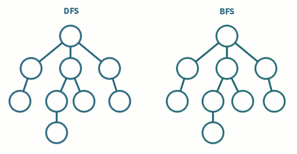
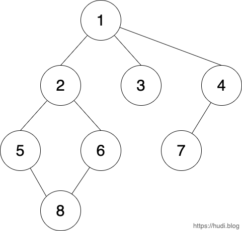

> 본 포스트는 저자가 학습하며 작성한 글 이기 때문에 틀린 내용이 있을 수 있습니다. 지적은 언제나 환영입니다.



## 1. 서론

DFS/BFS 는 그래프 자료구조에 기반한 대표적인 '탐색' 알고리즘이다. 그래프 탐색 순서에 따라 DFS 와 BFS 가 구분된다. DFS 와 BFS 를 이해하고 활용하기 위해서는 우선적으로 **큐 (Queue)**, **스택 (Stack)** 그리고 **그래프 (Graph)** 자료구조에 대한 이해가 선행되어야 한다.

큐와 스택에 대한 글은 필자가 이미 블로그에 작성한 바 있어 링크를 달아두도록 하겠다. 또한 추후 그래프 자료구조도 블로그에서 다뤄볼 예정이니, 작성이 완료되면 링크를 추가해두겠다.

- [[DS] 스택 (Stack), 큐 (Queue)](/ds-stack-queue)

## 2. DFS (Depth-First Search)

DFS 는 한국어로 **'깊이 우선 탐색'** 이라고 불리며, **'스택'** 자료구조를 사용한 그래프 탐색 알고리즘이다. 이름에서 알 수 있듯, **루트 노드에서 시작하여 다른 분기 (Branch) 로 넘어가기 전, 현재 탐색중인 분기를 완벽하게 (깊게) 탐색하는 방식**이다.

가장 깊은 노드까지 도달하였을 때 탐색한 경로를 역추적하여 되돌아나오기 위해 스택을 사용한다. 또한 이미 방문한 노드를 다시 방문하지 않기 위해 방문한 노드를 따로 저장을 해야한다. 이를 **'방문 처리'** 라고 한다.

DFS 의 동작 순서를 정리하면 아래와 같다.

> 1. 루트 노드를 스택에 넣고 방문처리 한다.
> 2. 스택 최상단 노드의 인접 노드 중 방문하지 않은 노드 하나를 스택에 넣고 방문처리한다. 만약 인접 노드를 모두 방문한 경우 스택을 Pop 한다.
> 3. 2 단계를 더 이상 수행할 수 없을 때 까지 (스택이 빌 때 까지) 반복한다.

그러면, 아래의 그래프를 DFS 로 탐색해보자.



### 2-1. graph, visited 선언

```python
graph = [
    [],
    [2, 3, 4],
    [1, 5, 6],
    [1],
    [1, 7],
    [2, 8],
    [2, 8],
    [4],
    [5, 6]
]

visited = [False] * len(graph)
```

예제는 2차원 리스트로 인접행렬을 구현하여 `graph` 에 할당하여 그래프 자료구조로 활용한다. 또한 `visited` 리스트에는 각 노드의 방문여부를 기록한다.

미리 정해진 길이로 리스트를 만들어 놓은다음 `boolean` 으로 방문여부를 판단하는 것이 `in` 으로 판단하는 것 보다 빠르다. ( 각각 $O(1)$ 과 $O(N)$ 의 시간 복잡도를 갖고 있다 )

### 2-2. 재귀를 통한 구현

재귀를 사용하는 이유는 코드의 가독성이 높아지기 때문일 것 이다. 사실 재귀 함수 호출도 내부적으로 살펴보면 스택 메모리를 사용하니 근본적으로는 동일하다고 볼 수 있다.

```python
def dfs(graph, node, visited):
    print(node, visited)
    visited[node] = True

    for neighbor in graph[node]:
        if visited[neighbor] == False:
            dfs(graph, neighbor, visited)

dfs(graph, 1, visited)
```

### 2-3. 스택을 통한 구현

```python
stack.append(1)
visited[1] = True

while len(stack) > 0:
    current_node = None
    for node in graph[stack[-1]]:
        if visited[node] == False:
            current_node = node
            break

    if current_node == None:
        stack.pop()
    else:
        visited[current_node] = True
        stack.append(current_node)


print(visited)
```

재귀의 동작을 그대로 스택으로 구현한 모습이다. 확실히 재귀로 구현하는 것이 가독성면에서 우수하다.

### 2-4. 실행 결과

위 그래프를 DFS 로 탐색하면 `1 → 2 → 5 → 8 → 6 → 3 → 4 → 7` 의 순으로 탐색을 하는 것을 볼 수 있다.

## 3. BFS (Breadth-First Search)

BFS 는 한국어로 **'너비 우선 탐색'** 이라고 불리며, **'큐'** 자료구조를 사용한 그래프 탐색 알고리즘이다. 이름에서 알 수 있듯, **현재 노드와 가까운 노드를 우선적으로 넓게 탐색하는 방식**이다.

현재 노드의 이웃 노드를 스택이 아닌 큐에 집어넣어 자연스럽게 먼저 들어간 노드를 먼저 탐색 (FIFO) 하게 되는 방식이다.

BFS 의 동작 순서를 정리하면 아래와 같다.

> 1.  루트 노드를 큐에 넣고 방문처리한다.
> 2.  큐를 Deque 하고, Deque 한 노드의 방문하지 않은 모든 인접 노드를 큐에 넣고 방문 처리한다.
> 3.  2 단계를 더 이상 수행할 수 없을 때 까지 (큐가 빌 때 까지) 반복한다.

위 그래프를 BFS로 한번 탐색해보자. `graph` 와 `visited` 는 선언 되어 있다고 전제한다.

### 3-1. 구현

```python
from collections import deque

deq = deque()
visited = [False] * len(graph)

deq.appendleft(1)
visited[1] = True

print(1)

while len(deq) > 0:
    current_node = deq.pop()
    for neighbor in graph[current_node]:
        if visited[neighbor] == False:
            print(neighbor)
            deq.appendleft(neighbor)
            visited[neighbor] = True
```

> 큐를 구현할 때 그냥 리스트를 사용해버리면, 큐의 방향에 따라 `enqueue` 혹은 `dequeue` 둘 중 하나는 $O(N)$ 의 시간 복잡도가 발생할 수 있다. 내부가 이중 연결 리스트로 구현된 `collections.deque` 을 사용하여 큐를 구현하자.

### 3-2. 실행 결과

위 그래프를 BFS 로 탐색하면 `1 → 2 → 3 → 4 → 5 → 6 → 7 → 8` 의 순으로 탐색을 하는 것을 볼 수 있다.

## 4. 참고

- 이것이 취업을 위한 코딩 테스트이다 with 파이썬 - 나동빈 저
