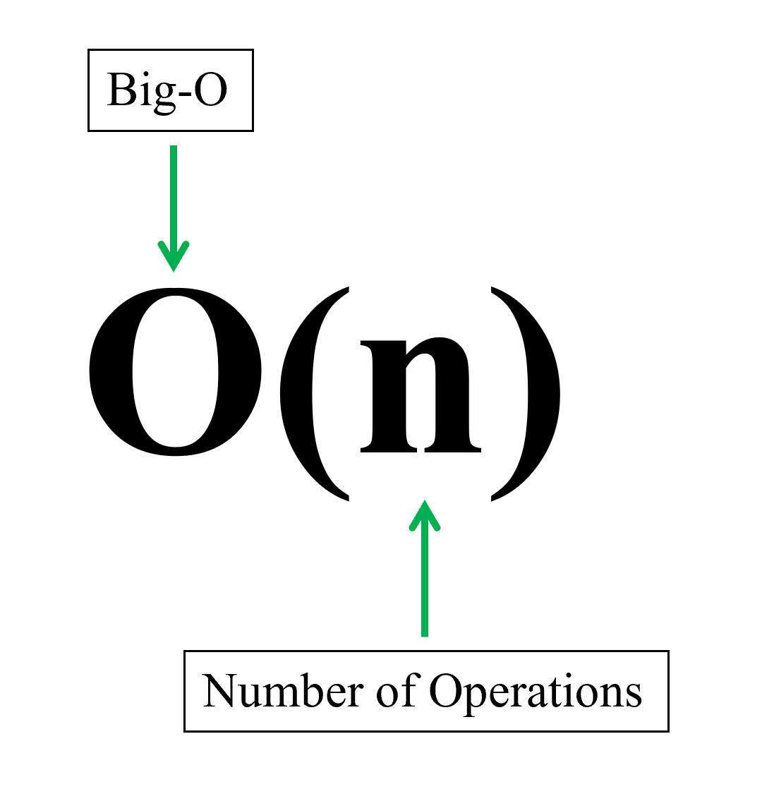
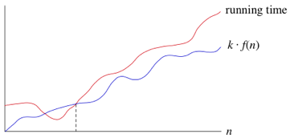
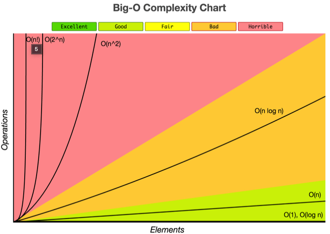

> 본 포스트는 저자가 학습하며 작성한 글 이기 때문에 틀린 내용이 있을 수 있습니다. 지적은 언제나 환영입니다.



## 1. 알고리즘의 비용 계산

특정 문제를 해결하는 알고리즘은 여러가지가 존재할 수 있다. 그 중 가장 최적의 알고리즘을 선택해야하는데, 그 선택의 기준으로 **공간 복잡도 (Space complexity)** 와 **시간 복잡도 (Time complexity)** 가 존재한다.

### 1-1. 공간 복잡도 (Space complexity)

공간 복잡도는 프로그램이 실행되고 완료되기까지 사용하는 총 저장 공간량을 의미한다. 저장 공간에는 **'고정 공간'** 과 **'가변 공간'** 으로 나뉜다.

- 고정 공간 : 알고리즘과는 관련 없는 공간으로 코드와 단순 변수, 상수가 해당된다.
- 가변 공간 : 알고리즘이 수행되며 동적으로 할당되는 공간이 해당된다. 알고리즘과 밀접한 관련이 있다.

이를 함수로 나타내면 아래와 같다.

$$
S(P) = c + Sp(n)
$$

해당 식에서 `c`는 고정 공간 (상수) 를, `Sp(n)` 는 가변공간을 나타낸다. `c` 는 상수이므로 공간 복잡도는 '가변 공간' 이 좌지우지 하는 것을 알 수 있다.

이전 컴퓨터 사양이 좋지 않을 시절에는 중요히 여기는 지표였지만, 최근 컴퓨터의 사양이 상향 평준화 됨에 따라 그렇게 중요하게 여겨지지는 않는다. 다만, 빅데이터 등을 다루는 문제에서는 가끔 다뤄질 때가 있다고 하니 참고만 하자.

### 1-2. 시간 복잡도 (Time complexity)

시간 복잡도는 프로그램이 실행되고 완료되기까지 사용하는 총 소요 시간을 의미한다. 엄밀하게 따지자면, 시간 복잡도는 **'컴파일 시간'** 과 **'실행 시간'** 을 합친 의미이지만, 컴파일 시간은 공간복잡도의 고정 공간과 비슷하게 알고리즘에 영향을 받는 지표가 아니기 때문에 코딩테스트 등을 풀이 할 때에는 고려되지 않는다.

허나 코드가 실행되는 환경, 언어 등 여러 요인에 따라 같은 알고리즘이라도 소요되는 실제 시간은 다르다. 따라서 시간 복잡도는 정확한 프로그램이 실행 시간을 초단위로 표기하는 것이 아니라, **명령문의 실행 빈도수에 따라 대략적으로 소요 시간**을 나타내기 위해 사용된다. 따라서 같은 시간 복잡도를 갖는 코드를 C++ 과 Python 에서 각각 실행하면 실제 실행 시간은 다를 수 있다.

시간 복잡도는 보통의 경우 점근 표기법 특히, **빅오표기법 (Big-O notation)** 을 사용한다. 아래에서 점근 표기법에 대해 더 자세히 알아보자.

## 2. 점근 표기법 (Asymtotic Notation)

점근 표기법이란, 어떤 함수의 증가 양상을 다른 함수와 비교하기 위해 사용되는 표기법으로, 특히 컴퓨터 과학의 알고리즘의 성능을 비교할 때 많이 사용된다. 점근 표기법에는 대표적으로 아래와 같은 3가지가 있다.

### 2-1. Big-Ω (최선 경우 분석)



> 모든 $N > N_{0}$ 에 대하여, $f(N) \geq k \cdot g(N)$ 이 성립하는 양의 상수 $k$ 와 $N_{0}$ 가 존재하면, $f(N) = Ω(g(N))$ 이다.

빅오메가 표기법이라고 읽는다.

알고리즘이 최선의 경우를 맞닥뜨렸을 때 최소한 $k \cdot g(N)$ 의 성능보다는 느리게 동작함을 즉, **점근적 하한 (Lower bound)** 을 의미한다.

### 2-2. Big-O (최악 경우 분석)


> 모든 $N > N_{0}$ 에 대하여, $f(N) \leq k \cdot g(N)$ 이 성립하는 양의 상수 $k$ 와 $N_{0}$ 가 존재하면, $f(N) = O(g(N))$ 이다.

빅오 표기법이라고 읽는다.

즉, 쉽게 말하자면, $N_{0}$ 를 포함한, 모든 $N$ 에 대해 $f(N)$ 의 모든 함수값이 $k \cdot g(N)$ 을 넘지 않는다는 뜻 이다. 즉, $g(N)$ 은 $f(N)$ 의 **점근적 상한 (Upper bound)** 이다.

위 점근 표기법 중 최악의 경우를 나타내는 빅오 표기법이 가장 많이 사용된다.

> 이후 설명할 시간 실행 함수가 $N^2 + 9N + 9$ 인 알고리즘이 존재할 때, 물론 $O(N^4)$ 과 $O(2^N)$ 도 성립한다. 하지만, $g(N)$ 을 선택할 때에는 차수가 최대한 낮은 함수를 선택해야한다.

### 2-3. Big-Θ (평균 경우 분석)


> 모든 $N > N_{0}$ 에 대하여, $k_{1} \cdot g(N) \leq f(N) \leq k_{2} \cdot g(N)$ 이 성립하는 양의 상수 $k_{1}$, $k_{2}$ 와 $N_{0}$ 가 존재하면, $f(N) = Θ(g(N))$ 이다.

빅세타 표기법이라고 읽는다. 위에서 설명한 Big-Ω 와 Big-O 를 합쳐 하나로 표현한 것과 같다.

## 3. Big-O 표기법

위에서 점근 표기법을 수학적으로 간략하게 알아보았다. 그렇다면, 점근 표기법 중에서 가장 많이 사용되는 Big-O 표기법에 대해 조금 더 자세히 알아보자.

```python
def fibonacci(n):
    if n < 0:
        return
    if n <= 1:
        return n

    result = 0
    f1 = 0
    f2 = 1

    for _ in range(2, n + 1):
        result = f1 + f2
        f1 = f2
        f2 = result

    return result
```

위와 같이 주어진 `n` 번째 피보나치 수열 값을 반환하는 `fibonacci` 함수가 존재한다. 이 함수의 실행 빈도수를 수식으로 나타내어보자.

> 주어진 `n` 값이 0 보다 작거나, 1 이하인 경우는 일반적이지 않은 경우니 고려하지 않는다. `n` 은 1 보다 크다.

### 3-1. 상수항

우선 반복문 밖에 있는 명령문들의 실행 빈도를 체크해보자. 반복하지 않고, 수행 시 단 1번씩만 실행되는 코드를 체크해주면 된다.

2, 4 라인의 if 문에서 조건을 체크하며 $2$ 회 실행된다. 다음으로 7~9 라인에서 변수에 값을 할당하며 총 $3$ 회 실행된다. 마지막 return 문에서 $1$ 회 실행된다.

모두 더하면 총, $6$ 회 실행되는 모습을 확인할 수 있다. 이는 입력값 $n$ 과 무관하게 고정된 수치이다.

### 3-2. n에 대한 항

11~14 라인에서 반복을 최대 $n - 1$ 회 수행한다. 이때 반복문의 조건 체크 $1$ 회, 반복문 내부 명령 $3$ 회, 총 $4$ 회를 매 반복마다 실행한다. 즉 전체 반복문은 최대 $4(n - 1)$ 회 실행될 수 있다.

### 3-3. 실행 시간 함수

위에서 도출된 상수항과 n에 대한 항을 더하여 정리하면 아래의 함수를 얻을 수 있다.

$$
    f(n) = 4n - 2
$$

이를 Big-O 표기법으로 바꾸기 위해서는 **차수가 가장 높은 n에 대한 항만을 남겨두고**, 그 **계수를 생략**하고 **O의 우측 괄호안에 표기**한다. 즉, $4n$ 항만을 남겨두고, 계수를 지워 $n$ 으로 만든 다음 $O(n)$ 과 같이 표기한다. 이렇게 우리는 코드의 시간 복잡도를 Big-O 표기법으로 나타낼 수 있다.

위 과정을 간략히 3단계로 정리하면 아래와 같다.

> 1. 실행 빈도수를 구하고 실행 시간 함수를 찾는다.
> 2. 실행 시간 함수에 가장 큰 영향을 주는 (가장 높은 차수를 가지고 있는) n 에 대한 항 만을 남긴다.
> 3. 계수를 생략하고 O 우측 괄호안에 표기한다.

## 4. 자주 사용되는 Big-O 표기



### 4-1. O(1) (상수시간)

입력의 크기와 상관 없이 항상 같은 시간이 걸리는 알고리즘이다. 배열이나 해시 테이블의 데이터에 접근할 때 $O(1)$ 의 시간 복잡도를 갖는다.

### 4-2. O(logN) (로그시간)

문제를 해결하는데 필요한 단계들이 연산마다 줄어드는 알고리즘이다. 이진탐색, 힙 삽입/삭제 등이 $O(logN)$ 의 시간 복잡도를 갖는다.

### 4-2. O(N) (선형시간)

대표적으로 한번의 반복을 수행하고 완료되는 선형 탐사가 $O(N)$ 의 시간 복잡도를 갖는다.

### 4-2. O(NlogN) (선형로그시간)

대표적으로 힙 정렬이 $O(N \cdot logN)$ 의 시간 복잡도를 갖는다.

### 4-2. O(N^2) (제곱시간)

2중 반복을 돌게되는 알고리즘은 $O(N^2)$ 의 시간 복잡도를 갖는다.

### 4-2. O(N^3) (세제곱시간)

3중 반복을 돌게되는 알고리즘은 $O(N^3)$ 의 시간 복잡도를 갖는다.

### 4-2. O(2^N) (지수시간)

대표적으로 입력 원소로 만들 수 있는 부분집합의 모든 경우의 수를 도출할 때 지수시간을 갖는다.

### 4-2. O(N!) (팩토리얼 시간)

대표적으로 입력 원소로 만들 수 있는 순열의 모든 경우의 수를 도출할 때 팩토리얼 시간을 갖는다.

## 5. 참고

- [Khan Academy - 점근적 표기법](https://ko.khanacademy.org/computing/computer-science/algorithms/asymptotic-notation/a/asymptotic-notation)
