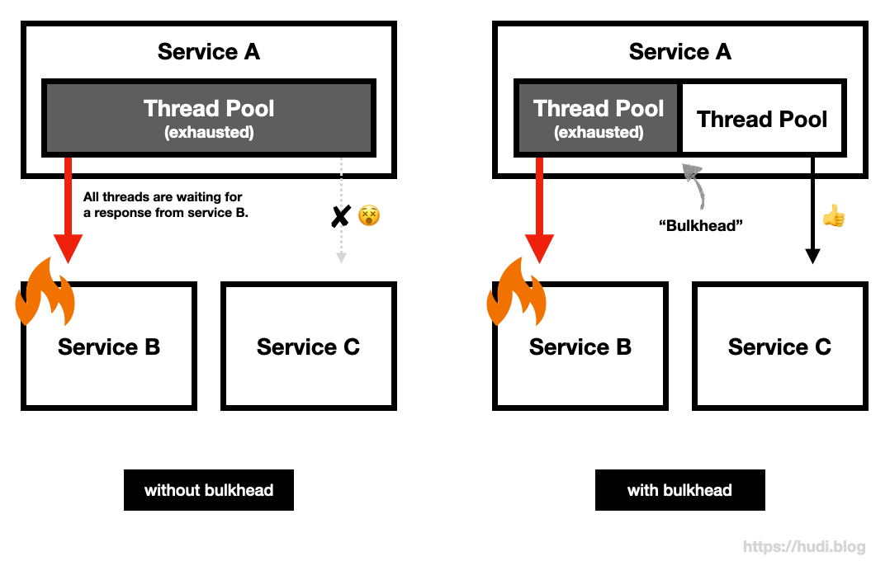
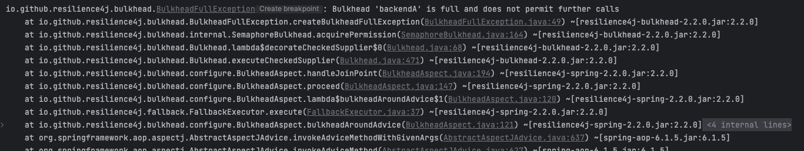

## 배경

최근 특정 데이터를 Apache POI를 사용해서 엑셀 파일로 만들어서 유저에게 서빙하는 기능을 개발했었다. 유즈 케이스를 조금 찾아보았는데, Apache POI로 규모가 큰 데이터를 다룰 때 Out of Memory 가 쉽게 발생한다는 사실을 알게 되었다. 다른 중요한 기능도 수행하고 있는 서버인데, 엑셀 파일을 만들다가 Out of Memory가 발생하면 서버 자체가 죽어버리므로, 발생해서는 안되는 문제였다. 따라서 해당 기능을 **동시에 요청할 수 있는 최대 수**를 제어할 필요가 있었다. 그렇게 Bulkhead 패턴을 공부하게 되었다.

> 💭 사실 가장 좋은 방법은 해당 기능을 수행하는 별개의 서비스를 만들어서 물리적으로 장애를 격리하는 방법이겠지만, 실무를 하다보면 항상 **일정, 운영비용과 완성도** 사이를 저울질하게 되는 것 같다. 나는 별개 서비스를 만드는 것은 오버 엔지니어링이라고 판단하였고, 기존 서비스에 해당 기능을 붙이되 Bulkhead 패턴을 사용해서 요청량을 제어하는 것이 합리적이라고 판단했다.

> 💡 POI의 엑셀 파일 접근을 위한 구현체는 HSSF, XSSF, SXSSF 3개가 있는데, 이 중 **SXSSF는 스트리밍 방식**을 사용하여 **메모리를 과도하게 점유하는 문제를 해결한 구현체**이다. 실제로 운영에서는 SXSSF를 사용하여, 눈에 띄게 메모리 사용량이 늘지 않았다.

## Bulkhead Pattern


Bulkhead는 한국어로 격벽을 의미한다. 격벽이란 선박의 공간을 여러 구획으로 나누기 위해 사용되는 벽을 의미한다. 선박의 공간을 격벽으로 구획을 나누면, 어느 한 곳에 물이 차더라도 다른 구획은 이에 영향 받지 않기 때문에, 선박은 안전하게 항해할 수 있다.

Bulkhead 패턴은 **선박의 격벽**으로부터 영감을 얻어 만들어진 패턴으로, **리소스를 격리**하여, **일부 컴포넌트에 문제가 발생하더라도, 그것이 시스템 전체로의 장애로 전파되지 않게끔 만들어주는 패턴**이다.

### without bulkhead vs with bulkhead



예를 들어보자. MSA 환경에서 서비스 A, B, C가 존재한다. 서비스 A의 `B API` 는 서비스 B를 호출해 응답을 만들고, `C API` 는 서비스 C를 호출해 응답을 만들어낸다고 가정해보자.

그런데 서비스 B에 장애가 발생하여, 응답을 매우 느리게 주는 상황이라면? 이런 상황에서 서비스 A의 `B API` 호출이 발생한다면, 서비스 B의 응답을 기다리느라 **계속 쓰레드를 점유**할 것이고, 장애가 길어짐에 따라 서비스 A의 **톰캣 쓰레드 풀이 고갈**될 것이다. 그렇다면 `C API` 는 서비스 B에 의존하지 않지만, 톰캣 쓰레드를 할당 받지 못해 덩달아 장애의 영향을 받게 된다.

여기에 Bulkhead 패턴을 사용하여, 두 쓰레드 풀을 격리하면 어떻게 될까? 여전히 서비스 B에 의존적인 `B API` 의 요청을 처리하는 쓰레드 풀은 고갈 상태가 유지되겠지만, **서비스 C에 의존적인 `C API` 의 요청을 처리하는 쓰레드 풀은 고갈 상태가 아니므로 서비스 B 장애 여부와 무관하게 요청을 잘 처리**할 것이다.

즉, Bulkhead 패턴의 핵심 아이디어는 **‘리소스 격리를 통한 장애 격리’** 이다. 예시에서는 쓰레드 풀을 예로 들었지만, 커넥션 풀과 같은 다른 자원에도 적용해볼 수 있다. 또한 꼭 리소스 풀을 물리적으로 분리하지 않고, 세마포어[^1] 등의 상호배제 메커니즘 등을 사용하여 Bulkhead 를 구현할 수도 있다.

## 장애 전파 재현 및 Bulkhead 구현

코틀린 코드로 아주 간단하게 리소스 고갈로 인한 장애 전파를 재현해보고, 이를 격벽으로 나누어 장애 전파를 차단하는 Bulkhead 패턴을 구현해보자.

### 리소스 고갈로 인한 장애 전파 재현

```kotlin
fun main() {
    val tomcatThreadPool = Executors.newFixedThreadPool(4)

    val startTime = System.currentTimeMillis()

    for (i in (1..4)) {
        tomcatThreadPool.execute { callBService(startTime) }
    }

    for (i in (1..4)) {
        tomcatThreadPool.execute { callCService(startTime) }
    }
}

fun callBService(callTime: Long) = println("* 서비스 B 호출 완료 | 소요 시간: ${System.currentTimeMillis() - callTime}ms")
fun callCService(callTime: Long) = println("* 서비스 C 호출 완료 | 소요 시간: ${System.currentTimeMillis() - callTime}ms")
```

이해를 돕기 위해 아래와 같이 가정한다.

- `main` 함수 = 서비스 A 애플리케이션
- `tomcatThreadPool` = 서비스 A의 톰캣 쓰레드 풀 (사이즈 4)
- `tomcatThreadPool.execute()` = 서비스 A로 들어온 HTTP 요청
- `callBService()` , `callCService()` = 서비스 B, C의 API를 호출하는 함수

위 코드를 실행하면, `tomcatThreadPool` 의 쓰레드들은 서비스 B를 호출하기 위해 모두 할당된 후, 작업을 잘 마치고 난 뒤 서비스 C를 호출하기 위해 할당될 것이다. 그럼 아래와 같이 정상적으로 작업이 완료될 것이다.

```
* 서비스 B 호출 완료 | 소요 시간: 1ms
* 서비스 B 호출 완료 | 소요 시간: 1ms
* 서비스 B 호출 완료 | 소요 시간: 1ms
* 서비스 B 호출 완료 | 소요 시간: 1ms
* 서비스 C 호출 완료 | 소요 시간: 6ms
* 서비스 C 호출 완료 | 소요 시간: 6ms
* 서비스 C 호출 완료 | 소요 시간: 6ms
* 서비스 C 호출 완료 | 소요 시간: 6ms
```

그런데 서비스 B의 데이터베이스에 장애가 발생해서, 서비스 B가 굉장히 느리게 응답을 하기 시작했다. 이를 아래와 같이 `Thread.sleep()` 을 사용하여 표현한다.

```kotlin
fun callBService(callTime: Long) {
    Thread.sleep(20_000) // 데이터베이스 장애 발생으로, 굉장히 느리게 응답한다고 가정한다.
    println("* 서비스 B 호출 완료 | 소요 시간: ${System.currentTimeMillis() - callTime}ms")
}
```

이렇게 서비스 B에 장애가 발생한 상황에서는, 서비스 B를 호출하기 위한 쓰레드를 비정상적으로 오래 점유한다. 그렇게 되면 서비스 C만 필요한 요청이 톰캣 쓰레드를 할당받지 못하고, 아래와 장애가 전파된다.

```
* 서비스 B 호출 완료 | 소요 시간: 20008ms
* 서비스 C 호출 완료 | 소요 시간: 20026ms
* 서비스 C 호출 완료 | 소요 시간: 20027ms
* 서비스 C 호출 완료 | 소요 시간: 20027ms
* 서비스 C 호출 완료 | 소요 시간: 20027ms
* 서비스 B 호출 완료 | 소요 시간: 20008ms
* 서비스 B 호출 완료 | 소요 시간: 20007ms
* 서비스 B 호출 완료 | 소요 시간: 20007ms
```

서비스 C를 호출하는 함수는 호출 즉시 결과를 반환할 수 있었으나, 서비스 B 호출로 인해 쓰레드 풀이 밀려 정상적으로 쓰레드를 할당받지 못하게 되었고, 그 결과 서비스 C를 호출하는 함수의 응답까지 덩달아 굉장히 느려졌다. 장애가 전파된 것이다. 실제 스프링 애플리케이션이었다면, 타임아웃이 발생하여 아예 응답을 주지 못하고 예외가 발생했을수도 있다.

### Bulkhead 적용

그럼 이제 `tomcatThreadPool` 을 격벽으로 분리해보자. 이를 `bulkheadForB` 쓰레드 풀과 `bulkheadForC` 쓰레드 풀을 만들고, 서비스 B와 서비스 C를 호출하는 메소드를 각각의 쓰레드 풀로 격리할 것이다.

```kotlin
fun main() {
    val bulkheadForB = Executors.newFixedThreadPool(4)
    val bulkheadForC = Executors.newFixedThreadPool(4)

    val startTime = System.currentTimeMillis()

    for (i in (1..4)) {
        // 서비스 B를 호출하는 함수는, bulkheadForB 쓰레드 풀에서 실행
        bulkheadForB.execute { callBService(startTime) }
    }

    for (i in (1..4)) {
        // 서비스 C를 호출하는 함수는, bulkheadForC 쓰레드 풀에서 실행
        bulkheadForC.execute { callCService(startTime) }
    }
}
```

그럼 결과는 아래와 같을 것이다. 서비스 C를 호출하는 메서드는 더이상 서비스 B의 장애에 영향을 받지 않는다.

```
* 서비스 C 호출 완료 | 소요 시간: 2ms
* 서비스 C 호출 완료 | 소요 시간: 2ms
* 서비스 C 호출 완료 | 소요 시간: 2ms
* 서비스 C 호출 완료 | 소요 시간: 2ms
* 서비스 B 호출 완료 | 소요 시간: 20010ms
* 서비스 B 호출 완료 | 소요 시간: 20009ms
* 서비스 B 호출 완료 | 소요 시간: 20008ms
* 서비스 B 호출 완료 | 소요 시간: 20009ms
```

## Resilience4j의 Bulkhead

실제 업무에서는 위와 같이 직접 Bulkhead 를 구현할 필요 없이 라이브러리를 사용하면 간단하게 Bulkhead 를 구현할 수 있다. 나는 이미 팀에서 Resilience4j 를 사용중이었으므로, 이 라이브러리가 제공하는 Bulkhead 기능을 사용하였다.

Resilience4j의 Bulkhead 는 쓰레드 풀 또는 세마포어를 사용하여 동시 호출 수를 제어하며, 이에 따라 특정 작업으로 인해 과도한 리소스를 차지하지 않도록 리소스를 격리할 수 있도록한다.

공식 가이드는 [**여기**](https://resilience4j.readme.io/docs/getting-started-3)에 접속해서 읽어보면 되고, 이 글에서는 간단히 적용만 해보겠다. 아래와 같이 resilience4j 의존성부터 추가한다.

```kotlin
implementation("io.github.resilience4j:resilience4j-spring-boot2:2.2.0")
```

그리고 `application.properties` 에 아래와 같이 추가한다.

```kotlin
resilience4j.bulkhead.instances.backendA.maxConcurrentCalls=4
resilience4j.bulkhead.instances.backendA.maxWaitDuration=0
```

`maxConcurrentCalls` 는 허용할 최대 동시 호출 수, `maxWaitDuration` 은 최대 동시 호출 수에 도달했을 때 추가 요청이 들어온 경우 얼마나 기다려줄 것인지를 나타낸다. 지금과 같은 설정은 최대 4개의 동시 요청을 허용하며, 5번째 요청부터는 즉시 실패하도록 한다. `backendA` 는 벌크헤드의 이름이다.

```kotlin
@RestController
class BulkheadController {

    @Bulkhead(name = "backendA", type = Bulkhead.Type.SEMAPHORE)
    @GetMapping("/bulkhead")
    fun bulkhead(): String {
        Thread.sleep(10_000)
        return "DONE"
    }
}
```

위와 같이 간단하게 컨트롤러를 작성했다. `type` 은 `Bulkhead.Type.SEMAPHORE` 와 `Bulkhead.Type.THREADPOOL` 두가지가 있으며, 생략하면 기본값은 세마포어이다. 해당 엔트포인트로 4개를 초과한 동시 요청을 넣게 되면, 아래와 같이 `BulkheadFullException` 이 발생하는 것을 볼 수 있다.



[^1]: [https://hudi.blog/race-condition-critical-section-mutual-exclusion/#세마포어-semaphore](https://hudi.blog/race-condition-critical-section-mutual-exclusion/#%EC%84%B8%EB%A7%88%ED%8F%AC%EC%96%B4-semaphore)
