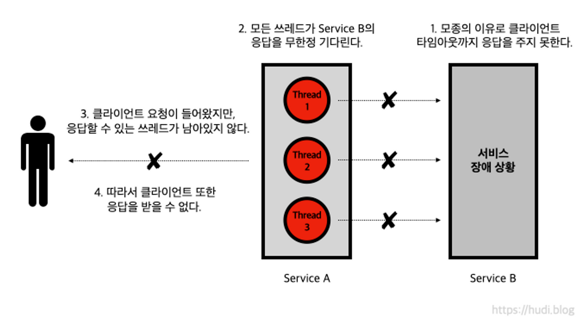
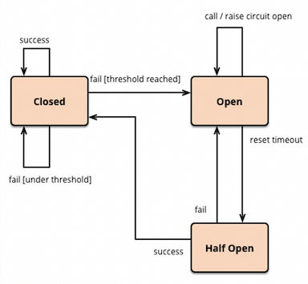
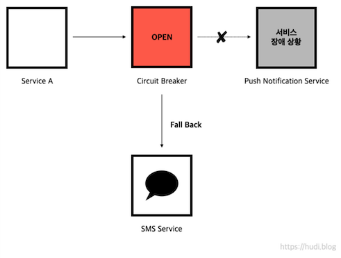

## MSA 환경의 서비스간 장애의 전파

> 소프트웨어는 모두 실패한다.

아마존 부사장인 버너 보겔스(Werner Vogels)의 이야기다. 이전에는 무결함이나 실패 무결성 즉, 절대 다운되지 않는 완벽한 시스템을 추구했다. 하지만, 버너 보겔스의 말처럼 **실패하지 않는 시스템을 만드는 것은 불가능**하다.

우리는 완벽한 시스템을 만들기 보다, 실패에 빠르고 유연하게 대응할 수 있는 시스템을 만드는 것에 더 무게를 두어야한다. 즉, 장애가 발생해도 견딜 수 있는 **내결함성(Fault Tolerance)이 더욱 중요**하다는 이야기이다.

특히 MSA와 같은 분산 환경에서는 서비스가 다른 서비스를 동기 호출 시, **실패할 가능성이 항상 존재**한다. 서비스가 모두 개별 프로세스로 동작하고 있기 때문에 응답하지 못하거나, 응답이 매우 늦어지는 문제가 발생할 수 있다.

예를 들어 서비스 A가 서비스 B를 호출하는 구조일 때, 서비스 B에 장애가 발생했다고 가정해보자. 서비스 A는 항상 서비스 B로부터 에러 응답을 받거나, 타임아웃까지 아예 응답을 받지 못하는 상황이 발생한다.

전자의 경우, 서비스 A를 호출하는 클라이언트는 **항상 에러 응답**을 받게 될 것이다. 후자의 경우는 서비스 A의 모든 쓰레드가 서비스 B의 응답을 받기 위해 대기하면서, 더이상 새로운 클라이언트의 요청을 받을 수 있는 **쓰레드가 고갈되어 장애가 전파**된다. 여기서 핵심은 서비스 B의 **장애가 서비스 A까지 전파**된다는 점이다.



MSA 환경은 클라이언트의 요청이 수개의 서비스를 거쳐 응답이 이뤄질수도 있다는 점이다. 서비스 B로부터 시작된 장애가 서비스 A, C, D, E, ... 까지 영향을 미칠 수 있다는 점이다. 즉, **하나의 서비스의 장애가 연쇄적으로 이어져 전체 서비스의 장애로까지 이어질 수 있다는 점**이다.

더 큰 문제는, 이런 상황에서 **장애의 시작점을 파악하는 것이 쉽지 않다는 것**이다. 그렇기 때문에 마이크로 서비스 아키텍처는 **스스로 회복**해야하며, **장애를 격리**할 수 있어야 한다.

## 서킷 브레이커 패턴



위 문제를 해결하기 위해 등장한 것이 서킷 브레이커 패턴이다. 서킷 브레이커 패턴은 이름과 같이 과부하가 걸린 전기를 자동으로 차단해서 전기 사고를 방지하는 회로 차단기와 비슷하게 동작한다.

서킷 브레이커는 다른 서비스에 대한 호출을 모니터링하며, 요청의 실패율이 일정 **임계치(threshold)**를 넘어가면, 장애가 발생한 **서비스로의 요청을 차단하여 Fail Fast** 하는 방법이다.

서킷 브레이커는 위 그림과 같은 상태 머신으로 나타낼 수 있다. 서킷 브레이커는 **Closed, Open, Half Open** 3가지의 상태를 갖는다.

- **Closed** : 요청 실패율이 정해놓은 임계치보다 낮은 상태. 평소대로 모든 요청이 처리된다.
- **Open** : 요청 실패율이 정해놓은 임계치보다 높아진 상태. 서킷 브레이커가 열린 경우, 요청을 보내지 않고 즉시 실패처리 한다.
- **Half Open** : Open 이후 일정 시간이 지나면 Half Open 된다. 이 상태에서 **요청이 성공하면 Closed 상태로 변경되고, 실패하면 Open 상태를 유지**한다.

만약 서킷 브레이커가 열렸다면, 서비스에 요청하는 대신 **Fallback**을 하게 된다. 예를 들어, 푸시 알림 서버가 장애가 발생해 서킷 브레이커가 열렸다고 가정하자.

일반적인 상황에서는 고객들에게 알림을 보낼 수 있는 방법이 없었을 것이다. 하지만, 서킷 브레이커가 열리고 요청을 SMS 서비스로 Fallback 한다면, 다소 푸시 알림보다 불편하지만 고객들은 중요 알림을 받아볼 수 있을 것이다.



## Resilience4j 를 사용한 서킷 브레이커 구현

서킷 브레이커 패턴은 다양한 방식으로 구현할 수 있다. 물론 직접 처음부터 구현하는 방식도 있지만, 넷플릭스의 Hystrix 혹은 Resilience4j 와 같은 라이브러리를 사용할 수 있다. 또는 인프라 관점에서 Nginx, Envoy 와 같은 프록시를 사용하여 구현해볼수도 있다.

> [Hystrix is no longer in active development, and is currently in maintenance mode.](https://github.com/Netflix/Hystrix)

Hystrix는 공식문서에 의하면, 현재 개발이 중단된 상황이다. 따라서 본 포스팅에서는 **Resilience4j**를 사용하여 서킷 브레이커를 구현해본다.

우리는 주문 내역을 가져오는 Order 마이크로 서비스를 구현한다. 주문 내역을 가져오기 위해서는 User 마이크로 서비스에 REST API 호출을 하여 유저 정보를 가져와야 한다고 가정한다. 실습은 코틀린과 스프링부트 2.X로 진행한다.

### 의존성

```groovy
dependencies{
  implementation("org.springframework.boot:spring-boot-starter")
  implementation("org.springframework.boot:spring-boot-starter-web")
  implementation("org.springframework.boot:spring-boot-starter-aop")
  implementation("io.github.resilience4j:resilience4j-spring-boot2")
}
```

의존성은 위와 같다. `spring-boot-starter-aop` 의존성이 없으면, 뒤이어 사용할 `@CircuitBreaker` 어노테이션을 사용할 수 없으니 꼭 추가한다.

### application.yaml

```yaml
resilience4j.circuitbreaker:
  configs:
    default:
      registerHealthIndicator: true
      slidingWindowSize: 10
      minimumNumberOfCalls: 5
      permittedNumberOfCallsInHalfOpenState: 3
      automaticTransitionFromOpenToHalfOpenEnabled: true
      waitDurationInOpenState: 5s
      failureRateThreshold: 50
      eventConsumerBufferSize: 10
  instances:
    orderService:
      baseConfig: default
```

`resilience4j-spring-boot2` 의존성을 사용하므로, 스프링부트 `application.yaml` 을 통해 선언적으로 서킷 브레이커에 대한 설정을 할 수 있다. 자세한 설정 방법은 [**공식문서**](https://resilience4j.readme.io/docs/circuitbreaker)를 참고하자.

### OrderController

```kotlin
@RestController
class OrderController(
    private val orderService: OrderService,
) {

    @GetMapping("/orders/{orderId}")
    fun getOrder(
        @PathVariable orderId: Long,
    ): Order? {
        return orderService.getOrder(orderId)
    }
}
```

단순히 OrderService 의 메소드를 호출해서 반환한다.

### UserClient

```kotlin
@Component
class UserClient {
    fun getUser(userId: Long): User {
        if ((1..10).random() > 5) {
            throw HttpServerErrorException(HttpStatus.INTERNAL_SERVER_ERROR, "This is a remote exception")
        } // 50% 확률로 실패

        return User(
            id = 1,
            name = "유저"
        ) // 임의의 User 반환
    }
}
```

장애상황을 가정하기 위해 UserClient는 50% 확률로 HttpServerErrorException이 발생되어 실패한다.

### OrderService

```kotlin
@Service
class OrderService(
    private val userClient: UserClient,
) {

    @CircuitBreaker(name = "orderService", fallbackMethod = "fallback")
    fun getOrder(id: Long): Order? {
        val user = userClient.getUser(1)
        return Order(
            id = id,
            user = user,
        )
    }

    private fun fallback(e: Exception): Order? {
        println("서킷이 열렸습니다: $e")
        return null
    }
}
```

핵심인 서비스 코드이다. 서킷 브레이커를 적용할 메소드 위에 `@CircuitBreaker` 어노테이션을 붙인다. **name 파라미터는 서킷 브레이커 설정 시 넣어둔 이름과 동일**하다.

`fallbackMethod` 파라미터는 서킷이 열렸을 때 fallback 을 하기 위해 실행할 메소드 이름을 입력한다. 단, 메소드 시그니처는 `@CircuitBreaker` 가 붙어있는 메소드와 **메소드 시그니쳐가 동일**해야하되, 추가로 Exception 파라미터를 받아야한다. 다만, 위와 같이 원본 메소드의 파라미터를 생략하고 Exception 만 받아도 괜찮은 듯 하다.

직접 테스트해보면, **slidingWindowSize**로 설정된 10개의 요청 중, **failureRateThreshold**에 설정된 임계치 50%만큼 실패하게 되면 즉, 최근 10개의 요청 중 5개 이상의 요청이 실패하게 되면 서킷이 열려 fallback 메소드가 실행되게 된다.

## 참고

- 마이크로 서비스 패턴 - 크리스 리처드슨
- 도메인 주도 설계로 시작하는 마이크로서비스 개발 - 한정헌, 유해식, 최은정, 이주영
- [https://bcho.tistory.com/1247](https://bcho.tistory.com/1247)
- [https://engineering.linecorp.com/ko/blog/try-armeria-circuit-breaker](https://engineering.linecorp.com/ko/blog/try-armeria-circuit-breaker)
- [https://junhyunny.github.io/spring-boot/spring-cloud/msa/design-pattern/msa-circuit-breaker-pattern/](https://junhyunny.github.io/spring-boot/spring-cloud/msa/design-pattern/msa-circuit-breaker-pattern/)
- [https://resilience4j.readme.io/](https://resilience4j.readme.io/)
- ChatGPT
