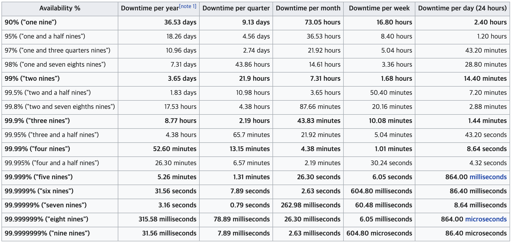
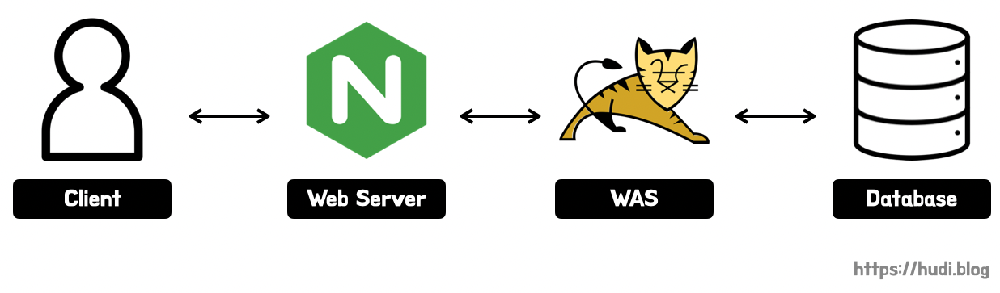
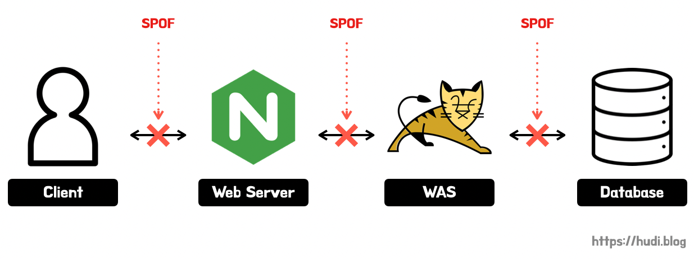
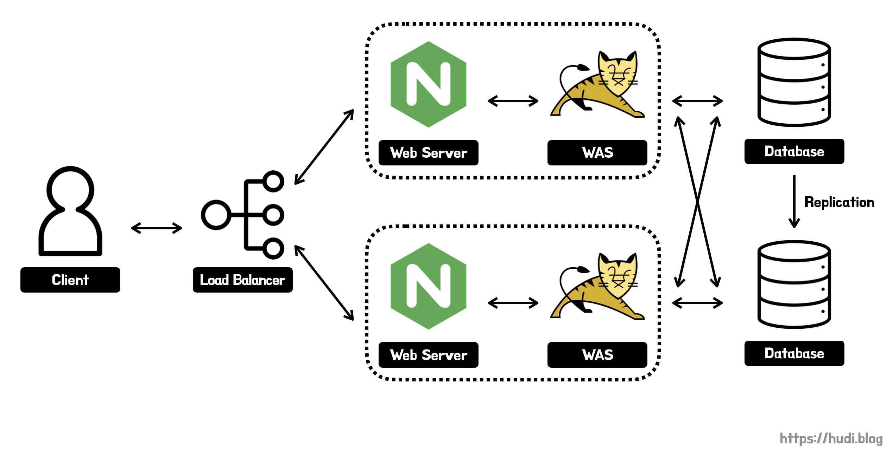
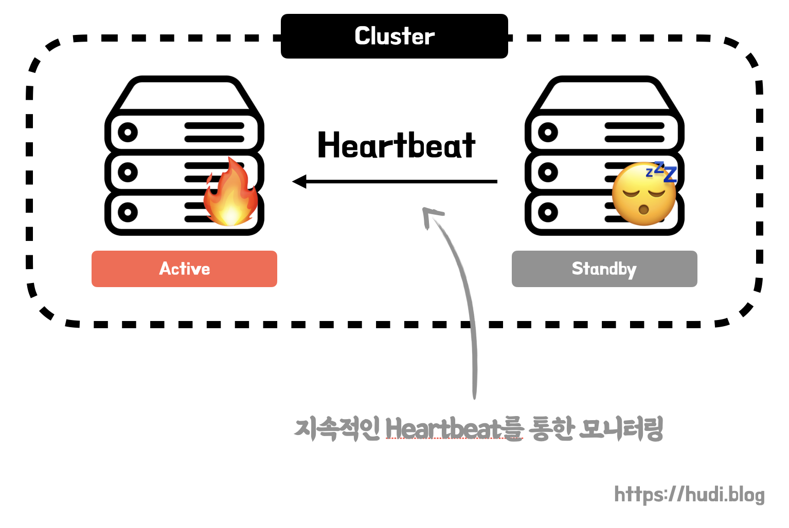
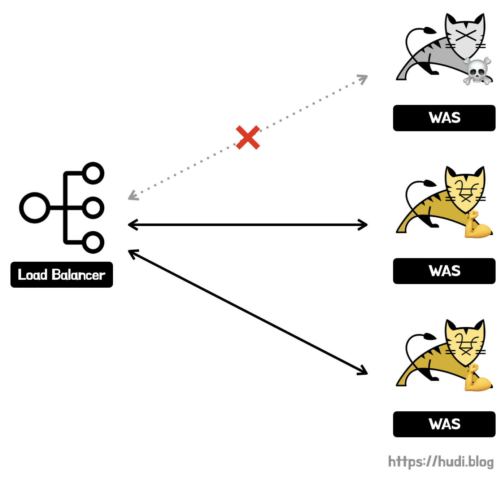

## 학습 배경

우아한테크코스 백엔드 레벨4에서 아키텍처 개선에 대한 강의를 들었다. 아키텍처를 개선하며 중요하게 볼 지표는 **가용성(availability)**이다. 가용성이란 전체 서비스 운영 시간 중 서비스가 정상적으로 동작하는 시간의 비율을 나타내는 지표이다. 이전까지는 그냥 추상적으로만 알고 있던 개념인데, 조금 더 자세히 알아볼까 한다. 이와 함께 고가용성 아키텍처를 설계하기 위한 내용을 추가로 학습하였다.

## 가용성

위에서 이야기했듯 가용성이란 정체 서비스 운영 중 서비스가 **정상적으로 동작하는 비율**이 얼마나 되는지 **시간 측면**의 관점으로 설명하는 지표이다. 즉, 시스템의 **신뢰도**를 평가할 때 사용되는 중요한 지표이다. 예를 들어 100일을 운영한 서비스가 총 1일간 제대로 동작하지 않았다면, 이 서비스의 가용성은 99%이다. 이를 수식으로 나타내면 아래와 같다.

$$

Availability = \frac{uptime}{uptime + downtime}

$$

위 수식에서 $uptime$은 이용 가능 시간, $downtime$은 이용 불가 시간을 의미한다.

### 고가용성 (High Availability, HA)

가용성이 높은 서비스를 가리켜 고가용성의 서비스라고 이야기한다. 고가용성이란 말 그대로 높은 가용성을 확보한 상태를 의미한다. 고가용성의 서비스는 상당히 오랜 시간동안 장애 없이 안정적으로 운영할 수 있다. 고가용성의 가용한 시간을 일반적으로 **9s(nines)** 라는 표현 방식을 사용한다.

9s에서 one nine은 90%를, two nine은 99%를 의미한다. 이를 정리한 표가 영문 위키 백과 **[High availability](https://en.wikipedia.org/wiki/High_availability)** 문서에 존재한다. 그 표를 가져와보았다.

가용성 90%의 서비스는 하루에 2.4시간, 연간 36.53일의 downtime이 발생한다. 숫자 자체는 높아보이는데, downtime이 꽤나 큰 것을 확인할 수 있다.

가장 이상적인 것은 five nines 즉 99.999%의 가용성을 확보하는 것이다. five nines를 확보하면 연간 downtime이 약 5분 가량으로 굉장히 낮은 것을 확인할 수 있다. 우리는 five nines을 서비스의 목표 가용성을 삼을 필요가 있다.

## 어떻게 고가용성을 확보할까?

### 단일 장애점 (SPOF) 식별 및 제거

고가용성의 아키텍처를 설계하기 위한 원칙 중 하나는 **단일 장애점(single point of failure, SPOF)를 식별하고 제거**하는 것이다 (**[참고](https://en.wikipedia.org/wiki/High_availability#Principles)**). SPOF란, 하나가 장애가 발생하면 시스템 전체가 이용 불능 상태가 되는 지점을 의미한다. 아래 그림에서 SPOF는 어디일까?

위 그림에서 SPOF는 아래와 같이 모든 지점이다.

웹 서버가 장애가 나면, 클라이언트의 요청이 WAS로 도달할 수 없다. WAS도, Database도 마찬가지로 장애가 발생하면 모든 서비스가 이용 불능이 된다. 즉, 가용성이 떨어질 확률이 굉장히 많다.

SPOF가 많다는 것은 곧 낮은 가용성의 서비스일 가능성이 높다는 의미이다. 그렇기 때문에 고가용성 아키텍처를 설계할 때 SPOF를 제거하는 것이 중요하다고 이야기하는 것이다.

### 다중화와 로드밸런싱

SPOF를 제거하기 위해서는 어떻게 해야할까? SPOF가 되는 지점을 **다중화(redundancy)** 시키는 것이다. 예를 들어 위에서 WAS를 다중화 시키면, 하나의 WAS가 장애가 발생하여도 다른 여러대의 WAS가 요청을 처리할 수 있으므로 높은 가용성을 유지할 수 있게 된다. 위 그림과 같은 아키텍처를 다중화하면 아래와 같이 구성된다.

> 위 그림은 소프트웨어 관점에서만 묘사되어 있지만, 하드웨어도 SPOF가 될 수 있다.

즉, **하드웨어, 소프트웨어, 데이터베이스의 다중화**는 SPOF를 제거하고, 고가용성의 아키텍처를 만드는데 중요한 키워드이다. 여기에서 중요한건 부하 분산 시스템이다. 위 그림에서도 다중화된 컴포넌트를 서비스하기 위해 클라이언트와 컴포넌트 사이에 로드 밸런서가 추가된 것을 볼 수 있다. 로드 밸런서는 각 요소들이 받는 부하를 고르게 분산시켜 장애를 방지하고, 후술할 장애 극복 프로세스를 실행하기 위한 중요한 요소이다.

로드밸런서는 지금까지는 비용을 위해 Nginx를 사용했지만, 실무에서는 대부분 AWS를 사용하므로 ELB, ALB와 같은 로드 밸런서를 활용해볼 수 있다.

로드밸런서와 다중화를 활용하여 무중단 배포를 도입하면, 새로운 서비스를 배포할때 발생하는 downtime도 제거하고 더 높은 가용성을 확보할 수 있다. 관련된 내용은 **[무중단 배포 아키텍처와 배포 전략 (Rolling, Blue/Green, Canary)](https://hudi.blog/zero-downtime-deployment/)** 와 **[Jenkins와 Nginx로 스프링부트 애플리케이션 무중단 배포하기](https://hudi.blog/zero-downtime-deployment-with-jenkins-and-nginx/)** 포스팅을 읽어보자.

### 장애 극복 기능 (Failover)

또, 고가용성을 위해서는 장애가 발생했을 때 곧바로 이를 인지하고 장애 상황을 복구하는 자동화된 시스템이 필요하다.

지난 **[고가용성의 웹 서비스를 위한 데이터베이스 클러스터링](https://hudi.blog/database-clustering/)** 포스팅에서 소개한 데이터베이스 클러스터링이 failover를 위한 다중화 방법 중 하나이다. standby 서버는 active 서버에 지속적으로 **Heartbeat 모니터링**을 통해 장애 상황을 확인하고, 장애 발생 시 자신을 active로 바꿔 최대한 downtime을 줄이는 방식이다.

또, 로드밸런서의 **헬스 체크(health check)**도 failover를 위한 기능이다. 로드밸런서에 물려있는 여러 컴포넌트에게 지속적으로 장애가 발생하지 않았는지 헬스 체크하고, 장애가 발생한 컴포넌트가 발견되면 그 즉시 로드밸런싱 서비스에서 해당 컴포넌트를 제외하여 failover 한다. 유저의 트래픽이 장애가 발생한 컴포넌트로 향하지 않게되어 높은 가용성을 유지할 수 있다.

### 백업, 지리적 분산

언제 어디서든 대비할 수 없는 **천재지변**이 발생할 수 있다. 이런 재해로부터 데이터를 지키기 위해 **백업과 복구 프로세스**를 만들어야한다. 백업과 복구 프로세스가 잘 갖춰져있는 아키텍처에서는 설령 데이터가 유실되었다고 하더라도, 빠르게 복구하여 서비스를 재개할 수 있을 것이다. MySQL과 같은 DBMS를 사용한다면 레플리케이션을 통해 백업과 복구 프로세스를 구축할 수 있다. **[데이터베이스의 확장성과 가용성을 위한 MySQL Replication](https://hudi.blog/mysql-replication/)** 포스팅을 참고하자.

또, 서버들의 **지리적 분산**도 중요하다. 지진과 해일, 홍수, 테러와 같이 물리적으로 서버에 위협이 될 만한 요소는 어디에나 존재한다. 서버, 데이터를 한 곳에서만 분산 저장하지 않고 아예 물리적으로 분산하여 저장하는 것은 중요하다.

최근 폭우가 쏟아져 서울에 물난리가 난적이 있다. 이때, 한국투자증권의 서버실이 침수되어 15시간동안 서비스가 중단된 이례적인 사건이 발생하였다 (기사: **[한국투자증권, 서버 15시간 '셧다운'...IT관리 능력 '낙제점'](https://www.etnews.com/20220809000142)**). 다른 서비스도 아니고 증권 서비스가 말이다. 만약 한국투자증권 서버가 물리적으로 분산되어 운영되었다면 이런 참사는 발생하지 않을 것이다.

AWS 리전 내 가용영역(AZ)는 실제로 물리적으로 100km 떨어진 곳에 위치시킨다고 한다. 따라서 서울 리전이라고 하더라도 실제 AZ가 부산에 위치한 것일수도 있다. 이에 대한 내용은 예전에 작성한 포스팅 **[[AWS] 리전(Region)과 가용영역(Availability Zone)](https://hudi.blog/region-and-availability-zone/)** 을 참고하자.

## 참고

- [https://docs.oracle.com/cd/E19528-01/819-0992/6n3cn7p3p/index.html](https://docs.oracle.com/cd/E19528-01/819-0992/6n3cn7p3p/index.html)
- [https://zetawiki.com/wiki/가용성](https://zetawiki.com/wiki/%EA%B0%80%EC%9A%A9%EC%84%B1)
- [https://itwiki.kr/w/단일\_장애점\_문제](https://itwiki.kr/w/%EB%8B%A8%EC%9D%BC_%EC%9E%A5%EC%95%A0%EC%A0%90_%EB%AC%B8%EC%A0%9C)
- [https://blog.stratus.com/ko/rule-nines-availability-always-on-world/](https://blog.stratus.com/ko/rule-nines-availability-always-on-world/)
- [https://www.parallels.com/blogs/ras/ha-architecture/](https://www.parallels.com/blogs/ras/ha-architecture/)
