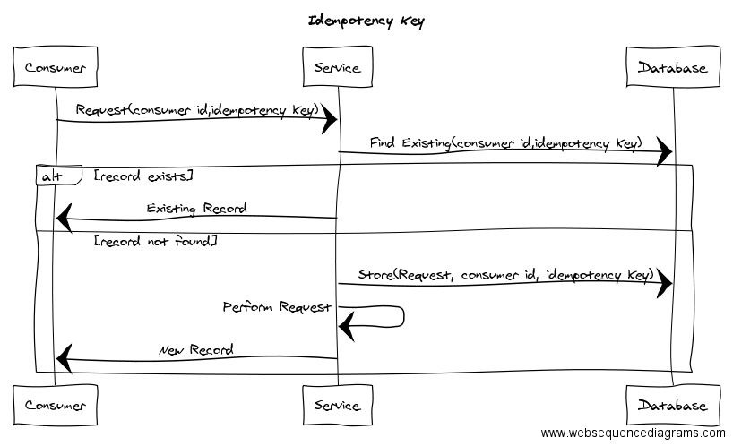
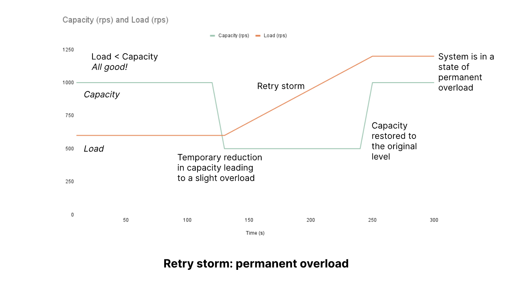
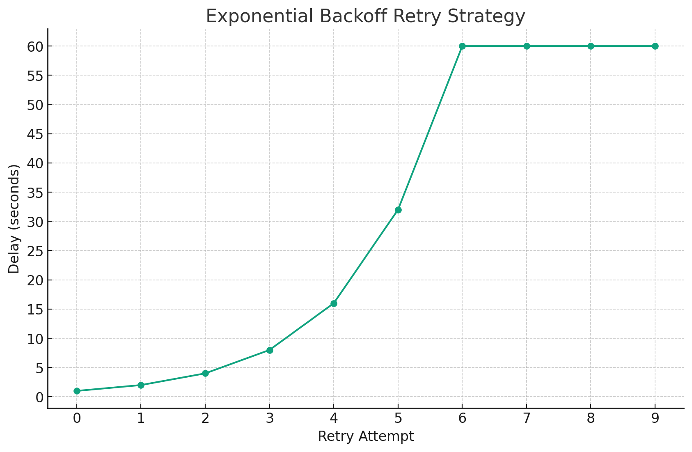
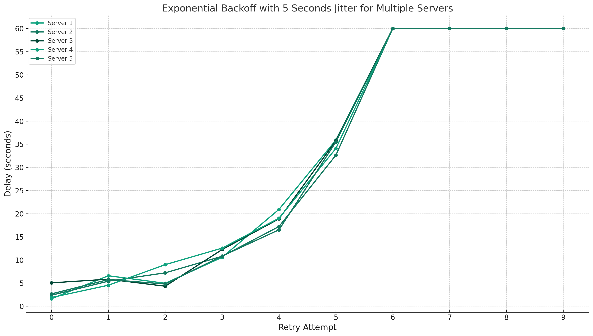

## 실패라고 단언할 수 있는가?

클라이언트가 서버로 네트워크를 통해 요청을 보낼때, 성공적으로 잘 처리되어 응답을 받는 경우가 대부분이겠지만, 일부 요청에서는 에러가 발생할 것이다. 그리고 이 에러 중 대부분의 경우 응답을 받은 즉시 요청이 정말로 실패했는지 확정지을 수 있겠지만, 일부 에러의 경우 실패를 확정지을 수 없다. 그런데 실패를 확정짓지 못한다는 것이 무슨 의미일까? 에러를 받았다면, 그 요청은 당연히 실패한 것 아닐까?

### CASE: 타임아웃 발생

한가지 상황을 가정해보자. 클라이언트가 서버에 게시물 작성을 요청했고, 서버는 그 요청을 받아 게시물을 데이터베이스에 저장하기 시작했다. 그런데 모종의 이유로 데이터베이스 I/O 작업이 굉장히 길어졌다. 클라이언트는 30초 넘게 기다렸지만 서버가 응답을 주지 않아 Read Timeout 에러로 클라이언트는 서버와 연결을 끊었다.

하지만 Timeout 발생 이후 데이터베이스 작업이 끝났고, 게시물이 정상적으로 등록되었다. 분명 클라이언트는 Read Timeout 에러를 만났지만, 서버는 아주 느렸지만 요청을 성공적으로 마쳤다. 하지만 이미 클라이언트는 이 요청을 실패처리했다.

### 네트워크 에러는 종종 결과를 확정지을 수 없다

앞서 Timeout을 예로 들었지만, 이 외에도 네트워크 에러는 성공/실패 여부를 즉시 확정지을 수 없는 경우가 존재한다. 이런 에러가 발생한 경우 아래 3가지 케이스로 나누어 볼 수 있을것이다.

> 1. 요청이 서버에 도달한 뒤, 에러가 발생했고, 그 요청은 **실제로 실패**했다.
> 2. 요청이 서버에 도달한 뒤, 에러가 발생했지만, **사실 그 요청은 성공**했다.
> 3. 알고보니 요청이 서버에 **도달조차 하지 못했다**.

결과를 당장 확정할 수 없는 네트워크 에러가 발생했을때 별 생각없이 이를 확정적인 실패로 판단하는 경우, 사용자에게 잘못된 결과를 노출할 수 있다. 또한 모놀리식 환경과 다르게, MSA 환경에서는 데이터베이스의 트랜잭션을 사용한 롤백이 불가능하다. 따라서 한쪽이 실패한 경우 정합성이 깨질 수 있는 것이다.

## 가정: 주문과 결제 서버

우리가 이커머스 서비스를 개발하고 있다고 가정하자. 우리는 유저로부터 주문을 요청받는 `주문` 서버, 주문 서버로부터 결제 요청을 받는 `결제` 서버를 만들고 있다. `주문` 서버는 유저의 주문 내역을 적재하고, `결제` 서버는 유저의 결제 내역을 적재한다.

그런데 이때, 주문 서버가 결제 서버로 요청했지만 타임아웃이 발생했다면 어떻게 핸들링 해야할까? 주문 서버는 자신의 주문을 확정해야하는데, 결제가 완료되었는지 알 수 없으니 그럴 수 없다. 단순히 결제 요청이 실패했다고 곧바로 주문을 실패처리한다면, 유저는 주문이 실패했는데도 불구하고 돈이 빠져나가는 경험을 겪을수도 있다.

## 재시도 (Retry)

일단 주문서버는 결제서버에 재시도를 해볼 수 있을 것이다. 결제 서버가 제대로 응답을 할 때 까지 2번이고, 3번이고 재시도 하는 방법이다. 재시도 과정에서 결제 서버가 정상 응답을 내려주었다면, 주문의 상태도 성공/실패로 확정지을 수 있을 것이다.

그런데 무턱대고 재시도를 해도 괜찮을까? 만약 Timeout이 발생했던 모든 요청이 사실은 성공했다면, 의도치 않게 1번의 주문으로 다건의 결제가 진행되는 금융 사고가 발생할 것이다. 좀 더 안전하게 재시도를 요청할 방법이 필요하다.

## 멱등성을 통한 안전한 재시도

멱등성이란, 같은 요청을 여러번 수행하더라도 처음 요청과 동일한 결과를 갖도록 하는 성질을 의미한다. 예를 들어, 결제 서버에 멱등성이 적용된다면 동일한 결제 요청이 도달하더라도 결제는 단 한번만 수행되어야 할 것이다. 그런데, 멱등성은 어떻게 구현하는 것일까? '동일한 요청'은 결제 서버가 어떻게 판단할까?

### 멱등키 (Idenpotency Key)

주문 서버는 결제 서버에 결제 요청을 보낼 때, 유니크한 ID를 생성하여 함께 보낸다. 이 ID를 **멱등키**라고 한다.

결제 서버는 결제 요청을 받음과 동시에, 이전에 동일한 멱등키로 결제가 진행된적이 있는지 확인한다. 처음 받은 멱등키라면 결제를 진행한다. 하지만, 이전에 받아 이미 결제가 수행되었던 멱등키라면, 결제를 수행하지 않고 처음 요청의 결과를 그대로 반환한다.

## 똑똑하게 Retry 하기

그런데 알고보니 결제 서버가 굉장히 큰 부하를 받고 있었고, 그로 인해 처리 속도가 매우 낮아져 Timeout이 발생했던 것이라면, Retry는 어떤 문제를 야기할까?

결제 서버 입장에서는 당장 현재 받고 있는 트래픽이 낮아져야 요청 속도가 개선이 될것이다. 하지만 결제서버는 주문서버의 Retry로 인해 이전보다 더 큰 부하를 받게 된다. 오히려 상황이 이전보다 악화된 것이다. 실제 서비스에서는 주문 서버 뿐 아니라, 결제 서버에 의존하는 수 많은 서버들이 Retry 요청을 보내게될 것이다. 마치 DDOS와도 같은 이런 현상을 **Retry Storm** 이라고 부른다.

이런 문제를 방지하기 위해 **Retry 전략**이 필요하다.

### Exponential Backoff

**지수적으로(Exponential)** 간격을 두고(Backoff) 재시도하는 전략이다.

예를 들면, 위 그래프와 같이 최초 재시도는 1초 뒤에 보낸다고 가정했을 때, 그 이후 재시도는 2초 뒤, 그 다음은 4초 뒤, 8초, 16초, ⋯. 이렇게 지수적으로 재시도 간격을 늘린다. 필요하다면 최대 재시도 간격을 그래프와 같이 60초로 설정해볼수도 있다.

동일한 간격으로 잦은 재시도 요청을 보내는 것 보다, 지수적으로 그 간격을 늘려가면서 요청하는 것이 결제서버가 받게되는 부하가 훨씬 적다. 하지만 결제서버로 요청하는 모든 서버가 동일한 전략을 사용하면, 결국 재시도 시점에 결제서버가 받게되는 부하는 여전히 클것이다.

### Exponential Backoff with Jitter

Jitter란 원래 컴퓨터 공학에서 사용되는 용어인데, 패킷이 도달하는 시간이 일정하지 않고 불규칙한 현상을 가리킨다. Exponential Backoff with Jitter는 이 Jitter를 의도적으로 발생시켜 Retry 요청들이 일정한 시각에 몰리는 것을 방지한다. 즉, 쉽게 말하자면 기존 Exponential Backoff 전략에 무작위성을 더한 전략이라고 생각하면 된다.

위처럼, 지수적으로 증가하는 간격에 무작위성을 추가하니 같은 시각에 요청이 몰리지 않고 분산되게 되었다.

### 언젠가 재시도는 포기해야한다

무제한으로 재시도 요청을 보낼수는 없다. 많은 재시도를 하게 된다면, 사용자도 그만큼 늦게 응답을 받게 된다. 또, 재시도는 그 자체로 리소스 낭비가 될 수 있다. 즉, 재시도 횟수를 정해두고 언젠가는 재시도를 포기해야한다.

수많은 재시도 끝에도 Timeout을 만나봤다면, 주문서버는 결국 결제 요청의 성공 여부를 모를 것이다. 하지만 주문서버는 자신의 주문의 상태를 확정지어야한다.

## 중복 주문 방지

> 이 아래 부분은 이응준님의 **[토스 SLASH 22 - 왜 은행은 무한스크롤이 안되나요](https://www.youtube.com/watch?v=v9rcKpUZw4o)** 발표 영상의 내용을 다수 참고하였다.

재시도를 포기했다면, 유저에게는 '주문 처리 결과를 알 수 없다' 는 메시지가 노출될 것이다. 유저는 자신의 주문이 어떻게 처리되었는지 알 방법이 없으니, 재주문을 시도할 것이다. 하지만 재주문을 요청한다면 중복으로 주문이 발생할 가능성이 있다. 따라서 중복 요청을 막아야한다.

1. **주문 상태 초기화**: 주문 서버는 유저에게 주문 요청을 받자마자, 주문을 `대기` 상태로 저장한다.
2. **결제 요청 및 주문 상태 전이**: 주문 서버는 결제 서버에 결제 요청을 보내고, 응답에 따라서 주문의 상태를 `성공` 또는 `실패` 로 변경한다. 하지만 다수의 Retry에도 불구하고 Timeout이 발생했다면, 결제의 상태를 확정할 수 없으므로 주문의 상태도 여전히 `대기` 상태이다.
3. **중복 주문 방지**: `대기` 상태의 주문을 보유한 유저가 새로운 주문을 요청한 경우, '이전 주문건이 진행중' 이라는 문구를 노출하고 주문을 막는다.

## 확정되지 않은 결제 요청 확정

### 폴링 (Polling)

결제 서버가 결제 내역의 상태를 조회할 수 있는 API를 열어두고, 주문 서버가 이 API로 대기 상태로 남아있는 결제건에 대해 주기적으로 요청하여 상태를 확인하는 방법이다. 결제 서버가 해당 결제에 대해 성공 또는 실패의 최종 상태로 응답을 한다면, 주문 서버도 해당 결제건과 매핑되어 있는 주문 내역의 상태를 성공 또는 실패로 갱신한다.

하지만 이 방법은 앞서 살펴본 Retry Storm 과 비슷하게 결제 서버에 불필요한 부하를 유발할 수 있다. 결제의 상태가 최종 상태로 확정되는 순간 주문 서버가 이를 알 수 있도록 해볼 수 없을까? 메시지큐를 사용하면 가능하다.

### 메시지 큐 (Message Queue)

카프카와 같은 메시지 큐를 사용하는 방법이다. 결제 서버가 완료된 결제 내역에 대해 성공/실패 여부를 메시지로 발행하고, 주문 서버가 해당 메시지를 컨슘한다. 주문 서버는 컨슘한 메시지의 결제 내역의 상태에 따라, 매핑되어 있는 주문 내역의 상태를 성공 또는 실패로 갱신한다. 폴링방식과 비교했을 때 불필요한 트래픽이 발생하지 않으며, CDL Retry 패턴등을 사용하여 더 안정적으로 정합성을 유지할 수 있다.

### 결제 요청이 도달조차 하지 않았다면?

인프라 이슈등으로 인하여 주문 서버의 요청이 결제 서버에 도달조차 하지 못한 경우가 낮은 확률로 발생할수 있다. 이 경우 결제 서버는 해당 결제건에 대해 전혀 모르고 있을 것이다. 이런 경우 영영 주문의 상태는 최종 상태로 확정되지 못할것이고, 유저는 영원히 주문을 할 수 없는 상태에 놓인다.

이런 상황을 막기 위해서는 대기중인 주문이 이미 있어 유저의 주문을 막기 이전에, 결제 서버에 대기중인 주문건에 매핑된 결제에 대해 알고 있냐고 물어봐야한다. 결제 서버가 모르고 있다면, 결제 과정 자체가 시작되지 않았으므로 주문을 실패로 확정해도 된다.

물론 결제 요청이 모종의 이유로 결제 상태 확인 요청보다 늦게 들어오는 경우 또 정합이 깨질 수 있다. 이 때에는 주문서버, 결제서버 양자간 타임아웃 시간을 합의하고, 결제 요청에 요청을 보낸 타임스탬프를 기록한 뒤, 타임아웃 시간 이후에 요청이 들어온 경우 항상 실패처리하면 된다.

## 그럼에도 불구하고

그럼에도 불구하고 컴포넌트간 정합성은 어떤 엣지케이스로 인해 깨지게될 수 있다. 따라서 주기적으로 이런 정합이 깨진 건들을 식별하고, 개발자에게 알릴 수 있도록 모니터링을 잘 구축해둬야할 필요가 있다.

## 참고

- https://www.youtube.com/watch?v=v9rcKpUZw4o
- https://www.youtube.com/watch?v=UOWy6zdsD-c
- https://tech.kakaopay.com/post/msa-transaction
- https://multithreaded.stitchfix.com/blog/2017/06/26/patterns-of-soa-idempotency-key/
- https://jungseob86.tistory.com/12
