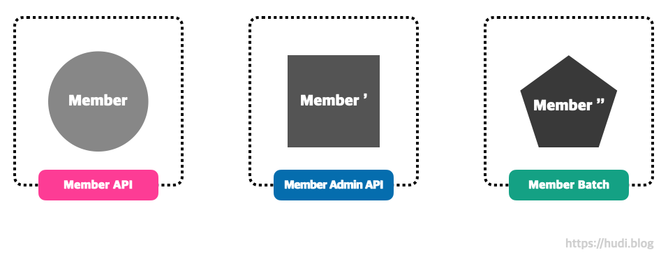
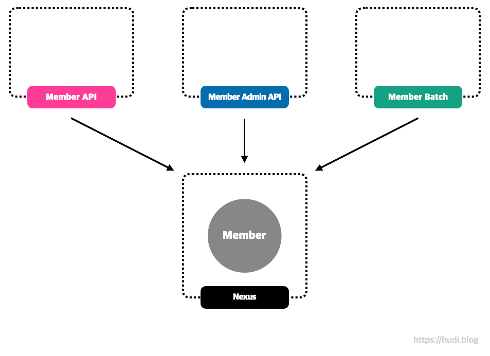
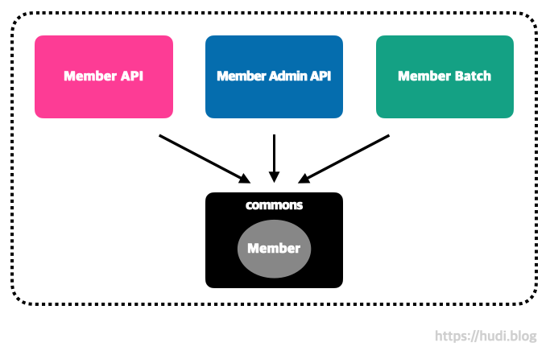
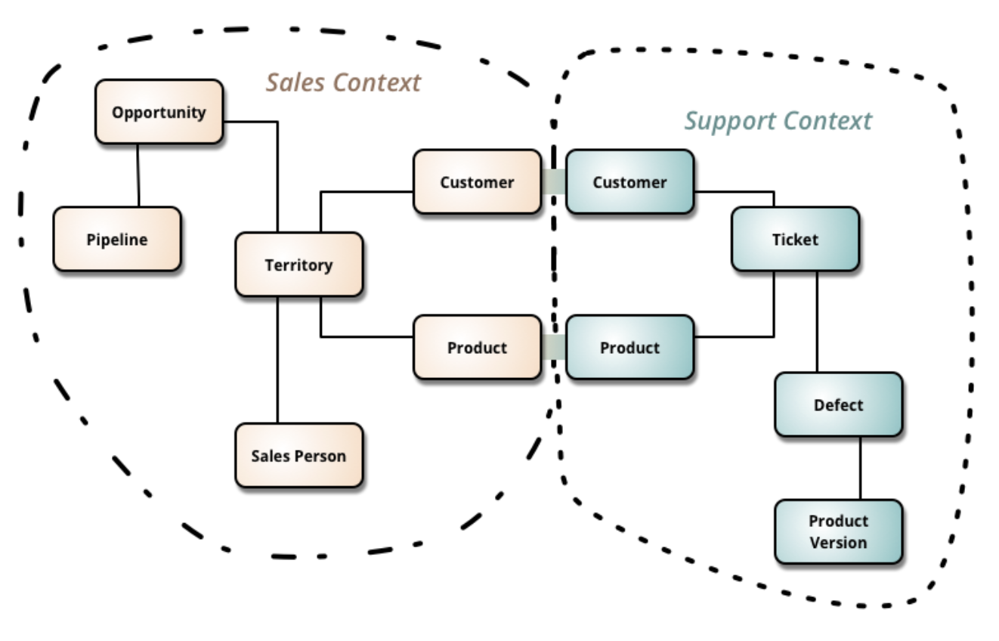

## 멀티 모듈이란

Java에서 모듈이란 패키지의 한 단계 위의 집합체이며, 독립적으로 배포될 수 있는 코드의 단위를 이야기한다. 멀티 모듈 프로젝트는 상호 연결된 여러개의 모듈로 구성된 프로젝트를 의미한다. 멀티 모듈 프로젝트의 각 모듈은 전체 서비스의 구성요소로서 동작한다.

각 모듈은 독립적으로 빌드할 수 있는 것이 특징이다. 즉 한 프로젝트에서 특정 모듈은 자바 스프링 스택을 사용할 때, 다른 모듈은 코틀린 스프링 스택을 사용할수도 있다. 또는 스프링 부트를 특정 모듈에서는 2.X.X 버전을, 다른 모듈은 3.X.X 버전을 사용할수도 있다.

## Case1. 멀티 모듈을 통한 공통 코드 분리

### 싱글 모듈 멀티 프로젝트

회원 시스템을 만든다고 가정해보자. 회원 시스템에서 우리가 필요한 것들은 고객의 화면단에서 호출하게 되는 Member API 서버, 사내 관리자 페이지에서 호출하게 되는 Member Admin API 서버, 주기적으로 작업을 수행하는 Member Batch 서버 이렇게 3가지이다.

같은 도메인에 대해 별도의 여러 프로젝트로 구성되어 있으므로 **중복되는 코드**가 많이 발생할 것이다. 예를 들어 Member 도메인 모델에 대한 코드를 Member API, Member Admin API, Member Batch 프로젝트에 **모두 작성**해주어야 한다. 이는 서비스, 레포지토리도 마찬가지이다. 이런 구조에서 요구사항이 변경된다면, 3개의 프로젝트에 산재된 **공통된 코드를 모두 변경**해주어야한다.

이때 흔히 말하는 **‘복붙’**을 사용하게 될 것이고, **일관성 관리의 주체는 사람**이다. 사람이 일관성을 관리하다보니 **휴먼 에러**가 발생하기 쉽다. 또한 여러 프로젝트에 코드가 산재되어 있으니 처음에는 **동일했던 코드가 각자 다르게 변화할 가능성**이 커지고, 이런 상황이 온다면 **유지보수 난이도가 높아질 것**이다.

그리고 이 모든 프로젝트를 관리하기 위해 여러개의 IDE를 실행해야하는 것도 큰 단점이다. IntelliJ는 컴퓨터 리소스를 굉장히 많이 잡아먹는다…

### 사설 저장소 사용

싱글 모듈 멀티 프로젝트에서 발생한 여러 문제 (코드의 중복, 일관성을 사람이 관리)를 해결하기 위해 **Nexus 등을 사용하여 사설 저장소**에 공통된 코드를 라이브러리화 하여 **배포**하는 방법이 있을 것이다. 배포된 라이브러리는 Member API, Member Admin API, Member Batch 에서 **의존성을 추가**하여 사용한다.

중복된 코드에 대한 **일관성 관리 주체가 사람에서 시스템으로 이동되었고, 따라서 신뢰성이 상승**하였다. 하지만, 여전히 불편함은 존재한다.

공통된 코드가 수정되면 이를 **배포하고 빌드하는 사이클**이 추가된다. 단 한줄의 소스코드 수정이라도 이 과정을 거쳐야 하므로 **굉장히 번거로워진다**. 또한 기존에는 3개의 IDE를 실행해야 했다면, 이제는 4개의 IDE를 켜야한다는 깨알같은 불편함도 추가된다.

### 멀티 모듈 싱글 프로젝트

멀티 모듈 싱글 프로젝트 아키텍처는, 앞서 살펴본 2가지 방법과 다르게 하나의 프로젝트에서 ‘모듈’을 여러개로 분리하여 관리하는 방법이다. 위 그림을 살펴보면 각각의 프로젝트였던 Member API, Member Admin API, Member Batch, 공통된 코드(commons)가 모두 프로젝트가 아닌 모듈(서브 프로젝트)이 된 것을 확인할 수 있다.

이 방식을 사용하면 **코드 일관성 관리 주체를 시스템으로** 옮겨올 수 있으며, 공통 코드가 수정되었을 때 별도의 **빌드/배포 사이클이 필요하지 않으며**, **IDE 또한 하나만 실행해** 사용할 수 있다는 장점이 존재한다. 앞서 존재했던 문제를 모두 해결한 것을 확인할 수 있다. 이것이 **중복된 공통 코드를 분리하는 관점**에서의 멀티 모듈 사용 케이스이다.

## Case2. 멀티 모듈과 DDD, 그리고 MSA

DDD(domain-driven development)에는 **바운디드 컨텍스트(bounded context)**라는 개념이 존재한다. 나도 DDD에 깊이 공부해본적은 없어 자세히 이야기하기는 어려우나, 바운디드 컨텍스트란 DDD의 **유비쿼터스 언어가 특정한 의미를 가지는 범위, 경계, 맥락**을 의미한다.

예를 들어 ‘**고객’** 이라는 단어는 **‘배달 서비스’**의 맥락에서는 이 고객의 **집주소 정보**에 관심이 있겠지만, **‘결제 서비스’**의 맥락에서는 유저의 **결제 정보**에 관심이 있을 것이다. 이 서로 다른 두 서비스에서 바라보는 ‘고객’은 사실상 다른 고객이다. 맥락에 따라 같은 단어가 다르게 해석되는 것이다. 이것이 바로 바운디드 컨텍스트이다.

바운디드 컨텍스트는 배달 앱으로 예를 들자면, ‘고객’, ‘주문’, ‘식당’, ‘결제’, ‘배달’ 등을 예로 들 수 있다. 멀티 모듈을 사용하면 DDD의 **바운디드 컨텍스트를 독립된 모듈로 분리**할 수 있다. 즉, 시스템을 더 작은 단위로 분해하여 복잡한 도메인을 더 쉽게 이해할 수 있게 된다.

바운디드 컨텍스트 단위로 쪼개진 멀티 모듈 프로젝트는 각각의 모듈이 **독립적인 마이크로 서비스로 점진적으로 변화할 수 있다.**

> 좋은 아키텍처는 시스템이 모노리틱 구조로 태어나서 단일 파일로 배포되더라도, 이후에는 독립적으로 배포 가능한 단위들의 집합으로 성장하고, 또 독립적인 서비스나 마이크로서비스 수준까지 성장할 수 있도록 만들어져야한다. 또한 좋은 아키텍처라면 나중에 상황이 바뀌었을 때 이 진행 방향을 거꾸로 돌려 원래 형태인 모노리틱 구조로 되돌릴 수도 있어야 한다 *― 클린 아키텍처*
> 

## 마치며

다음 포스팅에서는 스프링부트 프로젝트에 멀티 모듈을 적용하는 방법을 알아볼 예정이다.

## 참고

- [https://www.youtube.com/watch?v=nH382BcycHc](https://www.youtube.com/watch?v=nH382BcycHc)
- [https://techblog.woowahan.com/2637/](https://techblog.woowahan.com/2637/)
- [https://tecoble.techcourse.co.kr/post/2021-09-06-multi-module/](https://tecoble.techcourse.co.kr/post/2021-09-06-multi-module/)
- ChatGPT