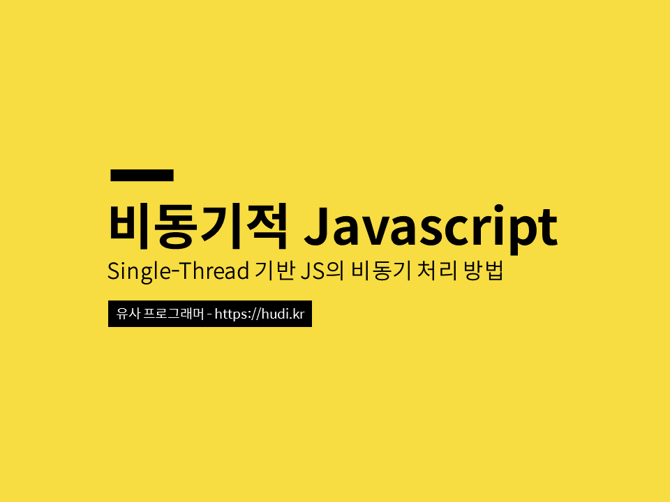
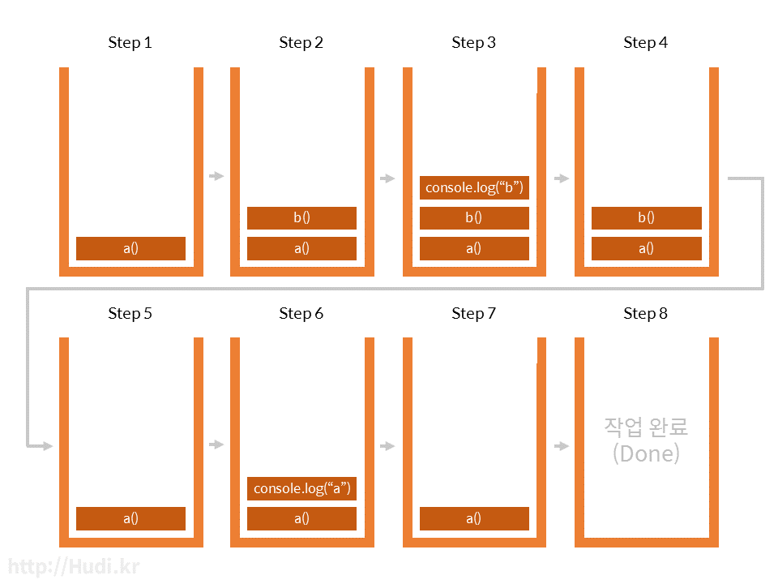
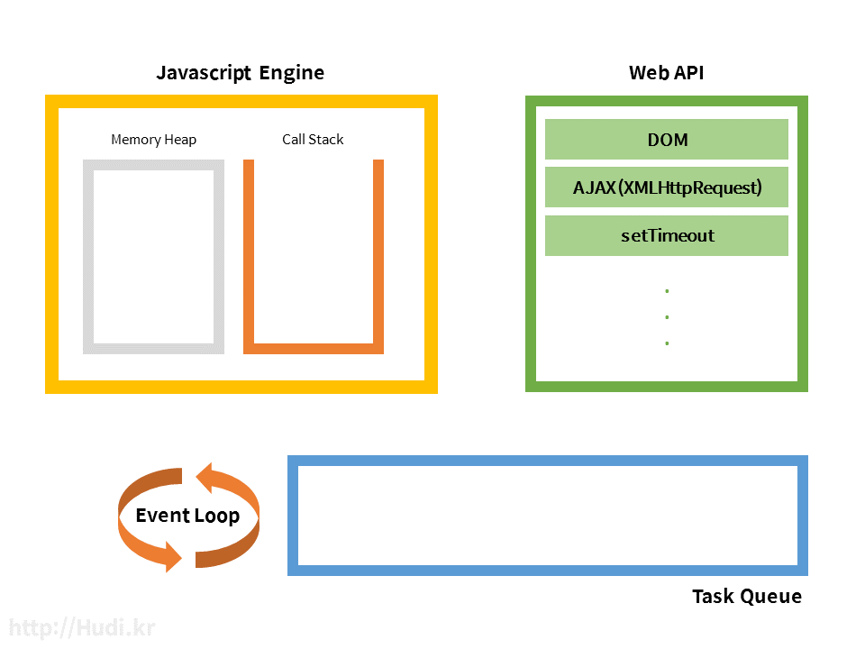
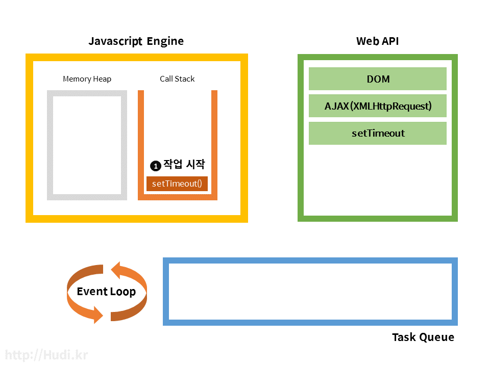
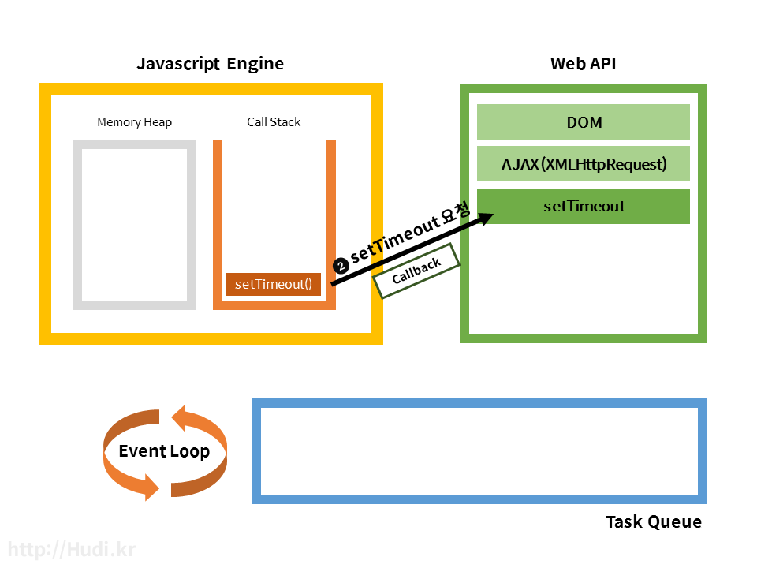
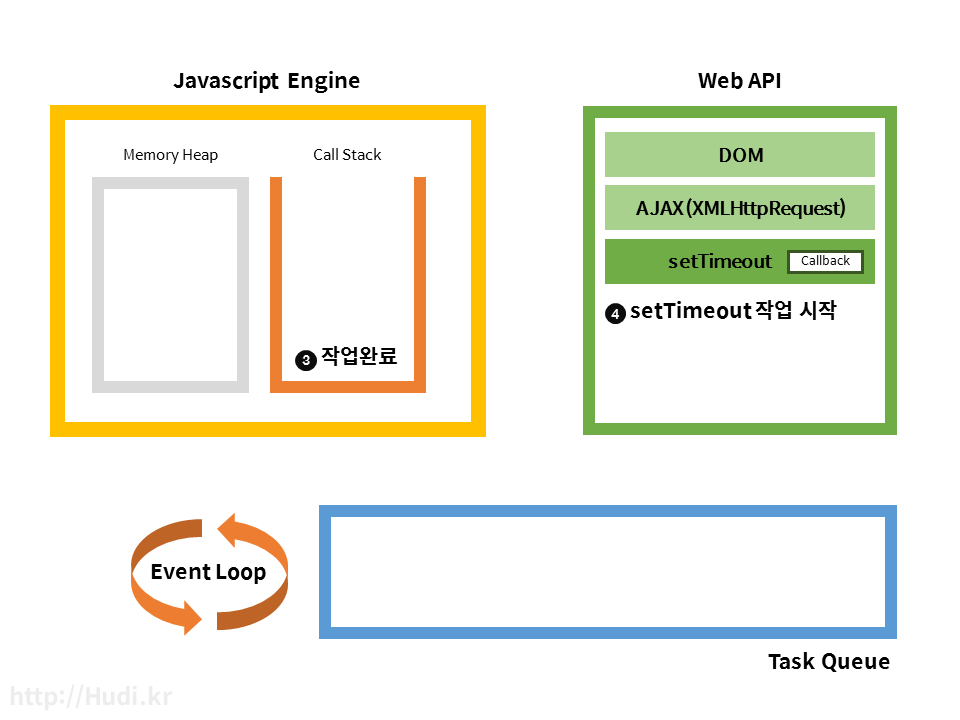
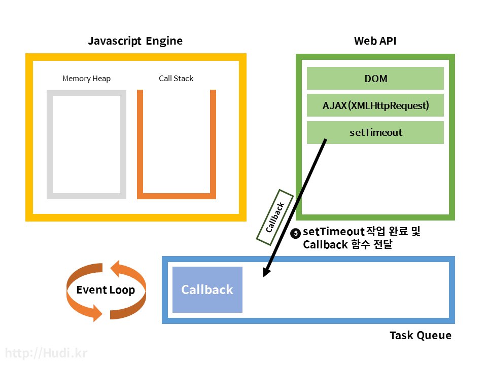
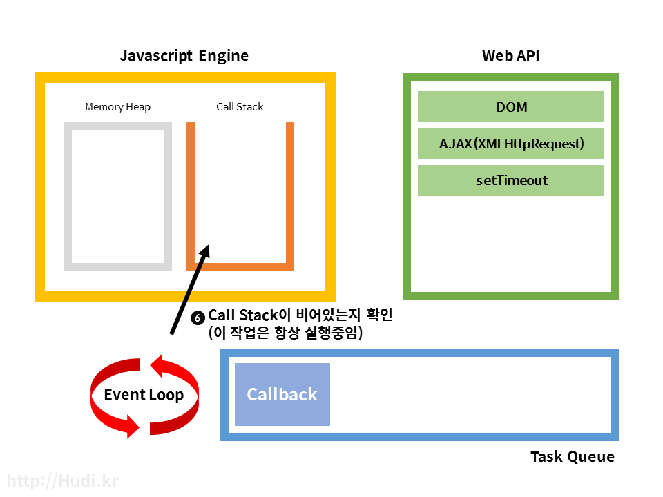
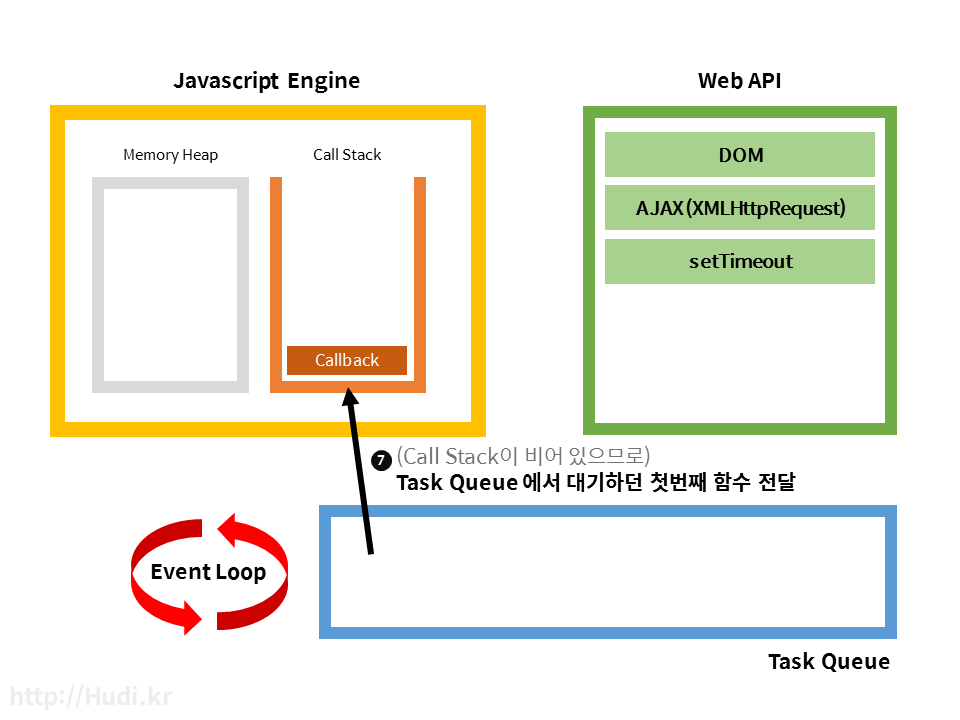

> 이전 블로그 (https://hudi.kr) 에서 이전해온 글 입니다.



싱글 스레드 (Single-Thread) 로 작동한다고 알려져있는 Javascript 가 어떻게 비동기 작업을 통해 여러가지 Task를 동시에 처리하는지에 대해 알아보자. 특히 Promise 패턴, Async Await 를 제대로 이해하기 위해서는 꼭 공부하고 넘어가자.

## 비동기적 Javascript
C, Java, Python 을 사용하면 상식적으로 별도의 스레드나 프로세스를 사용하지 않는 이상, 먼저 작성된 순서대로 즉, 동기적으로 코드가 실행된다. 가령, 3번째 줄에 있는 코드의 작업이 5번째 줄에 있는 코드보다 늦게 끝나는 비상식적인 일은 발생하지 않는다는 뜻이다. 하지만 자바스크립트는 먼저 실행된 코드의 작업이 끝나기 전에 더 나중에 실행된 코드의 작업이 끝날 수 있다. 아주 간단한 예를 들어보겠다.

```js
function first() {
	setTimeout(() => {
  	console.log("The First function has been called.")
  }, 1000)
}

function second() {
	setTimeout(() => {
  	console.log("The Second function has been called.")
  }, 500)
}

first()
second()
```

first 함수가 호출되면, setTimeout 을 통해 1000ms 가 지나고서야 문장이 출력되지만, second 함수는 문자열 출력에 고작 500ms 밖에 걸리지 않는다. 코드에서는 first 함수를 먼저 호출했지만, 결과는 다음과 같다.

```
The Second function has been called.
The First function has been called.
```

이것이 Javascript 의 비동기성이다. 하지만, 자바스크립트는 하나의 스레드 (Single Thread) 기반의 언어이다. 즉, 자바스크립트는 한번에 하나의 작업밖에 수행하지 못한다는 의미이다. 그런데 이상하다. 자바스크립트는 위의 간단한 예제는 물론이고, Ajax로 데이터를 불러오면서 Mouseover 이벤트를 처리하면서 애니메이션을 동작시킨다. 어떻게 이런 동시성 (Concurrency) 이 가능한 것일까? 그것을 알아보기 전에 Javascript Engine 의 구조부터 짚고 넘어가자.

## Call Stack



자바스크립트 엔진은 메모리 힙과 단일 호출 스택 (Call Stack)을 가지고 있다. 하나의 호출 스택만 가지고 있으므로 위에서 지겹게 언급했듯이, 한번에 단 하나의 함수만 처리할 수 있다. 다음과 같은 시시콜콜한 자바스크립트 코드를 실행해보자.

```js
function a() {
	b()
	console.log("a")
}

function b() {
	console.log("b")
}

a()
```

결과가 어떻게 나오는가? 당연히 “b”, “a” 순서대로 출력되는 것이 정상이다. 왜 이런 순서로 출력되는지 Call Stack 에 함수가 쌓이는 순서를 보고 확인해보자.


보이는 것 같이 스택의 형태로 호출된 함수를 추가하고 (Push) 실행된 함수를 제거 (Pop) 하는 형태이다. 이렇게 자바스크립트는 다른 함수가 실행되고 있을때는 그 함수가 종료되기 직전까지 다른 작업이 중간에 끼어들 수 없다. 이것을 Run-to-completion 이라고 한다. “뭐야, 그럼 결국 동시실행이 불가능하다는 이야기잖아.” 하고 실망할 수 있겠지만, 자바스크립트는 자바스크립트 엔진으로만 돌아가는 것이 아니다.

## Javascript Runtime



사실 자바스크립트 엔진 밖에서도 자바스크립트 실행에 관여하는 요소들이 존재한다. 각각 Web API와 Task Queue, Event Loop 이다. 비동기 작업시 각 요소의 역할에 대해 알아보자.

### Web API
위 사진과 같이, Web API 는 브라우저에서 제공되는 API이며, AJAX나 Timeout 등의 비동기 작업을 실행한다. 자바스크립트에서 setTimeout 과 같은 함수를 실행하면, 자바스크립트 엔진은 Web API에 setTimeout 을 요청하고 동시에 setTimeout에 넣어준 Callback 까지 전달한다. Callstack 에서는 Web API 요청 이후 setTimeout 작업이 완료되어 제거된다.

Web API는 방금 요청받은 setTimeout을 완료하고, 동시에 전달받은 Callback 을 Task Queue라는 곳에 넘겨준다. 다음으로 Task Queue와 Event Loop 에 대해 알아보자.

### Task Queue와 Event Loop
Task Queue 는 Callback Queue 라고도 하는데, 큐 형태로 Web API에서 넘겨받은 Callback 함수를 저장한다. 이 Callback 함수들은 자바스크립트 엔진의 Call Stack의 모든 작업이 완료되면 순서대로 Call Stack에 추가된다. 이 때 Call Stack 가 비어있지 않은지 (실행중인 작업이 존재하는지) 와 Task Queue 에 Task가 존재하는지 를 판단하고, Task Queue 의 작업을 Call Stack 에 옮기는 일을 Event Loop가 작업한다. Event Loop 는 이 작업을 처음부터 끝까지 계속 반복하여 실행한다. 그래서 Event ‘Loop’ 인것이다.

```js
while (queue.waitForMessage()) {
    queue.processNextMessage();
}
```

MDN은 Event Loop의 작업을 위와같은 가상의 코드로 설명하고 있다.

### 직접 해보기

```js
setTimeout(function() {
    console.log("All task was done.");
}, 5000);
```

위 코드는 5초뒤에 문장을 출력하는 아주 간단한 코드이다. 어떻게 비동기로 작동하는지 알아보자.




1. 코드가 실행되고 setTimeout 함수가 실행되면서 Call Stack 에는 setTimeout 함수가 추가된다.



2. setTimeout 함수는 자바스크립트 엔진이 처리하지 않고, Web API가 처리하기에 setTimeout 에 담긴 Callback 함수를 전달함과 동시에 setTimeout 작업을 요청한다.



3. Call Stack 에서는 모든 작업이 완료되었으므로 setTimeout 작업이 제거된다. 

4. Web API는 setTimeout 작업이 실행된다. 5000ms 를 기다린다.



5. 5000ms 가 지나고, Task Queue로 Callback 함수를 전달한다.



6. Event Loop는 항상 Call Stack이 비어있는지, Task Queue 에 작업이 있는지 검사하고 있는데, 마침 지금은 Call Stack이 비어있고, Task Queue 에 수행할 작업이 추가되어 있다. 



7. Task Queue에서 대기하던 Callback 함수 하나를 Call Stack 으로 보낸다.


8. Callback 함수의 작업도 전부 완료되어 Pop되고, 프로그램이 종료된 모습이다.

결국 여기서 알 수 있는 점은 Javascript 엔진은 그저 주어진 코드를 실행하는 온디맨드 (on demand) 실행 환경이라는 것이다. 그 코드 실행의 스케줄링은 Javascript 엔진이 호스팅된 런타임 환경이 맡게되는 것이다.

## Interval이 0이라면?
그렇다면, Interval이 0인 setTimeout 함수와 바로 다음 줄에 일반적인 코드를 적으면, 어떤 코드가 먼저 실행될까? 아래의 간단한 코드의 출력 결과를 예상해보자.

```js
setTimeout(function() {
    console.log("Bye, World!");
}, 0);
console.log("Hello, World!")
```

“Bye, World!”, “Hello, World!” 순의 출력을 예상했다면, 위의 파트를 다시 읽어보고 오자. 실제로는 “Hello, World!” 라는 문장이 먼저 출력된다. 직관적으로는 이해가 잘 안될것이다. Interval이 0이면 바로 실행되야 하는것 아닐까?

## 위에 대한 설명
코드가 실행되면, setTimeout이 가장 먼저 실행되고, Call Stack에 setTimeout이 등록된다. Web API에 setTimeout 작업을 요청함과 동시에 Call Stack에서는 setTimeout 작업이 제거되고, console.log(“Hello, World!”) 작업이 등록된다. console.log(“Hello, World!”) 작업이 완료되고, Task Queue 에서 대기중인 console.log(“Bye, World!”) 작업이 Call Stack으로 전달되어 실행되고 프로그램이 종료된다.

## 관련 웹 사이트
자신이 짠 코드가 어떻게 실행되는지 보고 싶다면, http://latentflip.com/loupe 해당 사이트에 방문하여 직접 코드를 작성해보자. Call Stack, Web API, Task Queue, Event Loop 이 어떻게 상호작용 하고 작동하는지 한눈에 알 수 있도록 애니메이션으로 보여준다.