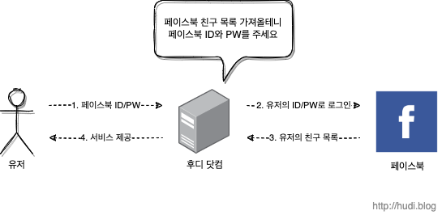
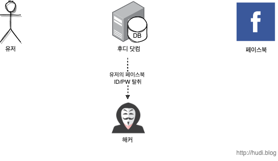
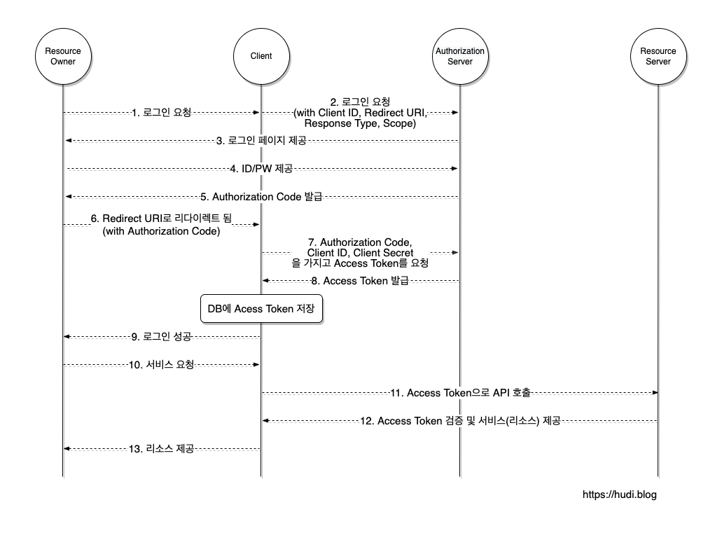
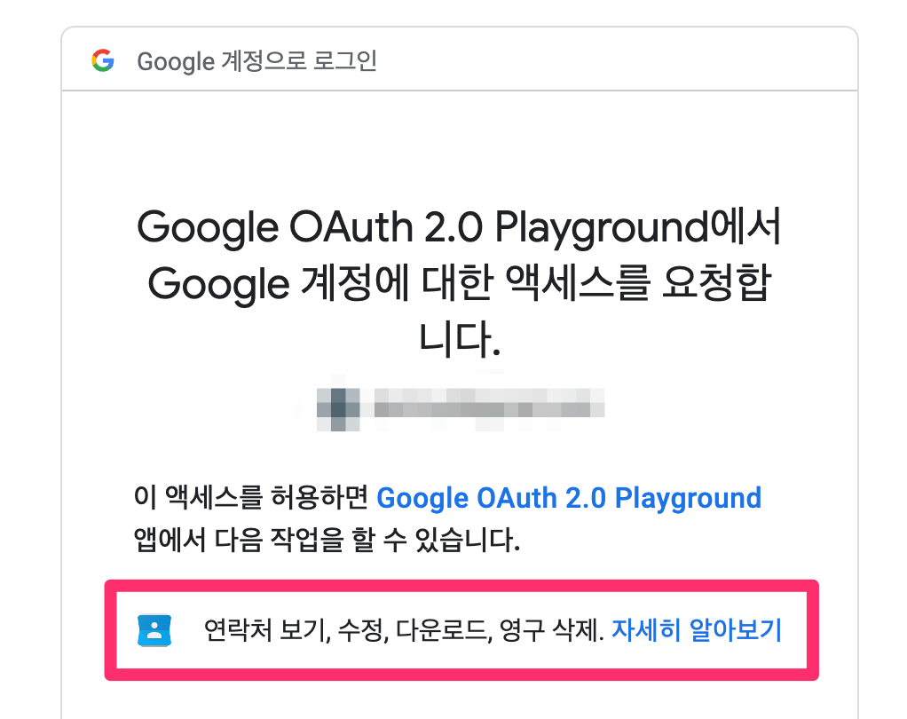

> 2022년 07월 13일에 작성한 글을 보충하여 새로 포스팅한 글이다.

## OAuth 등장 배경

우리의 서비스가 사용자를 대신하여 구글의 캘린더에 일정을 추가하거나, 페이스북, 트위터에 글을 남기는 기능을 만들 수 있을 것 이다. 이때, 가장 쉽게 이 기능을 구현하는 방법은 사용자로부터 구글, 페이스북, 트위터의 ID, Password 를 직접 제공받아 우리의 서비스에 저장하고 활용하는 방법이다.



하지만 이런 방법이 안전할까? 사용자들은 처음보는 우리 서비스를 신뢰하고 자신의 구글 계정 정보를 맡길 수 있을까? 사실 현재의 관점으로 바라보면 미친짓이나 다름없다.

심지어 일반적으로 사용자들은 많은 웹사이트에서 동일한 ID, Password 를 사용하기 때문에 이것이 유출된다면 우리의 사이트에서 피해가 발생하는 것으로만 끝나지 않을 것 이다.



이는 우리의 서비스와 구글, 페이스북, 트위터 등의 입장에서도 굉장한 부담이다. 우리의 입장에서는 사용자의 아주 민감한 정보를 직접 저장하고 관리해야한다는 부담이 생길 것 이다. 또한 구글, 페이스북, 트위터는 자신의 사용자 정보를 신뢰할 수 없는 제3자에게 맡긴다는 것이 매우 불만족스러울 것 이다.

또한 유저는 우리의 서비스로 부여한 권한을 취소하려면, 비밀번호를 변경하는 방법밖에 없다.

이런 문제를 해결하기 위해 OAuth 가 등장하기 이전에는 구글은 AuthSub, 야후는 BBAuth 등 각자 회사가 개발한 방법을 사용하였다. 하지만 이 방식은 표준화 되어있지 않기 때문에 구글과 연동하는 서비스를 만들기 위해서는 AuthSub, 야후와 연동하기 위해서는 BBAuth 에 맞춰 개별적으로 개발하고 유지보수 해야한다.

이를 위해 등장한 것이 바로 OAuth 이다. 최초 1.0 버전은 2006년 트위터와 Ma.gnolia 가 주도적으로 개발하였다. 이후 1.0버전이 개선된 1.0a 버전이 출시되었으나 모바일 어플리케이션 등에서 안전하게 사용될 수 없는 사례가 존재했다. 이런 사례를 보완하고 기존 버전보다 조금 더 단순화한 OAuth 2.0 버전이 2012년에 등장하게 되었다.

> 이 포스팅에서는 가장 최신 버전인 OAuth 2.0을 기준으로 설명한다. 또한 2.0 버전과 하위 버전은 호환되지 않음에 주의하자.

## OAuth 란?

구글, 페이스북, 트위터와 같은 다양한 플랫폼의 특정한 사용자 데이터에 접근하기 위해 제3자 클라이언트(우리의 서비스)가 사용자의 **접근 권한을 위임(Delegated Authorization)**받을 수 있는 표준 프로토콜이다.

쉽게 말하자면, 우리의 서비스가 우리 서비스를 이용하는 유저의 타사 플랫폼 정보에 접근하기 위해서 권한을 타사 플랫폼으로부터 위임 받는 것 이다.

## OAuth 2.0 주체

위에서 언급한 '사용자', '우리의 서비스', '타사 플랫폼(구글, 페이스북, 트위터)' 등을 부르는 용어가 존재한다. 이를 먼저 정리하고 넘어간다.

- Resource Owner : 리소스 소유자. 우리의 서비스를 이용하면서, 구글, 페이스북 등의 플랫폼에서 리소스를 소유하고 있는 사용자이다.
- Client : Resource Server의 자원을 이용하고자 하는 서비스
- Authorization Server : Resource Owner를 인증하고, Client에게 액세스 토큰을 발급해주는 서버
- Resource Server : 구글, 페이스북, 트위터와 같이 리소스를 가지고 있는 서버

> Authorization Server와 Resource Server는 [공식문서](https://datatracker.ietf.org/doc/html/rfc6749#section-1.2)상 별개로 구분되어 있지만, 별개의 서버로 구성할지, 하나의 서버로 구성할지는 개발자가 선택하기 나름이라고 한다.

> Client는 우리가 구현하는 서비스이므로 Resource Owner와 헷갈리지 말자. Resource Server와 Authorization Server의 입장에서는 우리 서비스가 클라이언트이기 때문에 이런 이름을 갖게 된 것 이다.

## 어플리케이션 등록

선행되어야 하는 작업이 있다. Client를 Resource Server 에 등록해야하는 작업이다. 이때, Redirect URI를 등록해야한다. Redirect URI는 사용자가 OAuth 2.0 서비스에서 인증을 마치고 (예를 들어 구글 로그인 페이지에서 로그인을 마쳤을 때) 사용자를 리디렉션시킬 위치이다.

### Redirect URI

OAuth 2.0 서비스는 인증이 성공한 사용자를 사전에 등록된 Redirect URI로만 리디렉션 시킨다. 승인되지 않은 URI로 리디렉션 될 경우, 추후 설명할 Authorization Code를 중간에 탈취당할 위험성이 있기 때문이다. 일부 OAuth 2.0 서비스는 여러 Redirect URI를 등록할 수 있다.

Redirect URI는 기본적으로 보안을 위해 https만 허용된다. 단, 루프백(localhost)는 예외적으로 http가 허용된다.

### Client ID, Client Secret

등록과정을 마치면, Client ID와 Client Secret를 얻을 수 있다. 발급된 Client ID와 Client Secret은 액세스 토큰을 획득하는데 사용된다. 이때, Client ID는 공개되어도 상관없지만, Client Secret은 절대 유출되어서는 안된다. 심각한 보안사고로 이어질 수 있다.

## OAuth 2.0의 동작 메커니즘



### 1 ~ 2. 로그인 요청

Resource Owner가 우리 서비스의 '구글로 로그인하기' 등의 버튼을 클릭해 로그인을 요청한다. Client는 OAuth 프로세스를 시작하기 위해 사용자의 브라우저를 Authorization Server로 보내야한다.

클라이언트는 이때 Authorization Server가 제공하는 Authorization URL에 `response_type` , `client_id` , `redirect_uri` , `scope` 등의 매개변수를 쿼리 스트링으로 포함하여 보낸다.

예를 들어 어떤 OAuth 2.0 서비스의 Authorization URL이 `https://authorization-server.com/auth` 라면, 결과적으로 Client는 아래와 같은 URL을 빌드할 것 이다.

```
https://authorization-server.com/auth?response_type=code
&client_id=29352735982374239857
&redirect_uri=https://example-app.com/callback
&scope=create+delete
```

이때 Authorization Server에게 보낼 매개변수는 아래와 같은 것들이 있다.

- `response_type` : 반드시 `code` 로 값을 설정해야한다. ([참고](https://datatracker.ietf.org/doc/html/rfc6749#section-4.1.1)) 인증이 성공할 경우 클라이언트는 후술할 Authorization Code를 받을 수 있다.
- `client_id` : 애플리케이션을 생성했을 때 발급받은 Client ID
- `redirect_uri` : 애플리케이션을 생성할 때 등록한 Redirect URI
- `scope` : 클라이언트가 부여받은 리소스 접근 권한. 아래에서 더 자세히 설명하겠다.

### 3 ~ 4. 로그인 페이지 제공, ID/PW 제공

클라이언트가 빌드한 Authorization URL로 이동된 Resource Owner는 제공된 로그인 페이지에서 ID와 PW 등을 입력하여 인증할 것 이다.

### 5 ~ 6. Authorization Code 발급, Redirect URI로 리디렉트

인증이 성공되었다면, Authorization Server 는 제공된 Redirect URI로 사용자를 리디렉션시킬 것 이다. 이때, Redirect URI에 Authorization Code를 포함하여 사용자를 리디렉션 시킨다. 구글의 경우 코드를 쿼리 스트링에 포함한다.

이때, Authorization Code란 Client가 Access Token을 획득하기 위해 사용하는 임시 코드이다. 이 코드는 수명이 매우 짧다. (일반적으로 1~10분)

### 7 ~ 8. Authorization Code와 Access Token 교환

Client는 Authorization Server에 Authorization Code를 전달하고, Access Token을 응답받는다. Client는 발급받은 Resource Owner의 Access Token을 저장하고, 이후 Resource Server에서 Resource Owner의 리소스에 접근하기 위해 Access Token을 사용한다.

Access Token은 유출되어서는 안된다. 따라서 제 3자가 가로채지 못하도록 HTTPS 연결을 통해서만 사용될 수 있다.

Authorization Code와 Access Token 교환은 `token` 엔드포인트에서 이루어진다. 아래는 token 엔드포인트에서 Access Token을 발급받기 위한 HTTP 요청의 예시이다. 이 요청은 `application/x-www-form-urlencoded` 의 형식에 맞춰 전달해야한다.

```
POST /oauth/token HTTP/1.1
Host: authorization-server.com

grant_type=authorization_code
&code=xxxxxxxxxxx
&redirect_uri=https://example-app.com/redirect
&client_id=xxxxxxxxxx
&client_secret=xxxxxxxxxx
```

필수로 전달해야하는 매개변수를 살펴보자.

- `grant_type` : 항상 `authorization_code` 로 설정되어야 한다. ([참고](https://datatracker.ietf.org/doc/html/rfc6749#section-4.1.3))
- `code` : 발급받은 Authorization Code
- `redirect_uri` : Redirect URI
- `client_id` : Client ID
- `client_secret` : RFC 표준상 필수는 아니지만, Client Secret이 발급된 경우 포함하여 요청해야한다.

### 9. 로그인 성공

위 과정을 성공적으로 마치면 Client는 Resource Owner에게 로그인이 성공하였음을 알린다.

### 10 ~ 13. Access Token으로 리소스 접근

이후 Resource Owner가 Resource Server의 리소스가 필요한 기능을 Client에 요청한다. Client는 위 과정에서 발급받고 저장해둔 Resource Owner의 Access Token을 사용하여 제한된 리소스에 접근하고, Resource Owner에게 자사의 서비스를 제공한다.

## OAuth 2.0의 스코프

OAuth 2.0은 스코프라는 개념을 통해서 유저 리소스에 대한 클라이언트의 접근 범위를 제한할 수 있다. 스코프는 여러개가 될 수 있으며, 대소문자를 구문하는 문자열을 공백으로 구분하여 표현된다. 이때 문자열은 OAuth 2.0 인증 서버에 의해 정의된다.

예를 들어 우리의 서비스가 사용자의 구글 연락처를 받아오고 싶다면, OAuth 2.0 스코프에 연락처 스코프 문자열을 포함하여 OAuth 2.0 제공자에게 전달하면 된다. 그렇다면 사용자는 아래의 사진과 같이 스코프에 명시된 권한을 요청하는 화면을 만날 수 있을 것 이다.



이 과정을 거쳐 발급된 액세스 토큰은 부여된 스코프에 해당하는 권한을 제한적으로 획득할 수 있다.

## Authorization Code가 왜 필요한 것 인가?

그런데 조금 이상하다. Authorization Code를 발급하지 않고, 곧바로 Client에게 Access Token을 발급해줘도 되지 않을까? 왜 굳이 Access Token을 획득하는 과정에 Authorization Code 발급 과정이 필요할까?

Redirect URI를 통해 Authorization Code를 발급하는 과정이 생략된다면, Authorization Server가 Access Token을 Client에 전달하기 위해 Redirect URI를 통해야 한다. 이때, Redirect URI를 통해 데이터를 전달할 방법은 URL 자체에 데이터를 실어 전달하는 방법밖에 존재하지 않는다. 브라우저를 통해 데이터가 곧바로 노출되는 것 이다.

하지만, Access Token은 민감한 데이터이다. 이렇게 쉽게 노출되어서는 안된다. 이런 보안 사고를 방지 Authorization Code를 사용하는 것 이다.

Redirect URI를 프론트엔드 주소로 설정하여, Authorization Code를 프론트엔드로 전달한다. 그리고 이 Authorization Code는 프론트엔드에서 백엔드로 전달된다. 코드를 전달받은 백엔드는 비로소 Authorization Server의 token 엔드포인트로 요청하여 Access Token을 발급한다.

이런 과정을 거치면 Access Token이 항상 우리의 어플리케이션과 OAuth 서비스의 백채널을 통해서만 전송되기 때문에 공격자가 Access Token을 가로챌 수 없게된다. ([참고](https://developer.okta.com/blog/2018/04/10/oauth-authorization-code-grant-type#when-to-use-the-authorization-code-flow))

## 백엔드와 프론트엔드의 역할

> 필자가 사실 OAuth를 공부하며 가장 혼란스러웠던 것은 Client의 백엔드, 프론트엔드 사이의 역할을 어떻게 나누어야 하냐는 점 이었다. 어딜 찾아봐도 Client로 뭉뚱그려 설명되어 있을 뿐 백엔드와 프론트엔드에 대한 상세한 이야기는 찾아보기 힘들었다. 이런저런 시행착오를 하며 아래와 같이 나름의 결론을 지어보았다.

### 인증 URL 생성

일단, Authorization Server의 로그인 페이지로 이동하기 위한 인증 URL을 생성하는 것은 프론트엔드, 백엔드 어디서해도 괜찮다고 생각한다. 단, Client ID나 Scope와 같은 정보들의 응집도를 위해 이것도 백엔드에서 생성하고, 프론트엔드는 백엔드로부터 URL을 가져오는것이 좋다고 생각한다. 일단, 백엔드가 URL을 생성한다고 가정한다.

### Authorization Code와 Access Token 흐름

프론트엔드는 백엔드가 생성한 인증 URL을 가져오고, 프론트엔드는 사용자를 인증 URL로 리디렉션시킨다. 그리고 사용자는 로그인을 마치고 Redirect URI로 리디렉션 될텐데, 이때 Redirect URI은 프론트엔드로 설정한다.

프론트엔드로 리디렉트 되었다면 함께 전달된 Authorization Code를 백엔드 API를 통해 백엔드로 전달한다. Authorization Code를 전달받은 백엔드는 Authorization Code, Client ID, Client Secret으로 Authorization Server로부터 Access Token을 발급받는다.

### 만약, Redirect URI가 백엔드라면?

Redirect URI를 백엔드 URI로 설정하면, 사용자는 소셜 로그인 이후 백엔드 서버로 리디렉션될 것 이다. 뭐, 어찌됐든 백엔드는 정상적으로 Authorization Code를 전달받을 것 이다.

그런데 백엔드 즉, API 서버는 사용자가 브라우저로 직접 접속하기 위해 존재하는 것이 아니다. 사용자를 백엔드 URI로 리디렉션 하는 것은 애초에 백엔드 역할을 생각하지 않은 설계라고 생각한다. 그리고 결국 백엔드에서 사용자를 다시 프론트엔드 URI로 리디렉션 시켜야한다.

## 마치며

OAuth 2.0을 글로만 공부하면 이해가 정말 어려운 것 같다. 필자도 OAuth SDK 없이 직접 OAuth를 간단히 구현해보며 많은 깨달음을 얻었다. 다음 포스팅은 Spring Boot로 직접 간단하게 OAuth 2.0을 Spring Security 없이 구현해보는 것을 다뤄보려 한다.

## 참고

- https://www.oauth.com/
- https://datatracker.ietf.org/doc/html/rfc6749
- https://ko.wikipedia.org/wiki/OAuth
- https://developer.okta.com/blog/2019/10/21/illustrated-guide-to-oauth-and-oidc
- https://developer.okta.com/blog/2017/06/21/what-the-heck-is-oauth
