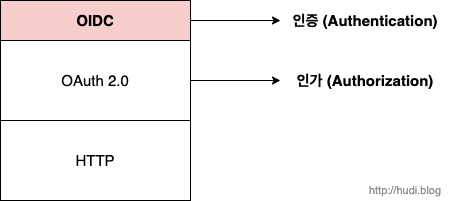

## 등장배경

이전에는 사용자 데이터를 서비스에서 직접 관리하는 경우가 대다수였다. 하지만 해킹, 피싱등으로 인한 개인정보 유출 사건이 끊임없이 발생하자, 서비스에서 직접 사용자 데이터를 관리하는 것이 큰 부담으로 다가온다.

또한 서비스의 수가 끝없이 늘어나면서 모든 서비스가 독자적인 인증 시스템을 가지고 있다면, 서비스 이용자는 각 서비스별 인증 정보를 모두 외우고 있어야한다.

서비스 운영자는 안전하게 사용자 데이터를 관리하리라 믿을 수 있는 웹사이트(구글, 페이스북, 트위터 등)에 사용자 인증 절차를 위임하고, 사용자는 자신이 신뢰할 수 있는 서비스의 인증 정보 하나로 여러 서비스에서 인증할수는 없을까? 이때 사용할 수 있는 것이 바로 OpenID이다.

## OpenID의 정의

OpenID는 비영리기관인 OpenID Foundation에서 추진하는 개방형 표준 및 분산 인증 프로토콜이다. 즉, OpenID는 **인증(Authentication)**을 위해 등장했다.

OpenID를 제공하는 웹사이트에서는 사용자는 웹사이트마다 모두 각자 계정을 만들고 관리할 필요가 없다. 대신 그들은 자신이 신뢰하는 OpenID 서비스 제공자(구글, 카카오 등)가 제공하는 OpenID 인증 서비스 하나만을 이용하여 인증하면 된다.

OpenID는 2006년 1.0버전을 표준으로 출시되었고, 이후 2007년에 2.0버전이 출시되었다. 그리고 2014년 3세대 OpenID로 OpenID Connect가 등장하게 되었다. 이 포스팅에서는 3세대 OpenID 기술인 OpenID Connect, 줄여서 OIDC를 기준으로 설명한다.

## OpenID 주체

OpenID는 대표적으로 2가지의 주체를 가리키는 용어가 존재한다. IdP와 RP이다.

### IdP (Identity Provider)

IdP는 구글, 카카오와 같이 OpenID 서비스를 제공하는 당사자이다.

### RP (Relying Party)

사용자를 인증하기 위해 IdP에 의존하는 주체이다. 'OOO으로 로그인하기' 따위의 기능을 제공하는 서비스라고 생각하면 좋을 것 같다.

## OpenID Connect와 OAuth 2.0

### OIDC는 OAuth 2.0의 확장



지난 **[OAuth 2.0 개념과 동작원리](https://hudi.blog/oauth-2.0/) 포스팅에서** OAuth 2.0에 대해 알아보았었다. 이번 포스팅에서 소개할 3세대 OpenID인 OIDC(OpenID Connect)는 사실 OAuth 2.0 위에서 동작하는 얇은 ID 계층이다. OIDC는 사용자 인증을 OAuth 2.0 프로세스를 확장하여 구현한다.

### OIDC와 OAuth 2.0의 차이

지난 포스팅에서 알아보았듯이 OAuth 2.0은 클라이언트가 리소스 소유자(Resource Owner)로부터 리소스 서버의 자원에 대해 인가받고, 접근하기 위해 사용된다. 즉, **OAuth의 주요 목적은 인가(Authorization)**이다. 인가의 과정에서 부산물로써 인증이 존재하긴 하지만, **핵심 목적은 인증이 아니다.**

OAuth 2.0 프레임워크는 어플리케이션을 승인한 사용자에 대한 정보를 명시적으로 제공하지 않고, **액세스 토큰(Access Token)이라는 형태로 권한**을 제공한다. 액세스 토큰은 마치 **호텔 키 카드**와 같다. 호텔 카드키만으로는 키 카드 소유자가 어떤 객실에 출입할 권한이 있는지 알 수 있지만, 카드키 소유자에 대한 신원 정보는 전혀 알 수 없다.

하지만, OpenID의 주요 목적은 **인증(Authentication)**이다. OpenID를 사용하면 클라이언트는 ID 토큰을 획득할 수 있다. 이 ID 토큰에는 사용자에 대한 신원 정보가 담겨있다. 액세스 토큰이 호텔 키 카드라면, ID 토큰은 주민등록증이라고 할 수 있다. 주민등록증으로 신원 확인(이름, 사진, 거주지 주소 등)을 확인할 수 있겠지만, 호텔 객실에는 출입할 수 없을 것이다.

정리하자면, OAuth 2.0은 리소스 서버로부터 리소스를 가져오기 위한 **액세스 토큰 확보에 목적**이 있다면, OpenID Connect는 사용자의 **신원 정보가 담긴 ID 토큰 확보**에 그 목적이 있다.

### OAuth 2.0만으로 인증할 수 있지 않아?

그런데, 이상하다. OAuth 2.0은 사용자의 리소스를 리소스 서버로부터 가져오기 위해 사용한다. 이 과정에서 인증 서버를 통해 사용자를 인증하는 과정을 거친다. 사용자의 신원 정보가 필요하면, OAuth 2.0 인가 프로세스를 거쳐 발급된 액세스 토큰을 가지고 사용자 정보 리소스에 접근하면 될 것 이다.

물론 OIDC없이 사용자 프로필 정보를 리소스 서버로부터 가져올 수 있다. 하지만, OIDC 없이 OAuth 2.0 단독으로 사용자 리소스를 가지고 오기 위해서는 OIDC를 사용할 때의 2배의 통신을 해야한다.

OAuth 2.0을 단독으로 사용하면, Access Token을 발급 받은 다음 이 토큰을 사용하여 사용자 리소스를 다시 요청하여 받아와야한다. 하지만 OIDC를 사용하면 Access Token과 함께 전달받은 ID Token을 복호화하여 사용자 정보를 가져오면 끝이다.

OAuth 2.0 단독으로 사용하여 사용자 정보를 조회할 때 발생한 통신이 1억회라면, OIDC를 사용하면 5천만회로 줄어드는 것이다.

## OIDC 인증 과정

앞서, OIDC는 OAuth 2.0을 확장하여 동작한다고 이야기하였다. OAuth 2.0에서 **스코프(Scope)**라는 개념이 기억나는가? 스코프란, 쉽게 말해서 OAuth 2.0의 클라이언트가 리소스 서버에 접근할 수 있는 제한 범위에 대한 내용이다.

OIDC는 OAuth 2.0의 스코프로 `openid` 값이 포함되어 들어오면, 액세스 토큰과 함께 사용자 인증에 대한 정보를 ID Token 이라고 불리는 JWT로 반환한다. 아래와 같을 것 이다.

```
eyJhbGciOiJSUzI1NiIsImtpZCI6IjFlOWdkazcifQ.ewogImlzcyI6ICJodHRwOi8vc2VydmVyLmV4YW1wbGUuY29tIiwKICJzdWIiOiAiMjQ4Mjg5NzYxMDAxIiwKICJhdWQiOiAiczZCaGRSa3F0MyIsCiAibm9uY2UiOiAibi0wUzZfV3pBMk1qIiwKICJleHAiOiAxMzExMjgxOTcwLAogImlhdCI6IDEzMTEyODA5NzAKfQ.ggW8hZ1EuVLuxNuuIJKX_V8a_OMXzR0EHR9R6jgdqrOOF4daGU96Sr_P6qJp6IcmD3HP99Obi1PRs-cwh3LO-p146waJ8IhehcwL7F09JdijmBqNqeGpe-gccMg4vfKjkM8FcGvnzZUN4_KSP0aAp1tOJ1zZwgjxqGByKHiOtX7TpdQyHE5lcMiKPXfEIQILVq0pc_E2DzL7emopWoaoZTF_m0_N0YzFC6g6EJbOEoRoSK5hoDalrcvRYLSrQAZZKflyuVCyixEoV9GfNQC3_osjzw2PAithfubEEBLuVVk4XUVrWOLrLl0nx7RkKU8NXNHq-rvKMzqg
```

이 JWT의 페이로드에는 사용자 식별을 위한 정보가 담겨있다. 한번 JWT를 디코드 해보자.

```json
{
  "iss": "http://server.example.com",
  "sub": "248289761001",
  "aud": "s6BhdRkqt3",
  "nonce": "n-0S6_WzA2Mj",
  "exp": 1311281970,
  "iat": 1311280970
}
```

위와 같이 `iss` `exp` 같은 기본적인 클레임과 함께 `sub` 라는 유저 식별 정보(ID)를 보내준다. 위 예시에서는 유저 식별 정보만 ID 토큰에 포함되도록 반환받았다. 그런데, OAuth 2.0의 스코프를 `openid` 뿐 아니라 IdP에서 제공하는 추가적인 스코프(예를 들어 `email` 등)를 추가로 포함하여 요청하면 ID 토큰에 유저에 대한 추가적인 정보를 얻어올 수 있을 것 이다.

## 참고

- https://openid.net/specs/openid-connect-core-1_0.html
- https://www.oauth.com/oauth2-servers/openid-connect/
- https://en.wikipedia.org/wiki/OpenID
- https://developer.okta.com/blog/2019/10/21/illustrated-guide-to-oauth-and-oidc
- https://www.pingidentity.com/en/resources/content-library/articles/openid-connect.html
- https://www.samsungsds.com/kr/insights/oidc.html
