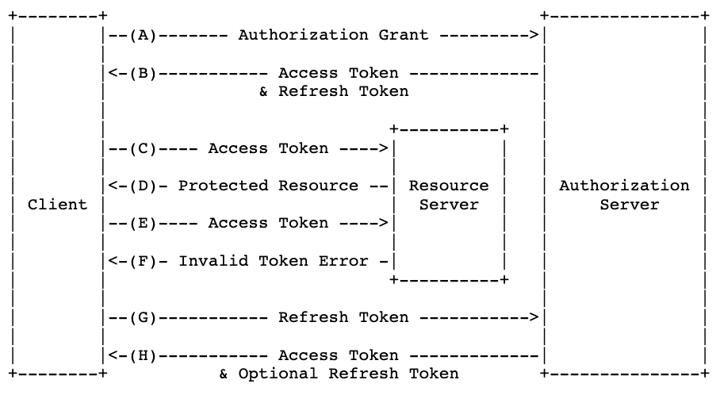
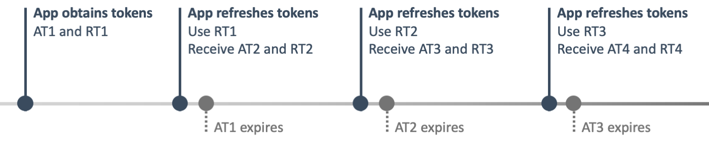

## Access Token의 문제점

### 사용자의 잦은 로그아웃 경험

현재 달록에서는 Refresh Token을 사용중이지 않다. Access Token 만을 사용하여 사용자를 인증한다. 현재 달록의 Access Token 유효 기한은 24시간 즉, 하루이다. 로그인을 한 이후 하루가 지나면 사용자는 달록에서 로그아웃되는 경험을 하게 될 것이다.

그렇다고 유효 기간을 길게 하자니, 바로 뒤에서 이야기할 보안 문제가 발생한다.

### 보안 문제

사실 Refresh Token을 사용하는 가장 큰 이유가 아닐까 싶다. **[직접 만들어보며 이해하는 JWT](https://hudi.blog/self-made-jwt/)**와 **[세션 기반 인증과 토큰 기반 인증 (feat. 인증과 인가)](https://hudi.blog/session-based-auth-vs-token-based-auth/)**에서 이야기 했듯이, 토큰 기반 인증 방식에서 토큰은 세션과 다르게 **stateless** 하다. **서버가 상태를 보관하고 있지 않다**는 이야기이다. 서버는 한번 발급한 토큰에 대해서 제어권을 가지고 있지 않다.

이런 토큰이 탈취된다면 어떻게 될까? 사용자는 계정의 제어권을 해커에게 속수무책으로 내어줄 수 밖에 없다. 서버측에서도 토큰이 만료될때까지 기다리는 것 말고는 어찌할 도리가 없다.

## Refresh Token 이란?

### 목적

결론부터 말하자면 Refresh Token의 목적은 Access Token의 유효 기간을 짧고, 자주 재발급 하도록 만들어 보안을 강화하면서도 사용자에게 잦은 로그아웃 경험을 주지 않도록 하는 것이다.

Access Token은 리소스에 접근하기 위해서 사용되는 토큰이라면, Refresh Token은 기존에 클라이언트가 가지고 있던 Access Token이 만료되었을 때 Access Token을 새로 발급받기 위해 사용한다.

### 유효 기간

Refresh Token은 Access Token 대비 긴 유효 기간을 갖는다. Refresh Token을 사용하는 상황에서는 일반적으로 Access Token의 유효기간은 30분 이내, Refresh Token의 유효기간은 2주 정도로 설정한다고 한다. 당연히 서비스 성격에 따라 적절한 유효기간을 설정 해야한다.

## Refresh Token 매커니즘

1. 클라이언트가 로그인을 요청하고 성공하면, 서버는 Access Token과 Refresh Token을 함께 제공한다.
2. 이후 클라이언트는 인가가 필요한 요청에 Access Token을 실어 보낸다.
3. 시간이 조금 흘러 Access Token이 만료 되었다면, 클라이언트는 Refresh Token을 서버로 전달하여 새로운 Access Token을 발급 받는다.

## Refresh Token의 형태

Refresh Token은 JWT 일수도, 그냥 간단한 문자열 또는 UUID 일수도 있다. ([참고](https://betterprogramming.pub/should-we-store-tokens-in-db-af30212b7f22))

### JWT 형태의 Refresh Token

Refresh Token이 만약 JWT 라면, Access Token 와 똑같이 stateless 하고, 토큰 자체에 데이터를 담을 수 있을 것이다. 이 경우 Refresh Token의 유효성을 검증하기 위해 데이터베이스에 별도로 액세스하지 않아도 된다는 점 이다. 따라서 서버의 부하가 상대적으로 적을 것이다.

하지만 Access Token과 마찬가지로 Refresh Token 을 서버에서 제어할 수 없다는 단점이 존재한다. 즉, Refresh Token 을 탈취당한 상황에서 토큰을 별달리 무효화 시키는 방법이 없다.

### JWT 형태가 아닌 Refresh Token

반대로 Refresh Token으로 random string 또는 UUID 등으로 사용한다면, 그 토큰을 사용자와 매핑되도록 데이터베이스에 저장해야할 것이다. 이런 경우 Refresh Token 사용시 데이터베이스에 액세스 해야한다. 하지만, 사용자를 강제로 로그아웃 시키거나, 차단할 수 있게된다. 또한 Refresh Token이 탈취되었을 경우 그 즉시 무효화시킬 수 있다.

## RTR (Refresh Token Rotation)

RTR 이라는 방법이 있다. 간단하게 말하자면, Refresh Token을 한번만 사용할 수 있게(One Time Use Only) 만드는 방법이다. Refresh Token을 사용하여 새로운 Access Token을 발급받을 때 Refresh Token 도 새롭게 발급받게 된다.

이런 방식을 사용하면, 이미 사용된 Refresh Token을 사용하게 되면 서비스측에서 탈취를 확인하여 조치할 수 있게된다. 다만, 사용되지 않은 Refresh Token을 훔쳐 사용하거나, 그냥 지속적으로 Access Token만을 탈취한다면 막을 수 없다.

## Refresh Token의 한계

### Access Token을 즉시 차단할 방법의 부재

아무리 Refresh Token이 Access Token의 유효기간을 짧게 만들어 줄 수 있다고 하더라도, 탈취된 Access Token이 유효한 그 짧은 시간 동안에 악용될 수 있다는 위험성이 존재한다.

### Refresh Token 그 자체를 탈취 당할 가능성

해커에게 Refresh Token 자체를 탈취 당하면 해커는 마음껏 Access Token을 발행할 수 있다. 서버 DB에서 Refresh Token을 저장해 직접 추적하는 방법을 사용하면 조금이나마 피해를 줄일 수 있겠지만, 피해가 확인되기 전까진 탈취 여부를 알 방법이 없다.

RTR을 사용한다면 Refresh Token을 1회 사용하고 버리게 되어 더 안전하게 사용할 수 있지만, 사용하지 않은 Refresh Token을 탈취당하면 해커는 1회 한정으로 Access Token을 발급받을 수 있다.

즉, 이러나 저러나 Refresh Token을 탈취 당할 위험성이 존재한다. 따라서 클라이언트는 XSS, CSRF 공격으로부터 Refresh Token이 탈취되지 않도록 안전하게 보관해야한다.

## Access Token을 무효화 할 수 있게 만들면 안되나?

문득, _“서버가 직접 Access Token 발급 기록을 데이터베이스에 보관하고 추적하면 Refresh Token을 사용하지 않아도 되지 않을까?”_ 라는 생각이 들었다. 하지만 곧바로 바보같은 생각임을 깨닫게 되었다.

토큰 기반 인증 방식을 사용하는 이유는 stateless 하다는 특징을 이용해 확장성을 갖도록하여 경제성을 취하기 위함이다. 그런데, 이런 토큰을 데이터베이스에 저장한다는 것은 이런 장점을 포기하는 것이다. 즉, 세션과 다를점이 없다. 이렇게 할 거라면 차라리 세션을 쓴다는 생각이 들었다.

## 참고

- [https://pragmaticwebsecurity.com/articles/oauthoidc/refresh-token-protection-implications.html](https://pragmaticwebsecurity.com/articles/oauthoidc/refresh-token-protection-implications.html)
- [https://okky.kr/articles/1007579](https://okky.kr/articles/1007579)
- [https://betterprogramming.pub/should-we-store-tokens-in-db-af30212b7f22](https://betterprogramming.pub/should-we-store-tokens-in-db-af30212b7f22)
- [https://auth0.com/blog/refresh-tokens-what-are-they-and-when-to-use-them/](https://auth0.com/blog/refresh-tokens-what-are-they-and-when-to-use-them/)
- [https://www.izertis.com/en/-/refresh-token-with-jwt-authentication-in-node-js](https://www.izertis.com/en/-/refresh-token-with-jwt-authentication-in-node-js)
- [https://www.youtube.com/watch?v=1QiOXWEbqYQ](https://www.youtube.com/watch?v=1QiOXWEbqYQ)
