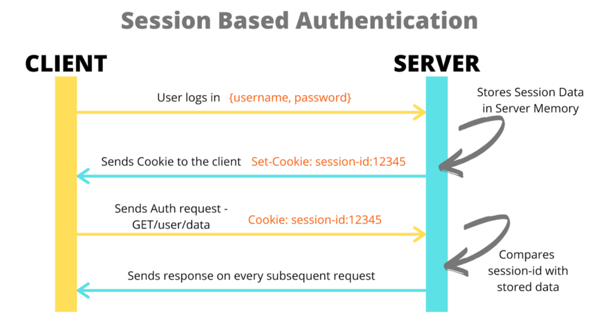
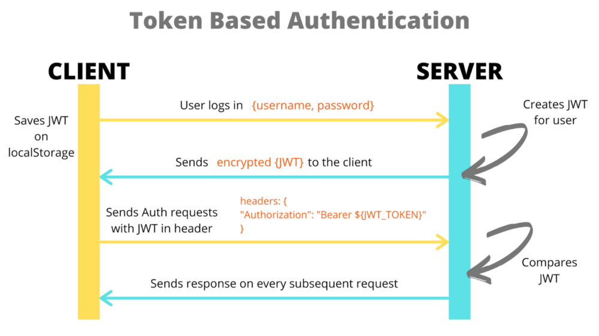
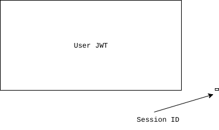

## 인증과 인가

세션기반 인가와 토큰기반 인가에 대해 알아보기 이전에 먼저, 인증과 인가가 무엇인지 부터 알아야할 필요가 있다. 인증과 인가를 같거나 비슷한 개념이라고 생각하는 사람들이 많을텐데, 엄밀하게는 서로 다른 개념이다. 인증과 인가는 요약하자면 **<u>시스템의 자원을 적절하고 유효한 사용자에게 전달하고 공개하는 방법</u>**이다.

### 인증 (Authentication)

인증은 쉽게 말하자면, **로그인** 이다. 클라이언트가 자기자신이라고 주장하고 있는 사용자가 맞는지를 검증하는 과정이다. 예를 들어 로그인 화면에서 내가 유저 아이디를 USER1 로 입력하고 패스워드를 입력해 제출하면, 서버에서는 내가 진짜로 USER1 이라는 유저가 맞는지 확인한다.

### 인가 (Authorization)

인가는 인증 작업 이후에 행해지는 작업으로, **인증된 사용자에 대한 자원에 대한 접근 확인 절차**를 의미한다.

여기에 일반 유저인 USER1과 USER2가 있다. 일반 유저인 USER1 은 글 작성, 조회, 수정, 삭제 등 일반적인 작업에 대한 권한이 부여되어 있다. 하지만 USER1 은 USER2가 작성한 글을 수정하거나 제거할 수는 없다. 타인의 리소스에 대해서는 인가되어 있지 않기 때문이다. 또한 USER1과 USER2 는 모두 관리자 페이지에 접속할 수 없다. 일반 유저는 관리자 페이지에 대해 인가되어 있지 않기 때문이다.

## HTTP의 비상태성(Stateless)

HTTP는 **비상태성**이라는 특성을 갖는다. 서버는 클라이언트의 상태를 저장하지 않으며, 따라서 이전 요청과 다음 요청의 맥락이 이어지지 않는다. HTTP는 바로 직전에 발생한 통신을 기억하지 못한다. 따라서 HTTP 단독으로는 요청한 클라이언트가 이전에 이미 인증과정을 거쳤는지 알 방법이 없다.

그렇다고, 글을 조회하거나 작성할 때 마다 사용자에게 로그인을 하라고 요청할 수는 없는 노릇이다. 매 작업마다 로그인을 사용자에게 요청하는 것은 UX를 전혀 고려하지 않은 방식이다.

그렇다면, 사용자의 아이디와 패스워드를 브라우저에 그대로 저장해놓고, 매 요청마다 함께 그 정보를 보내는 방법은 어떨까? 이런 방식은 전송 데이터가 커져 비효율적일 뿐더러 클라이언트에 민감한 데이터가 그대로 저장되어 보안에도 굉장히 취약하다. 서버 입장에서도 매 작업마다 데이터베이스를 조회하고, 인증과정을 거치는 것이 비효율일 것 이다.

이런 HTTP 환경에서 서버는 어떤 방식으로 사용자를 인가할까? 웹 어플리케이션에서는 이 문제를 세션 또는 토큰을 사용하여 문제를 해결한다. **즉, 세션과 토큰은 인증 보다는 인가와 관련된 기술이라고 할 수 있다.**

## 세션기반 인증

> 세션 그 자체에 개념에 대해서는 **[쿠키와 세션 (ft. HTTP의 비연결성과 비상태성)](https://hudi.blog/cookie-and-session)** 이라는 글을 작성해두었으니 참고하자. 어느정도 내용이 겹칠 수 있다 😅

세션기반 인가는 사용자의 인증 정보가 서버의 세션 저장소에 저장되는 방식이다. 사용자가 로그인을 하면, 해당 인증 정보를 서버의 세션 저장소에 저장하고, 사용자에게는 저장된 세션 정보의 식별자인 Session ID를 발급한다. 발급된 Session ID는 브라우저에 쿠키 형태로 저장되지만, 실제 인증 정보는 서버에 저장되어 있다.

브라우저는 인증 절차를 마친 이후의 요청마다 HTTP Cookie 헤더에 Session ID 를 함께 서버로 전송한다. 서버는 요청을 전달받고, Session ID에 해당하는 세션 정보가 세션 저장소에 존재한다면 해당 사용자를 인증된 사용자로 판단한다.

## 토큰기반 인증

> 이 글에서 토큰기반 인증은 현재 가장 널리 사용되는 JWT(Json Web Token) 기준으로 설명한다. JWT 기술에 대해 자세히 알아보고 싶다면 이전에 작성한 **[직접 만들어보며 이해하는 JWT](https://hudi.blog/self-made-jwt/)** 를 참고하자.

세션 기반 인증이 인증 정보를 서버에 저장하는 방식이라면, 토큰 기반 인증은 인증 정보를 클라이언트가 직접 들고 있는 방식이다. 이때 인증 정보가 토큰의 형태로 브라우저의 로컬 스토리지(혹은 쿠키)에 저장된다. 토큰의 종류에 따라 다르겠지만, 대표적인 토큰인 JWT의 경우 디지털 서명이 존재해 토큰의 내용이 위변조 되었는지 서버측에서 확인할 수 있다.

토큰 기반 인증에서는 사용자가 가지고 있는 토큰을 HTTP 의 Authorization 헤더에 실어 보낸다. 이 헤더를 수신한 서버는 토큰이 위변조 되었거나, 만료 시각이 지나지 않은지 확인한 이후 토큰에 담겨있는 사용자 인증 정보를 확인해 사용자를 인가한다.

## 세션기반 인증 vs 토큰기반 인증

### 사이즈

세션의 경우 Cookie 헤더에 세션 ID만 실어 보내면 되므로 트래픽을 적게 사용한다. 하지만 JWT는 사용자 인증 정보와 토큰의 발급시각, 만료시각, 토큰의 ID등 담겨있는 정보가 세션 ID에 비해 비대하므로 세션 방식보다 훨씬 더 많은 네트워크 트래픽을 사용한다.

[Why JWTs Suck as Session Tokens](https://developer.okta.com/blog/2017/08/17/why-jwts-suck-as-session-tokens) 게시물에 따르면, 단순히 JWT에 `iss`, `sub`, `nbf`, `exp`, `iat`, `jti`, `typ` 클레임만을 실었는데 304 바이트가 나왔다고 한다. 그에 비해 세션 ID는 단 6바이트. 50배가 넘는 트래픽 비효율이다.

### 안전성과 보안문제

세션의 경우 모든 인증 정보를 서버에서 관리하기 때문에 보안 측면에서 조금 더 유리하다. 설령 세션 ID가 해커에게 탈취된다고 하더라도, 서버측에서 해당 세션을 무효 처리하면 된다.

하지만 토큰의 경우 그렇지 않다. 토큰은 서버가 트래킹하지 않고, 클라이언트가 모든 인증정보를 가지고 있다. 따라서 토큰이 한번 해커에게 탈취되면 해당 토큰이 만료되기 전까지는 속수무책으로 피해를 입을 수 밖에 없다.

또한 JWT 특성상 토큰에 실린 Payload가 별도로 암호화 되어있지 않으므로, 누구나 내용을 확인할 수 있다. 따라서 Payload에 민감한 데이터는 실을 수 없다. 즉, Payload 에 실을 수 있는 데이터가 제한된다.

하지만 세션과 같은 경우에는 모든 데이터가 서버에 저장되기 때문에 아무나 함부로 열람할 수 없으므로 저장할 수 있는 데이터에 제한이 없다.

### 확장성

그럼에도 불구하고 최근 모던 웹 어플리케이션이 토큰 기반 인증을 사용하는 이유가 바로 이 확장성이다.

일반적으로 웹 어플리케이션의 서버 확장 방식은 수평 확장을 사용한다. 즉, 한대가 아닌 여러대의 서버가 요청을 처리하게 된다. 이때 별도의 작업을 해주지 않는다면, 세션 기반 인증 방식은 세션 불일치 문제를 겪게 된다. 이를 해결하기 위해서 Sticky Session, Session Clustering, 세션 스토리지 외부 분리 등의 작업을 해주어야한다.

하지만, 토큰 기반 인증 방식의 경우 서버가 직접 인증 방식을 저장하지 않고, 클라이언트가 저장하는 방식을 취하기 때문에 이런 세션 불일치 문제로부터 자유롭다. 이런 특징으로 토큰 기반 인증 방식은 HTTP의 비상태성(Stateless)를 그대로 활용할 수 있고, 따라서 높은 확장성을 가질 수 있다.

> 수직확장과 수평확장에 대한 자세한 내용은 **[수직 확장(Scale up) vs 수평 확장 (Scale out)](https://hudi.blog/scale-up-vs-scale-out/)** 포스팅을, 다중 서버 환경에서의 세션 불일치 문제는 **[다중 서버 환경에서의 세션 불일치 문제와 해결방법](https://hudi.blog/session-consistency-issue/)** 포스팅을 참고하자.

### 서버의 부담

확장성과 어느정도 이어지는 내용이다. 세션 기반 인증 방식은 서비스가 세션 데이터를 직접 저장하고, 관리한다. 따라서 세션 데이터의 양이 많아지면 많아질수록 서버의 부담이 증가할 것 이다.

하지만 토근 기반 인증 방식은 서버가 인증 데이터를 가지고 있는 대신, 클라이언트가 인증 데이터를 직접 가지고 있다. 따라서 유저의 수가 얼마나 되던 서버의 부담이 증가하지 않는다. 따라서 서버의 부담 측면에서는 세션 기반 인증 방식보다는 토큰 기반 인증 방식이 조금 더 유리함을 알 수 있다.

## 참고

- [https://dev.to/thecodearcher/what-really-is-the-difference-between-session-and-token-based-authentication-2o39](https://dev.to/thecodearcher/what-really-is-the-difference-between-session-and-token-based-authentication-2o39)
