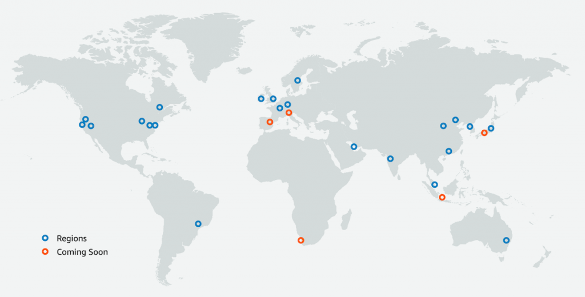
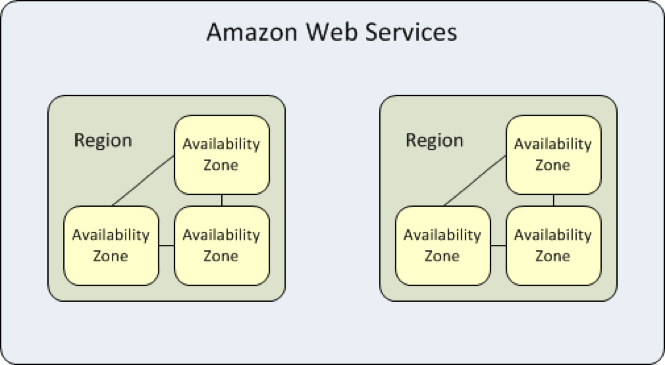

## 리전 (Region)

AWS는 글로벌 클라우드 서비스이다. 따라서 AWS에서 제공되는 클라우드 컴퓨팅 리소스들은 미국에서만 호스팅 되지 않고, 전세계 각국에서 호스팅된다. 이때 이 호스팅되는 위치를 지리적 관점으로 영역을 구분하는데, 이를 리전이라고 한다. 이를테면, 일본 도쿄에서 호스팅되는 영역은 도쿄 리전, 한국 서울에서 호스팅 되는 영역은 서울 리전이라고 이야기 한다.

이렇게 전세계에 물리적으로 호스팅 영역을 구분해놓았기 때문에, AWS 사용자는 서비스될 국가와 가장 가까운 리전을 선택하여 빠른 속도를 낼 수 있게 되었다. 또한 한 국가에서만 호스팅되고 있지 않고, 전 세계로 영역이 분산되어 있기 때문에 천재지변 등의 불가항력에 대해 대처할 수 있다.

각 리전은 서로 완전히 독립적이다. 따라서 서울 리전에서 만든 리소스를 미국 버지니아 북부 리전에서는 사용할 수 없다.

## 가용 영역 (Availability Zone)

AWS의 리전은 **가용 영역 (Availability Zone)** 이라는 더 작은 단위로 격리된다. AWS 리전은 최소 2개 이상의 가용 영역으로 구성되며, 각 가용 영역은 최소 1개 이상의 데이터 센터 (Internet Data Center) 로 구성된다. 개별 데이터 센터에는 일반적으로 50,000 ~ 80,000 대의 물리적 서버가 있다고 한다. 현재 한국에는 총 4개의 가용영역이 존재한다.

각각의 가용 영역은 같은 리전임에도 불구하고 서로 지리적으로 멀리 떨어져있다. 천재지변, 테러 등의 불가항력으로부터 대비하기 위함이다.

[**AWS 글로벌 인프라 맵**](https://aws.amazon.com/ko/about-aws/global-infrastructure/)에서 현재 존재하는 리전과 각 리전별 가용영역을 확인해볼 수 있다.

## 참고

- [https://aws.amazon.com/ko/about-aws/global-infrastructure/regions_az/](https://aws.amazon.com/ko/about-aws/global-infrastructure/regions_az/)
- [https://docs.aws.amazon.com/ko_kr/AWSEC2/latest/UserGuide/using-regions-availability-zones.html](https://docs.aws.amazon.com/ko_kr/AWSEC2/latest/UserGuide/using-regions-availability-zones.html)
- 아마존 웹 서비스 AWS Discovery Book
