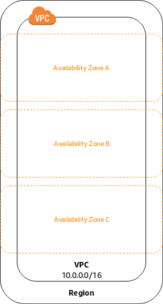
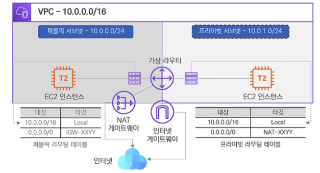

> 우아한테크코스 레벨2 장바구니 미션에서 배포를 하기 위해 AWS의 EC2 인스턴스를 생성했다. 배포 인프라 강의에서 짤막하게 VPC와 Subnet에 대해 듣게 되었고, 더 자세히 이해하기 위해 별도로 공부했다. 하지만, 모든 내용을 공부하기엔 광범위한 주제고, 생각보다 어려워 당장 필요한 수준의 학습만 간단하게 하기로 하였다. 따라서 틀린 내용이 있을 수 있다 😅

## 선수 지식

VPC에 대해 이해하기 위해 미리 알고 있어야 하는 지식이 조금 있었다. 이를 먼저 적고 VPC에 대해 이야기해보도록 하겠다.

### 사설(Private) IP vs 공인(Public) IP

사설 IP 주소는 [**사설 네트워크(Private Network)**](https://ko.wikipedia.org/wiki/%EC%82%AC%EC%84%A4%EB%A7%9D)에 연결된 디바이스를 식별하기 위해 사용되는 IP 주소이다. 사설 IP 주소는 사설 네트워크 내에서만 유효한 주소이며, 따라서 외부 인터넷에서는 사용될 수 없다.

공인 IP주소는 인터넷에서 네트워크 디바이스를 식별하기 위해 KT, U+, SK와 같은 인터넷 서비스 제공자(ISP) 가 제공하는 IP주소이다. 따라서 인터넷을 통해 연결할 수 있는 IP주소이다.

### CIDR(Classless Inter-Domain Routing) 표기법

CIDR 표기법은 `192.168.0.0/16` 와 같은 형태로 **연속된 IP주소의 범위**를 표기하는 방법 중 하나이다. CIDR는 IPv4, IPv6 둘다 사용할 수 있지만, 이 글에서는 IPv4 에 대해서만 다룬다. IPv4는 점으로 구분된 옥텟 4개로 표현된 주소 체계이다. 옥텟은 8bit 이며, 따라서 IPv4 주소는 32bit 로 표현될 수 있다.

CIDR 표기법은 IP주소 뒤에 `/비트수` 를 붙여 IP주소의 범위를 표기한다. 이때 이 비트수는 IP의 앞자리부터 몇 비트만큼 가릴 것 인지, 즉 마스킹(Masking)할 것 인지를 나타낸다. 예를 들어, `192.168.0.0/16` 은 앞에서부터 16비트 즉, 2개의 옥텟을 마스킹한다. 마스킹된 비트는 수정할 수 없으며, 마스킹 되지 않은 나머지 비트만 수정할 수 있다. 즉, `192.168.0.0/16` 은 `192.168.0.0` 부터 `192.168.255.255` 까지의 범위를 의미한다고 할 수 있다.

복잡하다. 하지만 이를 쉽게 계산할 수 있는 계산기가 인터넷에 많으니 걱정하지 않아도 될 것 같다.

## VPC (Virtual Private Cloud)

VPC는 AWS 계정 전용 **가상 네트워크(Virtual Network)**이다. AWS 클라우드에서 각 VPC는 서로 논리적으로 분리되어 있다. VPC는 가상 네트워크이므로 내부에 생성되는 인스턴스는 사설 IP를 할당받게 된다. 이때 사설 IP는 VPC의 서브넷 범위에서 자동으로 할당되고, 할당된 사설 IP는 동일 VPC 네트워크의 인스턴스간 통신에 사용될 수 있다.

EC2 인스턴스와 같은 AWS의 리소스를 VPC 내에서 실행할 수 있다.

### VPC의 사이즈 설정

AWS에서 VPC를 생성할 때 VPC에서 사용하게 될 사설 IP 주소의 범위를 지정해야 한다. 주소 범위는 앞서 선수 지식에서 설명한 CIDR 표기법을 사용하여 표현한다. 즉, `10.0.0.0/24` 로 설정된 VPC가 가용할 수 있는 IP 범위는 `10.0.0.0` 부터 `10.0.0.255` 까지 일 것 이다. 따라서 이 VPC는 256개의 IP주소를 지원하게 된다.

### 서브넷 (Subnet)

VPC 내부의 네트워크에서도 서비스 목적에 따라 **IP Block(대역)**으로 나누어 구분할 수 있다. 이 IP Block을 우리는 **서브넷(Subnet)** 이라고 한다. VPC는 리전의 모든 가용영역에 적용된다. 하지만 서브넷은 단일 가용영역에서만 생성할 수 있고, 여러 가용 영역에 걸쳐 확장될 수 없다. 서브넷의 IP 주소 범위도 앞서 말한 VPC의 방식과 같이 CIDR로 표기할 수 있다.

### Public Subnet, Private Subnet

서브넷도 위와 같이 퍼블릭 서브넷과 프라이빗 서브넷으로 나뉜다. 퍼블릭 서브넷은 네트워크 트래픽이 인터넷 게이트웨이 (Internet Gateway, IGW) 로 라우팅이 되는 서브넷을 의미하고, 프라이빗 서브넷은 인터넷 게이트웨이로 라우팅 되지 않는 서브넷을 의미한다. 이때, 인터넷 게이트웨이는 VPC당 하나만 생성할 수 있다고 한다.

퍼블릭 서브넷은 실제 사용자에게 보여질 웹서비스의 인스턴스를 위해 사용한다. 반대로 일반 사용자들에게 직접적으로 노출되면 보안상 문제가 발생하는 DB서버 등은 프라이빗 서브넷에 생성한다. 단, DB 서버에서도 보안 업데이트나, apt install 등을 사용하기 위해 제한적으로 외부 인터넷과 연결될 필요는 존재한다. 따라서 NAT(Network Address Translation) 게이트웨이를 두어 프라이빗 서브넷 내부에서 외부로 나가는 단방향 트래픽만 허용할 수 있다.

### 라우팅 테이블 (Routing Table)

각 서브넷은 서브넷 외부로 향하는 Outbound 트래픽에 대해 허용된 경로를 지정하는 라우팅 테이블이 연결되어 있어야 한다. 생성된 서브넷은 자동으로 VPC의 기본 라우팅 테이블과 연결된다. 그리고 이 라우팅 테이블에는 기본적으로 VPC 내부의 모든 Subnet으로 통신이 되도록 설정이 되어 있다고 한다.

이 라우팅 테이블은 VPC의 서브넷에서 발생한 패킷이 목적이 주소로 이동하기 위해 어떤 경로로 이동해야 하는지 알려주는 이정표와 같은 개념이라고 한다. 예를 들어 퍼블릭 서브넷을 만들기 위해 인터넷 게이트웨이를 생성하고, 라우팅 테이블 타겟으로 설정하면 해당 서브넷의 패킷은 인터넷으로 향할 수 있을 것 이다.

> 위 내용은 아직 이해가 크게 되지 않아 짧게 적었다.

## 마치며

시간이 넉넉치 않아 이론적으로만 공부하고, VPC를 직접 설정해보는 실습은 진행해보지 못했다. 아래 포스팅을 참고하여 추후 시간이 될 때 직접 VPC를 생성하고 설정해보는 실습을 진행해서 이해도를 더 높여보면 좋을 것 같다.

- [https://seungjuitmemo.tistory.com/224](https://seungjuitmemo.tistory.com/224)
- [https://velog.io/@seeh_h/AWS-VPC-Subnet-간단-정리#퍼블릭-서브넷--프라이빗-서브넷](https://velog.io/@seeh_h/AWS-VPC-Subnet-%EA%B0%84%EB%8B%A8-%EC%A0%95%EB%A6%AC#%ED%8D%BC%EB%B8%94%EB%A6%AD-%EC%84%9C%EB%B8%8C%EB%84%B7--%ED%94%84%EB%9D%BC%EC%9D%B4%EB%B9%97-%EC%84%9C%EB%B8%8C%EB%84%B7)
- [https://tech.cloud.nongshim.co.kr/2018/10/16/4-네트워크-구성하기vpc-subnet-route-table-internet-gateway/](https://tech.cloud.nongshim.co.kr/2018/10/16/4-%EB%84%A4%ED%8A%B8%EC%9B%8C%ED%81%AC-%EA%B5%AC%EC%84%B1%ED%95%98%EA%B8%B0vpc-subnet-route-table-internet-gateway/)

## 참고

- [https://docs.aws.amazon.com/ko_kr/vpc/latest/userguide/VPC_Subnets.html#vpc-subnet-basics](https://docs.aws.amazon.com/ko_kr/vpc/latest/userguide/VPC_Subnets.html#vpc-subnet-basics)
- 아마존 웹 서비스 AWS Discovery Book
