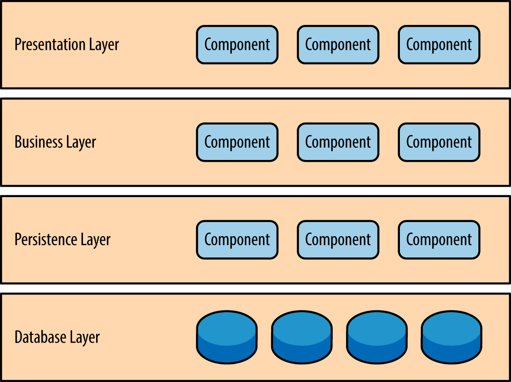
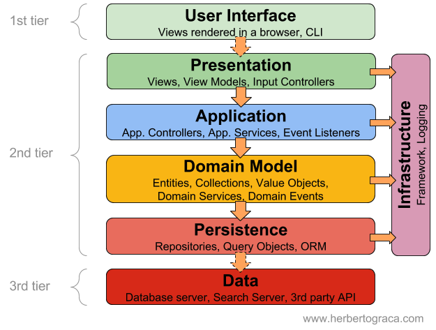
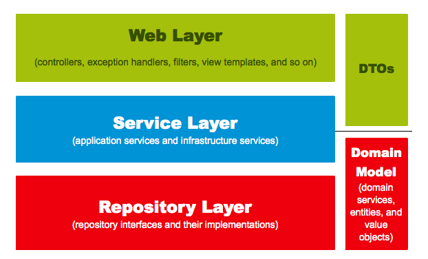
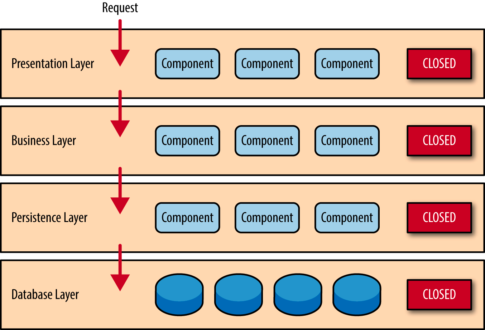
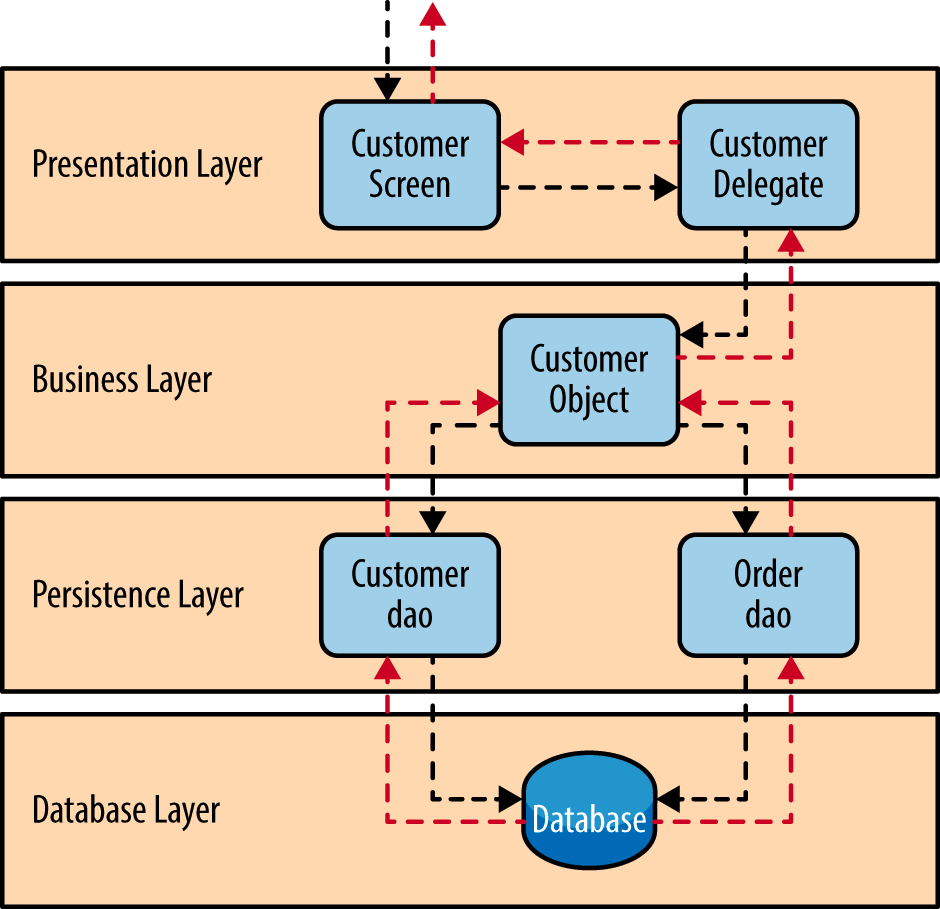

## Layered Architecture

Layered Architecture는 소프트웨어 개발에서 소프트웨어 개발에서 가장 일반적으로 널리 사용되는 아키텍처이다. 구성되는 계층의 숫자에 따라 N 계층 아키텍처 (N-tier Architecture) 라고도 한다.

각 계층은 어플리케이션 내에서의 특정 역할과 관심사(화면 표시, 비즈니스 로직 수행, DB 작업 등)별로 구분된다. 이는 Layered Architecture 의 강력한 기능인 '관심사의 분리 (Separation of Concern)' 를 의미한다. 특정 계층의 구성요소는 해당 계층에 관련된 기능만 수행한다. 이런 특징은 높은 유지보수성과 쉬운 테스트라는 장점이 존재한다.

## 4-Tier Layered Architecture

Layered Architecture 패턴에서 구성 레이어 숫자나 각 레이어의 유형을 명시하고 있지는 않지만, 일반적인 경우 아래와 같은 유형의 4개의 레이어로 구분한다.

> 비교적 단순한 어플리케이션이라면 3개의 계층으로 나뉠수도 있고, 더 복잡하다면 5개의 계층으로도 충분히 나뉠 수 있다.

### Presentation Layer

사용자가 데이터를 전달하기 위해 화면에 정보를 표시하는 것을 주 관심사로 둔다. Presentation Layer 는 비즈니스 로직이 어떻게 수행되는지 알 필요가 없다. 대표적인 구성요소는 View와 Controller가 있다.

### Business Layer

비즈니스 로직을 수행하는 것을 주 관심사로 둔다. 마찬가지로 화면에 데이터를 출력하는 방법이나 혹은 데이터를 어디서, 어떻게 가져오는지에 대한 내용은 알고있지 않다. 그저 Persistence Layer에서 데이터를 가져와 비즈니스 로직을 수행하고 그 결과를 Presentation Layer 로 전달하면 된다. 대표적인 구성요소는 Service와 Domain Model 등이 있다.

경우에 따라 아래처럼 Service와 Domain Model을 별개의 계층으로 나누거나, 아예 Domain Model을 Layered Architecture 와 별개의 것으로 분리하는 경우도 더러 있는 것 같다

중요한것은 Layered Architecture 의 사용 이유와 특징을 잘 이해하고 사용하는 것 이므로, 설득력 있는 구조라면 어떻게 설계해도 괜찮다고 생각한다.

### Persistence Layer

어플리케이션의 영속성을 구현하기 위해, 데이터 출처와 그 데이터를 가져오고 다루는 것을 주 관심사로 둔다. 대표적인 구성요소는 Repository, DAO 등이 있다.

### Database Layer

MySQL, MariaDB, PostgreSQL, MongoDB 등 데이터베이스가 위치한 계층을 의미한다.

## 수직적으로 구성된 격리된 레이어 (Layers of isolation)

Layered Architecture에서 각각의 나뉘어진 수평 계층은 수직적으로 배치된다. 이는 Layered Architecture의 주요 특징 중 하나이다. 이런 구조에서 특정 레이어는 바로 하위 레이어에만 연결된다.

그런데 그냥 Presentation Layer 에서 그냥 Database Layer 에 연결해서 정보를 가져오는게 더 편하지 않을까? Presenstation Layer 에서 직접 데이터베이스에 접속하여 데이터를 가져오게 되면, SQL에 대한 변경사항이 Presentation Layer에 직접 영향을 미친다. 즉, 과도한 의존성이 발생하게 된다. 이는 어플리케이션의 변경을 매우 어렵게 만든다.

Layered Architecture 에서 각 레이어는 격리되어 있다. 각 레이어가 다른 레이어와 독립적이므로 특정 레이어는 다른 레이어의 내부 동작을 모르게 된다. 즉 각 계층은 캡슐화되어 있고, 단일 책임을 갖는다. 따라서 특정 레이어는 다른 레이어에 영향을 주지 않고 변경될 수 있다.

## Layered Architecture 시나리오

사용자가 특정 고객 정보를 요청한 상황을 가정하여, Layered Architecture 가 이 요청을 수행하는 시나리오를 정리해보자.

1. 사용자가 보고있는 화면(Customer Screen, 흔히 말하는 View 라고 할 수 있을 것 같다)에서 사용자는 고객 정보를 요청한다.
2. 이 요청은 그 요청을 처리할 수 있는 모듈이 무엇인지 알고있는 Customer Delegate (흔히 말하는 Controller 라고 할 수 있을 것 같다) 로 전달된다. Customer Delegate 는 해당 요청을 처리하기 위해 Business Layer 의 Customer Object 로 요청을 다시 전달한다.
3. Customer Object는 요청을 받고 비즈니스 로직을 수행하기 위한 데이터를 얻기 위해, Persistence Layer의 Customer dao 와 Order dao 에 요청을 보낸다.
4. Persistence Layer 의 DAO들은 요청을 수행하기 위해 Database Layer 에 접근하여 데이터를 가져온다.
5. 이 요청은 다시 반대로 Persistence Layer → Business Layer → Presentation Layer 로 전달되고 최종적으로 사용자에게 전달된다.

## 싱크홀 안티패턴을 주의하자!

싱크홀 안티패턴이란 특정 레이어가 아무런 로직도 수행하지 않고 들어온 요청을 그대로 다시 하위 레이어로 내보내는 경우를 의미한다. 이런 흐름은 불필요한 리소스 낭비를 초래한다. 전체 흐름 중에서 약 20%가 싱크홀이라면 그럭저럭 나쁘지 않은 수준이라고 한다.

## 참고

- https://www.baeldung.com/cs/layered-architecture
- https://www.oreilly.com/library/view/software-architecture-patterns/9781491971437/ch01.html
