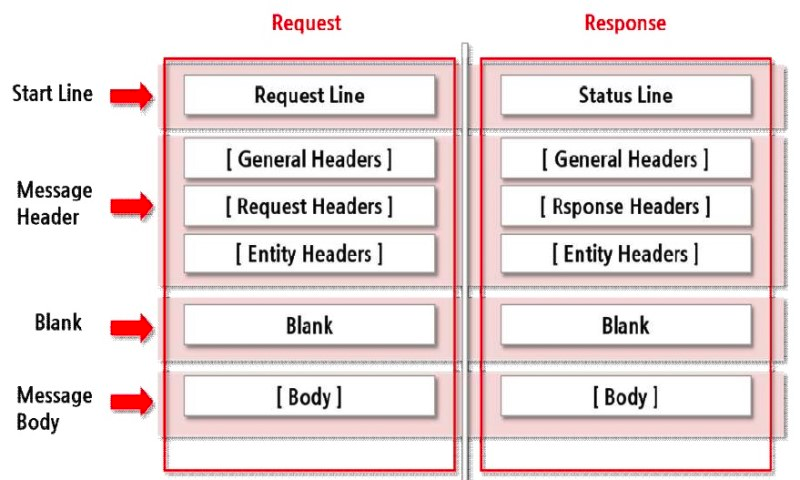

> 이 글은 책 ‘그림으로 배우는 HTTP & Network Basic’ 를 읽고 내용에 필자의 생각과 지식을 덧붙여 정리한 내용이다. 책 내용과 100% 일치하지 않을 수 있으며, 개인적인 견해나 경험이 들어갈 수 있다.

## HTTP 메시지

HTTP에서 교환하는 데이터는 HTTP 메시지라고 불리며, 클라이언트의 요청 메시지를 리퀘스트 메시지, 서버의 응답 메시지를 리스폰스 메시지라고 한다.

HTTP 메시지는 복수행으로 이루어진 텍스트이며 크게 구분하여 메시지 헤더와 메시지 바디로 이루어져있다. 최초에 나타난 개행 문자로 메시지 헤더와 바디를 구분한다. HTTP 메시지 안에 바디는 없을수도 있다.

### HTTP 메시지 구조

- **메시지 헤더** : 서버와 클라이언트가 꼭 처리해야하는 리퀘스트와 리스폰스 내용과 속성
- **개행문자(CR+LF)** : CR(Carriage Return)은 커서를 맨 앞으로 옮겨주며, LF(Line Feed)는 줄을 바꿔준다.
- **메시지 바디** : 전송되는 데이터 그 자체

## 리퀘스트 메시지와 리스폰스 메시지의 구조



### 리퀘스트 메시지 헤더

- **리퀘스트 라인 :** 리퀘스트의 메소드, 리퀘스트 URI, HTTP 버전 포함
- **리퀘스트 헤더 필드**
- **일반 헤더 필드**
- **엔티티 헤더 필드**

### **리스폰스 메시지 헤더**

- **상태 라인 :** 리스폰스 결과를 나타내는 상태 코드와 설명, HTTP 버전 포함
- **리스폰스 헤더 필드**
- **일반 헤더 필드**
- **엔티티 헤더 필드**

헤더 필드에는 리퀘스트와 리스폰스의 여러 조건과 속성등을 나타내는 헤더 필드가 포함된다. 일반 헤더 필드, 리퀘스트 헤더 필드, 리스폰스 헤더 필드, 엔티티 헤더 필드 4종류로 나뉜다.

그 외로 RFC에 없는 Cookie와 같은 헤더 필드가 포함되는 경우가 있다.

## 인코딩으로 전송 효율을 높이다

그대로 데이터를 전송하기 보다는 인코딩을 함으로써 전송 효율을 높일 수 있다. 전송 효율은 늘어나나 CPU등의 리소스는 많이 사용할 수 있다.

### 메시지 바디와 엔티티 바디의 차이

- 메시지 : HTTP 통신의 기본 단위, 옥텟(8bit) 시퀀스로 구성되고 통신을 통해 전송된다.
- 엔티티 : 리퀘스트, 리스폰스의 페이로드로 전송되는 정보. 엔티티 헤더 필드와 엔티티 바디로 구성된다.

HTTP 메시지 바디는 리퀘스트, 리스폰스의 엔티티 바디를 운반한다. 기본적으로 메시지 바디와 엔티티 바디는 같지만 전송 코딩이 적용된 경우 엔티티 바디의 내용이 변경되므로 메시지 바디와 달라진다.

### 압축해서 보내는 콘텐츠 코딩

HTTP에서 콘텐츠 코딩을 사용하여 엔티티 정보를 인코딩을 통해 내용은 유지한채로 압축할 수 있다. 인코딩된 엔티티는 수신측에서 디코딩한다.

gzip(GNU zip), compress(UNIX 표준 압축), deflate(zlib), identity(인코딩 없음) 등의 콘텐츠 압축 방식이 존재한다.

### 분해해서 보내는 청크 전송 코딩

청크 전송 코딩을 사용하여 사이즈가 큰 데이터를 보낼 때 데이터를 분할해서 조금씩 표시할 수 있다. 원래라면 모든 리소스의 엔티티 바디 전송이 완료되지 않으면 브라우저에 표시가 되지 않았다.

청크 전송 코딩은 엔티티 바디를 청크라는 덩어리로 분해하고 전송한다. 이때, 각 청크의 앞에 청크의 사이즈를 16진수로 표시한다. 수신한 측에서는 원래의 엔티티 바디로 디코딩한다. 또한 청크 사이즈가 0인 청크가 수신되면 수신을 종료한다.

## 여러 데이터를 보내는 멀티파트

MIME은 메일로 텍스트, 영상, 이미지같은 다양한 데이터를 보내기 위해 사용되었다. 이것이 이메일에서 잘 작동하여 HTTP에서 여러 다른 종류 데이터를 한번에 보내는 방식에 채택되었고, 이는 멀티파트라고 불린다.

멀티파트를 사용하면 메시지 바디 내부에 엔티티를 여러개 포함하여 보낼 수 있다. 이때, 이미지, 텍스트 파일 등을 실어 보낼 수 있다.

### multipart/form-data

웹 Form으로 부터 파일 업로드에 사용된다.

```
Content-Type: multipart/form-data; boundary=AaB03x

--AaB03x
Content-Deisposition: form-data; name="field1"

Joe Blow
--AaB03x
Content-Disposition: form-data; name="pics"; filename="fiel1.txt"
Content-Type: text/plain
... (file1.txt데이터) ...
--AaB03x--
```

### multipart/byteranges

상태코드 206 Partial Content 리스폰스 메시지가 복수 Range 내용을 포함할 때 사용된다. Range에 대한 내용은 바로 다음에 나온다.

```
HTTP/1.1 206 Partial Content
Date: Fri, 13 Jul 2012 02:45:26 GMT
Last-Modified: Fri, 31 Aug 2007 02:02:20 GMT
Content-Type: multipart/byteranges; boundary=THIS_STRING_SEPARATES

--THIS_STRING_SEPARATES
Content-Type: application/pdf
Content-Range: bytes 500-999/8000

...(지정한 범위의 데이터)...
--THIS_STRING_SEPARATES
Content-Type: application/pdf
Content-Range: bytes 7000-7999/8000
--THIS_STRING_SEPARATES--
```

멀티파트를 사용할 때에는 Content-Type 헤더 필드를 사용한다. 그리고 멀티파트에서 각 엔티티를 구분하기 위해서 boundary 문자열을 사용한다. 각 엔티티 앞에는 `--` 문자 뒤에 boundary 문자열을 붙인다. 그리고 멀티파트의 마지막은 `--` 문자를 boundary 문자열 앞뒤로 붙여 끝을 알린다.

멀티파트는 파트마다 헤더 필드가 포함된다. 자세한 내용은 RFC2046을 참고하자.

## 일부분만 받는 레인지 리퀘스트

레인지 리퀘스트를 사용하면 다운로드 중 인터넷 연결이 끊겨 끝내 다 받지 못한 데이터를 수신받지 못한 일부분만을 별도로 다운로드할 수 있다. 이런 기능을 리줌이라고 하며, HTTP의 레인지 리퀘스트를 사용하여 구현할 수 있다.

```
GET /tip.jpg HTTP/1.1
Host: www.usagidesign.jp
Range: bytes=5001-10000
```

위와 같이 `Range` 헤더를 통해 데이터의 일부분만을 수신받을 수 있다.

```
Range: bytes=-3000, 5000-7000
```

위와 같이 다중으로 부분 범위를 수신할 수도 있다. 이때 `-3000` 은 처음부터 3000바이트 까지를 의미한다.

이렇게 요청하게 되면 앞서 멀티파트 부분에서 설명한 `206 Partial Content` , `Content-type: ultipart/byteranges` 로 응답받을 수 있다. 단, 레인지 리퀘스트를 지원하지 않는 서버는 평범하게 `200 OK` 상태코드와 함께 전체 엔티티를 반환한다.

## 최적의 콘텐츠를 돌려주는 콘텐츠 네고시에이션

같은 콘텐츠이지만 다르게 표현되어야 하는 페이지가 있을 것이다. 이를테면, 영어 페이지와 한국어 페이지를 따로 제공할 때가 있을 것이다.

콘텐츠 네고시에이션이란 말 그대로 클라이언트에게 더 적합한 콘텐츠를 제공하기 위해 서버와 클라이언트가 리소스 내용에 대해 협상하는 것이다.

콘텐츠 네고시에이션은 리소스를 언어, 문자 세트(Charset), 인코딩 방식 등을 기준으로 판단한다. 판단 기준은 `Accept`, `Accept-Charset`, `Accept-Encoding`, `Accept-Language`, `Content-Language` 등의 리퀘스트 헤더 필드이다. 자세한 내용은 다음 장에 나온다고 한다.

콘텐츠 네고시에이션은 아래와 같이 크게 3가지 종류로 나뉜다.

### 서버 구동형 네고시에이션 (Server-driven Negotiation)

서버 측에서 리퀘스트 헤더 필드를 참고하여 콘텐츠 네고시에이션 하는 방식이다. 브라우저가 보내는 정보를 기반으로 작동하기 때문에 유저에게 정말 적절한 콘텐츠가 선택되었는지 확신할 수 없다.

### 에이전트 구동형 네고시에이션 (Agent-driven Negotiation)

클라이언트 측에서 콘텐츠 네고시에이션을 하는 방식이다. 브라우저에 표시된 선택지 중 유저가 수동으로 선택하거나, 자바스크립트 등을 사용하여 자동으로 정하는 방법도 있다. PC 웹페이지와 스마트폰 웹페이지를 자동으로 전환하여 보여주는 것이 이에 해당한다.

### 트랜스페어런트 네고시에이션 (Transparent Negotiation)

서버 구동형과 에이전트 구동형을 혼합하여 서버, 클라이언트 각각이 콘텐츠 네고시에이션을 하는 방식이다.
