이번장을 통해 사용자 수가 증가함에 따라 시스템의 규모를 확장해 나가는 과정을 개략적으로 공부해볼 것이다. 당장 각각의 내용을 깊게 이해하기는 어렵겠지만, 규모 확장과 안정적인 시스템을 위한 여러 방법과 전략에 대해 감을 잡고 키워드를 수집한다는 생각으로 학습했다.

## 단일 서버

모든 **컴포넌트가 단 한대에 서버에서 실행**되는 간단한 시스템 부터 설계한다.

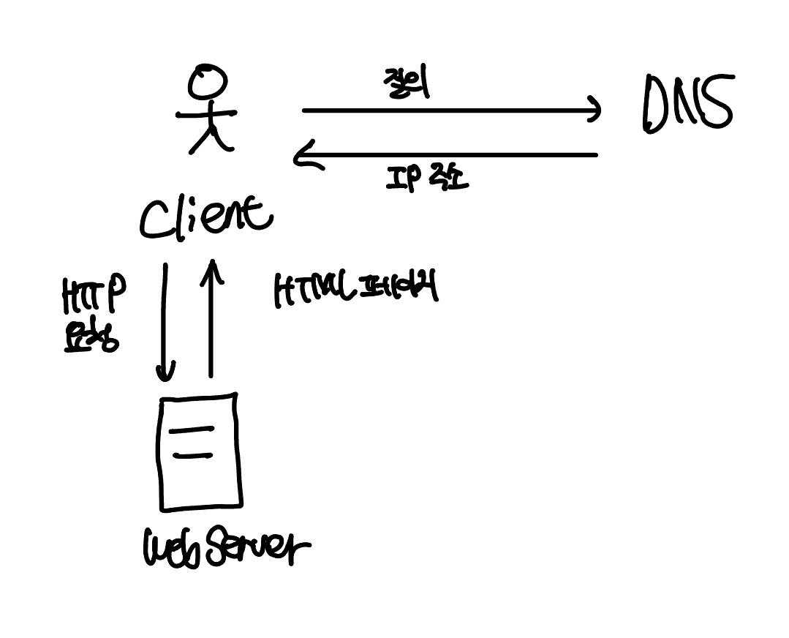

위와 같이 웹 서버가 클라이언트의 모든 요청을 처리할 것 이다. 위 구조에서 사용자 요청은 어떻게 흐를까?

1. 클라이언트는 DNS에 도메인 이름으로 IP를 질의한다. DNS는 우리 시스템의 일부는 아니다.
2. 클라이언트는 DNS 조회 결과로 IP를 얻어온다. 이 IP 주소는 웹 서버의 주소이다.
3. 이 IP 주소로 클라이언트는 HTTP 요청을 전달한다.
4. 웹 서버는 클라이언트에게 HTML 웹 페이지를 전달한다.

## 데이터베이스

사용자가 늘면 단일서버로는 부족하여 **웹/모바일 트래픽 처리 서버(웹 계층)와 데이터베이스 서버(데이터 계층)을 분리**한다. 그렇다면 그 각각을 **독립적으로 확장해 나갈 수 있다.**

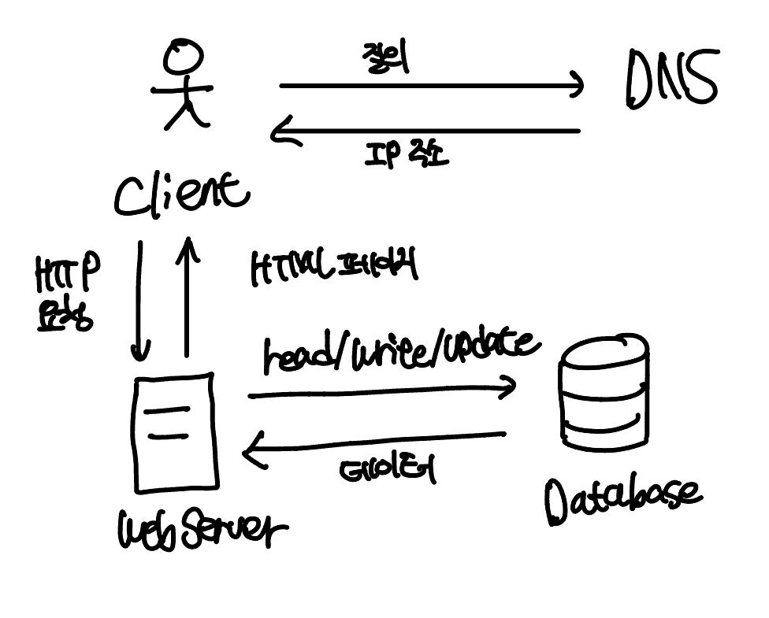

### 어떤 데이터베이스를 사용할것인가?

관계형 데이터베이스는 MySQL, 오라클, PostgreSQL 등이 있으며, 데이터를 테이블, 열, 컬럼으로 표현한다. SQL을 사용하여 테이블의 관계에 따라 데이터를 조인할 수 있다.

비-관계형 데이터베이스 (NoSQL)은 CouchDB, Neo4j, Cassandra, HBase, MongoDB, Amazon DynamoDB 등이 있다. NoSQL은 다시 키-값 저장소, 그래프 저장소, 칼럼 저장소, 문서 저장소 네 부류로 나뉘어진다고 한다.

대부분의 개발자는 시장에서 40년간 잘 살아남아온 **관계형 데이터베이스를 사용하는 것이 최선**이다. 그렇다면, 언제 비-관계형 데이터베이스를 사용할 수 있을까?

- 아주 **낮은 응답 지연시간**이 요구될 때
- 다루는 데이터가 **비정형(unstructured)**라서 관계형 데이터가 아닐 때
- 데이터를 **직렬화하거나 역직렬화만 하면 될 때**
- **아주 많은 양의 데이터**를 저장할 필요가 있을 때

## 수직적 규모 확장 vs 수평적 규모 확장

**수직적 규모 확장(scale-up)**은 서버에 **고사양 자원을 추가**(더 좋은 CPU, 더 많은 램)하는 행위, **수평적 규모 확장(scale-out)**은 **더 많은 서버**를 추가하여 성능을 개선하는 행위이다.

트래픽이 적을때는 수직적 확장이 좋은 선택이다. 하지만, 한대의 서버에 CPU나 메모리를 무한대로 증설할 방법이 없다. **단일 컴퓨팅 파워에는 한계**가 있기 때문이다. 또, 장애에 대한 **자동복구(failover)**나 **다중화(redundancdy) 방안**을 제시하지 않는다. 서버에 장애가 발생하면, 모든 웹사이트, 앱은 서비스가 중단된다. 이런 단점으로 **대규모 애플리케이션에는 수평적 규모 확장법**이 더 적절하다.

앞서 본 설계에서는 사용자가 웹서버에 바로 연결된다. 웹 서버가 다운되면 사용자는 웹 사이트에 접속할 수 없다. 또, 트래픽이 너무 많아져서 서버가 한계에 도달하면 응답속도가 느려지거나 접속이 불가능해진다. 이런 문제를 해결하기 위해 로드 밸런서를 도입해야한다.

### 로드밸런서

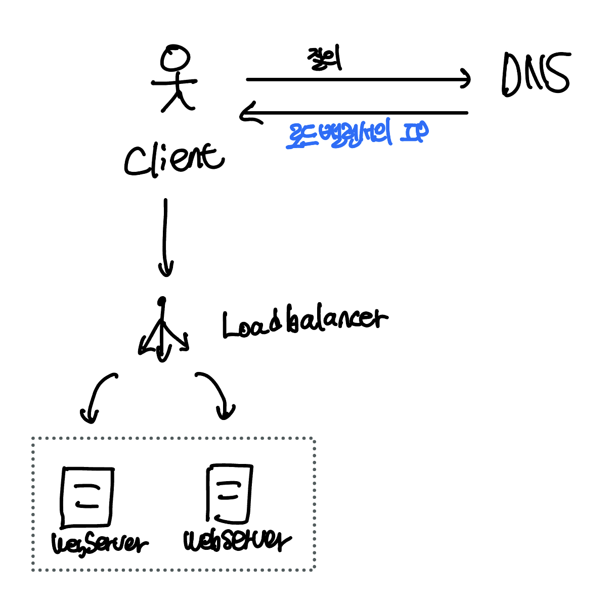

로드밸런서는 부하 분산 집합(load balancing set)에 속한 웹 서버들에게 **트래픽 부하를 고르게 분산**해주는 요소이다. 사용자는 **웹서버 대신 로드밸런서의 공개 IP 주소**로 접속한다. 따라서, 웹 서버는 클라이언트의 접속을 직접 처리하지 않는다. 일반적으로 보안을 위해 서버간 통신에는 사설 IP 주소를 사용한다. 따라서, **로드 밸런서와 웹 서버는 이 사설 주소를 사용하여 통신**한다.

이렇게 부하 분산 집합에 웹 서버를 하나 더 추가하게 되면 **자동 복구하지 못하는 문제(no failover)가 해소**되고, **웹 계층의 가용성(availability)은 향상**된다. 서버1이 다운되면(offline) 모든 트래픽이 서버 2로 향하게 된다. 따라서 웹 사이트 전체가 다운되는 일이 발생하지 않는다. 트래픽이 가파르게 증가하면 부하 분산 집합에 서버를 추가하기만 하면 된다.

웹 계층은 어느정도 개선됐는데, 데이터베이스 서버는 아직 하나이다. 자동 복구나 다중화를 지원하지 않는다. 데이터베이스 다중화는 이런 문제를 해결한다.

### 데이터베이스 다중화

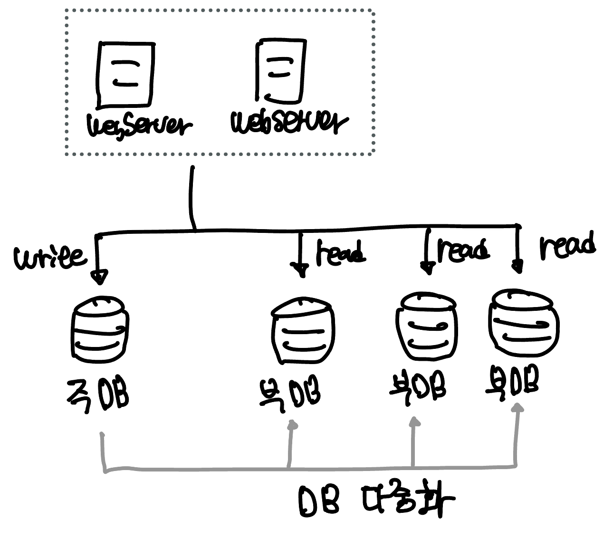

많은 데이터베이스 관리 시스템이 다중화를 지원한다. **주(master)-부(slave) 관계**를 설정하고, **데이터 원본은 주 서버에, 사본은 부 서버**에 저장한다. 쓰기 연산은 주 서버에서만 지원하고, 부 서버는 주 서버로부터 사본을 전달받아 읽기 연산만을 지원한다.

대부분의 어플리케이션은 **읽기 연산의 비중이 쓰기 연산보다 많다**. 따라서 통상 주 데이터베이스 서버보다 부 데이터베이스 서버 수가 더 많다.

데이터베이스를 다중화하면 얻는 이점은 무엇일까?

1. **더 나은 성능 :** master-slave 다중화 모델에서 모든 쓰기 연산은 master로, 읽기 연산은 다수의 slave로 분산된다. **병렬로 처리되는 쿼리의 수가 늘어나므로 성능이 향상**된다.
2. **안정성 :** 자연 재해등으로 서버 일부가 파괴되어도 **데이터가 보존**된다. 지리적으로 떨어져있는 곳으로 서버를 다중화 시킬수 있기 때문이다.
3. **가용성 :** 데이터를 여러 지역에 복제하여 하나의 데이터베이스 서버에 장애가 발생해도 다른 서버에 있는 데이터로 계속 서비스를 이어나갈 수 있다.

따라서 주-부 관계로 구성된 데이터베이스 다중화 구조는 아래와 같은 상황을 감당할 수 있다.

- **하나뿐인 부 서버가 다운되었다면, 읽기 연산을 한시적으로 주 서버로 전달**한다. 이후 새로운 부 서버를 올려 장애 서버를 대체한다. **부 서버가 여러대인 경우라면 나머지 읽기 연산이 나머지 부 서버로 분산**되고, 이후 새로운 부 서버가 장애서버를 대체한다.
- 주 서버가 다운되었고, 한대의 부 서버가 있는 경우 **부 서버가 새로운 주 서버**가 되고, 일시적으로 쓰기/읽기 연산을 모두 처리한다.
  > 프로덕션 환경에서 발생하는 일은 이것보다 더 복잡하다. 부 서버가 가지고 있는 데이터가 완전 최신 데이터가 아닐 수 있다. 없는 데이터를 복구 스트립트를 돌려 추가해야한다. 다중 마스터나 원형 다중화 방식을 도입하면 대처할 수 있는데, 매우 복잡하여 책에서 다루지 않는다고 한다.

### 전체 모습

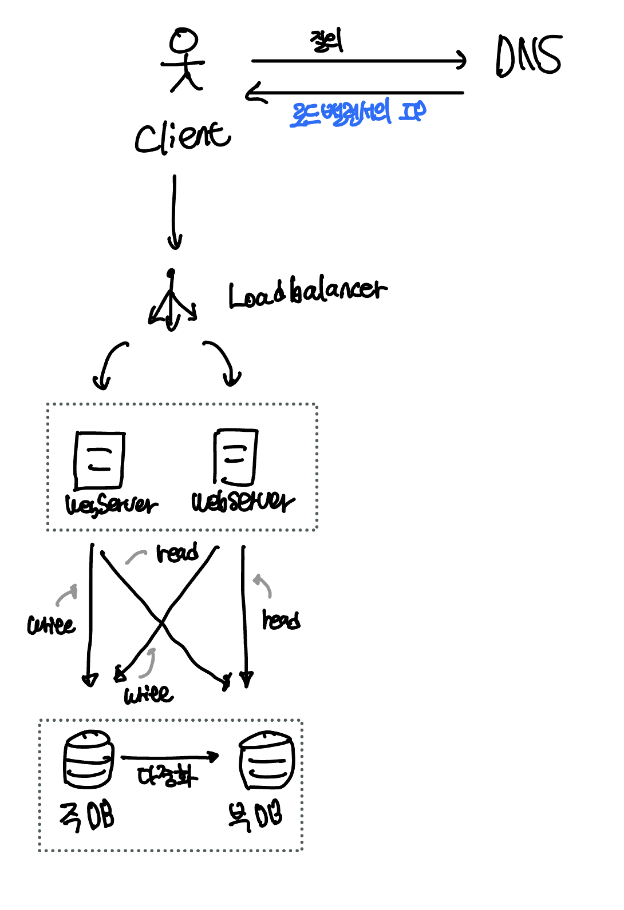

## 캐시

캐시를 사용하면 **응답시간(latency)을 개선**할 수 있다. 응답 시간은 **(1) 캐시**를 붙이고 **(2) 정적 콘텐츠를 콘텐츠 전송 네트워크(Content Delivery Network, CDN)**로 옮기면 개선할 수 있다.

이때 캐시란, **값 비싼 연산결과나 자주 참조되는 데이터를 메모리에 보관**하고, **뒤 이은 요청부터 빨리 처리**될 수 있도록 하는 저장소이다.

애플리케이션의 성능은 **데이터베이스를 얼마나 자주 호출하느냐에 따라 크게 좌우**된다 (네트워크와 IO가 발생하기 때문). 캐시는 이런 문제를 완화할 수 있다.

캐시 계층(cache tier)는 데이터가 잠시 보관되는 곳으로 **데이터베이스보다 훨신 빠르다** (데이터베이스는 데이터를 디스크에 저장하고, 캐시는 램에 저장하기 때문). 별도의 캐시 계층을 두면 **(1) 성능이 개선되고 (2) 데이터베이스 부하가 줄어들고 (3) 캐시 계층을 독립적으로 확장**할 수 있다.

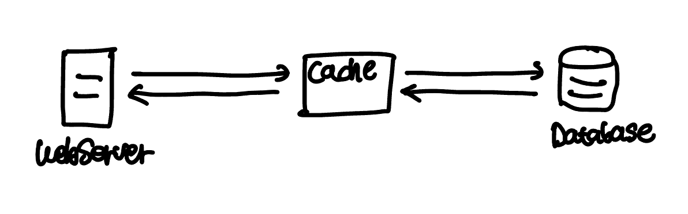

웹 서버는 캐시 서버에 데이터가 있다면 캐시 서버에서 데이터를 읽는다. 없다면 데이터베이스에서 데이터를 읽고, 캐시에 저장한뒤 클라이언트에 반환한다. 이런 캐시 전략을 **읽기 주도형 캐시 전략(read-through caching strategy)**라고 한다. 이외에도 데이터 종류, 크기, 액세스 패턴에 맞는 다양한 캐시 전략이 있다고 한다.

### 캐시 사용시 유의점

- 캐시는 어떤 상황에 바람직한가?

  데이터 갱신은 자주 일어나지 않지만, 참조가 빈번할 때

- 어떤 데이터를 캐시에 두어야 하는가?

  영속적으로 보관할 데이터를 캐시에 두는 것은 바람직 하지 않다. 캐시는 **휘발성 메모리**에 데이터를 저장하기 때문. **중요한 데이터는 영속성 저장소(persistent data store)**에 두어야한다.

- 캐시에 보관된 데이터는 어떻게 만료(expire)되는가?

  적절한 만료 정책을 마련해두는것이 좋다. 만료된 데이터는 캐시에서 삭제해야한다. 만료 정책이 없으면 데이터가 캐시에 계속 남는다. 만료 기한이 **너무 짧으면, 데이터베이스를 너무 자주 읽게** 되므로 캐시를 두는 의미가 퇴색될 수 있다. 만료 기한이 **너무 길면 실제 데이터와 캐시가 차이**가날 가능성이 있으므로 주의한다.

- 일관성은 어떻게 유지되는가?

  일관성이란 데이터의 원본과 캐시된 사본이 같은지의 여부이다. **저장소의 원본을 갱신하는 연산과 캐시를 갱신하는 연산이 단일 트랜잭션으로 처리되지 않는 경우 이 일관성이 깨질 수 있다.** 원본 데이터 갱신을 성공하고, 캐시 갱신에는 실패하였을 때 이 두 연산이 단일 트랜잭션으로 묶이지 않았다면 원본과 캐시의 일관성이 깨진다. 여러 지역에 걸쳐 시스템을 확장하는 경우 캐시와 저장소 사이의 일관성을 유지하는것은 어려운 문제이다.

- 장애에는 어떻게 대처할 것인가?

  캐시 서버를 **한대만 두면 단일 장애 지점(Single Point of Failure, SPOF)**가 될 수 있다. SPOF를 피하려면, 여러 지역에 걸쳐 캐시 서버를 분산해야한다.

- 캐시 메모리는 얼마나 크게 잡을 것인가?

  **캐시 메모리가 너무 작다면**, 액세스 패턴에 따라 데이터가 **캐시 메모리에서 너무 자주 밀려나버려(eviction)** 성능이 떨어지게된다. 이를 막을 한가지 방법은 **캐시 메모리를 과할당(overprovision)** 하는 것이다. 갑자기 캐시에 보관할 데이터가 많아졌을 때 생길 문제를 방지할 수 있다.

- 데이터 방출(eviction) 정책은 무엇인가?

  캐시가 꽉 차버린 상태에서 추가로 데이터를 넣어야한다면 기존 데이터를 내보내야한다. 이를 데이터 방출 정책이라고 하는데, 가장 널리 쓰이는건 마지막으로 사용된 시점이 가장 오래된 데이터를 먼저 내보내는 LRU(Least Recently Used)이다. 다른 정책으로는 사용된 빈도가 가장 낮은 데이터를 내보내는 LFU(Least Frequently Used), 가장 먼저 캐시에 들어온 데이터를 가장 먼저 내보내는 정책인 FIFO(First In First Out)같은것이 있다.

## 콘텐츠 전송 네트워크(CDN)

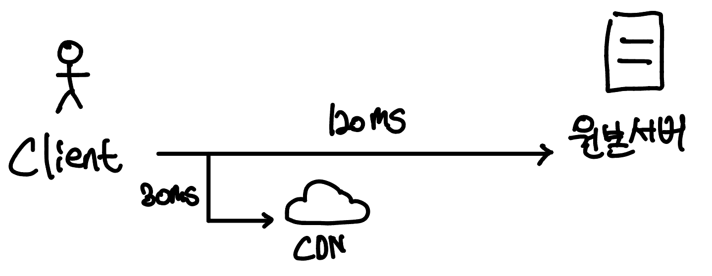

CDN은 정적 콘텐츠 (이미지, 비디오, CSS, Javascript) 를 전송하는데 쓰이는 지리적으로 분산된 서버의 네트워크이다. 사용자가 웹사이트를 방문하면, 그 사용자에게 가장 가까운 CDN 서버가 정적 콘텐츠를 전달한다.

> 동적 콘텐츠 캐싱은 Request Path, Query String, Cookie, Request Header 등의 정보에 기반하여 HTML 페이지를 캐싱하는 것을 의미한다. 이는 책에서 다룰 수 있는 범위 밖이라고 한다.

### CDN의 동작 과정

1. 사용자가 이미지 URL을 이용해 이미지에 접근한다. 이 URL의 도메인은 CDN 서비스 사업자가 제공한다.
2. **CDN 서버에 해당 이미지가 없는 경우 CDN 서버는 원본 서버에 요청해 파일을 가져온다.** 원본 서버는 웹 서버일수도, S3 같은 온라인 저장소일수도 있다.
3. 원본 서버가 CDN 서버에 파일을 반환한다. HTTP 응답 헤더에는 해당 파일이 얼마나 오래 캐시될 수 있는지 나타내는 **TTL(Time-To-Live)** 값이 들어있다.
4. CDN서버는 파일을 캐시하고 사용자에게 반환한다. 이 이미지 파일은 TTL에 명시된 시간만큼 캐시된다.
5. 다른 사용자가 동일한 이미지를 CDN 서버에 요청한다.
6. 해당 이미지가 만료되지 않았다면 **CDN 서버가 캐시해둔 파일을 반환**한다.

### CDN 사용시 고려해야 할 사항

- **비용:** CDN은 보통 3rd-party provider에 의해 운영되며, 데이터 전송양에 따라 요금을 지불한다. **자주 사용되지 않는 콘텐츠를 캐싱하는 것은 비용 낭비**임을 주의하자.
- **적절한 만료 시한 설정:** **시의성이 중요한(time-sensitive)** 콘텐츠는 만료 시점을 잘 설정하는게 중요하다. 만료 시한이 **너무 길면 콘텐츠의 신선도가 떨어지고**, **너무 짧으면 원본 서버에 빈번한 접속 요청**이 들어올 것이다. 캐시 서버의 만료 정책과 비슷하다.
- **CDN 장애에 대한 대처 방안:** CDN이 응답하지 않은 경우 이 문제를 감지하여 원본 서버로부터 콘텐츠를 가져올 수 있도록 클라이언트를 구성할 필요가 있다.
- 콘텐츠 무효화(invalidation) 방법: 아직 만료되지 않은 콘텐츠라고 하더라도 아래 방법을 통해 CDN에서 캐시를 제거할 수 있다.
  1. CDN 서비스 사업자가 제공하는 API를 통한 무효화
  2. 콘텐츠의 다른 버전을 서비스하도록 **오브젝트 버저닝(object versioning)**이용. 콘텐츠의 새로운 버전을 쩡하기 위해서는 URL 마지막에 버전 번호를 인자로 준다. `image.png?v=2` 처럼 말이다. (캐시 버스팅을 이야기하는 것 같다)

### 전체 모습

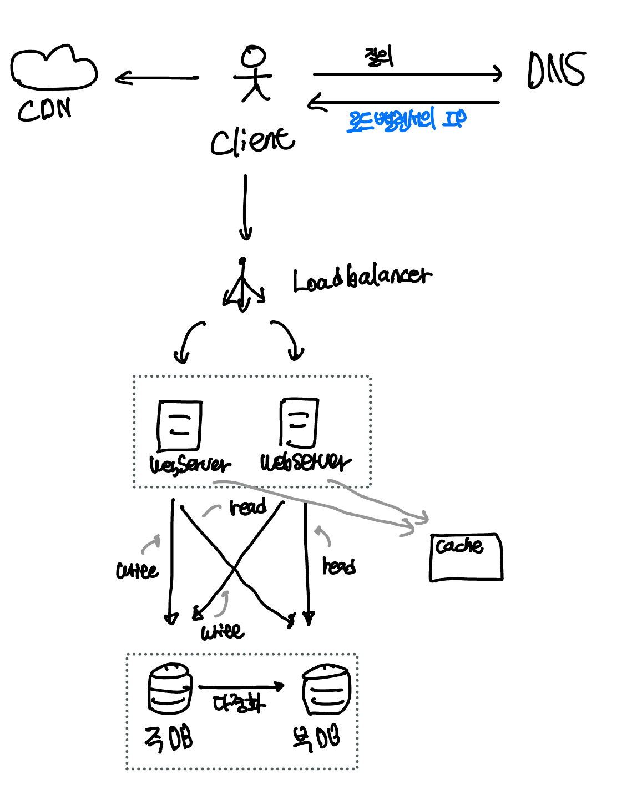

## 무상태(stateless) 웹 계층

**웹 계층을 수평 확장**하는 방법을 고민해보자. 이를 위해서는 사용자 세션 데이터와 같은 상태 정보를 웹 계층에서 제거해야한다.

### 상태 정보 의존적인 아키텍처

상태정보를 보관하는 서버는 클라이언트 정보, 즉 **상태를 유지하여 요청들 사이에 공유(쿠키와 세션등을 사용하여)**되도록 한다. 무상태 서버에는 이런 장치가 없다.

사용자A는 서버1, 사용자B는 서버2에서 로그인했다면, 사용자A는 항상 서버1로 사용자B는 항상 서버2로 요청해야한다. 즉, 같은 클라이언트로부터의 요청은 항상 같은 서버로 전송되어야 한다. 이를 지원하기 위해 로드밸런서는 Sticky Session 기능을 제공하지만, 이는 로드 밸런서에 부담을 준다. (**[다중 서버 환경에서의 세션 불일치 문제와 해결방법](https://hudi.blog/session-consistency-issue/)** 포스팅을 참고하자) 로드밸런서 뒷단에 서버를 추가하거나 제거하기도 까다로워지고, 이들 서버의 장애를 처리하기도 복잡해진다.

> 왜 로드밸런서 뒷단에 서버를 추가하거나 제거하기 어려워지고, 장애를 처리하기도 복잡해지는 것일까? 이에 대해서는 더 공부가 필요할 것 같다.

### 무상태 아키텍처

무상태 아키텍처는 상태 정보를 **별도의 공유 저장소(shared storage)**로부터 데이터를 저장하고 가져온다. 즉, 상태 정보는 **웹 서버로부터 물리적으로 분리**되어 있다. 이런 구조는 **단순하고, 안정적이고, 규모 확장**이 쉽다.

이 공유 저장소는 Memcached나 Redis와 같은 캐시 시스템일수도 있고 NoSQL 일수도 있다. 책에서는 규모 확장이 간편하여 NoSQL을 선택했다고 한다.

> 왜 NoSQL이 규모 확장이 더 간편한지는 더 공부해봐야할 것 같다.

상태를 별도의 저장소에 저장하여 부하 분산 집합내의 **자동 규모 확장(autoscaling)**이 가능해졌다. 상태가 웹 서버에서 제거되었으므로, 트래픽 양에 따라 웹 서버를 넣거나 빼기만 하면 자동으로 규모를 확장할 수 있다.

> 왜 무상태 아키텍처가 오토 스케일링을 가능하게 한건지는 당장 이해가지는 않는다. Sticky Session을 사용하면서 오토 스케일링을 사용할 수는 없는건가? 가능하더라도 오버헤드가 많이 발생해서 그런건가? 아직은 명확하게 와닿지는 않는다.

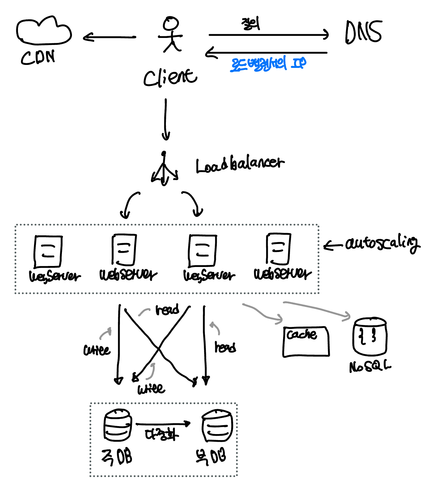

## 데이터 센터

서비스가 전 세계적으로 사용하게 되었다고 가정하자. 가용성을 높이고 **전세계 어디서든 쾌적하게 사용하기 위해 데이터 센터(data center)**를 지원하는것이 필수이다.

지리적으로 분리된 두개의 데이터 센터가 있다고 가정하자. 장애가 없는 상황에서 사용자는 가장 가까운 데이터센터로 라우팅된다. 이 절차를 **지리적 라우팅(geoDNS-routing 또는 geo-routing)** 이라고 한다. 지리적 라우팅에서 geoDNS는 사용자의 위치에 따라 도메인 이름을 어떤 IP주소로 변화할지 결정해주는 DNS 서비스이다.

만약 데이터 센터 중 하나에 심각한 장애가 발생하면 모든 트래픽은 장애가 발생하지 않은 데이터 센터로 향한다.

다중 데이터센터 아키텍처를 만들기 위해서는 몇 가지 기술적 난제를 해결해야한다.

- **트래픽 우회:** 올바른 데이터 센터로 트래픽을 보내는 효과적인 방법을 찾는다. geoDNS는 사용자에게서 가장 가까운 데이터센터로 트래픽을 보낼 수 있도록 해준다.
- **데이터 동기화(synchronization):** 데이터 센터마다 별도로 데이터베이스를 사용하고 있는 상황이라면, 장애가 자동으로 복구되어(failover) 트래픽이 다른 데이터베이스로 우회된다 해도, 해당 데이터센터에는 찾는 데이터가 없을 수 있다. 이런 상황을 막는 보편적 전략은 데이터를 여러 데이터센터에 걸쳐 다중화하는 것이다.
  > 이 부분은 이해가 조금 어렵다. 일단 다중 데이터센터 아키텍처에서는 데이터 동기화가 까다롭다는 의미로 받아들이고 넘어간다.
- **테스트와 배포:** 여러 데이터 센터에서 웹 사이트 혹은 애플리케이션을 테스트 해보는게 중요하다. 또한 자동화된 배포 도구를 사용하여 모든 데이터 센터에 동일한 서비스가 설치되도록 한다.

### 전체 모습

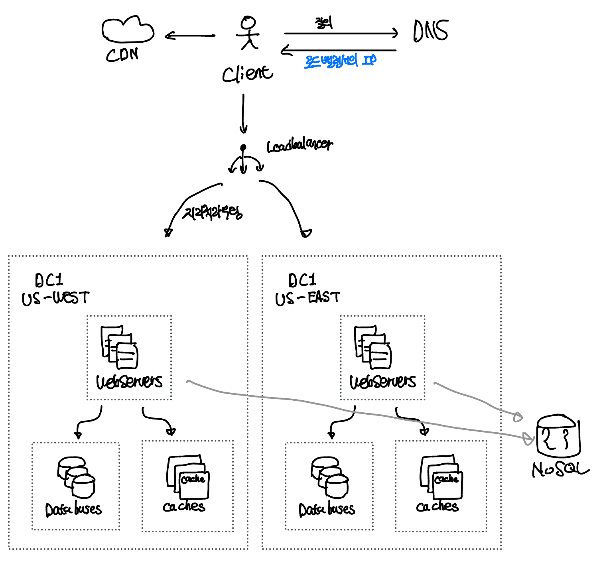

> 왜 이 그림에서 상태를 저장하는 NoSQL은 독립적으로 위치해있을까?… 라고 생각을 해봤는데, 각 데이터 센터별 분리되어 있는 **웹 서버에서 모두 동일한 세션 정보를 공유**해야하기 때문이라는 생각이 든다.

## 메시지 큐

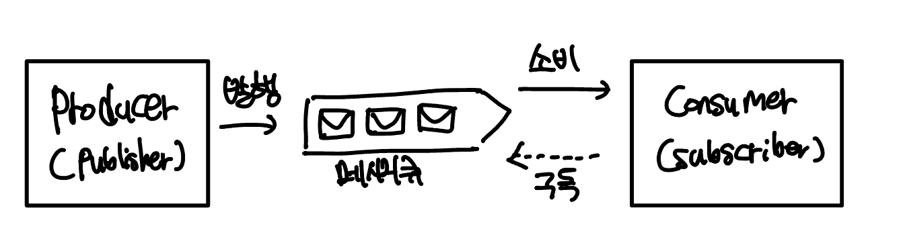

시스템을 더 큰 규모로 확장하려면, **시스템의 컴포넌트를 분리(느슨한 결합, loose coupling)하고 각기 독립적으로 확장**될 수 있도록 해야한다. 메시지큐는 많은 실제 분산 시스템이 이 문제를 풀기위해 사용하는 핵심적인 전략이다.

메시지 큐는 **비동기 통신을 지원하는 컴포넌트**이다. 메시지큐는 **무손실을 보장**하는 특징이 있는데, 이는 메시지 큐에 한번 저장된 메시지는 소비자가 꺼낼때 까지 안전히 보관된다는 점이다. 메시지큐는 메시지의 버퍼 역할을 하며, 비동기적으로 전송한다.

**생산자 또는 발행자(producer/publisher)**라고 불리는 입력 서비스가 **메시지를 만들어 메시지 큐에 발행(publish)**한다. 메시지 큐에는 **소비자 혹은 구독자(consumer/subscriber)**라고 불리는 서비스 또는 서버가 연결되어 있는데, **메시지를 받고 동작을 수행**하는 역할을 한다.

메시지 큐를 사용하면 서비스 또는 **서버 간 결합이 느슨**해져, 규모 확장성이 보장되어야 하는 안정적인 애플리케이션을 구성하기 좋다. 또, **결함에 대한 내성을 높여**준다.

**생산자는 소비자가 다운되어 있을때도 메시지를 발행**할 수 있고, 반대로 **소비자는 생산자 서비스가 다운되어 있더라도 메시지를 수신**할 수 있다. (이 점이 결함에 대한 내성을 높인다는 것 같다)

사용 예로 시간이 오래 걸리는 이미지 보정 작업을 들 수 있다. 생산자인 웹 서버는 이미지 보정 작업을 메시지 큐에 넣는다. 사진 보정 작업 프로세스는 메시지 큐에서 메시지를 꺼내 해당 비동기적으로 이미지 보정 작업을 수행한다. 이런 구조에서는 생산자와 소비자 서비스의 규모는 각기 독립적으로 확장될 수 있다.

> 왜 비동기적으로 동작하면 서버간 결합이 느슨해지고, 규모를 확장하기 쉬워지는걸까? 서로의 서버가 살아있던 죽어있던 메시지를 발행하기만 하면 되는 등 서로의 상태에 영향을 덜받기 때문인것 같다. 또 다른 이유는 아직 잘 모르겠다. 또, 생산자-메시지큐-소비자가 N:1:M 구성이 가능해서 확장성이 좋다고 한다. 아직 확실히 와닿지는 않는데, 더 공부해봐야할 것 같다.

## 로그, 메트릭 그리고 자동화

소규모 서비스에서는 **로그, 메트릭(metric), 자동화(automation)**은 좋지만 필수는 아니다. 하지만 사업 규모가 커지면 이런 도구에도 투자해야한다.

- **로그:** 에러 로그를 모니터링 하는 것은 중요하다. 시스템의 오류와 문제를 보다 쉽게 찾아낼 수 있도록 하기 때문이다. 서버 단위로 로그를 모니터링하는 것도 좋지만, 로그를 하나로 모아주는 도구를 활용하면 더 편리하게 검색, 조회 할 수 있다.
- **메트릭:** 메트릭을 잘 수집하면 사업 현황에 관한 유용한 정보를 얻을수도 있고, 시스템의 현재 상태를 손쉽게 파악할 수 도 있다.
  - 호스트 단위 메트릭: CPU, 메모리, 디스크 I/O에 관한 메트릭
  - 종합(aggregated) 메트릭 : 데이터베이스 계층의 성능, 캐시 계층의 성능
  - 핵심 비즈니스 메트릭: 일별 활성 사용자(daily active user), 수익, 재방문(retention) 같은 것들
- **자동화:** 시스템이 크고 복잡해지면, 생산성을 위해 자동화 도구를 활용해야한다. 빌드, 테스트, 배포 등의 절차를 자동화할 수 있다.

### 전체 모습

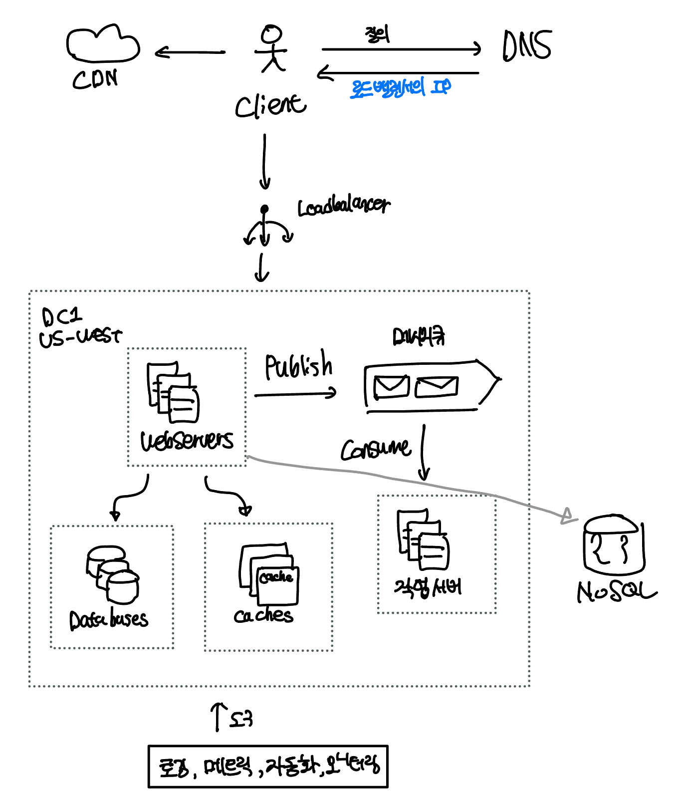

## 데이터베이스의 규모 확장

저장할 데이터가 많아지면 데이터베이스에 대한 부하도 증가한다. 그때엔 데이터베이스를 증설할 방법을 찾는다. 데이터베이스 규모를 확장하는 방법엔 수직적 규모 확장법과 수평적 규모 확장법 두가지로 나뉘어진다.

### 수직적 확장

데이터베이스 서버의 CPU, RAM, 디스크와 같은 자원을 증설하는 방법이다. 수직적 접근법에는 몇가지 심각한 약점이 있다.

1. 서버 하드웨어를 무한 증설할 수 없으므로 한계가 존재한다.
2. 하나의 데이터베이스를 수직 확장하면 SPOF로 인한 위험성이 크다.
3. 고성능 서버로 갈수록 가격이 올라가므로 비용이 많이 발생한다.

### 수평적 확장

데이터베이스의 **수평적 확장을 샤딩(sharding)**이라고 부른다. 더 많은 서버를 추가함으로써 성능을 향상시킬 수 있다.

샤딩은 대규모 데이터베이스를 **샤드(shard)라고 부르는 작은 단위로 분할**한다. 모든 샤드는 **같은 스키마**를 사용하지만, 샤드에 보관되는 데이터사이에는 **중복이 없다**.

샤드 방식에는 여러가지가 있다. **해시 샤딩(hash sharding)**은 샤드의 개수에 따른 해시 함수를 사용하여 데이터가 보관되는 샤드를 결정한다. 예를 들어 샤드가 4개인 경우 `user_id % 4` 를 해시 함수로 사용하여 데이터가 보관될 샤드를 결정할 수 있다.

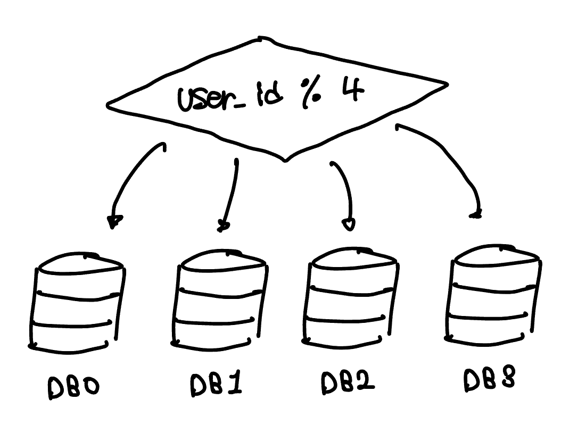

샤딩 전략에서 가장 중요하게 고려할 것은 **샤딩 키(sharding key, partition key)**를 어떻게 정하느냐이다. 샤딩 키는 **데이터가 어떤 샤드에 저장되는지 결정하는 하나 이상의 컬럼으로 구성**된다. 위 사례의 경우 `user_id` 가 샤딩 키이다. 샤딩키를 정할때는 데이터가 고르게 분할될 수 있도록 하는게 중요하다.

샤딩을 도입하면 시스템이 복잡해지고 풀어야할 새로운 문제도 생긴다.

- **데이터의 재 샤딩(resharding):** (1) **데이터가 너무 많아져** 하나의 샤드로는 감당이 어렵거나 (2) **균등하게 데이터 분포가 되지 않아** 특정 샤드에 데이터가 몰려 할당된 공간 소모가 다른 샤드에 비해 빠르게 진행될 때 재 샤딩을 고려해야한다. 이를 **샤드 소진(shard exhaustion)**이라고도 부르는데, 이런 현상을 해결하기 위해 샤드 키를 계산하는 함수를 변경하고 데이터를 재 배치해야한다. 책 뒷편에서 다룰 **안정 해시(consistent hashing)** 기법을 사용하여 이 문제를 해결할 수 있다.
- **유명인사(celebrity) 문제:** 핫스팟 키(hotspot key) 문제라고도 부른다. 특정 샤드에 질의가 집중되어 서버에 과부하가 걸리는 문제다. 페이스북 같은 서비스에서 유명 인사 유저가 모두 한 샤드에 집중적으로 저장되어 있다면 해당 샤드만 큰 과부하가 걸리게 될 것이다. 이 문제를 해결하기 위해 유명인사 각각에 샤드 하나씩을 할당해야 할 수도 있고, 더 잘게 샤드를 쪼개야할수도 있다.
- **조인과 비정규화(join and de-normalization):** 하나의 데이터베이스를 여러 서버로 쪼개면, 여러 샤드에 걸친 데이터를 조인하기 힘들다. 이를 해결하는 방법 중 하나는 데이터베이스를 비정규화 하여 조인 없이 하나의 테이블에서 질의가 수행될 수 있도록 하는 것이다.

### 전체 모습

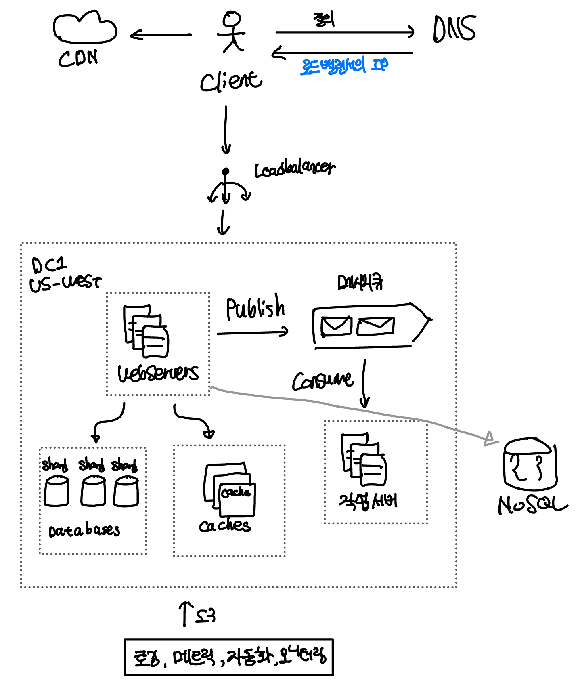

## 정리

- 웹 계층은 무상태 계층으로
- 모든 계층에 다중화 도입
- 가능한 한 많은 데이터를 캐시할 것
- 여러 데이터 센터를 지원할 것
- 정적 콘텐츠는 CDN을 통해 서비스할 것
- 데이터 계층은 샤딩을 통해 그 규모를 확장할 것
- 각 계층은 독립적 서비스로 분할할 것
- 시스템을 지속적으로 모니터링하고, 자동화 도구들을 활용할 것

## 참고

- 가상 면접 사례로 배우는 대규모 시스테 설계 기초, 알렉스 쉬
