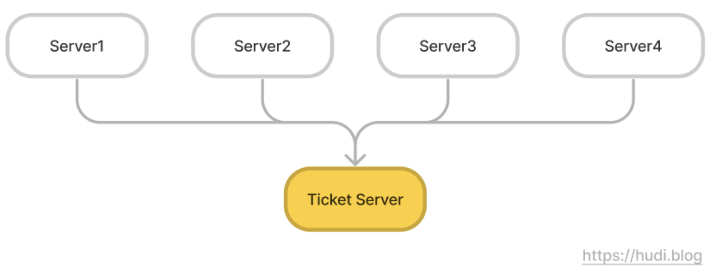
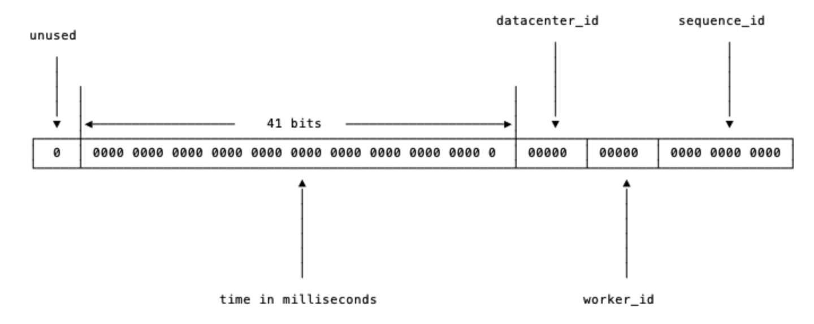

## 문제 이해 및 설계 범위 확정

이번 챕터에서는 분산 시스템에서 유일한 ID를 생성하는 방법에 대해 공부해본다. 요구사항을 정리하면 아래와 같다.

- ID는 유일해야한다.
- ID는 숫자로만 구성되어야 한다.
- ID는 64비트로 표현될 수 있는 값이어야 한다.
- ID는 발급 날짜에 따라 정렬 가능해야 한다.
- 초당 10,000개의 ID를 만들 수 있어야 한다.

## 설계안1 - 다중 마스터 복제

다중 데이터베이스 서버 환경에서 Auto Increment를 사용하는 방법이다. 단, Auto Increment의 증가량이 1이 아니라 k인 점이 일반적인 방식과 차이가 있다. k는 총 데이터베이스 서버 대수이다.

예를 들어 데이터베이스가 총 3개가 있다고 가정해보자. 1번 데이터베이스는 id값이 1, 4, 7, 10, … 으로, 2번 데이터베이스는 2, 5, 8, 11, … 으로, 3번 데이터베이스는 3, 6, 9, 12, … 처럼 증가하도록 설정하면 된다.

이 방법은 다중 시스템에서 유일한 ID를 생성할 수 있으며, 데이터베이스 수를 늘려 초당 생성할 수 있는 ID의 수를 늘릴 수 있다. 하지만, 아래의 단점이 존재한다.

첫번째로는 **확장성이다**. 데이터베이스 수가 늘거나 줄게되면 중간에 k값이 변경되는데, 이에 대응하는것이 어렵다. 이미 과거의 k값을 기준으로 생성된 ID와 중간부터 생성될 ID를 생각하면 확장성이 쉽지 않아 보인다. 이런 특징으로 여러 데이터 센터에 걸쳐 규모를 확장하기 어려울 것이다. 즉, 데이터베이스의 수가 끝까지 최초 k로 고정된 상황에서 쓰기 적합해보이는데, 이런 상황이 얼마나 있을까 싶다.

두번째로는 **시간 흐름에 맞게 커짐을 보장하지 않는다**는 점이다. 요구사항 중 ‘ID는 발급 날짜에 따라 정렬 가능해야 한다’가 있었다. 그런데, 이와 같은 구조에서는 2번 ID가 1번 ID보다 먼저 생성될 수 있다. 1번 데이터베이스보다 2번 데이터베이스에서 먼저 요청이 실행되면 발생하는 문제이다. 즉, ID가 시간적 순서를 보장하지 않고 이는 요구사항 위반이다.

## 설계안2 - UUID

UUID는 정보를 유일하게 식별하기 위해 사용되는 128 bit 짜리 16진수이다. UUID는 `e3703079-d624-42d4-a07d-0de2677d3758` 이렇게 생겼다. UUID는 중복 가능성이 있지만, 100년 동안 초당 10억 개의 ID를 생성해내면 충돌할 가능성이 50%가 된다고 한다. 사실상 충돌하지 않는다는 의미이다.

UUID를 유일 키로 사용하면 어떨까? 서버간 조율 과정도 필요 없으므로 동기화가 필요 없고, 따라서 규모 확장성이 높다. 그냥 필요할 때 생성하면 되는거니까.

다만, ID가 128비트로 길다. 요구사항은 64비트이다. 또한 숫자로만 구성되어 있지 않으며, 발급 날짜에 따라 정렬 가능하지 않다. 따라서 당면한 문제를 해결할 수 없다. 반면 이와 같은 제약사항이 없다면 확장성 측면에서 괜찮은 선택지라는 개인적인 생각이 든다.

## 설계안3 - 티켓 서버

아예 유일한 키를 생성하는 서버를 별도로 분리하는건 어떨까? 플리커(Flickr)가 분산 기본 키(distributed primary key)를 생성하기 위해서 이 방법을 사용했다고 한다.

웹 서버 여러개가 Auto Increment 로 ID를 생성하는 티켓 서버를 **중앙 집중형으로 하나만 사용**하는 것이다. 이 방법은 유일성이 보장되고, 숫자로만 구성된, 64비트로 표현가능한, 발급 날짜에 따라 정렬 가능한 ID를 생성할 수 있다. 성능만 갖춰진다면 초당 10,000개의 ID를 생성하도록 할 수 있을것이다. 구현도 무척 쉬울것이다.

하지만, 여기에는 치명적 단점이 있다. 아까 ‘티켓 서버를 중앙 집중형으로 하나만’ 이라고 이야기했다. 이말은 즉슨, **티켓 서버 자체가 SPOF(Single Point of Failure, 단일 장애점)이 되는 것**이다. 티켓 서버 하나가 장애나면 모든 서비스를 이용할 수 없게 된다. 이걸 해결한다고 **티켓 서버를 다중화**해버리면, 당초 해결하고자 했던 **동기화 이슈가 다시 발생**한다.

따라서 티켓 서버 방식은 중소 규모 어플리케이션에서 적합하다. 

## 설계안4 - 트위터 스노우플레이크 접근법

지금까지 살펴본 모든 방법은 당초 요구사항을 모두 해결하지 못한다. 트위터는 이 문제를 스노우플레이크라고 부르는 독자적인 ID 생성 기법을 만들어 해결했다.

ID는 총 5개의 절(section)으로 나뉜다. 절 순서대로 간략히 설명해보자면 아래와 같다.

1. **사인(sign) 비트**: 1비트를 할당한다. 현재 사용되지 않는다. 나중을 위해 확보해둔 비트로, 음수/양수를 구분하는데 사용할 수 있다.
2. **타임스탬프(timestamp)**: 41비트를 할당한다. Epoch Time 이후로 몇 밀리세컨드가 경과했는지 나타낸다. 41비트이므로 최대 69년(2^41 ms)의 시간을 표현할 수 있다. 일반적으로 Epoch Time은 1970년 01월 01일 00시 00분 00초겠지만, 더 오래 이 ID 체계를 사용하기 위해 트위터는 Epoch Time으로 트위터 기원시각(297,616,116,568)으로 보정하여 사용한다고 한다. 
3. **데이터센터 ID**: 5비트를 할당한다. 2^5, 즉 32개의 데이터 센터를 사용할 수 있다.
4. **서버 ID**: 5비트를 할당한다. 2^5, 즉 데이터센터별 32개의 서버를 사용할 수 있다.
5. **일련번호**: 12비트를 할당한다. 각 서버는 ID를 생성할 때 마다 이 일련번호를 1씩 증가시킨다. 이 값은 1ms가 경과할 때 마다 0으로 초기화 된다.

ID에 타임 스탬프 값을 넣어두기 때문에 시간순으로 정렬이 가능하다. 또한 데이터 센터 ID와 서버 ID를 사용하여 서로 다른 서버에서 같은 시각에 생성한 ID라고 하더라도 충돌이 발생하지 않는다. 또한 내부적으로 일련번호를 사용하여 같은 서버에서 생성한 ID도 충돌이 발생하지 않는다. 이 과정은 서버간 동기화가 필요 없으므로, 확장에 유리하다. ID 전체 길이도 딱 64비트라서 모든 요구사항을 만족한다.

## 더 학습해볼 키워드

- 시계 동기화

## 마치며

지금까지 나는 데이터베이스의 유일 키를 생성하기 위해 생각 없이 Auto Increment를 활용했다. 그런데 대용량 트래픽을 견디기 위한 분산 환경에서는 유일한 키를 생성하는 과정 조차 깊은 고민이 필요하단 사실에 놀랐다. 분산환경은 정말 만만하지 않구나라는 생각을 하며 읽게된 것 같다. 

## 참고

- 가상 면접 사례로 배우는 대규모 시스테 설계 기초, 알렉스 쉬
