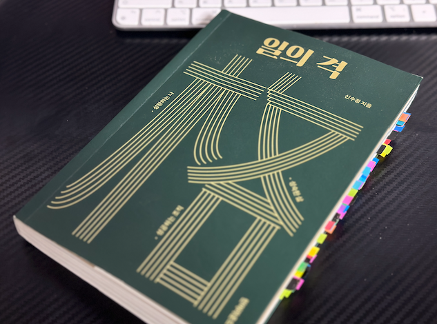

책 ‘일의 격’은 KT 엔터프라이즈 부문장 신수정의 책이다. 정확히는 ‘일의 격’은 저자가 [**저자의 페이스북**](https://www.facebook.com/shinsoojungceo)에 꾸준히 올리는 일과 삶에 대한 글을 책으로 엮어 만든 것이다. 직전에 포스팅한 '프로그래머의 길, 멘토에게 묻다'와 마찬가지로 몇 달전에 읽은 책이지만 지금 올린다.

사람은 어떻게 성장하는지, 조직을 어떻게 이끌어야 하는지, 어떤 삶의 태도를 가져야 하는지에 관하여 독자의 통찰이 담겨져있다. 통찰력있고 능력있는 상사와 매일 점심 식사를 같이 하게 되면 들을 법한 좋은 이야기들이 많이 담겨 있다고 생각한다.

모든 내용을 포스트에 담기는 어렵고, 내가 좋다고 생각했던 부분을 간단하게 정리해본다. 정리한 것 중 특히나 더 좋은 것들은 \* 로 표시한다.

## 1장 - 성장

### 보통 사람의 성공 비결은 과연 무엇일까? \*

- 2,000명의 유명한 과학자와 발명가의 업적을 조사한 결과, 나이와 무관하게 **다작**을 내는 시기에 가장 성공 가능성이 높은 결과물이 나온다는 것이 밝혀짐
- 앨버트 라슬로 바라바시는 그의 책 ‘성공의 공식 포뮬러’에서 $S=rQ$ (S = 성공, r = 아이디어의 가치, 능력, Q = 많은 시도, 집요함) 이라는 성공 공식을 제시한다. 즉, **r이 낮더라도, Q를 높이면 뭔가 얻어걸려 성공할 가능성이 높아진다**.
- 그러므로 천재가 아닌 우리 같은 보통 사람들의 성공 비결은 단순하다. **나이가 먹어도 꾸준히 실행**하는 것이다.
- 집요하게 꾸준히 하면 운이 올 가능성이 높아진다. **운은 끊임없는 시도와 꾸준함에**서 나온다.

### 성공의 가장 큰 적은 실패가 아닌 지루함 \*

- 책 ‘아주 작은 습관의 힘’ 작가가 유명 코치에게 “뛰어난 선수와 보통 선수의 차이는 무엇인가요?” 라고 물었다. 작가는 능력, 운과 같은 답을 기대했지만, 돌아온 답은 **‘지루함을 견디는 것’** 이다.
- 아마추어는 기분 좋을 때만 훈련한다. 보통 선수는 매일 훈련하지만 지루할 때면 대충 한다. 그러나 **뛰어난 선수는 상관없이 훈련**한다.
- 책 ‘신경 끄기의 기술’ 에서는 “목표는 멋지지만 목표로 가는 길에는 똥 덩어리가 가득하다. 지루한 길이다. 성공을 결정하는 질문은 ‘나는 무엇을 하고 싶은가?’가 아니라, **‘그 과정에서 오는 고통을 견딜 수 있는가?’** 이다.”
- 지루함을 견디는 방법은 ‘동일한 일을 그대로 반복하는 것이 아니라 **조금씩 목표를 올려 도전함으로써 즐거움을 만드는 것**’. 그리고 ‘이 과정을 **습관화하여 자동으로 행동**하게 만드는 것’.

### 연봉을 더 받으려면? \*

- **개인의 연봉 = f(자신이 만드는 가치, 희소성)**
- ‘자신이 만드는(또는 기여하는) 가치’란 자신이 일함으로써 **회사가 얼마나 이익을 창출**할 수 있는가이다. 이는 개인의 능력만으로 결정되는 것은 아니고 회사의 수익 시스템과 결합하여 결정된다. 즉, 수익모델이 좋은 기업은 동일한 가치를 만드는 개인에게 비교적 더 많은 연봉을 줄 수 있다.
- 연봉을 많이 받기 위한 규칙은 아래와 같다.
- **법칙1 : 가능한 자신을 통해 만들 수 있는 가치가 큰 기업으로 가야한다.**
  - 똑같은 능력의 사람으로 5천만원 밖에 못 만드는 회사도 있고 10억을 만드는 회사도 있다.
  - 단, 지금 큰 가치를 만드는 회사가 미래에도 계속 그러리라는 보장은 없다.
- **법칙2 : 대체하기 어려운 희소성을 확보한다.**
  - 내가 만들어 내는 가치가 ‘나’만이 만들어낼 수 있는지, 다른 사람이 내 자리에 있어도 만들어낼 수 있는지, 그 다른 사람들이 희소한지에 초점을 두어야 한다.
  - 오히려 작은 기업에 다닐 때 대체 가능한 사람이 주위에 더 없을 수 있다. 따라서 무조건 큰 기업에 가는 것이 나은 선택은 아닐 수 있다.

### 하버드생보다 더 뛰어난 성과를 올리는 방법 \*

- **한 분야의 오랜 학습**은 이것저것 잘하는 천재를 이긴다. **조금 덜 똑똑해도 한 분야를 끈질기게 오래 한 사람은 자신의 분야에 획을 그을 수 있다**.
- 스스로 머리가 부족하다고 여길수록 **한 분야를 파라**. **미친 듯이 오랜 기간 파라**. 그러면 이것저것 관심 많고 인기 분야만 쫒아다니는 수재, 천재, 고학력자를 이길 수 있다. 세상은 알량한 머리와 학벌을 자랑하는 이들에 의해 바뀌는 게 아니다. 우직하고 호기심 있는 이들의 꾸준하고 피땀어린 노력에 의해 바뀐다.

> 💬 사람들을 만나다보면, 가끔 그들의 천재성에 벽을 느끼는 경우가 많다. 그들과 가까워지는 유일한 방법은 우직한 노력이다.

### 커리어의 80%는 예기치 않은 우연으로 결정된다

- 인생은 구체적인 계획대로 돌아가지 않지만 북극성과 목적지는 명확히 정할 필요가 있다. 내가 어떤 미션이 있는가? 내가 이루려는 목표는 무엇인가? 를 정해야 한다. 단지, 그 미션과 목표를 이루어 가는 길은 우연이 개입하고 예측하기 어렵다는 것을 인정한다. 시행착오도 있을 수 있고 힘든 축적의 시기도 있다. 계획보다 느릴 수도 있다. 그러나 삶의 뜻이 분명하다면 그 과정을 인내하거나 나아가 즐길 수도 있다.
- 계획을 세워야 한다. 계획 자체가 중요한 것이 아니라, **계획을 세우는 과정**이 중요하다. 계획을 세우려 하면 생각을 하게 되고, 그것을 정리하고 가시화 하는 과정을 거친다. 그것이 계획만큼, 아니 계획보다 더 중요하다. 계획을 이루어나가려는 노력은 하라. 그러나 계획대로 안될 수도 있다는 사실을 인정한다.
- 계획된 우연: 행운은 그냥 오는게 아니라 행운을 부르는 5가지 요소가 작동한다. 5가지 요인은 ‘호기심, 낙관성, 끈기, 융통성, 위험 감수’ 이다.
- 삶은 ‘**새옹지마**’의 교훈이 작동한다. 처음 세웠던 계획이 망가졌지만, 그보다 더 나은 기회가 오기도 한다. 계획대로 잘 되었다고 너무 기뻐할 필요도 없다. 그게 그리 좋은 것은 아니었음을 이후 발견되기도 한다.

### 어려움과 고민이 들 때 답을 찾는 질문

- 스스로 답을 찾을 수 있는 5가지 질문
  1. 내가 얻고 싶은 결과는? (원하는 것)
  2. 나는 왜 그것을 얻고 싶은가? (목적)
  3. 어떻게 하면 그것을 실현시킬 수 있는가? (실현 전략)
  4. 그것은 내 미래에 어떤 의미가 있을까? (의미)
  5. 지금 내가 할 일은? (행동)

### 피하는 쪽이 아니라 향하는 쪽으로 생각하라

- 원하는 모습을 추구하다보면 문제들은 자연스럽게 해결될 때가 많다.
- “무엇인가를 하지 않겠다는 결심을 마음에 새기는 것은 불가능하다”
- “나는 왜 돈이 부족할까?”, “나는 왜 실력이 부족할까?”, “나는 왜 나쁜 습관에 빠져있을까?” 등에 집중하다 보면 항상 돈이 부족한 채 실력이 부족한 채 그 습관에 빠져있는 채 살게 된다는 것이다. 코끼리를 생각에서 없애려 하지 말고, 대신에 강아지를 생각하자.
- 중요한 것은 원하지 않는 것을 없애려는 데 에너지를 쏟기보다는 원하는 것에 에너지를 쓰는 것이 더 낫다. 내가 직장에서 어떤 모습을 만들까? 어떤 회사를 만들까? 어떤 사람이 될까? 돈을 많이 벌어 뭐할까? 에 집중하고 이를 위해 무엇을 할까? 를 실행하는 것이다.
- “피하려고 생각하기보다는 향해서 나아가려고 생각하라”
- 자신의 부족함을 극복하기 위해 애쓰려는 노력을 원하는 형상이나 이미지를 만들고 이를 성취하는데 쓰라.

### 집중력과 의지력의 명과 암

- 어떤 것에 에너지를 과하게 쓰는 사람은 항상 그 이면이 있다.
- 가난한 사람이 계속 가난한 상태를 유지하는 이유 중 하나는 현재 빈곤 해결에 에너지를 다 쏟아버리기 때문에, 조금 더 멀리 보는데 에너지를 쓸 여유가 없기 때문이라고 한다.
- 밖에서는 유명하고 화려한 사람이 막상 집에서는 아무 대화도 없이 무기력하게 퍼져있고, 집에서 아무런 통제력을 발휘하지 못하고, 아이와 놀아주는 것등 소소한 일상을 즐거움으로 여기지 못한다. 에너지를 한 쪽에 너무 써서 다른 쪽에 집중력이나 의지력을 발휘할 여지가 없기 때문이기도 하다.
- 그러므로 너무 한쪽에 모든 에너지를 써버리거나 매사에 과도한 열정과 의지력을 써버리는 것도 위험하다. **조금 남겨두어야 개인의 삶이나 진짜 원하는 꿈을 위해서도 쓸 수 있다**. 일주일에 하루 정도는 눈앞에 일에서 벗어나 소소함을 누리거나 조금 먼 시각, 장기적인 시각에서 자신의 일과 삶을 돌이켜 볼 필요도 있다.

### 과연 연주를 가장 잘 하는 연주자가 최고의 성공을 할까?

- 런던의 한 연구팀은 클래식 경연 대회 결선에 오른 세 사람들 중 누가 우승할지 세 집단에 맞추게 하였다. 한 집단에는 소리만, 또 다른 한 집단에는 연주 모습과 소리를 함께, 또 한 집단은 소리는 끈 채 연주 모습만 보여주었다. 흥미롭게도 우승자를 가장 높은 확률로 맞춘 집단은, 소리는 끈 채 연주 모습만 보여준 집단이었다.
- 실력이란 콘텐츠에만 있지 않다. 인간의 인식이란 그런 것이다. 그러므로 보이는 것도 매우 중요하다. 특히 실력이 비슷하다면 보이는 것이 성공의 차이를 결정한다.

### 테레사 수녀가 비행기 1등석을 탄 이유

- 자신이 원하고 필요한 사람들이 있는 공간에 자신을 던져라. 배울만한 분들, 도움받을 수 있는 분들에게 말을 건네고 그들과 함께하는 기회를 놓치지 마라.
- 용기 있게 하되 예의가 바르기만 하면 통하지 않는 경우는 별로 없다. 성공한 인격자일수록 기꺼이 타인을 돕는 것을 즐겨 하기 때문이다.

### 글로 쓰면 다룰 수 있다 \*

- 똑똑해보이는 사람들의 말을 글로 기록해보면, 흥미롭게도 비합리적인 인식과 믿음이 적지 않았다.
- **생각을 글로 명료화 한다면, 그 생각을 다룰 수 있게 된다.**
- 글을 명료화하지 않으면 다루기 어렵다. 생각이란 실체가 없어 여기를 잡으면 저기로가고 저기를 잡으면 여기로 온다. 게다가 감정까지 복합되면 아무리 똑똑한 사람도 이를 다룬다는 것은 거의 불가능하다.
- 일할 때, 보고서, 논문 쓸 때 뿐 아니라 자기 삶에서도 글을 써보면 좋겠다.
- 너무 잘 쓰려 하지말고 내 감정, 생각을 2~3줄로 ‘명명’ 하거나 ‘명료화’ 하는 정도로 충분하다.

> 💬 이 글을 읽고 나서는, 복잡한 문제를 해결하기 위해 거의 항상 글을 쓰면서 생각을 정리하게 되었다.

### 강렬한 호기심, 그리고 지속하는 힘이 천재를 이긴다 \*

- 세상의 획을 긋는 성취는 알량한 ‘머리’와 ‘효율’에서 나오는 게 아니라 우직한 ‘엉덩이’에서 나온다. 특정 분야에 대한 강렬한 관심, 강한 흥미, 인내와 끈기에서 나온다.
- **강렬한 이끌림이 있는 분야에 우직하게 몰두하는 ‘지속하는 힘’이 천재를 이긴다.**

### 효과적으로 배우는 방법은 비효율적으로 배우는 것이다

- 수동적인 독서, 강의는 편하지만 한계가 분명하다.
- 실제 삶의 변화가 이뤄지려면 뇌에 새겨져야 한다. 뇌에 새겨지려면, 스스로 몸과 머리를 쓰고 기록하고 실습하고 연습하고 자기가 이를 말로 이야기해봐야한다. 그것도 반복해서 해야 한다.
- 이러기 위해서는 2가지 허들, ‘귀찮음’, ‘지루함’ 그리고 ‘돈과 시간의 낭비’ (책을 사서 혼자 하는 것 보다, 이를 수행하기 위한 과정에 참석하는 것 등) 를 넘어야 한다.

### ‘처음부터 제대로’가 ‘민첩함’의 발목을 잡는다 \*

- 많은 기업들이 무언가를 하는데 조심스러워하고, 한번 하면 ‘제대로’, ‘실수 없이’, ‘실패 안 되게’, ‘예상 가능한 모든 기능을 반영해서’, ‘반드시 성공해야 한다’라는 의식이 강함을 발견한다. 이는 애자일 방식에 익숙하지 않은 기업들의 특징이다.
- 개인도 유사하다. 어떤 사람들은 ‘처음부터 제대로’할 것이 아니라면 아예 실행하지 않는다. ‘실수’하거나 ‘실패’하려 하지 않는다. 특히, 지금까지 좋은 경력과 브랜드를 쌓아왔을수록, 성공과 인정의 욕구가 강할수록 더더욱 그러하다.
- 그러나, **일단 작게 실험해보고 피드백을 받으며 발전시켜가는 것이 훨씬 효과적이고 효율적**이다. 더더욱 변화가 빠르고 예측이 어려운 이 세상에서 말이다.

> 💬 예전에 친구가 ‘애자일은 삶의 방식’ 이라고 이야기 했던게 기억난다. 당시에는 이해가지 않았는데, 요즘은 이 말이 이해가 간다.

### ‘짧게라도 여러 번’ 전략

- 연구자들은 1시간 X 2번 보다 10분 X 7번이 효과가 더 크다고 한다. 핵심은 ‘짧게라도 여러 번’ 이다.
- 여러번 하려면 어떻게 해야할까? 만만해야 한다. 일로 느껴지거나 지치면 백전백패이다.
- ‘시간이 아니라 횟수’, 이 전략은 ‘성장’ 뿐 아니라 ‘행복’의 법칙이기도 하다. 어쩌다 한 번 하는 긴 시간의 좋은 경험보다 짧은 여러 번의 경험이 삶을 더 풍요롭게 한다고 하니.

### 낮은 수준의 생각 전략

- 중요하지만 하기 싫은 일이 있을 때, 높은 수준의 생각을 써야 하는 것이 귀찮고 힘들 때, 단순한 일을 하고 낮은 수준의 생각을 함으로써 스트레스를 줄이고 자기 합리화를 하는 것을 ‘낮은 수준의 생각 전략’ 이라고 한다.
- 영어 실력을 높이기 위해, 영어를 효과적으로 공부하는 법에 대한 책을 읽는 것 보다, 외국 친구 모임에 나가서 수다를 떠는 것이 더 효과가 좋다.
- 자신이 바쁘다면 스스로에게 물어볼 필요가 있다. **내가 진짜 중요한 일에 바쁜가? 아니면 그것을 회피하기 위한 쉬운 일을 하면서 이게 그 중요한 일에 도움될 거야라고 스스로를 합리화하고 있는 것은 아닌가?**

> 💬 쉽고 그럴듯 해보이고 마치고나면 뿌듯하지만, 곰곰히 생각해보면 큰 의미 없는 일을 하고 있지 않는가?

### 전략적 무능

- ‘전략적 무능’. 우리가 모든 것에 유능해지려고 애쓸 필요가 없다는 뜻이다. 모든 것을 제대로 하고, 모든 것을 잘 하려 하면 바쁘고 에너지가 한없이 든다. 그러므로 때로 어떤 것들에는 ‘무능’해질 필요가 있다는 것이다. 가장 가치 있고 중요한 일에 초점을 맞추고 나머지는 전략적으로 대충 해도 된다는 것이다.
- 이런 식으로 몇 가지 영역에서 ‘무능’을 선택하면 의외로 시간이 많이 남는다. 그 시간에 자기가 원하고 필요한 것을 하면 된다.
- **모든 것에 ‘유능’하기는 어렵다**. 물론 특정 시기는 절대적으로 바쁠 수 밖에 없다. 그러나 계속 그렇게 살 수는 없다. 매우 바쁘게 살고 이를 좀 변화하고 싶은 분이라면 한 번쯤 거절하고 쳐낼 것, 좀 무능할 영역을 찾아보시라. 그거 안 한다고 죽지도 않고 큰일 나지도 않는다.

### ‘그때 그걸 했어야 했는데’를 지금 하라 \*

- 인생은 ‘워터폴(waterfall)’이 아니라 ‘**이터레이션(iteration)**’이다. 실수도 하고 오판도 한다. 여기서 레슨을 받아 다시 하면 된다.
- 불가능한 일이 아니라면 ‘그때 그걸 했어야 했는데’ 를 지금 하면 된다. 그런데 왜 이렇게 하기 어려울까? ‘용기’가 부족하기 때문이다. 용먹을 용기, 과거 잘못된 판단을 시인할 용기, 자존심을 꺾을 용기, 미움받을 용기…
- 그러므로 **진짜 똑똑한 사람은 IQ가 좋고 좋은 학벌과 스펙을 쌓은 사람이 아니라 ‘용기 있는 사람’**이다. 어중간하게 똑똑한 사람은 후회를 하고 평론을 하지만, **진짜 똑똑한 사람은 사과를 하고 변화를 만든다**.

> 💬 인생은 애자일

### 제대로 망치를 두드려라

- 열심히 땀을 뻘뻘 흘리며 일하는 게 중요한 것이 아니다. 열심히 일하는데 아무 곳이나 망치를 두드리면 오히려 상황을 악화시킨다.
- 프로, 전문직이나 기업과 사회의 리더들은 ‘열심’이나 ‘노력’으로 박수를 받는 것이 아니다. **‘유능함’으로 박수**를 받아야한다. **끝없는 훈련과 개발, 경험으로 역량을 쌓아 문제의 본질을 찾아 해결**해야 박수를 받는 것이다.

> 💬 열심히 하는게 중요한게 아니다. 잘 하는게 중요하다. 프로니까.

### 피드백을 회피하지 말자

- **‘피드백’**이 없으면 절대 발전이 없다.
- 천재가 아닌 이상 혼자의 방식대로 바둑을 둬서는 제대로 배우고 피드백 받은 사람들을 이길 수 없다.
- 마찬가지로 일을 하거나 사업을 할 때, 훌륭한 코치를 찾아 제대로 된 피드백을 받아 성장하는 것이 효과적으로 효율적인 길임이 분명하다.
- 그러니 누구든지 좋은 코치를 찾아야 하고, ‘피드백’을 받는 것을 회피하거나 두려워하지 말자.

### ‘즐긴다’는 말의 허상

- **의도적인 훈련이란 즐기기 쉽지 않다**. 훈련자의 육체적, 정신적 자원을 모조리 투입해야 하기 때문이다. 훈련과정을 즐긴다면 그것은 의도적인 훈련이라 할 수 없다.
- 1만 시간의 법칙은 오도된다. 중요한 것은 연습을 얼마나 했는가가 아니라 의도적인 연습을 얼마나 했는가이고 세계 최고 수준이 되려면 **반복되고 지루한 의도적 훈련**을 필수적으로 거쳐야 한다. 즐거울 수 없다.

### 편도체 바로 옆을 까치발로 살금살금 지나가라 \*

- 인간의 뇌는 ‘변화’를 싫어한다. 인간의 뇌는 변화를 위협으로 인식하고, 이에 뇌의 부위인 편도체를 깨운다.
- 그럼 성공적으로 변화하는 방법은 무엇인가? 편도체가 눈치채지 못하게 해버리는 것이다. 즉, 한번에 확 하려고 하지 말고 조금씩 하라는 것이다.
- **결심은 좋으나 처음부터 무리하지 마라**. 그리고 가능한 혼자 하지마라. 같이 하는 사람과 함께하되 작게 출발하라. 처음부터 절대 무리하고 힘 다 빼지 마라.
- 편도체가 눈치채지 못하게, **“Aim high, but start small”**

### 45세 때부터였다

- **논리적이고 체계적으로 생각하는 가장 좋은 방법은, 생각을 글로 쓰는 것과 그림으로 그리는 것**
- 글로 쓰거나 그림으로 그리면, **생각을 더욱 정교화할 수 있고, 다룰 수 있게 된다.**
- 잘 쓰려, 길게 쓰려 하지 말고, 그냥 쓰고, **정기적으로 쓰는 것이 중요하다.**

## 2장 - 성공

> 💬 2장은 주로 조직, 리더 등에 대한 이야기가 나온다. 지금은 실무 능력을 키워가는데 바쁜 단계라서 그런가, 아직 2장의 여러 내용들에 공감하기는 어려웠다.

### 리더는 체스 플레이어가 아니라 정원사다

- 저자가 직장생활을 돌이켜보니 존경할만한 리더들은 모두 정원사 같은 리더였다.
- 정원사 같은 리더란, 사사건건 참견하고 지시하는 리더가 아니라, 내가 일을 잘 할 수 있도록 편안한 환경을 만들어 주는 리더.
- 반면 만나고 싶지 않은 리더는 나를 체스판의 말로 여겼던 리더. 간섭하고, 통제하려 하고, 자신의 이익이 될때만 친절하게 대하면서, 책임을 미루려는 리더.

### 왜 훌륭한 목표와 전략이 실행에서 실패할까? \*

- 연구결과 목표와 전략이 실행 단계에서 실패하는 4가지 근본 원인이 밝혀졌다.
  1. 85%의 응답자는 **조직의 목표**를 몰랐다.
  2. 85%의 응답자는 조직의 목표를 이루기 위해 **자신이나 자신의 조직이 할 일**을 명확히 몰랐다.
  3. 87%의 응답자는 **회사가 가장 중요해 하는 목표와 관련해서 성공하는지 실패하는지** 몰랐다.
  4. 79%는 목표 진행에 있어 **자신의 명확한 책임**을 몰랐다.

> 💬 나는 회사와 얼라인 되어 있는가? 나는 나무가 아닌 숲을 보고 있는가? 내가 어떤 일을 해야 조직에 임팩트를 낼 수 있을까? 이런것들을 생각하면서 일해야지 올바른 우선순위가 나올 것 같다. 시야를 넓혀야한다.

### 철학, 핵심가치에 대하여

- 핵심가치는 매우 중요한데 미션보다 더 내재화하기 어렵다.
- 핵심가치는 그걸 무시하고 돈 벌 다른 기회가 있을 때도 이것 대신 선택할 배짱이 있어야하는 가치이다. 의사결정의 우선순위다.
- 만일 신뢰가 핵심가치라면, 고객의 신뢰를 좀 저버리고 돈 벌 기회가 있더라도 이 기회를 포기할 정도가 되어야 한다.
- 아마존의 제프 베조스가 “더 나은 방안이 있으면 언제든 카멜레온처럼 바꾸라”고 했지만, 이는 핵심가치가 아니라 방법, 전략, 비즈니스 모델을 의미한다.
- 이 철학은 가치-인재상-브랜드-기업문화와 다 연결되어 있다.
- 아마존이나 애플이나 구글이 대단한 이유는 기술에도 있지만 자신들의 가치를 악착같이 지켜왔기 때문이다.

### 최고의 실행이 안먹히는 이유 \*

- 우리가 책에서 본 최고의 실행을 도입할 때 주의할 것 중 하나는 **Context**를 놓치면 안된다는 것이다.
- 책이나 강연에는 Context 가 없다. 저자들이나 강연자들 또한 다른 회사의 사정을 알 리가 없다.
- 예를 들어, 대부분의 실리콘밸리 기업이 자율을 추구할 수 있는 이유는 구성원들의 역량이 있기 때문이다.

> 💬 이건 경영과 조직관리 뿐 아니라, 기술에서도 적용되는 이야기인 듯 하다. 다른 조직에서의 Best practice 가, 우리 조직에서는 먹히지 않을 수 있다. 맥락을 항상 생각해야한다.

### Learn it all은 Know it all을 이긴다 \*

- **“Learn it all은 Know it all을 이긴다”.** 이 말은 MS 회장 사티아 나델라가 한 말이다. **아는체 하지 말고 겸손하게 모른다는 것을 인정**하고, **매일이 새로운 날이 되도록 탐구하고 실험**하라는 것이다.
- 불행히도 직장인들의 80%는 10년간 새로운 것들을 거의 배우지 않는다고 한다.
- 회사를 다닌 기간, **경력이 중요한 것이 아니다**. **중요한 것은 얼마나 배우고 성장**했는가이다.
- **모르는 것을 인정하고 끊임없이 배움을 추구하는 사람**은, 자신은 이미 모든 것을 알고 있다고 착각하는 사람을 이긴다.

### 우리가 진실이라고 받아들이는 가정이 때로 우리를 한계 짓는다 \*

- 한 영역에서 오래 일한 분들은 그 업무를 매우 잘 이해하고 전문성이 있음에 틀림 없다. 그런데 흥미롭게도 이들 대부분은 더 큰 애벌레가 되는 변화는 훌륭하게 해내지만, 애벌레가 나비가 되는 변신을 생각하는 데 있어서는 매우 힘들어한다. 왜 그럴까?
  1. 첫째, 기존의 가정을 고수하고 있다. 어느 업무나 **‘이래야 한다’는 가정**이 있다. 그 가정하에 오래 일하다 보면 어느새 그 가정은 절대 깨어질 수 없는 ‘법칙’이 된다. **이에 그 가정을 넘어서는 생각을 하지 못한다**.
  2. 둘째, **‘비효율의 숙달화’**이다. 불편하고 비효율적인 일도 자꾸 하다 보면 숙달되어 편해진다. 편해지면 그게 바꾸어야 할 것이라는 것을 못 느낀다.
- 해결 방법은 무엇일까?
  1. 경험자들은 자신의 눈에 ‘맹점’이 있을 수 있다는 것을 인정해야 하고 (겸손), 자신이 고수하고 있는 가정이 무엇일지 생각해 본다.
  2. 고객, 외부에서 온 직원, 신입 직원, 외부인들의 관점을 무시하지 말고 들을 필요가 있다. (물론 이들 이야기의 상당 부분은 비현실적이고 엉뚱한 이야기 일 수도 있다)
  3. 자신과 다른 업종의 혁신을 참고하고, 새로운 관점을 얻기 위해 책을 읽고 공부하라.

> 💬 Question Every Assumption. 단순하면서 어려운 말이다. 모든 기본 가정에 의문을 제기하기 위해서는 용기가 필요하다. 나는 아직 용기가 부족하다. 사색하면서 일해야한다. 당연한건 당연한게 아닐 수도 있다. Fresh eye 의 이야기를 경청하고, 내가 Fresh eye 라면 용기있게 발언하자.

### 비효율의 숙달화 \*

- 일터에서 벌어지는 최악의 상황 중 하나는 **‘비효율의 숙달화’** 이다. 비효율적인 방식이지만, 시간이 지나면서 숙달되고, 나중에는 **비효율적이라는 사실을 잊는다**. 그러면서 **자신은 하루 고생하면서 열심히 일했다고 생각**한다.
- 항상 스스로에게 물어보자. 우리는 ‘비효율을 숙달해서 혁신의 필요성을 잃어버린 것 아닌가?’, ‘고객과 외부자가 볼 때는 말도 안되는 비효율을 우리는 너무도 자연스럽게 받아들이는 것은 아닌가?’, ‘우리는 나비가 아닌 더 나은 애벌레가 되려 하는 것은 아닌가?’

### 모르는 걸 모른다고 말할 용기 \*

- 마이크로소프트 전 CEO 스티브 발머는, 회사 내에서 직원들을 경쟁시켜 진짜 천재를 찾아내고자 했다. 실패하면 그는 천재가 아니라고 간주하여 낮은 평가를 주거나 해고했다.
- 그러자 **천재들은 실패하지도 않고 누구에게 묻지도 않으며, 정보를 공유하지도 않았다. 다들 아는체만 했다.** 실패하거나 모르면 평가 절하되기 때문이다. 그리고 목표를 낮게 설정했다. 높게 했다가 실패하면 멍청이라고 비난 받기 때문이다.
- 그런데 새롭게 CEO로 부임한 사티아 나델라는 임원과 기술자들이 모인 회의에서 **“저는 이 기술을 몰라요. 설명을 해주세요”** 라고 말했다고 한다. “**모르는 것과 실패했다는 것은 멍청하다는 의미가 아닙니다.** **성장을 의미하는 것입니다.** 우리에겐 천재가 필요한 게 아니라 서로 협력하는 팀이 필요합니다”. 그러자 그동안 천재 흉내를 내었던 직원들은, 실패를 두려워하지 않고 높은 목표를 설정하고 정보를 오픈했다.

> 💬 나는 아직 모르는 걸 모른다고 말할 용기가 부족하다. 하지만 많이 나아지고 있다. 1년전의 나는 모두에게 실력이 출중한 개발자로 비춰져야했다. 하지만 지금은 많이 내려 놓았다. 이런 태도가 되려 내 성장을 막는 다는 것을 깨달았기 때문이다. 난 앞으로도 더 모르는 것을 모른다고 말할 것이다. 모르는 것을 부끄러워하는 대신, 천재인척 하면서 성장하려 하지 않는 마음가짐을 부끄러워 할 것이다.

### 리더가 상처받지 않고 직원 피드백 받는 법 \*

- 리더십 코치 골드스미스 박사는 ‘피드백’이 아닌 ‘피드포워드’를 하라고 한다. 피드백이 바꿀 수 없는 과거에 초점을 맞추는 것이라면, 피드포워드는 바꿀 수 있는 미래에 에너지를 집중하는 것이다.
- “내가 과거에 잘못한 것이 무엇인가요?”, “나의 문제가 무엇인가요?” 라고 묻는 대신 **“내가 ~부분을 잘하고 싶은데 좋은 방법이 없을까요?”** 라는 방식으로 질문하자. 전자는 피드백의 질문이라면, 후자는 피드포워드의 질문이다.

> 💬 (약간 딴소리) 이 이야기가 머리속에 강하게 남았는데, 출처는 기억이 나지 않았었다. 확실히 책에 어떤 내용이 있었는지 기억하지 못하는 것 같아도, 읽은 내용은 나도 모르게 나의 생각을 구성하게 되는 것 같다.

### 사람에게서 해결책을 찾으려 하지 마라 \*

- 교육도 중요하고, 인식 전환도 필요하지만, 사람을 중심으로 삼는 대책은 ‘지속 가능’하지 않다.
- 더 중요한 대책은 **사람들이 그런 행동을 자연스럽게 하지 않도록 유도하는 시스템**을 만드는 것이다.
- 예를 들면 실수를 최소화 하는 인터페이스, 보안 위반을 하지 않도록 하는 시스템 등이 지속 가능한 대책이라고 할 수 있다.

> 💬 책 ‘더 시스템’ 에도 나온 것 처럼, 사람의 유한한 의지력에 기대기 보다는 시스템을 구축하는 편이 더 낫다.

### 상대가 진짜 똑똑한지 허풍인지 구별하는 방법

- 아마존의 제프 베조스는 자신이 같이 일하고자 하는 ‘똑똑한 사람’의 기준을 다음과 같이 말한다. “가장 똑똑한 사람들은 끊임없이 자신의 이해를 수정한다. 그들은 이미 해결했던 문제들에 대해서도 다시 고려해본다. 그들은 기존 사고에 대항하는 새로운 관점, 정보, 생각, 모순, 도전 등에 대해 열려있다. 자신의 예전 생각이 잘못되었다면 언제든 바꾼다.”
- 자신의 의사결정을 바꾸는 것을 ‘자신이 틀렸고 패배했고 어리석었다’라는 것을 인정한다고 생각하면 안된다. 자신의 의견은 확고히 가지고 있되 가정과 사실이 바뀌면 과감히 변경하라는 것이다. 가정이 바뀌고, 사실이 바뀌고, 환경이 바뀌었는데도 일관성을 부르짖는 것은 만용일 뿐이다.
- 연구에 의하면 ‘지적 겸손(Intellectual humility)’을 가진 사람이 더 나은 의사결정을 한다고 한다. 지적 겸손도가 높은 사람들은 “Strong opinions, which are weakly held (느슨하게 쥔 강한 의사 표현)”의 자세를 갖는다고 한다. 자신의 의견을 분명히 가지고는 있지만, 그것에 집착하지 않는다는 것이다.

## 3장 - 성숙

> 💬 여기부터는 삶과 인생에 대한 이야기가 많이 나온다. 블로그 주제와 다소 거리감(?) 있지 않나 싶지만, 이왕 여기까지 정리해본 김에 3장도 내용이 좋은 것들은 간단히 옮겨 본다.

### 너무 일희일비할 필요가 없다

- 어떤 벌어진 사건에 너무 일희일비할 필요가 없다. 과거는 과거다.
- 나쁜 일이 벌어지면 좋은 일도 있으려니 하고 좋은 일이 벌어지면 감사하되 경계할 필요가 있다. 이것이 인생이다.

### 과제의 분리 \*

- 인간관계를 힘들어하는 분들에게서 발견하는 두 가지 특성이 있는데, 하나는 **‘과제의 분리’**를 잘 못하는 것이고, 또 하나는 ‘일어난일과 해석의 분리’를 잘 못하는 것이다.
- **심리학자 아들러의 주장 중 하나인 ‘과제의 분리’는 자신의 일과 타인의 일을 구분하라는 것이다.**
- ‘과제의 분리’를 하면, 다른 사람이 나에 대해 어떻게 생각하는지 그리 괘념하지 않게 된다. 나에 대해 어떻게 생각하는지는 그의 일이지 나의 일이 아니다. 그러나 그가 어떻게 나를 생각하고 대하는가에 따라 내 감정이 흔들리는가 아닌가는 나의 과제이다. ‘과제의 분리’를 하면, 내가 누군가를 돕거나 벽을 허무는 것, 용서하는 것은 나의 과제이지만 그것을 받아들이는 것은 그의 과제라는 것을 알게 된다.
- **나는 나의 과제를 하고 그는 그의 과제를 한다. 나는 타인의 과제에 끼어들지 않고 타인은 당신의 과제에 끼어들지 않게 한다.**

### 더 많이 행동하면 더 행복해진다

- 저자가 행복에 관한 책을 몇권 읽고 요약한 것:
  1. 유전적 요인이 50% 정도.
  2. 환경적 요인(새집 구매, 좋은 직장, 좋은 배우자, 승진 등)이 10% 정도. 생각보다 비중은 낮다.
  3. 나머지 40%는 매일매일의 습관이나 행동을 선택하는 방식. **‘스스로 의도한 행동’**을 함으로써 행복을 느낀다고 한다 (자기효능감?). 행동한 결과가 성공일 때 행복한 것이 아니라, 원하는 행동 자체를 한 것이 행복을 결정한다고 한다.

### 조금은 빈둥거려도 괜찮다

- 매시간 빈둥거린다면 문제가 있지만, 매 순간 100% 빡빡하게 사는 것도 위험하다.
- 20% 정도는 여유를 가지는 것이 좋을 듯 하다. 이래야 미래를 위한 고민도 하고, 가족과 책이나 자연을 즐기고, 비상 상황 시 백업으로 쓸 수 있다.
- 의외로 열심히 살면서도 무언가 여유가 있으면 잘못 살고 있는 듯 죄의식을 느끼는 과도하게 성실한 분들이 꽤 있다. 죄의식을 놓을 필요가 있다. 20%는 좀 빈둥거려도 된다.

### 그게 다다 \*

- 우리의 큰 실수 중 하나는 어떤 발생한 사건으로 그 사람의 인격이나 특성을 정형화하여 해석하는 것이다. 뭐 하나를 실수했을 뿐인데 ‘멍청하다’, ;칠칠치 못하다’, ‘바보 같다’의 정형화된 해석을 한다. 나를 환영하지 않는 상대의 어떤 하나의 행동에도 ‘그는 나를 싫어해’, ‘나는 사랑받을 존재가 아니야’ 등으로 일반화하기도 한다.
- **실수를 했으면 고치면 되고, 잘못을 하면 꾸중을 듣고, 성과가 안 나오면 교훈 삼아 다음에 잘하면 되고, 차였으면 다른 사람을 찾으면 된다**. 그게 다다.

### 동일한 일만 계속하면 인생이 통째로 사라진다

- 우리의 삶이 다람쥐 쳇바퀴 같다면 시간이 많이 흘러도 뇌에 남는 게 없다. 과거 10년 동안 뭘 했는지 기억에 별로 없다면 바로 이 때문이다.
- 현재까지 인간의 수명을 크게 늘릴 방법은 없지만, 뇌가 느끼기에 수명을 늘릴 수 있는 방법이 있다. 그것은 바로 ‘변화하는 삶’을 사는 것이다. 변화가 많은 삶을 살수록 인생은 길어진다.

### 너무 잘 될 때 조심하라

- 과도하게 잘 풀리는 게 좋은 게 아니다. 고생도 하고, 좌절도 하고, 장애물도 만나면서 이를 극복하며 축적을 하나씩 할 때, 오히려 겸손할 수 있고 어려운 상황을 만나도 의연하게 대처할 수 있다.
- 지금 인생이 잘 안풀린다면? 축적의 시간으로 생각하고 감사하라. 지금 너무 잘 풀린다면? 겸손하고 최악의 상황과 미래의 전환을 대비하라.

> 💬 ’인생사 새옹지마’ 이야기가 많이 나온다.

### 나는 나의 삶의 통제자요, 원인이요, 자유인인가?

- 아무리 잘 먹고 잘 살아도 자신의 삶에 자신이 ‘원인’이요 ‘선택자’요 ‘창조자’가 아니라면 인간은 행복할 수 없다. 사육당하는 애완견과 다를 바 없을 것이다.
- 연구에 의하면 인간이 실제 자신의 삶을 통제하지 못하더라도 통제하고 있다고 생각(착각)만 해도 삶은 훨씬 건강하고 행복해진다는 것이다. 인간의 ‘생각’은 ‘실재’에 대한 ‘관점’을 바꿀 수 있는 힘이 있다. 더욱 흥미로운 것은 많은 경우 ‘관점’을 바꾸면 ‘실재’도 정말 바뀌곤 한다는 것이다.

> 💬 약간 다른 이야기이지만… 아인슈타인은 어려운 문제를 만났을 때 위기라고 생각하는 대신 흥미로운 ‘퍼즐’이라고 생각했다고 한다. 이런 관점의 전환이 우리의 문제 해결 능력을 높여주지 않을까.

### 다른 사람들의 인정과 칭찬을 구할 필요가 없는 이유

- 심리학자 아들러는 ‘타인의 인정을 구할 필요가 없다’고 말한다. 이런 삶은 다른 사람들의 기대를 만족시키는 삶을 살게 될 위험이 높다는 것이다. 궁극적으로는 ‘타인의 삶을 사는 것’으로 귀결된다.
- 그는 이렇게 묻는다. “만일 당신이 다른 사람의 삶을 산다면, 누가 당신의 삶을 살아 줄 것인가? 당신 자신의 삶을 살 사람은 바로 당신이다”
- 타인의 판단, 시선, 기대, 칭찬, 인정에 일희일비 하지 않고, 그저 쿨하게 받아들여라.

### 정말 살고 싶은 삶은?

- “삶에서 가장 원하는 것이 무엇인가?” 라는 질문을 해보자. 돈, 권력, 명예 등 다양한 답변이 나올 것이다.
- 그러면 “그것이 이루어지면 무엇을 하고 싶은가?” 라고 물어보자. 그 이상을 생각해보았는가?
- 얻고 싶은 것을 얻는 것이 자신이 원하는 삶이라고 생각하지만, 어쩌면 정말 원하는 삶은 다른 것일 수도 있다.

### ‘무거워서’ 힘든 게 아니다 \*

- 한 강사가 청중 앞에서 물컵을 들고 “이 물컵이 가벼운 가요? 무거운 가요?” 라고 물었다. 청중들은 ‘가볍다’고 했다. 그러자 그는 “만일 이 물컵을 1시간 동안 들 수 있을까요?” 라고 되물었다. 청준들은 30분 이상은 힘들다고 답했다.
- 그는 다시 물었다. “힘들 때 마다 내렸다가 다시 들면 어떨까요?”. 그랬더니 청중들은 그러면 하루 종일이라도 들 수 있다고 답했다.
- 스트레스, 염려, 책임, 불안, 경제적 짐의 가볍고 무거움과 삶이 힘든 것과는 관계가 별로 없다. 설령 그것이 가벼워도 힘들 수 있다. 역으로 돌덩이처럼 무거워도 힘들지 않을 수 있다. **가벼워도 힘든 이유는 틈틈이 내려놓지 않아서 이고, 무거워도 힘들지 않은 이유는 틈틈이 내려놓기 때문이다.** 그러므로 자신이 힘든 것은 ‘무게’와 상관이 없다. **‘내려놓음’과 상관이 있다.**

### 스트레스는 나의 친구요 나의 도전이다

- 신경 심리학자이자 뇌과학자 이안 로버트슨은 말했다.
- “스트레스의 강도가 너무 세면 사람을 무너뜨릴 수 있습니다. 그러나 극단적인 경우가 아니라면 그 스트레스는 사람에 따라 어떤 이에게는 자신을 발전시키는 ‘도전’이 되기도 하고, 어떤 이에게는 자신을 망가뜨리는 ‘위협’이 되기도 하빈다. 그러면 그 차이는 무엇일까요? ‘통제력’입니다. 스트레스는 자신을 강하게 할 수도 있고 무너뜨릴 수도 있는데, 그 핵심요소는 스트레스 자체에 있지 않고 스트레스에 대한 자신의 ‘태도’에 있습니다. 자신이 자신의 삶과 스트레스를 ‘통제’하고 있다고 ‘믿는’사람에게는 스트레스가 도전일 뿐입니다.”

### 잘 안돼도 괜찮아

- 스페인 인지치료학자 라파엘 산탄트루는 사람들이 기본적으로 기본적으로 가지고 있는 세 가지의 비합리적 신념에 대해 말한다.
  1. 내가 하는 모든 것이 잘 되어야 돼.
  2. 사람들은 나를 친절하고 공정하게 대해야 해.
  3. 모든 일은 내 뜻대로 돌아가야 해.
- 실제 가질 필요가 있는 합리적인 신념은 다음과 같다.
  1. 모든 것을 잘하고 싶어. 하지만 못한다고 해도 망가지는 건 아냐.
  2. 다른 사람들이 내게 친절하게 대하면 좋겠어. 하지만 그렇게 안해도 괜찮아.
  3. 내 뜻대로 돌아가면 좋겠어. 하지만 그렇지 않아도 상관없어.

### 자신의 삶을 바꿀 수 있는 것은 오직 ‘나 자신’ 뿐이다

- 일어난 ‘사건’이나 주위의 ‘환경’, 나의 ‘모습’ 이 자체가 나의 삶을 좌지우지하는 것이 아니라 그것들에 ‘내가 부여한 의미(해석)’가 나의 삶을 좌지우지 한다.
- 그 자체로는 아무 의미가 없다. 하지만 그럼에도 불구하고 우리가 그것들에 ‘의미를 부여하여’ 스스로를 행복하게도 불행하게도 만든다는 것이다.
- 예를 들어 ‘시험의 실패’ 자체가 나를 불행으로 이끄는 것이 아니라 ‘시험에 실패했기에 나는 희망이 없고 미래가 없으며 능력이 없어’라는 의미 부여로 자신을 불행에 이끈다는 것이다.

### 좋아한다고 너무 퍼주지 마라

- 보스조르메니 나지는 인간관계에서 보이지 않는 ‘관계 통장’이 있다고 한다. 배려, 사랑, 칭찬, 코칭, 선물 등은 ‘입금’이고, 폭력, 무시, 화, 비난 등은 ‘출금’이다.
- 서로 좋은 것을 주고받아 입금이 많이 쌓이면 웬만한 어려움이 생겨도 서로 견딜 수 있지만, 둘 다 또는 한쪽이 잔고가 없거나 마이너스 상태라면 조그만 위기가 와도 와르르 무너진다.

### 두뇌에 가해지는 최악의 행동은 무엇일까?

- 하버드 뇌과학자 존 레이티 박사는 “두뇌에 가해지는 최악의 행동은 무엇인가?” 에 ‘소극적 삶에 만족하며 사는 것’이라고 답했다. 익숙한대로 살고, 세상에 대해 호기심을 잃은 채 무관심한 태도로 살면 뇌를 약화시킨다고 한다.
- 그렇게 되지 않으려면 어떻게 해야할까? 운동을 하고, 새로운 것을 배우고, 균형 잡히게 먹고, 영성과 명상의 시간을 가져야한다.

## 등장 서적 정리

> 책을 읽는 것 만큼, 좋은 책 목록을 확보하는 것 또한 중요하다는 것을 느끼는 요즘이다. 요즘 책을 읽는데 타율이 너무 낮다. 저자정도가 되는 사람이 읽은 책이라면 한번쯤 읽어볼만하다고 해서 책에서 등장하는 서적들을 정리해보았다. 누락이 있을 수 있다 (아마 많을거다).

- 성공의 공식 포뮬러
- 아주 작은 습관의 힘 (자주 등장한다)
- 신경 끄기의 기술
- 하버드 상위 1퍼센트의 비밀
- 끝까지 해내는 힘
- 학문의 즐거움
- 모든 것은 태도에서 결정된다
- 스스로 답을 찾는 힘
- 동기 심리학
- 틀리지 않는 법
- 실행이 답이다
- 결국 재능을 발견해낸 사람들의 법칙
- 돈의 심리학
