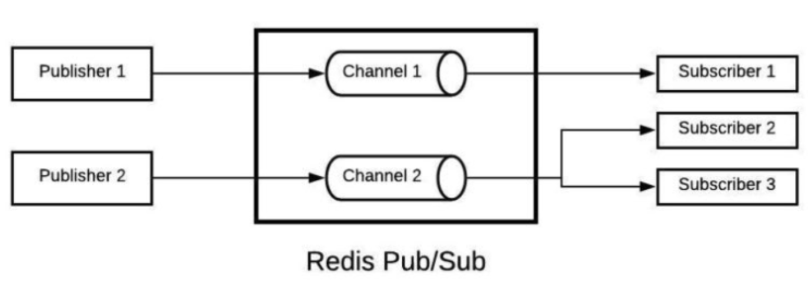

## 배경 상황

일반적으로 데이터베이스 부하 감소를 위하여 캐시를 고려하게 된다. 캐시에는 애플리케이션 서버 메모리에 저장하는 로컬 캐시 방식과 애플리케이션 서버와 독립적으로 존재하는 글로벌 캐시 방식으로 나뉜다.

로컬 캐시 같은 경우 구현이 쉬우나, **scale-out된 분산 환경**에서 각 애플리케이션 서버가 서로 다른 캐시 데이터를 갖는 **데이터 일관성 문제**가 발생할 수 있다. 이 문제를 해결하기 위해서 결국 Memcached나 Redis와 같은 솔루션을 사용하여 **글로벌 캐시**를 구성해야할 것이다. 모든 애플리케이션 서버가 **네트워크 I/O**를 통해 동일한 글로벌 캐시 서버를 사용하기 때문에 데이터 일관성 문제가 해결될 것이다.

그렇다면 모든것이 완벽할까? 글로벌 캐시는 아까 말했듯 네트워크 I/O 비용이 발생한다. 또, 캐시에 데이터를 저장하고 꺼내올 때 발생하는 직렬화/역직렬화 비용도 발생할 것이다. 반면 **로컬 캐시는 RAM Access 비용만 발생하므로 글로벌 캐시 방식에 비해 굉장히 빠르다**. 또, 직렬화/역직렬화도 필요 없다. **낮은 latency가 요구되는 상황**에서는 글로벌 캐시보다는 **로컬 캐시가 더 적합**할 것이다. 또, 중앙화된 **글로벌 캐시 서버 한대**를 사용한다면 캐시서버가 **SPOF(single point of failure)**가 되어 **HA(high availability), FT(fault tolerance)** 측면에서도 불리하다.

문제는 다시 처음으로 돌아간다. 아무 장치 없이 로컬 캐시를 사용하면, 분산 환경에서 발생하는 데이터 일관성 이슈를 피할 수 없다. 그렇다면 어떻게 해결하면 좋을까?

### Redis Pub/Sub 을 통한 로컬 캐시 동기화



레디스는 위 그림과 같이 **Pub/Sub** 기능을 제공한다. 특정 채널을 구독하는 subscriber 들에게 메시지를 **브로드캐스트** 하는 방법이다. 이를 이용해 어떤 애플리케이션 서버에서 캐시가 갱신되었을 때 그 메시지를 다른 모든 애플리케이션 서버에 브로드캐스트 하는 방식으로 동기화 하면 어떨까?

이 구조에서는 scale-out된 모든 애플리케이션 서버가 Publisher이자 Consumer가 된다. 그리고 **한 서버의 로컬 캐시가 갱신되면 그 사실을 다른 모든 애플리케이션 서버에 브로드캐스트** 하는 방식이다. 브로드캐스트할 때 **갱신된 캐시의 키**를 메시지로 전달한다.

> 💡 **Pub/Sub과 Producer/Consumer의 차이점**: 나는 Pub/Sub과 Producer/Consumer가 비슷하거나 거의 동일한 개념이라고 착각하고 있었다. Pub/Sub 모델은 특정 채널에 publisher가 메시지를 발행(publish)하면 그 채널을 구독하고 있는 모든 subscriber에게 메시지를 브로드캐스트한다. 즉, 모든 구독자가 메시지를 수신한다. 반면, Producer/Consumer 모델의 경우 producer가 한번 발행한 메시지(이벤트)를 가장 먼저 consume한 consumer만 해당 메시지를 읽을 수 있다. 즉, 작업이 한번만 실행되도록 하고싶을 때 사용한다. 자세한 내용은 기회가 될 때 별도의 포스팅으로 풀어보겠다. ([참고1](https://stackoverflow.com/questions/42471870/publish-subscribe-vs-producer-consumer), [참고2](https://stackoverflow.com/questions/42471870/publish-subscribe-vs-producer-consumer), [참고3](https://medium.com/frientrip/pub-sub-%EC%9E%98-%EC%95%8C%EA%B3%A0-%EC%93%B0%EC%9E%90-de9dc1b9f739))

### 방법1 - 변경된 키-데이터 쌍을 브로드캐스트

로컬 캐시가 갱신된 서버가 변경된 캐시 키와 데이터를 함께 브로드캐스트 하는 방법이다. 이 방식은 그다지 효율적이지 않다. 모든 노드가 설령 데이터를 사용하지 않더라도 변경된 모든 데이터를 수신하기 때문이다. 네트워크 과부하가 발생할 것이다.

### 방법2 - 변경된 키만을 브로드캐스트

이 방식은 갱신된 캐시 키만을 브로드캐스트 하여 네트워크 트래픽을 절약할 수 있는 방법이다. 이 방법에서는 데이터를 직접 전달하는 대신 **‘이 캐시 키가 갱신되었으니, 다음에 이 캐시로 요청이 오는 경우 데이터베이스에 직접 히트(hit)해’** 라고 말하는 방법이다. 즉, 무효화 시키는 방법이다.

## 실제 구현해보기

> 아래 내용은 Redis의 Pub/Sub 자체를 학습하는 것이 아닌, **이론으로만 알고있던 Redis Pub/Sub을 통한 캐시 동기화가 실제로 동작하는지 확인해보는 내용**이다. 따라서 Redis와 Spring Data Redis 등의 학습이 깊게 이뤄지지 않은 상태에서 작성하였다. Redis와 Spring Data Redis의 깊은 학습은 여유가 될 때 해보도록 하겠다.

위에서 소개된 '방법2 - 변경된 키만을 브로드캐스트' 방법으로 구현해본다.

### 요구사항

랭킹 시스템을 구현한다. 랭킹은 로컬 캐시에 캐시하며, 랭킹이 업데이트 될 때 캐시를 무효화한다. 그리고 이 무효화를 Redis를 사용해 다른 서버에도 전파해야한다.

### 개발환경

- Redis를 docker로 띄워뒀다.
- 캐시 무효화 전파를 확인하기 위해 스프링 애플리케이션을 각각 다른 포트로 4개 띄운다.
- 캐시 매니저로는 간단하게 `ConcurrentMapCacheManager` 를 사용한다.

### Ranking

```java
@Getter
@NoArgsConstructor
@Entity
public class Ranking {

    @Id
    @GeneratedValue(strategy = GenerationType.IDENTITY)
    private Long id;

    private Long ranking;

    private String name;

    public Ranking(final Long ranking, final String name) {
        this.ranking = ranking;
        this.name = name;
    }

    public void changeName(final String newName) {
        this.name = newName;
    }
}

```

랭킹 도메인은 위와 같이 간단하다.

### CacheConfig

```java
@EnableCaching
@Configuration
public class CacheConfig {

    @Bean
    public CacheManager cacheManager() {
        return new ConcurrentMapCacheManager();
    }
}
```

### RedisConfig

```java
@Configuration
public class RedisConfig {

    @Bean
    public RedisMessageListenerContainer RedisMessageListener(RedisConnectionFactory connectionFactory) {
        RedisMessageListenerContainer container = new RedisMessageListenerContainer();
        container.setConnectionFactory(connectionFactory);
        return container;
    }

    @Bean
    public RedisTemplate<String, Object> redisTemplate(RedisConnectionFactory connectionFactory) {
        RedisTemplate<String, Object> redisTemplate = new RedisTemplate<>();
        redisTemplate.setConnectionFactory(connectionFactory);
        redisTemplate.setKeySerializer(new StringRedisSerializer());
        redisTemplate.setValueSerializer(new Jackson2JsonRedisSerializer<>(String.class));
        return redisTemplate;
    }
}
```

위와 같이 `RedisTemplate` 과 `RedisMessageListenerContainer` 빈을 등록해준다. `RedisMessageListenerContainer` 에 대해서는 추후 자세한 학습이 필요하다.

### RedisPublisher

```java
@Service
public class RedisPublisher {

    private final RedisTemplate<String, Object> redisTemplate;

    public RedisPublisher(final RedisTemplate<String, Object> redisTemplate) {
        this.redisTemplate = redisTemplate;
    }

    public void publish(ChannelTopic topic, Long message) {
        redisTemplate.convertAndSend(topic.getTopic(), message);
    }
}
```

메시지를 발행하는 부분이다. `publish()` 메소드는 외부로부터 `ChannelTopic` 을 받아와, 해당 채널로 메시지를 발행한다. 메시지 발행에는 `RedisTemplate` 의 `convertAndSend()` 메소드가 사용된다.

### RedisSubscriber

```java
@Service
public class RedisSubscriber implements MessageListener {

    private final RedisTemplate<String, Object> redisTemplate;
    private final CacheManager cacheManager;

    public RedisSubscriber(final RedisTemplate<String, Object> redisTemplate, final CacheManager cacheManager,
                           final RedisMessageListenerContainer redisMessageListener) {
        this.redisTemplate = redisTemplate;
        this.cacheManager = cacheManager;

        ChannelTopic rankingInvalidationChannel = new ChannelTopic("ranking-invalidation");
        redisMessageListener.addMessageListener(this, rankingInvalidationChannel);
    }

    @Override
    public void onMessage(final Message message, final byte[] pattern) {
        String body = redisTemplate.getStringSerializer().deserialize(message.getBody());
        cacheManager.getCache("ranking").evict(Long.valueOf(body));
    }
}
```

다른 애플리케이션에서 메시지가 발행되었을 때, 정해진 명령을 실행하는 subscriber이다. `MessageListener` 인터페이스를 구현한다. `redisMessageListener` 를 생성자에서 주입받아 `addMessageListener()` 메소드를 호출해 자기자신을 메시지 리스너로 등록하도록 작성했다.

`onMessage()` 메소드를 오버라이드하여 메시지가 발행 되었을 때 수행할 코드를 작성한다. 나 같은 경우에는 `CacheManager` 를 주입받아 `"ranking"` 캐시에서 변경이 발생한 캐시 키를 무효화하도록 작성했다. 캐시에 대한 내용은 아래 `RankingService` 에 자세히 나온다.

### RankingService

```java
@Service
public class RankingService {

    private final RankingRepository rankingRepository;
    private final RedisPublisher redisPublisher;

    public RankingService(final RankingRepository rankingRepository, final RedisPublisher redisPublisher) {
        this.rankingRepository = rankingRepository;
        this.redisPublisher = redisPublisher;
    }

    @Transactional
    public Ranking createRanking(final Long rank, final String name) {
        Ranking ranking = new Ranking(rank, name);
        return rankingRepository.save(ranking);
    }

    @Cacheable("ranking")
    @Transactional(readOnly = true)
    public Ranking getRanking(final Long id) {
        return rankingRepository.findById(id).orElseThrow();
    }

    @Transactional
    public Ranking updateRanking(final Long id, final String name) {
        Ranking ranking = rankingRepository.findById(id).orElseThrow();
        ranking.changeName(name);

        redisPublisher.publish(ChannelTopic.of("ranking-invalidation"), id);

        return ranking;
    }
}
```

`getRanking()` 은 특정 `id` 의 랭킹을 가져오는 메소드이다. `@Cacheable` 을 사용해 캐싱했다.

`updateRanking()` 메소드는 랭킹 도메인을 업데이트 하면서, `redisPublisher` 를 사용하여 `"ranking-invalidation"` 채널에 메시지를 발행한다. 이 메시지를 바로 위에서 이야기한 `RedisSubscriber` 가 받아 `"ranking"` 캐시를 evict 한다.

### 실제 동작 확인

실제로 여러개의 애플리케이션 프로세스를 띄워 테스트 해보면, 한 곳에서 update 가 발생하였을 경우 다른 모든 애플리케이션 프로세스에서도 캐시를 무효화시켜 최신 데이터를 가져오는 것을 확인할 수 있다.

## 더 학습해볼 키워드/주제

- Redis
- Publish/Subscribe vs Producer/Consumer
- Spring Data Redis
- RedisMessageListenerContainer
- `RedisPublisher` 와 `RedisSubscriber` 는 왜 `@Service` 어노테이션을 사용하는가?
- MessageListener

## 참고

- [https://doc.postsharp.net/caching-pubsub](https://doc.postsharp.net/caching-pubsub)
- [https://stackoverflow.com/questions/63613743/methods-to-handle-cache-data-in-memory-through-multi-servers](https://stackoverflow.com/questions/63613743/methods-to-handle-cache-data-in-memory-through-multi-servers)
- [https://www.slideshare.net/RedisLabs/redisconf18-techniques-for-synchronizing-inmemory-caches-with-redis](https://www.slideshare.net/RedisLabs/redisconf18-techniques-for-synchronizing-inmemory-caches-with-redis)
- [https://pompitzz.github.io/blog/Redis/LocalCacheSyncWithRedisPubSub.html#redis-pub-sub](https://pompitzz.github.io/blog/Redis/LocalCacheSyncWithRedisPubSub.html#redis-pub-sub)
- [https://www.baeldung.com/pub-sub-vs-message-queues](https://www.baeldung.com/pub-sub-vs-message-queues)
- [https://medium.com/frientrip/pub-sub-잘-알고-쓰자-de9dc1b9f739](https://medium.com/frientrip/pub-sub-%EC%9E%98-%EC%95%8C%EA%B3%A0-%EC%93%B0%EC%9E%90-de9dc1b9f739)
- [https://zkdlu.github.io/2020-12-29/redis04-spring-boot에서-pub,sub-모델-사용하기/](https://zkdlu.github.io/2020-12-29/redis04-spring-boot%EC%97%90%EC%84%9C-pub,sub-%EB%AA%A8%EB%8D%B8-%EC%82%AC%EC%9A%A9%ED%95%98%EA%B8%B0/)
