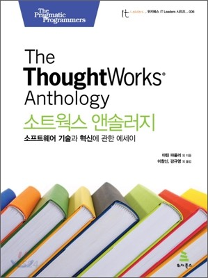
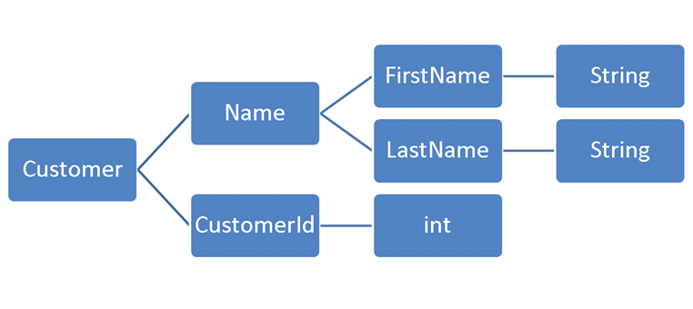

## 객체지향 생활체조 원칙



> _"어떤 멍청이라도 컴퓨터가 이해할 수 있는 코드는 작성할 수 있다. 좋은 프로그래머는 사람이 이해할 수 있는 코드를 작성한다. (Any fool can write code that a computer can understand. Good programmers write code that humans can understand)"_ ― 마틴 파울러

객체지향 생활체조 원칙은 마틴 파울러의 책 소트웍스 앤솔러지에 나온 9가지 원칙이다. 객체지향 생활체조 원칙은 좋은 품질의 소프트웨어를 만들기 위한 **응집도(cohension), 느슨한 결합(loose coupling), 무중복(zero duplication), 캡슐화(encapsulation), 테스트 가능성(testability), 가독성(readability), 초점(focus)**을 실현하기 위한 훈련 지침이다.

객체지향 생활체조 원칙은 우아한테크코스 선발과정인 프리코스 때부터 언급된 원칙이다. 그 이후 레벨 1, 2, 3을 거치면서 꾸준히 언급되었다. 이해 없이 얕은 수준으로 베껴 적는데서 그칠까봐 지금까지 객체지향 생활체조 원칙에 대해 포스팅하지 않았다. 레벨4인 지금, 각 원칙에 대한 Why? 에 대한 대답을 조금이나마 할 수 있게 된 것 같아서 원칙을 되돌아볼겸 정리해보고자 한다.

사실 소트웍스 앤솔러지 책이 집에 없어서… 직접 책의 내용을 참고하지는 않았지만, 다행히도 **[위키북스 공식 블로그](https://developerfarm.wordpress.com/2012/01/26/object_calisthenics_1/)**에서 소트웍스 앤솔러지의 객체지향 생활체조 원칙 부분을 발췌하여 올려준 덕분에 원문을 읽어볼 수 있었다. 클린코드를 함께 참고하며 작성해보았다.

이 글에서는 모든 원칙별로 원칙을 적용해야하는 이유와 그에 대한 솔루션을 제안한다. 원칙을 적용하는 것도 중요하지만, **각각의 원칙이 어떤 문제 상황을 피하기 위해 만들어졌는지 그 숨은 의도**를 알아내는것이 더 중요하기 때문이다. 원칙 그 자체에 매몰되지 말고, **원칙이 해결하고자 하는 문제점(WHY?)에 집중**해보자.

## 원칙1. 한 메서드에 오직 한 단계의 들여 쓰기만 한다.

### WHY?

```java
class Board {
//    ...
   String board() {
      StringBuffer buf = new StringBuffer();
      for (int i = 0; i < 10; i++) {
         for (int j = 0; j < 10; j++)
            buf.append(data[i][j]);
         buf.append("\n");
      }
      return buf.toString();
   }
}
```

코드의 들여쓰기 깊이가 깊어지면 깊어질수록 가독성이 하락한다. 조건문 안에 조건문이 있고, 그 조건문 안에는 반복문이 있고, … 이런 구조의 코드는 대체 무슨일을 하는지 알아볼 수 없다. 우리는 사람이다. 호흡이 너무 긴 문장을 이해하기 어려운 것 처럼 너무 긴 함수는 읽고 파악하기 힘들다.

또한, 함수에 많은 중첩 구조가 생겼다는 것은 함수가 하는 일이 많다는 것이다.

> _"함수는 한 가지를 해야 한다. 그 한 가지를 잘 해야 한다. 그 한 가지만을 해야 한다."_ ― 클린코드

### SOLUTION

이런 함수의 구조를 개선하기 위해서는 마틴 파울러의 책 **리팩토링**에서 소개된 **[메소드 추출(Extract Method) 기법](https://refactoring.com/catalog/extractFunction.html)**을 사용할 수 있다. 메소드 추출은 코드의 일부분을 메소드로 분리하여, 코드의 복잡도를 낮추는 기법이다.

```java
class Board {
   // ...
   String board() {
      StringBuffer buf = new StringBuffer();
      collectRows(buf);
      return buf.toString();
   }

   void collectRows(StringBuffer buf) {
      for (int i = 0; i < 10; i++)
         collectRow(buf, i);
   }

   void collectRow(StringBuffer buf, int row) {
      for (int i = 0; i < 10; i++)
         buf.append(data[row][i]);
      buf.append("\n");
   }
}
```

위 코드는 원본 코드를 메소드 추출 기법을 사용하여 리팩토링 한 것이다.

## 원칙2. else 예약어를 쓰지 않는다.

### WHY?

이 원칙을 처음 본 사람들은 깜짝 놀랄수도있다. else 예약어는 우리가 프로그래밍을 배울 때 거의 맨 처음 배우는 것이기 때문이다. 하지만, 우리는 else 예약어를 전혀 사용하지 않고도 프로그램을 작성할 수 있다. 실제로 우아한테크코스를 시작하고나서 코드를 짜며 단 한번도 else 예약어를 사용하지 않았다.

그런데, 멀쩡한 언어 스펙인 else 예약어를 대체 왜 사용하지 말라는 것일까? 자칫하면 조건의 분기에 대한 depth가 깊어질 수 있기 때문이다. 다소 극단적일 수 있지만, 아래의 코드를 보자.

```java
public String getAgeCategory(int age) {
    if (age < 5) {
        return "infant";
    } else {
        if (age < 12) {
            return "child";
        } else {
            if (age < 19) {
                return "teenager";
            } else {
                return "adult";
            }
        }
    }
}
```

위의 코드는 연령을 전달하면, 연령에 대한 분류를 반환하는 함수이다. 딱 보면 느껴지는 것 처럼 코드가 읽기 불편하다. 왜 읽기 불편할까?

if절이 중첩되면서 코드가 비선형적으로 흐르기 때문이다. 인간이 읽기에 직관적이지 않은 코드이고, 코드의 동작을 파악하기 위해서는 중첩된 조건문의 흐름을 따라가기 어렵다. 이는 [**Arrow Anti Pattern**](https://wiki.c2.com/?ArrowAntiPattern) 이다. else 문을 사용하면 자칫 else문 안에서 다시 중첩된 조건문을 만들 가능성이 있다. 또한 이렇게 코드가 중첩된 상황에서 if절에 대한 else를 찾기 어려워진다는 점도 존재한다.

else 예약어를 사용하지 않는 원칙은 **'원칙1. 한 메서드에 오직 한 단계의 들여 쓰기만 한다.'** 와 밀접하게 맞닿아있다. 깊은 단계의 들여쓰기는 곧 읽기 어려운 코드를 낳는다.

### SOLUTION

바로 Early Return 패턴을 사용하는 것이다. Ealry Return이란, 조건문 조건이 일치하면 그 즉시 반환을 하는 디자인 패턴이다. Ealry Return을 사용하여 위 예시 코드를 개선하면 아래와 같다.

```java
public String getAgeCategory(int age) {
    if (age < 5) {
        return "infant";
    }

    if (age < 12) {
        return "child";
    }

    if (age < 19) {
        return "teenager";
    }

    return "adult";
}
```

가독성이 훨씬 증가하여, 읽기 쉬운 코드가 된 것을 확인할 수 있다. 이때, **[보호 절(gaurd clause)](https://wiki.c2.com/?GuardClause)**을 사용해볼 수도 있다. 보호 절을 사용하여 Fast-Fail 처리를 할 수도 있겠다.

또는 객체지향의 주요 특징 중 하나인 다형성을 사용하는 방법도 있다. 다형성을 사용하는 예로는 가장 대표적으로 **[전략 패턴(strategy pattern)](https://ko.wikipedia.org/wiki/%EC%A0%84%EB%9E%B5_%ED%8C%A8%ED%84%B4)**이 있다. 또는 **[널 객체 패턴(null object pattern)](https://en.wikipedia.org/wiki/Null_object_pattern)**을 사용해볼 수도 있다.

> 참고로 else 키워드 대신 switch-case문을 사용해도 else 키워드의 문제는 동일하게 발생한다.

## 원칙3. 모든 원시값과 문자열을 포장한다.

### WHY?

> _"int 값 하나 자체는 그냥 아무 의미 없는 스칼라 값일 뿐이다. 어떤 메서드가 int 값을 매개변수로 받는다면 그 메서드 이름은 해당 매개변수의 의도를 나타내기 위해 모든 수단과 방법을 가리지 않아야 한다."_ ― 소트웍스 앤솔러지

원시타입 데이터는 아무런 의미를 가지고 있지 않다. 원시값의 의미는 변수명으로 추론할 수 밖에 없다. 예시로 아래와 같은 `Person` 클래스가 있다고 해보자.

```java
public class Person {

    private final int id;
    private final int age;
    private final int money;

    public Person(final int id, final int age, final int money) {
        this.id = id;
        this.age = age;
        this.money = money;
    }
}
```

`Person` 은 `id` , `age` , `money` 필드를 가지고 있으며, 모두 int 타입이다. 이 셋을 구분할 수 있는 것은 오직 변수명 뿐이다. 이런 상황에서는 아래와 같은 실수를 막을 수 없다.

```java
int age = 15;
int money = 5000;
int id = 150;

Person person = new Person(age, money, id);
```

위 코드는 컴파일 에러가 발생하지 않는다. `age` , `money` , `id` 모두 같은 타입이기 때문이다. 하지만, 우리 의도대로 `Person` 객체가 생성되지 않는다. 파라미터를 전달하는 순서가 의도와 맞지 않기 때문이다. 실제로 생성된 `Person` 객체는 ID가 15이고, 나이가 5000살이며, 가진 돈은 150원 일 것이다.

또, 아래와 같이 거리를 미터 단위로 나타내는 원시값이 있다고 하자.

```java
int distanceInMeter = 1000; // 1000m
```

이 데이터가 우리의 코드 베이스 전반에 흩어져 있다고 가정하자. 그런데, 몇몇 부분에서는 미터 단위를 킬로미터 단위로 환산하여 사용 해야한다고 하자. 환산이 필요한 부분에서는 아래와 같은 연산이 코드베이스 전반적으로 중복되어 흩어질 것이다.

```java
int distanceInKilometer = distanceInMeter / 1000; // 1km
```

생각해보니 거리는 음수가 될 수 없다. 거리 값을 사용하는 모든 코드에서 아래와 같이 거리 값의 무결성을 검증해야한다.

```java
if (distanceInMeter < 0) {
    throw new IllegalArgumentException("잘못된 거리 값 입니다.");
}
```

이렇게 점점 특정 데이터에 대한 작업이 여기저기 중복되어 흩어지게 된다. 이렇게 코드가 흩어진 경우 요구사항이 변경되었을 때 변경해야하는 코드의 지점도 많아진다. 유지보수가 힘들어질 것이다.

위 케이스 모두 원시 타입을 사용하여 도메인 개념을 표현할때 발생하는 문제점들이다. 이를 **[원시 타입에 대한 집착 (Primitive Obsession) 안티 패턴](http://wiki.c2.com/?PrimitiveObsession)**이라고 부른다.

### SOLUTION

위 문제를 해결하기 위해서는 원시값을 의미를 부여할 수 있는 객체로 만드는 것이다. 첫번째 케이스부터 개선해보자. 우선 아래와 같이 각각의 원시타입을 포장할 클래스를 정의한다.

```java
public class Id {

    private int value;

    // 생성자 생략
}

public class Age {

    private int value;

    // 생성자 생략
}

public class Money {

    private int value;

    // 생성자 생략
}
```

`Person` 클래스도 아래와 같이 변경한다.

```java
public class Person {

    private final Id id;
    private final Age age;
    private final Money money;

    public Person(final Id id, final Age age, final Money money) {
        this.id = id;
        this.age = age;
        this.money = money;
    }
}
```

개선된 구조에서는 각각의 도메인 개념이 다른 값과 구분된 고유의 타입을 갖게 되었으므로, 더이상 혼란스럽지 않게 값을 사용할 수 있다.

```java
Age age = new Age(15);
Money money = new Money(5000);
Id id = new Id(10);

Person person = new Person(id, age, money);
```

또한 잘못된 타입을 전달하면 컴파일 에러가 발생하므로 항상 올바른 값을 전달할 수 있다.

두번째 케이스를 개선해보자. 두번째 케이스는 데이터가 변환, 유효성 검사등의 행위를 가지지 않아 발생하는 문제이다. 객체지향을 객체지향답게 사용하려면, 책임과 역할을 부여받고 능동적으로 행동하는 객체를 만들어야한다. 도메인 개념을 캡슐화 하고, 행위를 부여하자.

```java
public class Distance {

    private final int meter;

    public Distance(final int meter) {
        if (meter < 0) {
            throw new IllegalArgumentException("잘못된 거리 값 입니다.");
        }

        this.meter = meter;
    }

    public int toKilometer() {
        return meter / 1000;
    }
}
```

`Distance` 라는 클래스를 정의하여 원시값을 포장하였다. 이 `Distance` 객체는 생성시점에 값의 유효성을 검증해 유효한 객체만 생성될 수 있다. 또한 `toKilometer()` 라는 변환 로직을 객체 내부에 구현하였다. 코드 베이스 전반에 흩어진 비즈니스 로직이 하나의 객체로 응집되었고, 그로 인하여 중복 코드도 줄어들었다. 또한 객체가 능동적인 행위를 갖게되어 더 객체지향적으로 코드를 작성할 수 있게 되었다.

이런 형태를 **값 객체 (Value Object)** 라고 한다. 값 객체에 대해서는 이전에 **[원시 타입 대신 VO(Value Object)를 사용하자](https://hudi.blog/value-object/)** 라는 포스팅으로 다뤄본 바 있다.

## 원칙4. 한 줄에 점을 하나만 찍는다.

> 여기서 점이란 객체 멤버에 접근하기 위한 점(`.`)을 의미한다. PHP 같은 경우엔 `->` 로 이해하면 된다.

### WHY?

방금전 원칙3에서 개선한 `Person` 클래스를 가져오자. 이번엔 `Person` 이 일정 금액 이상 돈을 보유하고 있는지 검사해볼 것이다.

```java
if (person.getMoney().getValue() > 10000) {
    System.out.println("당신은 부자 💰");
}
```

Getter를 사용하여 구현하면, 위와 같이 한 줄에 점이 2개 이상 찍힐것이다. 점이 여러개 찍혔다는 것의 의미는 무엇일까?

일단 위 코드는 점을 두개 이상 찍으면서, 결합도가 높아졌다. 위 코드를 사용하는 클래스는 `Person` 뿐 아니라 `Money` 에 대한 의존성을 추가로 갖게 된다.

### SOLUTION

_"한 줄에 점을 하나만 찍으라"_ 는 원칙은 사실 디미터 법칙을 직관적으로 이해하기 위한 원칙이다. 디미터 법칙은 **낯선 이와 이야기하지 말라(Don't Talk to Strangers)** 또는 **최소 지식 원칙(Principle of least knwoledge)** 으로도 알려져있다.

디미터 법칙의 핵심은 객체 그래프를 따라 멀리 떨어진 객체에게 메시지를 보내는 설계를 피하라는 것이다. 이런 설계는 객체간의 결합도를 높이는 지름길이다. 많은 점이 찍혀있다는 것은, 객체가 다른 객체에 깊숙이 관여하고 있음을 의미한다. 이는 캡슐화가 깨져있다는 방증이기도 하다.

```java
if (person.hasMoneyMoreThan(10000)) {
    System.out.println("당신은 부자 💰");
}
```

위와 같이 점을 하나만 사용하도록 코드를 개선하였다. `Person` 의 `Money` 의 메소드를 호출하는 것이 아니라 `Person` 에게 물어보는 방식으로 변경되었다. `Person` 은 조금 더 능동적으로 자신이 가지고 있는 상태를 활용해 행위를 수행할 수 있게 되었다. 또한 위 코드를 사용하는 객체도 `Money` 라는 객체에 대한 의존성을 끊어내었다. 이는 원칙9에서 이야기할 **Tell, don't ask 원칙**이기도 하다.

단, DTO, 자료구조와 같은 경우에는 내부 구조를 외부에 노출하는것이 당연하므로 디미터 법칙을 적용하지 않는다. 또한 Java Stream API 처럼 메소드 체이닝(method chaining)을 사용하는 경우는 디미터 법칙을 위반하지 않는다. 디미터 법칙은 결합도와 관련된 이야기이므로, **본질을 잊고 '한 줄에 점 하나'에 매몰되지 말자**.

## 원칙5. 줄여쓰지 않는다(축약 금지)

> _"의도가 분명하게 이름을 지으라"_ ― 클린 코드

### WHY?

클래스, 메소드, 변수 이름을 축약하면 읽는 이로 하여금 혼란을 야기할 수 있다. 왜 축약하고 싶은 욕구가 생길까? 이름이 너무 길기 때문일 것이다. 이름이 왜 길까? 해당 클래스, 메소드가 너무 많은 일을 하고 있다는 신호 아닐까? 특히 클래스의 경우 단일 책임 원칙(SRP)을 위반하고 있을 수 있다.

### SOLUTION

클래스와 메소드의 역할을 적절하게 분리하고, 각각의 책임을 다른 객체와 메소드에 위임해보자. 역할과 책임이 줄어들어 이름도 짧게 만들 수 있을 것이다.

클래스와 메소드의 이름을 한두단어 정도로 짧게 유지하고, 문맥을 중복하는 이름을 자제하자. 주문을 나타내는 `Order` 클래스의 주문 메소드를 `shipOrder()` 로 명명할 필요가 있을까? 짧게 `ship()` 으로 하여도 의미는 통할 것이다.

## 원칙6. 모든 엔티티를 작게 유지한다.

### WHY?

50줄이 넘는 클래스와, 파일이 10개 이상인 패키지를 지양하자는 원칙이다. 보통 50줄이 넘는 클래스는 한가지 일을 하고 있지 않으며, 코드의 이해와 재사용을 어렵게 만든다. SRP 원칙은 SOLID 중 가장 지키기 쉬우면서, 효과가 좋은 원칙이다. 이를 항상 기억하자. 또한 50줄이 넘지 않은 클래스는 한눈에 보기 쉽다는 부가적인 효과도 존재한다.

패키지 내의 파일의 수도 줄여야지 하나의 목적을 달성하기 위한 연관된 클래스의 집합임이 드러나게된다. 이는 높은 응집도를 위함이다.

### SOLUTION

클래스가 50줄이 넘어가지 않게 작성하고, 패키지의 파일이 10개 이상이 되지 않도록 유지하자.

## 원칙7. 2개를 초과하는 인스턴스 변수를 가진 클래스를 쓰지 않는다.

> 번역본에서는 '2개 이상' 이라고 표현했으나, 원문이 'No Classes With More Than Two Instance Variables**'** 이므로 '2개를 초과하는' 으로 해석하는것이 맞다.

### WHY?

인스턴스 변수가 많아질수록 클래스의 응집도는 낮아진다는 것을 의미한다. 마틴 파울러는 대부분의 클래스가 인스턴스 변수 하나만으로 일을 하는 것이 마땅하다고 한다. 하지만, 몇몇 경우에는 두개의 변수가 필요할 때가 있다고 한다. 클래스는 하나의 상태(인스턴스 변수)를 유지하고 관리하는 것과 두개의 독립된 변수를 조율하는 두가지 종류로 나뉜다고 한다.

이 원칙은 클래스의 인스턴스 변수를 최대 2개로 제한하는 것은 굉장히 엄격하지만, 최대한 클래스를 많이 분리하게 강제함으로써 높은 응집도를 유지할 수 있게하는 원칙이다.

### SOLUTION



덩치가 큰 객체를 이해하는 과정은 쉽지 않다. 객체를 협력 객체간의 계층 구조로 바라보자. 이 원칙을 재귀적으로 클래스에 적용하여, 덩치가 큰 객체를 작은 크기의 여러 객체로 분해하면, 자연스럽게 인스턴스 변수들을 적절한 곳에 위치시킬 수 있다.

## 원칙8. 일급 컬렉션을 쓴다.

### WHY?

'**원칙3. 모든 원시값과 문자열을 포장한다.'** 원칙과 비슷한 원칙이라고 생각한다. 컬렉션 또한 클래스로 포장하지 않으면, 의미없는 객체의 모음일 뿐이다.

다이소는 5000원이 넘는 물건을 판매하지 않는 정책이 있다고 한다. 다이소의 상품 진열대를 `List` 컬렉션으로 구현해보자.

```java
List<Item> daisoItems = new ArrayList<>();
if (item.isPriceHigherThan(5000)) {
    throw new IllegalArgumentException("5000원이 넘는 물건은 진열할 수 없습니다.");
}
```

5000원이 넘는 상품은 진열할 수 없으므로, 위와 같이 리스트에 `Item` 객체를 추가하는 곳마다 유효성 검증 코드를 추가해야한다. 원칙3에서의 문제가 똑같이 발생한다. 여기저기 비즈니스 로직이 흩어지고, 이로인해 중복 코드가 발생한다.

### SOLUTION

컬렉션을 클래스로 한번 감싸 일급 컬렉션으로 만들어 이 문제를 해결해보자.

```java
public class DaisoItems {

    private final List<Item> items;

    public DaisoItems() {
        this.items = new ArrayList<>();
    }

    public void addItem(final Item item) {
        if (item.isPriceHigherThan(5000)) {
            throw new IllegalArgumentException("5000원이 넘는 물건은 진열할 수 없습니다.");
        }

        items.add(item);
    }
}
```

사용은 아래와 같이 한다.

```java
DaisoItems daisoItems = new DaisoItems();
daisoItems.addItem(item);
```

여기저기 흩어져있는 비즈니스 로직이 일급컬렉션으로 응집되고, 중복 코드가 낮아지게 되었다. 또한 여러 역할과 책임을 일급 컬렉션에게 위임하여 좀 더 능동적인 객체로 만들어볼 수 있게 되었다.

## 원칙9. Getter, Setter, Property를 사용하지 않는다.

### WHY?

객체를 조금 더 객체답게 사용하기 위해서는, 객체가 할 수 있는 작업은 객체에게 믿고 맡겨야한다. 즉, 객체에게 책임이 있는 작업은 객체에게 직접 시켜야한다. 이런 원칙을 **묻지 말고, 시켜라(Tell, don't ask) 원칙**이라고 한다.

위에서 만든 `Distance` 객체에 Getter만 추가하여 다시 가져와보았다.

```java
public class Distance {

    private final int meter;

    public Distance(final int meter) {
        if (meter < 0) {
            throw new IllegalArgumentException("잘못된 거리 값 입니다.");
        }

        this.meter = meter;
    }

    public int toKilometer() {
        return meter / 1000;
    }

		public int getMeter() {
				return meter;
		}
}
```

어딘가에서 `Distance` 객체를 사용하는데, 이번엔 미터를 센티미터 단위로 환산하여 작업해야한다. 아래와 같이 `getMeter()` 를 사용하여 값을 가져오고 100을 곱하여 센티미터로 환산했다.

```java
Distance distance = new Distance(10);
int cm = distance.getMeter() * 100;
```

위는 바람직한 코드인가? 그렇지 않다. 위와 같은 코드는 객체의 역할과 책임, 자율성을 무시한 코드이다. 위와 같이 코드를 작성하면, 다시 비즈니스 로직이 코드 베이스 전반으로 흩어지고 중복 코드가 발생한다.

### SOLUTION

'단위 환산' 이라는 행동은 `Distance` 객체의 책임이다. 아래와 같이 개선하자.

```java
public class Distance {

    // ...

    public int toCentimeter() {
        return meter * 100;
    }

    // ...
}
```

센티미터로 단위를 환산하는데 Getter가 필요한가? Getter와 Property도 마찬가지이다. 객체 상태에 기반한 모든 결정과 행동은 외부가 아닌 객체 내부에서 이루어져야한다. 그것이 바람직한 객체이다.

Getter/Setter/Property를 남발하면, **불필요한 객체 내부 구현의 노출**로 이어지며 이는 곧 **응집도 하락과, 캡슐화의 위반**으로 이어진다. 계속 강조하지만 **객체의 자율성을 보장하고 능동적으로 행동**할 수 있도록 설계하자.

## 마치며

프로그래밍은 복잡도를 다루는 기술이다. 복잡도를 이겨내기 위해서는 최대한 작은 단위로, 읽기 쉽고 예측 할 수 있는 코드를 작성해야한다.

코드 작성은 마치 글쓰기와 같다. _"오른발을 내딛음과 동시에 왼손을 앞으로 내민다. 이어서 왼발을 내딛고 오른손을 앞으로 내민다. 이를 반복한다."_ 와 _"앞으로 걷는다."_ 둘 중 어떤 문장이 더 이해하기 쉬운가? 코드를 작성할 때에는 코드를 읽는 사람을 배려해야 한다. 코드를 읽는 사람은 다른 사람 뿐 아니라 미래의 내가 될 수도 있다.

객체지향 생활체조 원칙은 불편하다. 때때로는 가혹하다. 하지만 더 좋은 코드를 위해 '의식적인 연습'을 해보자.

## 참고

- 클린 코드, 로버트 C. 마틴
- [https://developerfarm.wordpress.com/2012/01/26/object_calisthenics_1/](https://developerfarm.wordpress.com/2012/01/26/object_calisthenics_1/)
- [https://williamdurand.fr/2013/06/03/object-calisthenics/](https://williamdurand.fr/2013/06/03/object-calisthenics/)
- [https://woonys.tistory.com/m/entry/Design-PatternJavaEarly-return-pattern이란](https://woonys.tistory.com/m/entry/Design-PatternJavaEarly-return-pattern%EC%9D%B4%EB%9E%80)
- [https://medium.com/@davidsen/clean-code-object-calisthenics-f6f4dec07c8b](https://medium.com/@davidsen/clean-code-object-calisthenics-f6f4dec07c8b)
- [https://softwareengineering.stackexchange.com/questions/202663/is-it-a-good-practice-to-wrap-all-primitives-and-strings](https://softwareengineering.stackexchange.com/questions/202663/is-it-a-good-practice-to-wrap-all-primitives-and-strings)
- [https://tecoble.techcourse.co.kr/post/2020-06-02-law-of-demeter/](https://tecoble.techcourse.co.kr/post/2020-06-02-law-of-demeter/)
