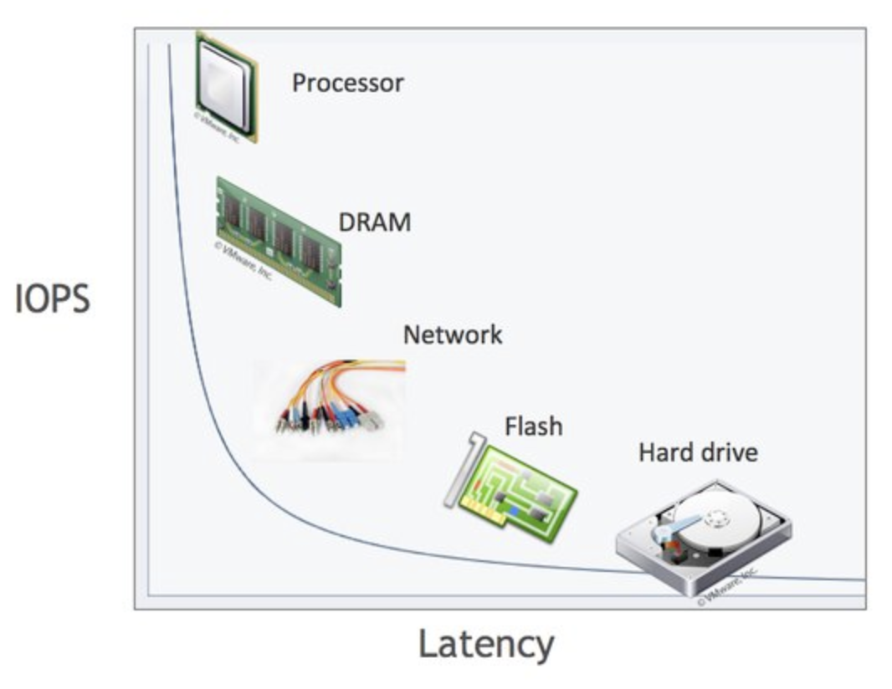

## HDD와 SSD

CPU의 처리 속도나 RAM과 같은 전기적인 원리로 동작하는 메모리의 I/O 속도는 매우 빠른 속도로 발전했다. 하지만 디스크 같은 기계적 장치는 CPU, RAM 대비 제한적으로 발전했다. 특히 HDD는 마치 LP판 같이 특정 위치에 디스크 헤드를 위치시켜 플래터(원판)을 회전시켜 읽거나 쓰는 원리로 매우 성능이 느리다. 이를 플래시 메모리로 보완하여 HDD 대비 속도가 빠른 SSD가 등장하였다.

메모리와 HDD의 처리 속도는 10만배 이상 차이난다. 반면 플래시 메모리를 사용하는 SSD와 메모리의 차이는 1,000배 가량 차이난다. 또한 순차 I/O 에서는 SSD가 HDD 대비 조금 빠른 수준이나, 랜덤 I/O에서는 SDD가 HDD 대비 훨씬 빠르다. DBMS에서 발생하는 대부분의 I/O는 랜덤 I/O이다.

책 Real MySQL 8.0에 따르면 위와 같은 차이로 HDD와 SDD의 초당 트랜잭션 처리 성능을 비교 했을 때 약 7배정도의 성능 차이를 보인다고 한다. 따라서 최근 DBMS용 서버는 대부분 SSD를 채택한다.

하지만 RAM과의 속도를 비교하였을 때는 아직 역부족이다. 즉, 여전히 저장 매체는 컴퓨터에서 가장 느린 부분이다. 전체 시스템의 속도는 전체 시스템의 구성 요소 중 가장 느린 쪽의 성능에 가장 큰 영향을 받는다.

### 암달의 법칙 (Amdahl’s law)

암달에 법칙에 따르면 전체 시스템의 일부를 아무리 개선하더라도 그 성능 개선에는 한계가 있다. 정말 단순한 계산으로 전체 작업 시간에서 CPU가 10%, HDD가 90%를 차지하고 있다고 가정해보자. 그리고 CPU의 성능을 2배 개선한 상황과 HDD의 성능을 2배 개선한 상황을 전체 시스템 성능 향상 관점으로 비교해보자.

$$
\cfrac{1}{(1 - P) + \frac{P}{S}}
$$

위는 암달의 법칙 공식이다. 특정 컴포넌트의 성능 향상이 전체 시스템의 향상에 미치는 영향도를 분석할 수 있다. 여기서 $P$는 해당 컴포넌트가 전체 시스템 작업 시간에서 차지하는 비율을 의미하고, $S$는 해당 컴포넌트의 성능 향상 배수이다.

CPU 향상을 2배 증가시킨 경우 전체 시스템 성능은 약 5%정도 향상한다 (P = 0.1, S = 2). 반면 HDD 성능의 향상을 2배 증가 시킨 경우 전체 시스템의 성능은 약 81%가 증가한다 (P = 0.9, S = 2). 전체 시스템 성능에 대한 CPU와 HDD 간의 영향도가 다르기 때문에 발생하는 일이다. (다시 말하지만 위는 정확한 계산이 아니다.)

이게 무슨 의미냐면, 아무리 애플리케이션 레벨에서 최적화를 한들 쿼리 성능이 좋지 않아 디스크 I/O가 많이 발생한다면 전체 시스템 성능 향상에 큰 영향을 줄 수 없다는 의미이다.

## 랜덤 I/O와 순차 I/O

랜덤 I/O는 읽어야하는 데이터가 물리적으로 **불연속적**으로 있기 때문에 **디스크 헤더를 이동** 시킨 다음 데이터를 읽는 것을 의미한다. 이때 디스크 헤드를 이동시키는 시간을 Seek time이라고 한다. 순차 I/O는 읽어야하는 **데이터가 연속적**으로 있어 쭉 읽기만 하는 경우를 의미한다.

데이터를 3번 읽어야 한다고 가정하자. 데이터 위치가 물리적으로 연속적이라면 디스크 헤드를 한번 이동시키면 되지만, 불연속적이라면 디스크 헤더를 3번 이동시켜야한다. 즉, Seek Time이 사실상 디스크에 데이터를 읽고 쓰는데 걸리는 시간을 좌우한다. 따라서 디스크의 성능은 디스크 헤더의 이동 없이 얼마나 많은 데이터를 순차적으로 저장하느냐에 달렸다.

SSD는 디스크 원판이 없어서 랜덤 I/O와 순차 I/O가 큰 차이가 없을 것 같지만 SSD에서도 랜덤 I/O는 순차 I/O 대비 전체 처리율(throughput)이 떨어진다.

DBMS는 디스크에 데이터를 빈번히 읽고 쓰기 때문에 MySQL 서버에서는 그룹 커밋이나 바이너리 로그, InnoDB 로그 버퍼등의 기능이 내장되어 있다.

쿼리를 튜닝한다고 **랜덤 I/O가 순차 I/O로 변하는 상황은 많지 않다고 한다**. 즉, **쿼리 튜닝의 목적은 랜덤 I/O를 줄이는** 것이다. 즉, **꼭 필요한 데이터만 읽도록** 쿼리를 개선하는 것이 중요하다.

인덱스 레인지 스캔은 데이터를 읽기 위해 주로 랜덤 I/O를 사용하고, 풀 테이블 스캔은 순차 I/O를 사용한다. 따라서 큰 테이블의 레코드를 읽는 작업을 할 때 옵티마이저가 인덱스 대신 풀 테이블 스캔을 하도록 유도하는 경우도 있다고 한다.

## 더 공부해볼 키워드

- 그룹 커밋
- 바이너리 로그
- InnoDB 로그 버퍼
- 인덱스 레인지 스캔
- 풀 테이블 스캔
- 옵티마이저

## 참고

- Real MySQL 8.0 - 백은빈, 이성욱
