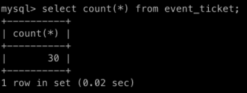

## 분산 락이란?

자바 스프링 기반의 웹 애플리케이션은 기본적으로 멀티 쓰레드 환경에서 구동된다. 따라서 여러 쓰레드가 함께 접근할 수 있는 **공유자원에 대해 경쟁 상태(race condition)이 발생하지 않도록** 별도의 처리가 필요하다.

자바는 `synchronized` 라는 키워드를 언어 차원에서 제공해, **모니터 기반으로 상호 배제(mutual exclusion)** 기능을 제공한다. 하지만, 이 매커니즘은 같은 프로세스에서만 상호 배제를 보장한다. 웹 애플리케이션 프로세스를 단 하나만 사용하는 서비스라면 상관 없지만, 일반적으로는 서버를 다중화하여 부하 분산하고 있을 것이다.

이런 **분산 환경**에서 **상호 배제를 구현**하여 동시성 문제를 다루기 위해 등장한 방법이 바로 **분산 락(distributed lock)**이다. 처음에 공부할 때 굉장히 헷갈린 부분인데, 분산 락은 데이터베이스에서 제공하는 락의 종류(갭 락, s-lock, x-lock 이런것들…)가 아니다. 일반적으로 웹 애플리케이션에서 공유 자원으로 데이터베이스를 가장 많이 사용하다보니, 데이터베이스에 대한 동시성 문제를 분산 락으로 풀어내는 사례가 많을 뿐이다. 물론 데이터베이스의 락 기능을 활용(MySQL의 네임드 락)하여 분산 락을 구현할 수 있지만, 직접적으로 연관있다고 보기는 어려운 것 같다.

분산 락을 구현하기 위해 **락에 대한 정보를 ‘어딘가’에 공통적으로 보관**하고 있어야 한다. 그리고 분산 환경에서 여러대의 서버들은 **공통된 ‘어딘가’를 바라보며, 자신이 임계 영역(critical section)에 접근할 수 있는지 확인**한다. 이렇게 분산 환경에서 원자성(atomic)을 보장할 수 있게 된다. 그리고 그 ‘어딘가’로 활용되는 기술은 MySQL의 네임드 락, Redis, Zookeeper 등이 있다. 그리고 이번 포스팅에서는 가상으로 동시성 이슈가 발생할만한 애플리케이션을 만들어보고, **Redis를 활용**하여 분산 락을 구현해보도록 하겠다.

## 애플리케이션 요구사항

동시성 이슈에 민감한 도메인 중 가장 쉽게 떠올릴 수 있는건 ‘선착순 신청’ 시스템일 것이다. 우리는 어떤 오프라인 행사가 열리면 그 행사에 참여를 신청할 수 있는 웹 서비스를 만든다. 그리고 그 애플리케이션에서 동시성 이슈를 직접 겪어보고, Redis를 활용한 두 가지 방법으로 이를 해결할 것이다.

### 인프라

- 웹 애플리케이션이 2개의 인스턴스에서 구동되는 다중화 환경이다.
- 데이터베이스는 1대이다.

### 요구사항

- 각 행사는 제한 인원이 존재한다. 제한 인원보다 많은 사람이 참여 신청할 수 없다.

## 선착순 행사 참여 애플리케이션 만들기

> Getter, ToString, 기본 생성자, DTO 코드 등 중요하지 않은 부분은 생략한다.
> 

### 사용된 기술

- Spring Boot
- Spring MVC
- Spring Data JPA
- Lombok

### Event

행사 도메인이다. `ticketLimit` 필드로 최대 참여수를 제한할 수 있다. `isClosed()` 를 통해 행사 참여 가능 여부를 확인할 수 있다.

```java
@Getter
@Entity
public class Event {

    @Id
    @GeneratedValue(strategy = GenerationType.IDENTITY)
    private Long id;

    private Long ticketLimit;

    @OneToMany(mappedBy = "event")
    private List<EventTicket> eventTickets;

    // ...
    
    public boolean isClosed() {
        return eventTickets.size() >= ticketLimit;
    }

// ...
```

### EventTicket

행사 티켓 도메인이다. 행사에 참여 신청 시 생성된다. 한 `Event` 당 `Event` 의 `ticketLimit` 만큼 생성될 수 있다. 예를 들어 `Event` 의 `ticketLimit` 이 25라면, `EventTicket` 은 최대 25개만 데이터베이스에 생성될 수 있다.

```java
@Getter
@Entity
public class EventTicket {

    @Id
    @GeneratedValue(strategy = GenerationType.IDENTITY)
    private Long id;

    @ManyToOne(fetch = FetchType.LAZY)
    @JoinColumn(name = "event_id")
    private Event event;

// ...
```

### EventRepository와 EventTicketRepository

```java
public interface EventRepository extends JpaRepository<Event, Long> {
}
```

```java
public interface EventTicketRepository extends JpaRepository<EventTicket, Long> {
}
```

### EventService

```java
@Service
public class EventService {

    private final EventRepository eventRepository;
    private final EventTicketRepository eventTicketRepository;

    public EventService(final EventRepository eventRepository, final EventTicketRepository eventTicketRepository) {
        this.eventRepository = eventRepository;
        this.eventTicketRepository = eventTicketRepository;
    }

    @Transactional
    public EventResponse createEvent(final Long ticketLimit) {
        Event savedEvent = eventRepository.save(new Event(ticketLimit));
        return new EventResponse(savedEvent.getId(), savedEvent.getTicketLimit());
    }

    @Transactional
    public EventTicketResponse createEventTicket(final Long eventId) {
        Event event = eventRepository.findById(eventId).orElseThrow();
        if (event.isClosed()) {
            throw new RuntimeException("마감 되었습니다.");
        }

        EventTicket savedEventTicket = eventTicketRepository.save(new EventTicket(event));
        return new EventTicketResponse(savedEventTicket.getId(), savedEventTicket.getEvent().getId());
    }
}
```

`createEventTicket()` 메소드에서 이벤트 티켓을 발행한다. `event.isClosed()` 를 통해 마감 여부를 검증하고, 마감 되었다면 `EventTicket` 이 생성될 수 없도록 제한한다.

### EventController

```java
@RestController
@RequestMapping("/events")
public class EventController {

    private EventService eventService;

    public EventController(final EventService eventService) {
        this.eventService = eventService;
    }

    @PostMapping
    public ResponseEntity<EventResponse> createEvent(@RequestBody final EventRequest request) {
        Long ticketLimit = request.getTicketLimit();
        EventResponse response = eventService.createEvent(ticketLimit);

        return ResponseEntity
                .created(URI.create("/events/" + response.getId()))
                .body(response);
    }

    @PostMapping("/{eventId}/tickets")
    public ResponseEntity<EventTicketResponse> createEventTicket(@PathVariable final Long eventId) {
        EventTicketResponse response = eventService.createEventTicket(eventId);

        return ResponseEntity
                .created(URI.create("/events/" + response.getEventId() + "/" + response.getId()))
                .body(response);
    }
}
```

### 동시성 이슈 발생

모든 테스트는 실제 분산 환경과 동일하게 만들기 위해, 2개의 포트로 스프링 애플리케이션을 띄우고 JMeter를 사용하여 두 프로세스에 동시에 요청한다. 최대 25명이 참여할 수 있는 행사를 생성하고, 100개의 쓰레드를 사용하여 두 프로세스에 동시에 참여 참여 요청(EventTicket 생성 요청)을 보낸다.



분명 25명으로 참여 제한을 걸어두었는데, 데이터베이스를 확인해보니 실제로는 `event_ticket` 테이블에 30 행의 데이터가 추가되었다. 동시성 이슈가 발생한 것이다. 대표적인 Check-Then-Act 패턴으로, 동시성으로 인해 검증(Check) 시점의 정보가 행위(Act) 시점에 더 이상 유효하지 않아서 발생한 오류이다. 앞서 말했지만 이는 `synchronized` 로도 해결할 수 없다. 두 애플리케이션이 별개의 프로세스로 동작하고 있기 때문이다.

## 방법1 - Redis SETNX을 활용

Redis에는 `SETNX` 라는 명령이 존재한다. “**SET** if **N**ot e**X**ists” 의 줄임말로, 말 그대로 특정 Key에 Value가 존재하지 않을 때만 값을 설정할 수 있다는 의미이다.

```
127.0.0.1:6379> setnx 1 lock
(integer) 1
127.0.0.1:6379> setnx 1 lock
(integer) 0
127.0.0.1:6379> del 1
(integer) 1
127.0.0.1:6379> setnx 1 lock
(integer) 1
```

위는 `SETNX` 명령을 사용한 모습이다. Key `1` 에 `lock` 이라는 Value를 설정하는 모습이다. 최초에는 Key에 아무 값도 설정되어 있지 않기 때문에 `1` 을 반환하며 성공한 모습이다. 이후에 동일한 명령을 하지만, 이미 해당 Key에 Value가 존재하기 때문에 `0` 을 반환하며 실패한 모습이다. 이후 `DEL` 명령을 통해 Key `1` 의 데이터를 제거하고, 동일하게 `SETNX` 명령을 실행하니 다시 `1` 을 반환하며 성공한다.

이 방식을 통해 애플리케이션에서 스핀 락(spin lock)을 구현할 수 있다. 스핀 락이란, 락을 사용할 수 있을 때 까지 지속적으로 확인하며 기다리는 방식을 말한다. 즉, 레디스 서버에 지속적으로 `SETNX` 명령을 보내어 임계 영역 진입 여부를 확인하는 매커니즘이다.

Redis Client로는 Lettuce를 활용한다. `build.gradle` 의 `dependencies` 에 아래를 추가한다. 자세한 Redis 연결 설정은 생략한다.

```
implementation 'org.springframework.boot:spring-boot-starter-cache'
```

### RedisLockRepository

```java
@Component
public class RedisLockRepository {

    private RedisTemplate<String, String> redisTemplate;

    public RedisLockRepository(final RedisTemplate<String, String> redisTemplate) {
        this.redisTemplate = redisTemplate;
    }

    public Boolean lock(final Long key) {
        return redisTemplate
                .opsForValue()
                .setIfAbsent(String.valueOf(key), "lock", Duration.ofMillis(3_000));
    }

    public Boolean unlock(final Long key) {
        return redisTemplate.delete(String.valueOf(key));
    }
}
```

`RedisTemplate` 을 주입 받아서 락을 관리하는 `RedisLockRepository` 를 구현한다.

`lock()` 메소드는 `setIfAbsent()` 를 사용하여 `SETNX` 를 실행한다. 이때, Key는 `Event` 엔티티의 ID로, Value는 `lock` 으로 설정한다. 세번째 파라미터는 Timeout 설정이다.

`unlock()` 메소드는 Key에 대해 `DEL` 명령을 실행한다. 이를 통해 락을 release 할 수 있다.

### EventService

> 당연히, EventService에서 redisLockRepository 을 주입받아야 한다.
> 

아래는 기존의 `createEventTicket()` 메소드에 스핀 락을 적용한 소스코드이다. while 문을 활용해 락을 획득할 때 까지 무한 반복을 돈다. 레디스 서버에 부하를 덜기 위해 반복마다 100ms 쉬어준다. 임계 영역에 진입한 후 비즈니스 로직을 처리하고 나서는 finally 블럭을 사용해 락을 해제해준다. 락을 해제해주지 않으면 다른 쓰레드에서 임계영역에 진입하지 못하므로 주의하자.

```java
@Transactional
public EventTicketResponse createEventTicket(final Long eventId) throws InterruptedException {
    while (!redisLockRepository.lock(eventId)) {
        Thread.sleep(100);
    } // 락을 획득하기 위해 대기

    try {
        Event event = eventRepository.findById(eventId).orElseThrow();
        if (event.isClosed()) {
            throw new RuntimeException("마감 되었습니다.");
        }

        EventTicket savedEventTicket = eventTicketRepository.save(new EventTicket(event));
        return new EventTicketResponse(savedEventTicket.getId(), savedEventTicket.getEvent().getId());
    } finally {
        redisLockRepository.unlock(eventId);
        // 락 해제
    }
}
```

### 장점과 단점

이렇게 `SETNX` 를 사용한 스핀 락 방식으로 분산 락을 구현해보았다. 장점과 단점을 요약해보면 아래와 같다.

- (장점) 기본 제공되는 Redis Client인 Lettuce 만으로 간단히 구현할 수 있다.
- (단점) 스핀 락 방식으로 사용하여, 레디스 서버에 부하를 줄 수 있다.

## 방법2 - Redis의 Message Broker 활용

이번에는 Redis가 제공하는 Message Broker 기능을 사용하여 분산 락을 구현해보자. (나도 Redis가 Message Broker로 사용할 수 있다는 것을 최근에 알았다.)

Redis에서 `SUBSCRIBE` 명령으로 특정 채널(channel)을 구독할 수 있으며, `PUBLISH` 명령으로 특정 채널에 메시지를 발행할 수 있다. 직접 해보자. 아래는 ch1 이라는 채널을 구독한 모습이다.

```
127.0.0.1:6379> subscribe ch1
Reading messages... (press Ctrl-C to quit)
1) "subscribe"
2) "ch1"
3) (integer) 1
```

터미널 창을 하나 더 띄워 아래와 같이 메시지를 발행해보자.

```
127.0.0.1:6379> publish ch1 helloworld
(integer) 1
```

다시 원래 터미널로 돌아가보자. 아래와 같이 메시지를 수신한 것을 확인할 수 있다.

```
1) "message"
2) "ch1"
3) "helloworld"
```

이 방식을 사용하면 끊임없이 레디스 서버에 확인하는 스핀 락을 사용하지 않아도 된다. 락을 해제하는 측이 락을 대기하는 프로세스에게 ‘락 획득 시도를 해도된다’ 라는 메시지를 발행하는 방식으로 동작한다.

이 메커니즘은 사실 우리가 직접 구현하지 않아도 된다. Redisson 이라는 라이브러리가 Redis의 메시지 브로커 기능을 활용하여 분산 락 매커니즘을 구현하였다. 이 라이브러리는 또 타임아웃을 구현해놓아, 일정 시간동안 락을 획득하지 못하면 예외를 발생시킬 수 있다.

아래 내용을 `build.gradle` 에 추가하여 Redisson에 대한 의존성을 추가하자.

```
implementation 'org.redisson:redisson-spring-boot-starter:3.17.7'
```

### EventService

```java
@Service
public class EventService {

    private final EventRepository eventRepository;
    private final EventTicketRepository eventTicketRepository;
    private final RedissonClient redissonClient;

    public EventService(final EventRepository eventRepository, final EventTicketRepository eventTicketRepository, final RedissonClient redissonClient) {
        this.eventRepository = eventRepository;
        this.eventTicketRepository = eventTicketRepository;
        this.redissonClient = redissonClient;
    }
// ...
```

일단 위와 같이 `RedissonClient` 를 주입받자.

```java
@Transactional
public EventTicketResponse createEventTicket(final Long eventId) {
    RLock lock = c(String.valueOf(eventId));

    try {
        boolean available = lock.tryLock(10, 1, TimeUnit.SECONDS);

        if (!available) {
            throw new RuntimeException("Lock을 획득하지 못했습니다.");
        }

        /* 비즈니스 로직 */
        Event event = eventRepository.findById(eventId).orElseThrow();
        if (event.isClosed()) {
            throw new RuntimeException("마감 되었습니다.");
        }

        EventTicket savedEventTicket = eventTicketRepository.save(new EventTicket(event));
        return new EventTicketResponse(savedEventTicket.getId(), savedEventTicket.getEvent().getId());
        /* 비즈니스 로직 */
    } catch (InterruptedException e) {
        throw new RuntimeException(e);
    } finally {
        lock.unlock();
    }
}
```

`redissonClient.getLock()` 을 통해 락을 획득하고, `tryLock()` 을 통해 락 획득을 시도한다. 락 획득을 성공하면 임계 영역에 진입하여 비즈니스 로직을 실행하고, finally 블럭에서 `unlock()` 한다.

락 획득을 실패하였으면, 끊임없이 레디스 서버에 재확인하는것이 아니라 대기 상태로 들어가 메시지가 오기를 기다린다. 

> 비즈니스 위 아래로 비즈니스와 관련없는 코드가 존재하는 문제는 나중에 Facade나 AOP로 해결할 수 있지 않을까 싶다. 지금은 그것이 중요한건 아니므로 넘어간다.
> 

### 장점과 단점

- (장점) 스핀 락 방식이 아니므로 쓸데없는 트래픽이 발생하지 않는다.
- (단점) 별도의 라이브러리를 사용해야한다. 이로 인한 사용법 공부가 필요하다.

## 낙관 락/비관 락과 차이점

이렇게 Redis를 사용하여 분산 락을 구현해보았다. 그런데 공부하면서 또 많이 헷갈렸던 부분이 낙관 락/비관 락으로 해결할 수 있는 문제와 분산 락으로 해결할 수 있는 문제가 많이 겹쳐보였다. 내가 느낀 이 둘의 차이점을 간략히 정리해본다.

낙관 락/비관 락의 관심사는 특정 엔티티에 대한 동시 접근 제어이다. 즉, 동시성을 제어하기 위한 엔티티가 존재해야한다. 하지만, 앞서 살펴본 예제는 엔티티의 생성 개수 제한에서 문제가 발생하였다. 이는 이미 존재하는 엔티티에 동시 접근하는 상황이 아니다. 따라서 낙관 락/비관 락으로 해결할 수 없다.

물론 ‘남은 자리 수’ 등의 정보를 엔티티로 별도 관리한다면 충분히 낙관 락/비관 락으로 해결할 수 있다. 따라서 지금 상황에 가장 적합한 해결 방법을 선택하는 것이 중요하다.

## 참고

- [https://redisson.org/glossary/java-distributed-lock.html](https://redisson.org/glossary/java-distributed-lock.html)
- [https://redis.com/ebook/part-2-core-concepts/chapter-6-application-components-in-redis/6-2-distributed-locking/](https://redis.com/ebook/part-2-core-concepts/chapter-6-application-components-in-redis/6-2-distributed-locking/)
- [https://it-hhhj2.tistory.com/102](https://it-hhhj2.tistory.com/102)
- [https://techblog.woowahan.com/2631/](https://techblog.woowahan.com/2631/)
- [https://insanelysimple.tistory.com/396](https://insanelysimple.tistory.com/396)
- [https://soyeon207.github.io/db/2021/08/29/distributed-lock.html](https://soyeon207.github.io/db/2021/08/29/distributed-lock.html)
- [https://kkambi.tistory.com/196](https://kkambi.tistory.com/196)
- [https://devroach.tistory.com/82](https://devroach.tistory.com/82)
- [https://hyperconnect.github.io/2019/11/15/redis-distributed-lock-1.html](https://hyperconnect.github.io/2019/11/15/redis-distributed-lock-1.html)