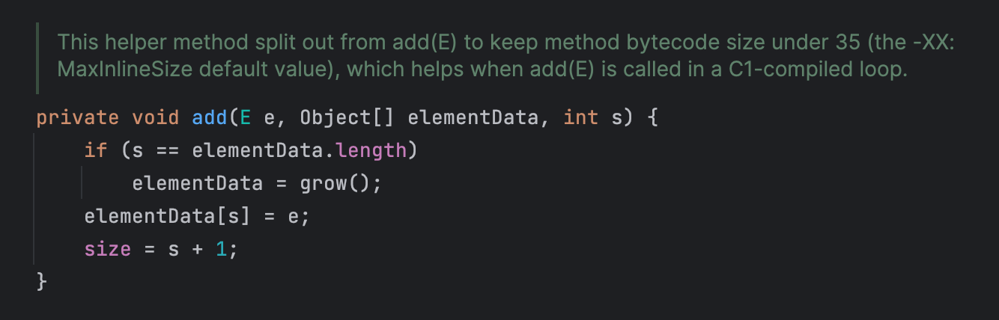
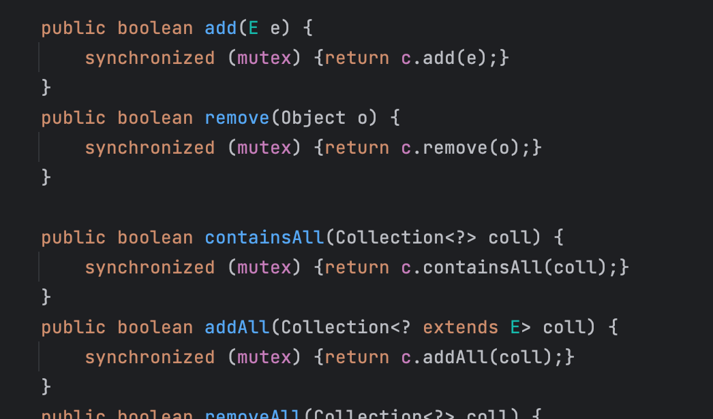
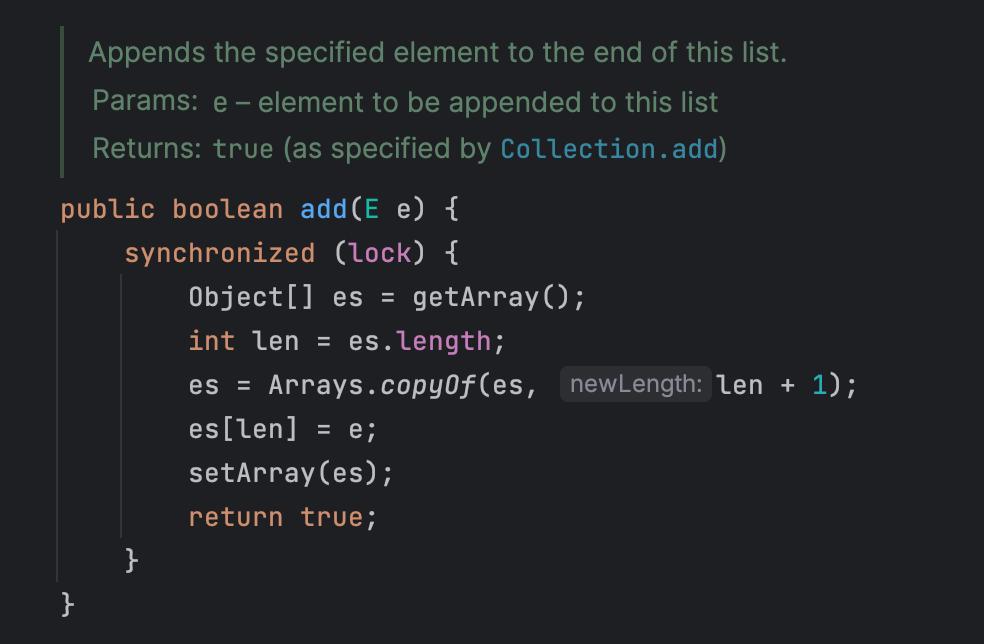
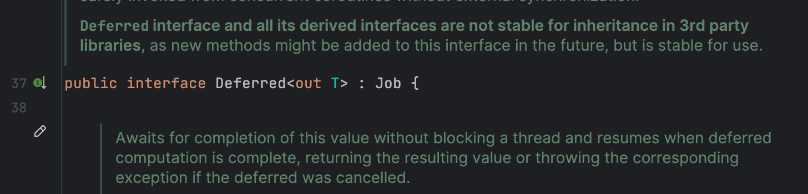

회사에서 대규모 데이터 처리의 성능 향상을 위해 코틀린 코루틴을 자주 사용하는데, 예전에 이런 동시성 환경에서 컬렉션을 잘못다루어 문제를 겪은적이 있었다. 이 포스팅에서는 이때 경험을 되살려 코틀린 동시성 환경에서 안전하게 컬렉션을 다루는 여러 방법을 소개한다.

## 동시성 이슈 발생 사례

### 단일 쓰레드에서의 작업

우리가 100개의 유저 ID 리스트를 가지고 있는데, 이 ID 리스트를 사용하여 외부 API 호출을 통해 실제 유저 데이터를 가져와야 한다고 가정하자. 100개정도면 병렬 처리를 하지 않아도 금방 작업이 끝날테니, 우리는 아래와 같이 코드를 작성하였다.

```kotlin
val userIds = (1..100L).toList()
val users = userIds.map { userId ->
    userClient.getUserById(userId)
}
```

쓰레드는 하나이므로 별 문제없이 코드가 실행된다. 그런데 만약 1만개, 10만개 규모의 데이터를 처리해야 하는 요구사항이 추가된다면? 싱글 쓰레드로는 턱도 없을 것이다. 따라서 멀티 쓰레드를 사용한 병렬처리를 고려하게 된다.

### 멀티 쓰레드에서의 문제 발생

코루틴을 사용하여 아래와 같이 코드를 작성해보자.

```kotlin
val userIds = (1..10_000L).toList()
val users = mutableListOf<User>()

runBlocking(Dispatchers.Default) {
    userIds.forEach { userId ->
        launch {
            users.add(userClient.getUserById(userId))
        }
    }
}
```

각각의 코루틴이 병렬적으로 외부 서버를 호출하여 유저를 얻어오고, `users` 리스트에 잘 추가했을 것 같다. 잘 동작했는지 `users` 리스트의 사이즈를 확인해보자.

```kotlin
println("users.size = ${users.size}")
// users.size = 8534
```

어라, 예상과 다르게 리스트의 사이즈는 1만개가 아니다. 왜 이런 문제가 발생했을까?

### ArrayList 구현 살펴보기

위 문제의 원인을 알기 위해서는 ArrayList 내부 구현을 살펴봐야한다.

> `mutableListOf()` 는 빈 `MutableList` 인터페이스를 반환하는데, `ArrayList` 가 `MutableList` 의 구현체로 사용된다.



위는 ArrayList의 `add()` 메소드가 호출되었을 때 실행되는 코드 중 일부이다. 파라미터 `s` 에는 ArrayList 가 실제로 몇개의 요소를 가지고 있는지를 나타내는 `size` 값이 세팅된다. 그리고 elementData 라는 Object 배열의 `s` 번째 인덱스로 새로운 요소를 추가한다. 그리고 `size` 를 s 보다 1 큰값으로 설정한다.

여기서 동시성 이슈가 발생한다. 같은 값이 파라미터 `s` 에 세팅되어 들어오면, elementData의 동일한 인덱스로 값이 설정될 것이고, 먼저 해당 인덱스에 저장된 값을 잃어버린다.

이 문제는 비단 ArrayList 뿐만 아니라, 동시성 처리가 되어 있지 않은 Java Collection Framework 구현체(e.g. LinkedHashSet, LinkedHashMap)에서도 비슷하게 발생한다. 따라서 멀티 쓰레드 환경에서는 사용하려는 컬렉션 구현체가 Thread-Safe 한지 잘 확인해야한다.

## 동시성 제어 메커니즘 사용

> Mutex, Monitor 등의 개념은 **[경쟁상태, 임계영역의 개념과 동기화를 위한 여러 상호배제 기법 (mutex, semaphore, monitor)](https://hudi.blog/race-condition-critical-section-mutual-exclusion/#%EB%8F%99%EA%B8%B0%ED%99%94-synchronization%EB%A5%BC-%EC%9C%84%ED%95%9C-%EC%83%81%ED%98%B8-%EB%B0%B0%EC%A0%9Cmutual-exclusion)** 포스트를 참고

### Synchronized

자바에서는 Monitor라는 상호 배제 매커니즘을 제공한다. Monitor를 쉽게 설명하자면, Java 언어 레벨에서 자체적으로 고수준으로 제공하는 일종의 Mutex 이다. Java 에서는 객체마다 Monitor 를 소유하고 있고, 이 Monitor 를 사용해서 임의의 임계 영역에 동시에 하나의 쓰레드만 진입할 수 있도록 제어할 수 있다.

자바에서는 `synchronized` 키워드를 사용하여 함수 자체를 임계 영역으로 만들거나, `synchronized` 블럭을 사용하여 블럭 내부를 임계 영역으로 만들 수 있다. 이는 코틀린에서도 비슷한데, 함수에 `@Synchronized` 어노테이션을 붙이거나, (자바와 동일하게) `synchronized` 블럭을 사용하는 방식을 사용할 수 있다.

```kotlin
val userIds = (1..10_000L).toList()
val users = mutableListOf<User>()

runBlocking(Dispatchers.Default) {
    userIds.forEach { userId ->
        launch {
            synchronized(users) {
                users.add(userClient.getUserById(userId))
            }
        }
    }
}
```

위와 같이 `synchronized` 함수 파라미터로 모니터를 획득할 객체를 전달해야한다. 여기서는 `users` 를 전달한다.

### Mutex

앞서 Monitor 설명에서 언급된 Mutex 를 직접 사용하는 방법도 있다. kotlinx.coroutines 에서는 직접 Mutex 를 사용할 수 있도록 `Mutex` 인터페이스를 제공한다.

```kotlin
val mutex = Mutex()

runBlocking(Dispatchers.Default) {
    userIds.forEach { userId ->
        launch {
            mutex.withLock {
                users.add(userClient.getUserById(userId))
            }
        }
    }
}
```

직접 `mutex.lock()` 과 `mutex.unlock()` 을 사용해서 락을 잠그고 해제할수도 있지만, `withLock` 을 사용하면 Mutex 가 상호 배제를 보장할 수 있는 임계영역을 더 쉽게 만들 수 있다.

## Thread-Safe 한 Collection 사용

앞서 해본것처럼 우리가 직접 상호배제 메커니즘을 사용하여 동시성 이슈를 해결해볼수도 있지만, 이미 잘 구현된 Thread-Safe 한 Collection 을 사용하는 방법이 더 좋다.

### 동기화된 컬렉션 (Synchronized Collection)

JDK 1.2 버전부터 Java Collection Framework 가 등장했는데, 이때 동기화된 컬렉션도 함께 등장했다.

```kotlin
Collections.synchronizedList(ArrayList<User>())
Collections.synchronizedSet(HashSet<User>())
Collections.synchronizedMap(HashMap<Long, User>())
```

사용법은 위와 같다.



이름에서 알 수 있듯 단순히 생성자로 받아온 컬렉션을 필드로 가지고 있고, `synchronized` 블럭을 사용하여 동시성을 제어한다. 이런 특징은 확실하게 동시성을 제어할 수도 있다는 장점을 가지고 있지만, 쓰레드가 동시에 진입해도 문제 없는 부분까지 동기화되어 성능이 좋지 않다. 따라서 요즘에는 잘 사용되지 않는 구현체이다.

```kotlin
val users = Collections.synchronizedList<User>(ArrayList())

runBlocking(Dispatchers.Default) {
    userIds.forEach { userId ->
        launch {
            users.add(userClient.getUserById(userId))
        }
    }
}
```

우리의 문제 상황에서 동기화된 컬렉션을 적용한다면, 위와 같이 코드를 작성할 수 있다.

### 동시성 컬렉션 (Concurrent Collection)

> 동기화된 컬렉션은 JDK 1.2 버전부터 제공되는데, 동시성 컬렉션은 JDK 1.5 버전 이후부터 제공되었다.

동시성 컬렉션은 위의 동기화된 컬렉션과 목적은 동일하지만, 모든 메소드의 전체를 동기화 블럭을 사용하는 것과 다르게, 더 복잡한 락 메커니즘이나 Non-Blocking 방식을 사용하여, 높은 성능을 유지하면서도 Thread-Safe 를 보장한다. 예를 들어 동시성 컬렉션 중 하나인 `ConcurrentHashMap` 의 경우, Map의 전체 데이터를 일정 세그먼트로 나누고, 세그먼트별로 별도의 락을 사용하는 방식을 사용하여, 락의 범위를 줄이고 락으로 인한 병목 현상을 개선하였다.

ArrayList 에 대응되는 동시성 컬렉션에는 `CopyOnWriteArrayList` 가 있다. Copy on Write 란, 이름 그대로 데이터를 쓸 때 복사하는 방식으로 동시성 환경에서 데이터를 읽을 때 발생할 수 있는 일관성 문제를 해결한다.

예를 들어보자. 어떤 리스트의 데이터를 쓰레드 T1, T2가 접근할 수 있다. T1은 리스트의 데이터를 순회하기 시작한다. 그런데 그 도중에 T2가 리스트의 값을 변경하고, 제거하고, 추가했다. T1은 리스트의 데이터를 일관적으로 가져올 수 있을까? 그렇지 않다. T1이 리스트를 순회하는 도중에 리스트가 변경되어 결과 또한 뒤죽박죽이 될 것이다.

여기서 Copy on Write 패턴을 적용해보자. T2가 리스트의 내용을 변경할 때, 리스트의 복사본을 새롭게 만들고, 해당 복사본에 변경을 반영한다. 그리고 이후 발생한 읽기 작업부터는 변경이 반영된 복사본을 읽어간다. 즉, T1은 최초에 읽어간 리스트를 모두 순회할 때 까지, 리스트에 대한 동일한 참조를 갖게되어 데이터 일관성 문제를 해결한다.

`CopyOnWriteArrayList` 는 리스트를 새롭게 복사하여 쓰기 작업이 수행된다는 특성 때문에, 읽기 작업이 많고 쓰기 작업이 적은 작업에서 유리하다. 그리고 Copy 하는 과정에서는 동기화를 보장해야하므로, `CopyOnWriteArrayList` 의 `add()` 메서드는 함수 전체에서 `synchronized` 블럭이 사용되었다. 그래서 사실 우리의 문제 상황에서는 `SynchronizedList` 를 사용하는 것 보다 크게 성능 향상이 이뤄지진 않을 것이다.



뭐, 일단 코드는 아래와 같이 작성해볼 수 있을 것이다.

```kotlin
val users = CopyOnWriteArrayList<User>()

runBlocking(Dispatchers.Default) {
    userIds.forEach { userId ->
        launch {
            users.add(userClient.getUserById(userId))
        }
    }
}
```

## 코루틴 async 사용

앞선 예제에서는 모두 코루틴 스코프 내부에서 `launch` 하여 병렬처리 하였는데, 사실 이런 작업에는 `async` 가 더 적절하다. 둘다 코루틴을 시작하는 함수이지만, `launch` 는 결과를 반환하지 않고, `async` 는 결과를 반환한다.

```kotlin
val job: Job = launch { users.add(userClient.getUserById(userId)) }
val deferred: Deferred<User> = async { userClient.getUserById(userId) }
```

위 코드처럼 `launch` 는 `Job` 을 반환한다. Job을 간단하게 설명한다면, 현재 코루틴 작업의 상태를 관리할 수 있는 객체라고 할 수 있다 (코루틴 깊숙이 들어가면 Job은 꽤 복잡한 개념이다). 반면 `async` 는 `Deferred` 를 반환한다. Deferred 는 Job 의 모든 기능을 포함하면서, 추가로 코루틴의 비동기 결과를 반환받을 수 있는 기능을 제공한다.



`Deferred` 는 `await()` 라는 메서드를 제공하는데, 이 메서드가 호출되면 해당 코루틴은 일시 중단(suspend)되고, 비동기 작업이 완료되면 `async` 로 시작된 비동기 작업의 결과는 `Deferred` 에 저장된다. 그 이후 일시 중단되었던 코루틴이 재개(resume)되고, `await()` 는 `Deferred` 에 저장된 결과값을 반환한다.

`Collection<Deferred<T>>` 타입은 `awaitAll()` 을 제공하는데, 컬렉션의 모든 Deferred 가 결과값을 가질 때 까지 기다린다. 따라서 아래와 같이 코드를 작성하면, 여러 비동기 작업의 결과를 깔끔하게 컬렉션으로 얻어올 수 있게 된다.

> Deferred의 동작은 자바의 CompletableFuture 와 비슷해보인다. 하지만 자바의 CompletableFuture의 경우 값을 얻기 위해 쓰레드를 Block 하는 반면, async는 Non-Blocking 방식으로 동작한다. 이것은 코루틴의 중요한 특징 중 하나이기도 하다. 이런 특징 덕분에 단순한 멀티 쓰레딩보다 코루틴을 사용하는 것이 더 성능면에서 좋다.

```kotlin
val users = runBlocking(Dispatchers.Default) {
    userIds.map {
        async {
            userClient.getUserById(it)
        }
    }.awaitAll()
}
```

별도의 컬렉션을 생성할 필요도, 동기화 문제를 걱정할 필요도 없이 깔끔하다.
