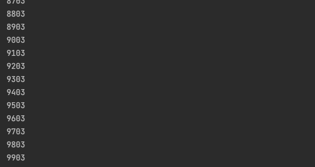
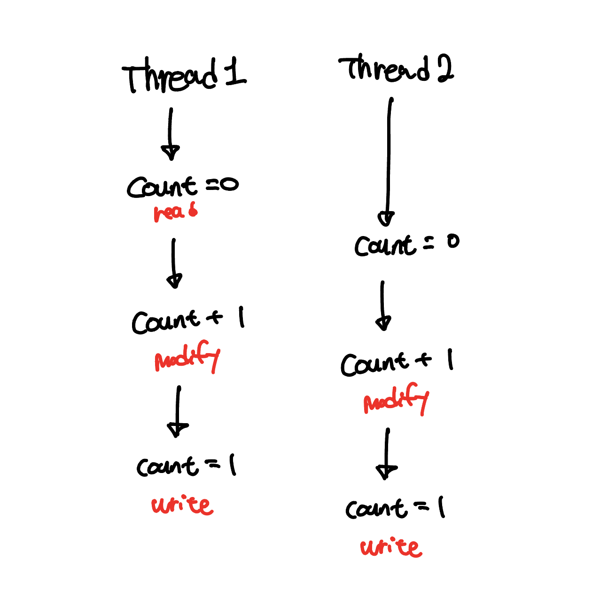
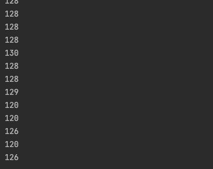
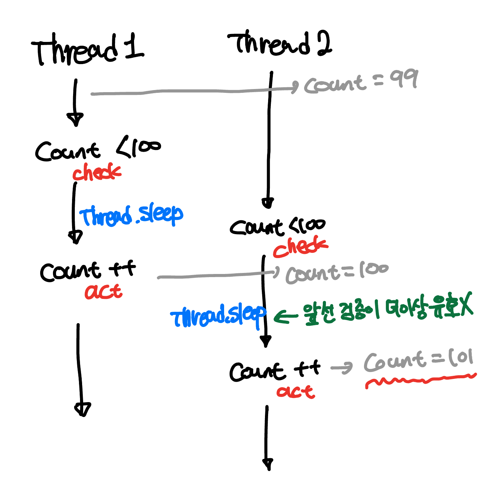

## 자바 동시성 이슈

싱글 쓰레드 애플리케이션에서는 하나의 쓰레드가 객체 하나를 사용하므로 동시성 이슈에 대해 걱정할 필요가 없다. 하지만, 우리가 자바를 통해 만드는 웹 애플리케이션은 일반적으로 멀티 쓰레드 환경에서 동작한다. 동시성 이슈는 멀티 쓰레드간 자원을 공유할 때 발생한다.

그리고 이 공유 자원에 여러 쓰레드가 동시에 접근하여 타이밍에 따라 결과가 달라질 수 있는 상황을 **경쟁 조건(race condition)**이라고 한다. 이 경쟁 조건은 크게 **Read-Modify-Write, Check-Then-Act** 이 두 가지로 구분할 수 있다고 한다. 이번 포스팅에서는 이 둘에 대해서 공부해보려고 한다.

## Read-Modify-Write

Read-Modify-Write는 **이전 상태를 기준으로 객체의 현재 상태를 변경하면서 발생하는 문제**를 이야기한다.

### 코드로 알아보기

일단 `Counter` 라는 객체를 하나 만들자. 이 객체는 별거는 없고, 그냥 `int` 형 변수를 하나 들고 있으면서 `add()` 메소드를 호출하면 그 변수에 값을 1 더하는 간단한 역할을 수행한다.

```java
public class Counter {

    private int count;

    public void add() {
        count++;
    }

    public int getCount() {
        return count;
    }
}
```

이제 위 객체를 공유자원을 만들 것이다. 아래의 코드를 살펴보자.

```java
@Test
void concurrencyTest() throws Exception {
    Counter counter = new Counter();

    Runnable add = () -> {
        for (int i = 0; i < 100; i++) {
            counter.add();
        }
        System.out.println(counter.getCount());
    };

    for (int i = 0; i < 100; i++) {
        (new Thread(add)).start();
    }

    Thread.sleep(100000); // 테스트 종료 방지
}
```

쓰레드를 100개 생성하고, 미리 생성한 `Counter` 의 `add()` 메소드를 100번 호출한다. 이 코드가 전부 실행되면, `Counter` 의 값은 얼마일까? 직관적으로는 **100개의 쓰레드가 100번 더하니 100 \* 100 즉 10,000**일 것이라는 생각이 든다. 하지만, 다들 알다시피 결과는 우리의 기대와 다르다.



이유가 무엇일까?

### 바이트 코드로 증감 연산자 분석

`Counter` 클래스의 `add()` 메소드를 다시 보자.

```java
public void add() {
    count++;
}
```

`++` 라는 증감 연산자가 사용되었다. 자바 코드로 보았을 때에는 한 줄이고, 따라서 한번의 연산만 발생할 것 같다. 하지만 과연 그럴까? 이 메소드의 바이트 코드를 살펴보자.

```java
public add()V
   L0
    LINENUMBER 8 L0
    ALOAD 0
    DUP
    GETFIELD com/example/xxx/Counter.count : I
    ICONST_1
    IADD
    PUTFIELD com/example/xxx/Counter.count : I
   L1
    LINENUMBER 9 L1
    RETURN
   L2
    LOCALVARIABLE this Lcom/example/xxx/Counter; L0 L2 0
    MAXSTACK = 3
    MAXLOCALS = 1
```

바이트 코드를 잘 몰라도 된다. 나도 바이트 코드 잘 모른다. 다만, 대략 읽어보니 증감 연산자는 실제로는 아래와 같이 여러 연산으로 실행되는 것을 확인할 수 있다.

1. `GETFIELD` 명령으로 `Counter` 의 `count` 값을 조회한다.
2. `ICONST_1` 과 `IADD` 명령으로 읽어온 값에 숫자 1을 더한다.
3. `PUTFIELD` 명령으로 `Counter` 의 `count` 값을 변경한다.

사실 `count++` 은 **원자성(atomic)**이 보장되지 않은 연산이었다. 위 일련의 연산 사이에 다른 쓰레드가 개입해버리면 기대하지 못한 결과가 발생할 수 있다.



위 그림에서는 두개의 쓰레드가 count 변수의 값을 각각 한번씩 더했다. 하지만, 읽기/수정/쓰기 의 타이밍 문제로 count 변수는 2가 아닌 1이 저장되게 된다. 위와 같은 경쟁상태의 형태를 **Read-Modify-Write** 이라고 한다.

## Check-Then-Act 패턴

Check-Then-Act 패턴은 **이전에 검증(check)한 결과가 행동(act) 시점에는 더이상 유효하지 않을 때** 발생하는 문제를 이야기한다.

### 코드로 알아보기

이번에는 `Counter` 가 아니라 `LimitedCounter` 라는 객체를 사용할 것이다. `Counter` 와 다르게 최대 100까지 숫자를 더할 수 있다.

```java
public class LimitedCounter {

    private int count;

    public void add() {
        try {
            if (count < 100) {
                Thread.sleep(10);
                count++;
            }
        } catch (InterruptedException ignored) {
        }
    }

    public int getCount() {
        return count;
    }
}
```

> Check와 Act간의 시간 차를 만들기 위해 임의로 `Thread.sleep` 을 사용하였다.

Read-Modify-Write에서 사용한 테스트 코드에서 구현체만 `LimitedCounter` 로 변경하고 그대로 실행해보자. 과연 `Counter` 의 값은 100을 초과하지 않을까? 예상했듯이 아래와 같이 100을 훌쩍 뛰어넘는 수가 `Counter` 에 저장된 것을 확인할 수 있다.



앞서 설명한 것과 같이 `if (count < 100)` 로 검증한 결과가 `count++` 를 실행할 시점에는 더이상 유효하지 않기 때문에 발생한 문제이다.



## 핵심은 원자성

이 문제가 발생한 원인의 핵심은 **원자성(atomic)이 보장되어 있지 않기 때문**이다. 원자성이란 공유 자원에 대한 작업이 **더이상 쪼갤 수 없는 하나의 연산인 것 처럼 동작**하는 것을 의미한다.

Read-Modify-Write 패턴에서의 증감 연산자도, Check-Then-Act 패턴에서의 if문과 명령도 하나의 연산인 것 처럼 동작하지 않았기 때문에, 명령과 명령 사이 시간차에 다른 쓰레드가 진입하게 되고 의도치 않은 결과를 낸것이다.

자바에서는 이런 원자성을 보장하기 위해 여러 방법을 지원한다. 다음 포스팅에서는 **블로킹 방식인 synchronized**와 **논블로킹 방식인 Atomic 타입**에 대해 다뤄보려고 한다.

## 참고

- [https://www.youtube.com/watch?v=ktWcieiNzKs](https://www.youtube.com/watch?v=ktWcieiNzKs)
