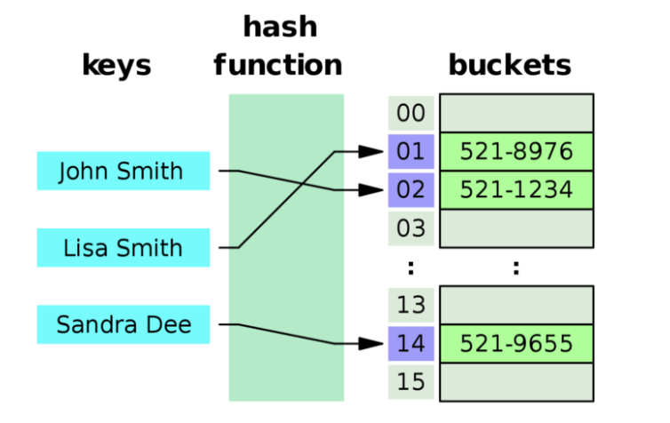

> 본 포스트는 [Do it! 자료구조와 함께 배우는 알고리즘 입문 : 파이썬 편](https://book.naver.com/bookdb/book_detail.nhn?bid=16419115)의 일부를 참고하여 작성하였습니다.

> 본 포스트는 저자가 학습하며 작성한 글 이기 때문에 틀린 내용이 있을 수 있습니다. 지적은 언제나 환영입니다.



## 1. 개요

### 1-1. 해시 테이블

해시 테이블 (또는 해시 맵 이라고도 한다) 은 1950년대에 등장했지만, 아직도 많은 곳에서 유용하게 사용되는 자료구조이다. 해시테이블은 데이터를 **Key-Value 쌍**으로 저장하는 자료구조이다. 대표적으로 Python 의 딕셔너리가 해시 테이블로 구현되어 있다.

해시 테이블은 Key 를 받아 임의의 해시 함수를 통해 도출된 해시 값을 배열의 Index 로 사용한다. 이런 방식을 통해 O(1) 이라는 아주 빠른 속도로 데이터에 접근할 수 있다. 하지만, Index 가 순서대로 사용되어 차곡차곡 데이터가 적재되지 않아 빈 공간이 생기고, 이는 공간의 낭비로 이어진다. 즉, 해시 테이블은 **공간과 시간이 Trade-Off** 의 관계에 있다. 공간으로 시간을 사는 개념이라고 보면 좋다.

해시 테이블의 배열의 각 원소를 **버킷 (Bucket)** 이라고 한다. 버킷의 개수는 고정적이다. 후술할 **해시 충돌** 을 해결하기 위해 각 버킷에는 링크드 리스트 등을 사용하여 여러 데이터를 저장하게 되는데, 이를 **슬롯 (Slot)** 이라고 한다. 한 버킷에는 여러개의 슬롯이 저장될 수 있으며, 슬롯의 개수는 가변적이다. 쉽게 생각하면 버킷은 행, 슬롯은 열 이라고 봐도 괜찮다.

### 1-2. 해시 함수

해시함수란 임의 길의의 데이터를 고정 길이의 데이터로 매핑하는 함수이다. 간단하게는 13 으로 나눈뒤 나머지를 구하는 함수도 해시함수라고 할 수 있다. 이런 해시함수를 사용하면 발생하는 문제가 한가지 존재하는데, 예를 들어 Key 값을 13 으로 나눈 나머지를 Index 로 사용하는 해시 테이블이 있다고 가정해보자. 또한 이 해시 테이블에는 현재 Key 가 5인 값이 들어가 있는 상황이다.

이 해시 테이블에 Key 가 18 인 데이터를 저장하려 해보자. 하지만, 18 의 해시 값도 5, 즉 Index 가 중복되기 때문에 **충돌 (Collision)** 이 발생한다.

해시함수는 1:1 관계가 아닌, 1:N 관계이기 때문에 발생하는 문제이다. 해시함수는 서로 다른 두 값을 해싱 했을 때, 무조건 다른 해시 값이 도출됨을 보장하지 않는다. 즉, 중복이 발생할 수 있다는 것이다.

해시 함수는 연산이 **빠르고**, **충돌이 적고**, **고르게 분포**될 수록 좋은 함수라고 평가 받는다.

### 1-3. 해시 충돌 대응

충돌을 대응하는 방식에는 아래와 같이 크게 두가지 방법이 있다.

- **Chaining**

  각 버킷에 대응하는 링크드 리스트를 생성하고, 버킷이 링크드 리스트의 가장 앞 노드를 바라보게끔 하여 충돌을 방지하는 방법이다. 해시 충돌이 발생했을 때 그저 같은 버킷 링크드 리스트의 마지막 노드로 해당 값을 추가해주기만 하면 된다. 열린 해시법이라고도 한다.
- **Open addressing**

  Chaining 방법과 다르게 한 버킷에는 하나의 Value 만 저장하며, 해시 충돌 시 Key 를 **재해싱(rehasing)** 하여 빈 버킷에 데이터를 저장하는 방법이다. 닫힌 해시법이라고도 한다.

## 2. Chaining 방식 구현하기 

이번엔 파이썬으로 직접 해시 테이블을 구현해보자. 사실 파이썬은 이미 딕셔너리라는 훌륭한 해시 테이블을 내장하고 있지만, 실 사용보다는 원리를 알아보는데에 목적이 있으므로 넘어가도록 한다.

첫번째로 구현할 방식은 Chaining 방식이다. 

### 2-1. Hash 값 구하기

파이썬에서 해시 테이블에서 사용되는 Key 값을 Hasing 하는 방법에는 여러가지가 있을 수 있다. 본 포스트에서는 해시 테이블의 크기로 나눈 값의 나머지로 Index 를 구할 것 이다. 하지만, Key 값이 꼭 정수형으로 들어온다는 보장은 없다. 따라서 `sha256` 을 이용하여 정수형이 아닌 데이터도 Hashing 하여 우리의 Index 규칙에 맞게 바꿔줄 것 이다.

```python
import hashlib

HASH_TABLE_SIZE = 13

def hash_value(key):
	if isinstance(key, int): # 만약 key 값이 정수형이라면
    return key % HASH_TABLE_SIZE # 해시테이블 크기로 나눈 나머지를 반환
  
  # 정수형이 아닌 값의 해싱
  return int(hashlib.sha256(str(key).encode()).hexdigest(), 16) % HASH_TABLE_SIZE
```

정수형이 아닌 Key 값은 `str(key).encode()` 를 통해 Byte 로 변환해주고, `hashlib.sha256(...).hexdigest()` 을 통해 해당 값을 sha256 으로 Hashing 한 뒤 16진수인 Digest 값을 가져온다. 그 다음 `int(..., 16)` 를 통해 16진수를 10진수로 바꿔준 다음 `% HASH_TABLE_SIZE` 연산을 해준다.

> 해시 함수를 통해 나온 결과값을 해쉬 값 혹은 다이제스트 (Digest) 라고 한다.

이 때, 해시 테이블의 크기로 나눈 나머지 값을 Index 로 사용하는 이유는 최대 Index 를 해시테이블 크기에 딱 맞게 계산할 수 있기 때문이다.

### 2-2. Node 클래스 정의

Chaining 방식으로 구현을 할 것이므로 각 버킷에 대응하는 링크드 리스트를 구현해야한다. 링크드 리스트의 각 노드를 담당하는 Class 를 우선으로 구현하자. 

```python
class Node:
    def __init__(self, key, value, next):
        self.key = key
        self.value = value
        self.next = next
```

`key` 와 `value` 그리고 다음 노드를 가리키는 `next` 를 멤버변수로 하는 `Node` 클래스를 정의해주었다.

### 2-3. ChainedHash 클래스 정의

```python
class ChainedHash:
    def __init__(self, size):
        self.size = size
        self.table = [None] * self.size

    def hash_value(self, key):
        if isinstance(key, int):
            return key % self.size
        return int(hashlib.sha256(str(key).encode()).hexdigest(), 16) % self.size
```

해시 테이블의 크기인 `size` 와 버킷으로 사용될 `table` 을 멤버 변수로 갖는 `ChainedHash` 클래스를 정의하였다. 그리고 위에서 미리 만들어둔 `hash_value` 함수를 메소드로 넣어주었다. 

> hashlib 이 import 되어있어야 한다.

### 2-4. add (추가) 메소드 정의

```python
def add(self, key, value):
    hash = self.hash_value(key)
        
    pointer = self.table[hash]
    while pointer != None:
        if pointer.key == key:
            return False
        pointer = pointer.next

    self.table[hash] = Node(key, value, self.table[hash])
    return True
```

`key` 를 파라미터로 받아와 해싱한다. 그 해시 값을 Index 로 버킷에 접근한다. 포인터 변수를 하나 두고, 원하는 `key` 에 해당하는 노드를 찾을 때 까지 탐색한다. 노드를 찾으면 이미 중복된 키가 존재하는 경우이므로 삭제 실패, `False` 를 반환한다. 노드를 찾지 못한 경우 키가 중복되지 않으므로 `self.table` 에 Index 로 접근해 나중에 추가된 노드가 링크드 리스트 가장 앞에 오도록 노드를 추가한다. 

### 2-5. search (탐색) 메소드 정의

```Python
def search(self, key):
    hash = self.hash_value(key)

    pointer = self.table[hash]
    while pointer != None:
        if pointer.key == key:
            return pointer.value
        pointer = pointer.next
        
    return None
```

`add` 메소드와 같은 방법으로 버킷을 찾고 버킷이 가리키는 링크드 리스트를 탐색하며 일치하는 키의 노드를 찾으면 그 노드의 `value` 를 반환한다. 찾지 못하면 `None` 을 반환한다.

### 2-6. remove (제거) 메소드 정의

```python
def remove(self, key):
    hash = self.hash_value(key)
        
    pointer = self.table[hash]

    # 버킷의 첫번째 노드와 주어진 Key 가 일치하면
    if pointer.key == key:
        # 해당 버킷을 None 으로 만듦
        self.table[hash] = None
        return True

    # 버킷의 첫번째 노드와 주어진 Key 가 일치하지 않으면
    else:
        # 다음 노드가 None 일때까지 반복 (버킷의 마지막 노드의 직전 노드까지 반복) 
        while pointer.next != None:
            # 다음 노드의 키가 주어진 key 와 일치하면 반복 탈출
            # 즉 최종적으로 pointer 는 삭제 대상 노드의 전 노드를 가리킴
            if pointer.next.key == key:
                break
            pointer = pointer.next
        
    # 다음 노드가 None 인 경우는
    # (1) 제거 대상이 버킷의 첫번째 노드 일때
    # (2) 버킷의 모든 노드를 탐색하였지만 제거대상을 찾지 못했을 때
    #     즉, 제거대상이 테이블에 존재하지 않을 때
    # 아래 코드는 (2) 의 경우를 처리함
    if pointer.next == None:
        return False

    # 가리키고 있는 노드의 다음 노드를 다다음 노드로 교체, 즉 삭제
    pointer.next = pointer.next.next
    return True
```

줄글로 설명하기에 조금 복잡하여 주석으로 대체하였다. 사실상 링크드 리스트의 노드 삭제 방법과 일치한다.

## 3. Open Addressing 방식 구현하기

위에서 Open Addressing 방식은 해시 충돌이 발생하였을 때, 재해싱 한다고 하였다. 더 자세히 이야기 하자면, 충돌이 발생한 버킷의 다음 버킷을 탐색하고, 또 충돌한다면 그 다음 버킷을 탐사하는 과정을 반복하는 **선형 탐사 (Linear Probing)** 를 하는 방식이다.

Chaining 방식과 다르게 링크드 리스트와 같은 추가적인 메모리를 사용하지 않고, 빈 버킷을 탐색하여 데이터를 저장하는 방식이기 때문에 메모리를 덜 사용하게 되는 이점이 존재한다.

참고로 파이썬의 Dictionary 는 Open Addressing 방식을 채택했다고 한다.

### 3-1. 버킷 상태 열거형 클래스 정의

```python
from enum import Enum
import hashlib

class Status(Enum):
    OCCUPIED = 0
    EMPTY = 1
    DELETED = 2
```

버킷의 상태는 크게 `점유됨 (OCCUPIED)`, `비어있음 (EMPTY)`, `삭제됨 (DELETED)` 으로 구분한다. 삭제됨 상태를 굳이 구분한 이유는 따로 있다.

데이터를 추가하는 중 3번째 버킷에서 충돌이 발생하여, 재해싱 후 4번째 버킷에 데이터를 등록한 상황을 가정해보자. 그리고 그 이후 3번째 버킷이 삭제되었다고 해보자. 이 때 `DELETED` 상태가 따로 정의되지 않은 상황이라면, 3번째 버킷에는 `EMPTY` 상태를 지정할 수 밖에 없다. 이런 경우 4번째 버킷을 검색할 때, 최초 해시값은 3번째 버킷과 일치할 텐데, 해당 버킷은 상태가 `EMPTY` 일테고 데이터가 없다고 판단되어 검색은 실패되고 종료될 것 이다. 

즉, DELETED 상태는 *'이 버킷은 비어있긴 한데, 해시 충돌로 재해싱되어 다른 버킷에 저장된 데이터가 있으니까 선형탐사해봐'* 라고 전달하는 것과 동일하다.

### 3-2. Bucket 클래스 정의

```python
class Bucket:
    def __init__(self, key = None, value = None, stat = Status.EMPTY):
        self.key = key
        self.value = value
        self.stat = stat

    def set(self, key, value, stat):
        self.key = key
        self.value = value
        self.stat = stat

    def set_status(self, stat):
        self.stat = stat
```

해시 테이블의 각 원소로 사용될 Bucket 클래스를 정의한다. `key` , `value` 그리고 상태를 나타내는 `stat` 멤버 변수를 가지고 있으며, 필드 전체를 설정할 수 있는 `set` 메소드와 상태만을 설정하는 `set_status` 메소드가 정의되어 있다.

### 3-3. OpenHash 클래스 정의

```python
class OpenHash:
    def __init__(self, size):
        self.size = size
        self.table = [Bucket()] * self.size
    
    def hash_value(self, key):
        if isinstance(key, int):
            return key % self.size
        return int(hashlib.sha256(str(key).encode()).hexdigest(), 16) % self.size
```

Chaining 방식과 동일하게 해시 테이블의 길이인 `size` 와 각 원소가 저장될 배열 `table` 를 정의한다. 단, 이때 각 원소는 위에서 정의한 `Bucket` 클래스를 사용한다. 또한 똑같이 `hash_value` 메소드를 정의한다.

### 3-4. rehash_value (재해싱) 메소드 정의

위 OpenHash 클래스 `hash_value` 메소드 아래에 계속 이어 작성한다.

```Python
def rehash_value(self, key):
    return (self.hash_value(key) + 1) % self.size
```

재해싱하는 메소드 `rehash_value` 를 정의한다. 기존의 해시값에 1을 더해 다시 나머지 연산으로 해시하는 함수이다. 즉 한칸 오른쪽의 버킷을 가리키게 된다. 단, 기존의 해시값이 가장 마지막 버킷을 가리킨다면, 나머지 연산으로 인해 첫번째 버킷을 가리키게 된다.

### 3-5. search_node (노드 검색) 메소드 정의

```Python
def search_node(self, key):
    hash = self.hash_value(key)

    pointer = self.table[hash]
    for i in range(self.size):
        # 버킷이 비어있을 때는 None 반환
        if pointer.stat == Status.EMPTY:
            break
        # 버킷이 할당되어있고, Key 까지 일치하면 지금 가리키고 있는 버킷 반환
        elif pointer.stat == Status.OCCUPIED and pointer.key == key:
            return pointer

        # (1) 버킷이 할당되어 있으나 Key 가 일치하지 않을 떄
        # (2) 지금 가리키고 있는 버킷은 삭제되었지만,
        #     재해싱하여 다른 버킷에 저장된 데이터가 있을 때 (stat == DELETED)
        hash = self.rehash_value(hash)
        p = self.table[hash]
    return None

def search(self, key):
    pointer = self.search_node(key)
    if pointer is not None:
        return pointer.value
    else:
        return None
```

테이블에서 버킷을 검색해 일치하는 버킷을 반환하는 `search_node` 메소드와, 일치하는 버킷의 `value` 를 반환하는 `search` 메소드를 정의한다.

`search_node` 메소드를 살펴보자. 일단, 버킷의 크기만큼 반복한다. 그리고 `pointer` 가 최초로 가리키는 버킷은 최초 해시값에 해당하는 버킷일 것 이다. 만약 그 버킷이 `EMPTY` 라면, 더 검색해볼 필요 없이 `None` 을 반환하면 된다. 그렇지 않고, 버킷이 점유되어 있으며 `key` 까지 일치한다면 검색에 성공하였으므로 해당하는 버킷을 반환한다.

만약 (1) 버킷이 할당되어 있지만 `key` 는 일치하지 않을때 (2) 지금 가리키고 있는 버킷은 삭제되었지만, 재해싱되어 다른 버킷에 데이터가 있는 경우 ( `stat == Status.DELETED` ) 일때는 재해싱하여 선형탐사를 해야한다. 이 때, 최대 *버킷의 크기 - 1* 번 선형탐사를 하게 되고, `elif` 절의 조건과 만족하게 되면 해당 버킷을 반환한다.

### 3-6. add (추가) 메소드 정의

```python
def add(self, key, value):
    # 이미 중복된 키가 존재
    if self.search(key) is not None:
        return False

    hash = self.hash_value(key)
    pointer = self.table[hash]
    for i in range(self.size):
        if pointer.stat == Status.EMPTY or pointer.stat == Status.DELETED:
            self.table[hash] = Bucket(key, value, Status.OCCUPIED)
            return True
        hash = self.rehash_value(hash)
        pointer = self.table[hash]
        
    return False
```

먼저 `search` 메소드로 이미 같은 `key` 를 가지고 있는 버킷이 있는지 검색한다. 중복된 `key` 가 없다면 추가를 진행한다.

추가할 때도 `search_node` 메소드와 마찬가지로 충돌 발생 시 (버킷이 `EMPTY` 혹은 `DELETED` 가 아닌 경우) 재해싱하여 비어있는 버킷에 값을 할당하는 작업을 진행한다. 만약 해시 테이블의 모든 원소에 추가 시도를 하였으나, 실패한 경우 버킷 용량이 부족한 것으로 판단되어 `False` 를 반환한다. 

### 3-7. remove (삭제) 메소드 정의

```python
def remove(self, key):
    pointer = self.search_node(key)
        
    # 등록되지 않은 키의 삭제는 실패
    if pointer is None:
        return False
    pointer.set_status(Status.DELETED)
    return True
```

`search_node` 메소드로 등록되지 않는 키 여부를 확인한 뒤, 등록된 키라면 해당 버킷의 상태를 `DELETED` 로 변경한다.

## 마치며

이렇게 파이썬에서 간단히 해시 테이블을 구현해보며 공부해보았다. Javascript 의 Object, Python 의 Dictionary 등 내장된 해시 테이블 자료구조가 어떻게 동작하는지 알고있지 않았는데, 이 기회에 좀 더 깊은 지식을 얻게 되어 즐거웠다 😊
