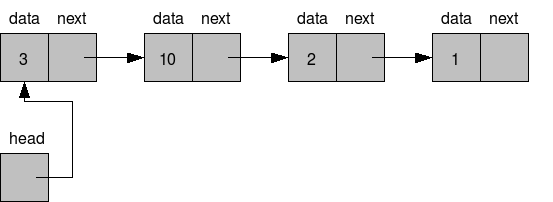

> 본 포스트는 [Do it! 자료구조와 함께 배우는 알고리즘 입문 : 파이썬 편](https://book.naver.com/bookdb/book_detail.nhn?bid=16419115)의 일부를 참고하여 작성하였습니다.

> 본 포스트는 저자가 학습하며 작성한 글 이기 때문에 틀린 내용이 있을 수 있습니다. 지적은 언제나 환영입니다.



## 1. 배열 (Array) 과 리스트 (List)

링크드 리스트를 이야기하기 전에 **배열 (Array)** 와 **리스트 (List)** 의 컴퓨터 공학적인 개념부터 잠깐 짚고 넘어가고자 한다. 이 둘은 비슷하여 용어가 혼동되어 사용되기도 한다. 하지만 실제 구현을 보면 이 둘은 명확한 차이가 있다.

배열은 메모리 상에서 **연속적인 공간을 할당**받아 데이터를 저장한다. 배열은 원소에 접근할 때 **'인덱스 (Index)'** 라는 개념을 사용한다. 배열에서의 인덱스는 원소의 데이터 주소를 가리키는 유일무이한 식별자이다. 이를 통해 아주 빠르게 특정 원소에 접근할 수 있다는 장점이 있다. 하지만, 이런 특징으로 인해 중간에 있는 원소 삽입/삭제가 느리다. 대상 원소의 뒤 원소들의 모든 위치를 변경해주는 추가 작업이 필요하기 때문이다.

반면, 리스트의 각 원소는 메모리 상 연속적인 공간에 할당되지 않을 수 있다. 즉, 첫번째 원소의 주소를 알더라도 그 다음 원소의 주소를 단순히 계산할 수 없다는 의미이다. 리스트의 각 원소는 다음 원소를 가리키는 **'포인터 (Pointer)'** 등을 사용하여 각 원소의 순서를 구현한다. 이런 특징으로 배열보다 데이터의 삽입/삭제가 빠른 편이다. 앞, 뒤 원소의 포인터만 바꿔주면 되기 때문이다. 하지만, 인덱스를 사용하여 특정 원소에 직접 접근이 불가능하기 때문에 원소를 검색하기 위해서는 첫번째 원소부터 **선형 검색 (Linear Search)** 해야하는 단점이 있다.

### 1-1. 파이썬에서의 리스트

혼동해서는 안되는 점은 파이썬에서 사용되는 리스트는 위에서 언급한 컴퓨터 공학적인 의미와 다르다. 파이썬에서 기본 제공되는 리스트는 실제 메모리 공간에 모든 원소를 연속적으로 배치하는 **'배열'** 로서 구현되어 있다. 따라서 인덱스로 원소에 접근이 가능하다.

단, 실제 배열과 다르게 길이가 고정되어 있지 않아 데이터의 추가/삭제가 편리하다. 이는 파이썬이 리스트에서 실제 필요한 메모리 보다 조금 더 여유 있게 메모리를 마련해놓기 때문이다. 개념상 C++ 의 STL Vector, Java의 ArrayList 와 비슷하다고 볼 수 있다.

## 2. 링크드 리스트 (Linked List) 개요

리스트는 순서가 있는 데이터를 늘어놓은 형태의 자료구조를 의미한다. 이전 포스트에서 다뤄본 [스택과 큐](http://localhost:8000/ds-stack-queue/)도 리스트 자료구조에 속한다. 링크드 리스트는 각각의 데이터가 그 다음의 데이터를 가리키는 방식으로 순서를 구현한다.

링크드 리스트의 각 원소는 **노드 (Node)** 라고 한다. 각 노드는 데이터와 그 다음 노드를 가리키는 **포인터 (Pointer)** 를 가지고 있다. 링크드 리스트의 맨 앞과 맨 끝 노드를 각각 **머리 (Head)**, **꼬리 (Tail) 노드**라고 한다. 각 노드의 앞쪽 노드를 **전임 노드 (Predecessor Node)**, 뒤쪽 노드를 **후임 노드 (Successor Node)** 라고 한다.

## 3. 포인터를 이용한 링크드 리스트

포인터를 이용한 링크드 리스트에서는 각 노드가 후임 노드를 포인터 변수를 이용하여 가리키고 있는 형태이다. 따라서 각 노드는 포인터를 위한 추가 메모리 공간이 필요하다는 단점이 존재한다.

### 3-1. Node 클래스 정의

```Python
class Node:
    def __init__(self, data, next):
        self.data = data
        self.next = next
```

각 노드는 데이터를 담는 `data` 와 후임 노드를 가리키는 `next` 라는 포인터를 멤버 변수로 갖는다.

### 3-2. LinkedList 클래스 정의

```Python
class LinkedList:
    def __init__(self):
        self.no = 0 # 링크드 리스트의 길이
        self.head = None # 머리 노드
        self.current = None # 이터레이터에서 사용될 변수

    def __len__(self):
        return self.no
```

링크드 리스트의 길이인 `no` , 머리노드를 가리키는 `head` , 현재 주목하고 있는 노드를 가리키는 `current` 를 멤버 변수로 갖는 `LinkedList` 클래스를 정의한다. 이때, 링크드 리스트의 길이를 반환하는 `__len__` 메소드도 함께 구현한다.

### 3-3. search 메소드, \_\_conatins\_\_ 구현

```python
# 링크드 리스트에서 데이터 검색 후
# 데이터가 발견되면 그 위치를 반환하고, current 값을 해당 노드로 바꾼다
# 검색 실패시 -1을 반환
def search(self, data):
    count = 0
    pointer = self.head
    while pointer is not None:
        if pointer.data == data:
            return count
        count += 1
        pointer = pointer.next
    return -1

def __contains__(self, data):
    return self.search(data) >= 0
```

`search` 메소드는 노드를 head 부터 tail 까지 선형 탐색하며, 그 과정 중 파라미터로 받아온 데이터와 일치하는 노드를 발견했을 경우 해당 노드의 위치를 반환한다. Tail 노드까지 탐색했는데도 발견되지 않았다면 -1을 반환한다.

`__contains__` 메소드는 파라미터로 전달한 데이터가 링크드 리스트에 포함되어 있는지 판단하는 메소드로, `search` 메소드를 실행하고 그 반환 값이 0이상이면 포함됨, 미만이면 포함되지 않음으로 판단한다.

### 3-4. add_first, add_last 메소드 구현

```python
def add_first(self, data):
    pointer = self.head
    self.head = Node(data, pointer)
    self.no += 1

def add_last(self, data):
    pointer = self.head
    if pointer is None:
        self.add_first(data)
    else:
        # 꼬리 노드 탐색
        while pointer.next is not None:
            pointer = pointer.next

        pointer.next = Node(data, None)
        self.no += 1
```

`add_first` 와 `add_last` 는 각각 링크드 리스트 앞과 뒤에 노드를 추가하는 메소드이다.

`add_first` 는 링크드 리스트의 `head` 를 새로운 노드로 교체한 다음 이전에 `head` 가 가리키던 노드를 새로운 노드의 후임 노드로 설정한다.

`add_last` 는 `head` 가 비어있다면, 바로 `head` 에 새로운 노드를 추가한다. 그렇지 않다면 tail 노드까지 이동하여 tail 노드의 후임노드로 새로운 노드를 추가한다.

### 3-5. remove_first, remove_last 메소드 구현

```python
def remove_first(self):
    if self.head is not None:
        self.head = self.head.next
        self.no -= 1

def remove_last(self):
    if self.head.next is None:
        self.remove_first()
    else:
        cur_pointer = self.head
        pre_pointer = self.head
        while cur_pointer.next is not None:
            pre_pointer = cur_pointer
            cur_pointer = cur_pointer.next

        pre_pointer.next = None
        self.no -= 1
```

### 3-6. remove 메소드 구현

```python
def remove(self, data):
    if self.head is not None:
        if self.head.data == data:
            self.remove_first()
            return True

        pointer = self.head
        while pointer.next is not None:
            if pointer.next.data == data:
                pointer.next = pointer.next.next
                return True
            pointer = pointer.next
    return False
```

`remove` 메소드는 삭제할 데이터를 `data` 파라미터로 받아 head 노드부터 선형 탐색하여 데이터가 일치하는 노드가 발견되면, 직전 노드의 포인터를 발견노드의 포인터로 교체한다.

### 3-7. 이터레이터 (Iterator) 의 구현

파이썬의 str, list 등은 반복 가능한 **이터러블 (Iterable)** 객체이다. 링크드 리스트도 이와 같은 반복 가능한 이터레이터 (Iterator) 로 만들 수 있다. `__iter__` 와 `__next__` 를 추가로 정의하자.

> 어떠한 객체가 이터레이터인지 확인하는 방법은 `__iter__` 메소드를 가지고 있는지 확인하면 된다.

```python
def __iter__(self):
    self.current = self.head
    return self

def __next__(self):
    if self.current is None:
        raise StopIteration
    else:
        data = self.current.data
        self.current = self.current.next
        return data
```

위 코드를 추가하면 아래와 같이 구현된 링크드 리스트를 이터레이터로 사용할 수 있다.

```python
ll = LinkedList()

ll.add_last("a")
ll.add_last("b")
ll.add_last("c")
ll.add_last("d")

for item in ll:
    print(item)
```

## 4. 마치며

위에서 구현한 링크드 리스트는 단일 연결 리스트 (Singly Linked List) 라고 한다. 단일 연결 리스트는 각 노드별로 포인터가 하나밖에 존재하지 않는다. 이 외에도 노드에 앞뒤 노드를 가리키는 두개의 포인터가 있는 이중 연결 리스트 (Doubly Linked List) 와 Tail 노드가 Head 노드를 가리켜 원형의 형태를 갖고있는 원형 링크드 리스트 (Circular Linked List) 가 존재한다.

구현적인 측면에서는 노드를 생성하고 소멸시키는 비효율을 없애고자, 배열로 구현한 링크드 리스트도 존재한다. 이와 같은 링크드 리스트는 기회가 되면 추가로 다뤄보도록 하겠다.
