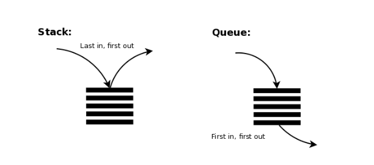

> 본 포스트는 [Do it! 자료구조와 함께 배우는 알고리즘 입문 : 파이썬 편](https://book.naver.com/bookdb/book_detail.nhn?bid=16419115)의 일부를 참고하여 작성하였습니다.

> 본 포스트는 저자가 학습하며 작성한 글 이기 때문에 틀린 내용이 있을 수 있습니다. 지적은 언제나 환영입니다.



## 1. 개요

스택 (Stack) 과 큐 (Queue) 는 모두 데이터를 임시 저장하기 위해 사용하는 자료구조이며, 데이터를 입력하고 출력하는 방향이 정해져있다. 스택, 큐는 서로 비슷한 점을 많이 가지고 있는 자료구조이다. 따라서 스택, 큐는 한 포스트내에서 동시에 다루기로 한다.

## 2. 스택 (Stack)

스택은 데이터의 입력과 출력이 **후입 선출 (FILO)** 방식을 따른다. 이름 (Stack) 그대로 데이터가 마치 프링글스 처럼 수직으로 차곡차곡 쌓아 올려지듯이 저장된다. 스택에 데이터를 넣는 작업을 **푸시 (Push)**, 그리고 데이터를 꺼내는 작업을 **팝 (Pop)** 이라고 한다.

> FILO 혹은 LIFO 은 각각 First In, Last Out 과 Last In, First Out 즉 **후입선출**을 의미한다.

### 2-1. 활용 예

그렇다면 스택은 어떤 상황에서 활용되기 적합할까? 후입 선출이라 함은 들어온 순서와 나가는 순서가 반대의 관계에 있음을 의미한다. 즉 특정한 순서의 작업을 반대로 되돌릴 때 유용하게 사용할 수 있을 것이다. 이런 예시에는 무엇이 있을까?

- 문서, 이미지 편집기 등에서 사용되는 Undo (Ctrl + z) 기능
- 웹브라우저의 뒤로가기 기능
- 문자열 뒤집기
- 후위표기법의 계산
- 재귀함수의 호출과 실행 _(실제로 재귀함수를 많이 호출하게되면 Stack Overflow 가 발생한다)_

여기서 후위표기법 계산에 대해서는 기회가 된다면 별개의 포스트로 다뤄보도록 하겠다.

## 3. 스택의 구현

```Python
stack = []

stack.append(1)
stack.append(2)
stack.append(3)

print(stack.pop()) # 3
print(stack) # [1, 2]
```

사실, 파이썬의 리스트는 `pop` 기본 지원하여 위와 같이 편리하게 스택처럼 사용할 수 있다. 하지만 본 포스트에서는 스택의 근본적인 원리를 공부하기 위해 직접 구현해보도록 한다.

### 3-1. Stack 클래스 정의

```python
class Stack:
    class Empty(Exception):
        pass

    class Full(Exception):
        pass

    def __init__(self, capacity):
        self.capacity = capacity # 스택 최대 용량
        self.stack = [None] * self.capacity # 스택으로 사용될 리스트
        self.pointer = 0 # 스택 포인터. 쌓여있는 데이터 '개수'를 나타냄

    def is_empty(self):
        # 포인터가 0을 가리키고 있다면, 그 스택은 비어있음
        # 오류를 대비하여 0 이하로 판단한다
        return self.pointer <= 0

    def is_full(self):
        # 포인터가 스택 용량과 동일한 값을 가리키고 있으면, 그 스택은 꽉 차있음
        # 오류를 대비하여 스택 용량 이상으로 판단한다
        return self.pointer >= self.capacity
```

스택 최대 크기인 `capacity` , 스택으로 사용될 리스트인 `stack` , 스택 포인터로 사용될 `pointer` 를 멤버 변수로 갖는 `Stack` 클래스를 정의한다.

> 스택 포인터란, 스택에 저장된 데이터의 **개수**를 가지고 있는 변수이다. 스택의 모든 작업은 이 스택 포인터를 기반으로 동작한다.

그리고 스택 포인터를 통해 스택이 비어있는지, 꽉 차 있는지를 확인하는 `is_empty` 메소드와 `is_full` 메소드도 정의한다.

최상단에는 이후 구현할 Push 와 Pop 메소드에서 예외처리시 사용될 Exception 클래스 `Empty` 와 `Full` 도 정의한다.

### 3-2. push, pop, peek 메소드 구현

```python
def push(self, value):
    if self.is_full():
        raise Stack.Full
    self.stack[self.pointer] = value
    self.pointer += 1

def pop(self):
    if self.is_empty():
        raise Stack.Empty
    self.pointer -= 1
    return self.stack[self.pointer]

def peek(self):
    if self.is_empty():
        raise Stack.Empty
    return self.stack[self.pointer - 1]
```

`push` 는 현재 스택 포인터가 가리키고 있는 값을 Index 로 하여 리스트에 값을 할당한고, 스택 포인터의 값을 하나 증가 시킨다. 만약 데이터를 추가 하기 전 이미 스택 리스트가 꽉 차있는 경우 `raise` 문으로 예외처리한다.

`pop` 은 현재 스택 포인터가 가리키고 있는 값에서 1을 빼고, 줄어든 스택 포인터를 Index 로 하여 리스트에 접근해 해당 값을 반환한다.

`peek` 는 스택 가장 위에 있는 값을 삭제하지 않고 반환만 하는 메소드이다.

### 3-3. clear 메소드 구현

```python
def clear(self):
    self.pointer = 0
```

`clear` 메소드는 스택의 데이터를 모두 삭제한다. 위에서 언급했듯, 스택은 스택 포인터를 기반으로 동작하기 때문에 실제로 모든 데이터를 리스트에서 삭제할 필요 없이 스택 포인터만 0으로 초기화 해주기만 하면 된다.

### 3-4. find, count 메소드 구현

```python
def find(self, value):
    # 현재 포인터부터 스택 최 하단까지 선형 검색
    for i in range(self.pointer -1, -1, -1):
        if self.stack[i] == value:
            return i
    return -1 # 검색 실패

def count(self, value):
    count = 0
    for i in range(self.pointer):
        if self.stack[i] == value:
            count += 1
    return count
```

`find` 메소드는 스택에서 특정 값의 데이터를 검색하고, 그 데이터의 위치를 반환한다. 이때, **현재 스택 포인터 (Top) 로부터 스택 최하단 (Bottom) 방향**으로 검색한다. 만약 `value` 에 해당하는 값이 검색되었다면 Index 를 반환하고, 검색에 실패하면 -1 을 반환한다.

> `range` 의 3번째 파라미터는 Step 값을 설정한다. -1 으로 설정하였으니 `range` 함수로 생성된 리스트의 값은 스택포인터부터 0까지 1씩 줄어들며 생성된다.

`count` 메소드는 스택에서 특정 값인 데이터의 개수를 반환한다. 이때는 굳이 Top to Bottom 으로 검색하지 않는다. 리스트의 0번째 원소부터 스택 포인터 -1 번째 원소까지 탐색하여 일치하는 값이 있을 때 마다 변수의 값을 1씩 더하여 최종 값을 반환한다.

### 3-5. \_\_len\_\_, \_\_contains\_\_ 메소드 구현

```python
def __len__(self):
    # 포인터가 가리키고 있는 개수 반환
    return self.pointer

def __contains__(self, value):
    # 특정 값이 스택에 저장되어 있는지에 대한 여부 반환
    if self.count(value) == 0:
        return False
    return True
```

`__len__` 메소드는 스택 포인터로 현재 스택에 적재된 데이터의 개수를 반환한다. `__contains__` 메소드는 특정 데이터가 스택에 저장되어있는지 여부를 반환한다.

둘다 메소드 이름이 조금 특이하다. 저런 형태를 **Double Leading and Trailing Underscores** 즉, 앞뒤로 있는 두개의 언더스코어라고 말한다. Double Underscore 는 줄여서 던더 (Dunder) 라고 말하기도 한다.

위와 같은 던더 컨벤션으로 메소드를 작성하는 경우는 **매직 메소드 (Magic Method, Special Method) 혹은 연산자를 오버로딩 (Overloading)** 할 때 사용한다. 예를 들어 위와 같이 정의된 `__len__` 과 `__contains__` 는 아래처럼 두가지 방법으로 사용될 수 있다.

```python
s = Stack(5)
s.push("apple")
s.push("banana")

print(s.__len__()) # 2
print(len(s)) # 2

print(s.__contains__("apple")) # True
print("banana" in s) # True
```

위와 같이 사용자 정의 클래스가 빌트인 함수 혹은 연산자를 커스터마이즈할 수 있다. 굉장히 Pythonic 하다.

## 4. 큐 (Queue)

큐는 데이터의 입력과 출력이 선입 선출 (FIFO) 방식을 따른다. 음식점 대기열과 같이 먼저 들어온 데이터가 먼저 나오게 된다. 큐에 데이터를 넣는 작업을 **인큐 (Enqueue)**, 꺼내는 작업을 **디큐 (Dequeue)** 라고 한다. 또한 데이터가 나오는 곳을 **프론트 (Front)** 그리고 데이터가 들어가는 곳을 **리어 (Rear)** 라고 한다.

큐는 프린터의 대기열 같이 순서가 있는 작업을 순차적으로 처리할 때 사용한다.

## 5. 큐의 구현

```python
queue = []

queue.append(1)
queue.append(2)
queue.append(3)

print(queue.pop(0)) # 1
print(queue) # [2, 3]
```

스택과 마찬가지로 파이썬 리스트의 `pop` 메소드를 활용하여, 리스트의 첫번째 원소를 제거하는 방식으로 편리하게 큐를 구현할 수 있다. 역시 마찬가지로 큐의 근본적인 원리를 공부하기 위해 직접 구현해보도록 한다.

이때 리스트에 단순히 데이터를 집어 넣는 방법 대신, 원형 버퍼 자료구조를 활용한 방법으로 큐를 구현할 것 이다. 리스트로 큐를 구현할때 enqueue 는 시간 복잡도 이슈가 발생하지 않지만, dequeue 시 맨 앞의 원소를 빼며 그 뒤에 있는 원소를 한칸 씩 앞으로 이동시켜야한다. 이때 시간 복잡도는 **O(N)** 이다. Dequeue 작업시 큰 시간 낭비가 발생하게 되는 것이다.

큐를 원형 버퍼로 구현하고, 변수로 처음과 끝의 위치를 지정해주면 **O(1)** 의 시간 복잡도로도 dequeue 처리가 가능하게된다.

### 5-1. Queue 클래스 정의

```Python
class Queue:
    class Empty(Exception):
        pass

    class Full(Exception):
        pass

    def __init__(self, capacity):
        self.no = 0 # 데이터 개수
        self.front = 0 # 맨 앞 원소 커서
        self.rear = 0 # 맨 끝 원소 커서 (enqueue 될 위치 (빈공간) 를 가리킴)
        self.capacity = capacity # 큐 최대 크기
        self.queue = [None] * capacity # 큐의 데이터가 저장되는 리스트

    def is_empty(self):
        return self.no

    def is_full(self):
        return self.no >= self.capacity
```

위에서 `Stack` 클래스 정의와 크게 다르지 않다. `Queue` 클래스는 큐에 쌓인 데이터의 개수 `no` , 큐의 맨 앞 그리고 맨 끝 커서를 나타내는 `front` 와 `rear` , 큐의 최대 크기를 나타내는 `capacity` 그리고 데이터가 저장되는 리스트 `queue` 를 멤버 변수로 갖고 있다.

`is_empty` 와 `is_full` 메소드는 `Stack` 의 구현과 비슷하다. 마찬가지로 큐가 비어있을 때, 꽉 차있을때의 예외 처리를 위한 Exception 클래스 또한 정의해뒀다.

### 5-2. enqueue, dequeue, peek 메소드 구현

```python
def enqueue(self, value):
    if self.is_full():
        raise Queue.Full
    self.queue[self.rear] = value
    self.rear += 1
    self.no += 1

    # list index out of range 를 방지하기 위함
    if self.rear == self.capacity:
        self.rear = 0

def dequeue(self):
    if self.is_empty():
        raise Queue.Empty

    value = self.queue[self.front]
    self.front += 1
    self.no -= 1

    # list index out of range 를 방지하기 위함
    if self.front == self.capacity:
        self.front = 0

    return value

def peek(self):
    if self.is_empty():
        raise Queue.Empty
    return self.queue[self.front]
```

`enqueue` 메소드는 큐 `rear` 에 데이터를 추가한다. `rear` 는 앞으로 데이터가 추가되면 데이터가 담길 원소를 가리키고 있다. `rear` 를 Index 로 하여 리스트에 `value` 를 할당하고, `rear` 와 `no` 에 1을 더한다.

데이터를 추가한 이후 `rear` 가 `capacity` 와 같다면 이후 데이터를 추가할 때 `list index out of range` 오류가 발생하게 된다. 이를 방지하기 위해 해당하는 경우 `rear` 를 0으로 설정한다. 이 작업은 큐 구현에 원형 버퍼를 사용하기 때문에 거쳐야 하는 과정이다.

`dequeue` 메소드는 `front` 가 가리키고 있는 값을 반환한다. 이 과정에서 `front` 에 1을 더하고, 저장된 데이터가 하나 사라지므로 `count` 는 1을 뺀다.

`peek` 메소드는 `front` 가 가리키고 있는 값을 반환하기만 한다. 스택의 `peek` 메소드와 동일한 역할이다.

### 5-3. find, count 메소드 구현

```python
def find(self, value):
    for i in range(self.no):
        # 큐의 front 에서 시작하여 rear 방향으로 탐색
        idx = (i + self.front) % self.capacity
        if self.queue[idx] == value:
            return idx
    return -1

def count(self, value):
    count = 0
    for i in range(self.no):
        # 큐의 front 에서 시작하여 rear 방향으로 탐색
        idx = (i + self.front) % self.capacity
        if self.queue[idx] == value:
            count += 1
    return count
```

`find` 메소드는 `value` 로 특정 값의 위치를 검색하여 반환하고, `count` 는 `value` 와 일치하는 데이터의 개수를 반환한다. 둘다 `no` 만큼 반복하며, `front` 위치에서 시작하여 `rear` 위치까지 탐색한다. 이는 `capacity` 개수만큼 탐색하는 것 보다 효율적이다. 이 과정에서 나머지 연산을 활용하여 `list index out of range` 를 방지함과 동시에 인덱스 범위가 초과된 경우 리스트의 처음부터 탐색하게 된다.

### 5-4. clear 메소드 구현

```python
def clear(self):
    self.no = self.front = self.rear = 0
```

스택 구현 시 스택 포인터만 0으로 초기화해준것과 마찬가지로 실제 데이터의 삭제 없이 `no`, `front`, `rear` 만 0으로 초기화해주면 된다.

### 5-5. \_\_len** , \_\_contains** 메소드 구현

```python
def __len__(self):
    return self.no

def __contains__(self, value):
    if self.count(value) == 0:
        return False
    return True
```

마찬가지로 스택의 구현과 비슷하다. 매직 메소드를 사용하여 `len` 함수와 `in` 연산자를 오버라이딩한다.

## 6. 덱 (Deque)

덱은 (데크 혹은 디큐로 읽기도 한다) **Double-Ended Queue** 의 약자로써, 이름와 같이 큐의 시작과 끝 양 끝 모두에서 데이터를 삽입하거나 출력이 가능한 자료구조이다. 스택의 성질과 큐의 성질 두가지를 동시에 가지고 있는 자료구조인 셈이다.

덱은 `collections` 모듈에서 `deque` 라는 클래스로 아주 잘 구현되어 있으므로 본 포스트에서는 구현까지는 다루지 않겠다. 해당 클래스는 추후 `collections` 모듈에 대해 전체적으로 공부하며, 그 내용을 블로그에 포스팅 해보려 하는데 그 때 다루게 될 듯 하다. 또한 덱의 구현 또한 기회가 된다면 다른 포스트에서 다뤄보도록 할 예정이다.
