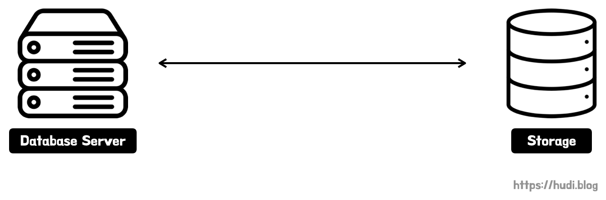
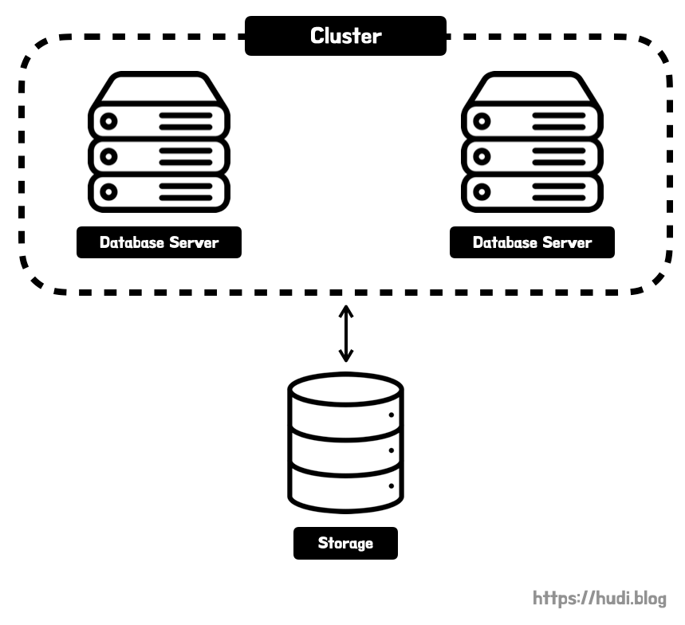
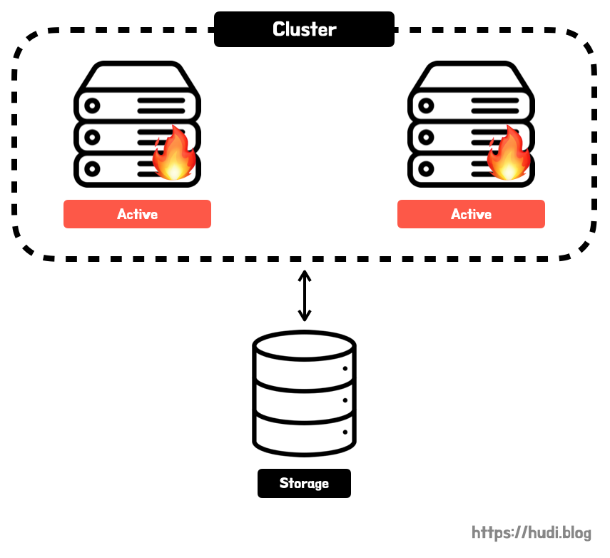
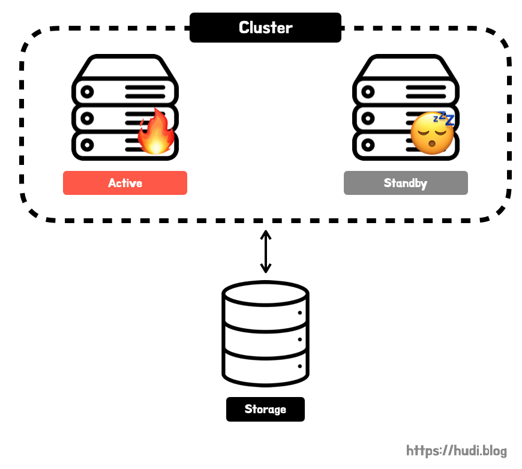

## 학습 배경

달록 서비스의 높은 가용성과 성능을 확보하기 위해 데이터베이스 다중화를 학습하고 있다. 지난번 포스팅으로 **[데이터베이스 레플리케이션](https://hudi.blog/mysql-replication/)**에 대해 학습하였다. 레플리케이션은 데이터베이스를 다중화하는데, 데이터베이스 서버를 소스(master) 서버와 여러대의 레플리카(slave) 서버로 수직적으로 구성하는 것이 특징이다. 소스 서버에는 원본 데이터가, 레플리카 서버에는 소스 서버 데이터의 복제본이 저장된다. 그리고 소스 서버에는 write(INSERT, UPDATE, DELETE) 연산을, 레플리카 서버에는 read(SELECT) 연산을 수행하도록 하여 부하를 분산한다.

데이터베이스 다중화를 학습해보면, 레플리케이션과 항상 같이 언급되는 클러스터링이라는 개념이 존재한다. 이번 포스팅에서는 데이터베이스 클러스터링에 대해서 알아보고, 달록에 어떤 방식의 데이터베이스 다중화를 사용할지 결정할 것이다.

> 이 포스팅은 어느 특정 데이터베이스 벤더에서 제공하는 클러스터링 기능이 아닌, **일반적으로 통용되는 데이터베이스 클러스터링 개념**에 대해 설명하고 있음을 참고하자. 또한 포스팅의 내용은 미크, 기무라 메이지의 책 ‘데이터베이스 첫걸음’을 참고하여 작성하였다.

## 데이터베이스 클러스터링

데이터를 영구적으로 보존해야하는 데이터베이스는 **영속 계층(persistence layer)**에 위치하여 필요 요건이 WAS에 비해 많다. 서버 메모리 등으로는 영속성을 만족할 수 없으므로 **외부 스토리지**를 사용하게 된다. 스토리지는 간단히 HDD나 SDD 등의 2차 메모리로 생각하자. 즉, **데이터베이스 서버는 스토리지와 묶어 생각**해야한다. 서버는 SQL을 실행하고, 스토리지는 데이터를 보존한다.

데이터베이스를 다중화 한다는 것은 여간 까다로운 작업이 아닐 것이다. 데이터베이스는 **정합성**이 굉장히 중요하기 때문이다. 무작정 데이터베이스 서버와 저장소를 늘렸다간, 어디에는 데이터가 추가되고 어디에는 데이터가 추가되지 않아 서비스에 장애가 발생할 것이다.

그렇다면 가장 간단하게 **데이터 스토리지는 하나로 두고, 데이터베이스 서버만 다중화하여 클러스터**를 구성하면 어떨까? 저장되는 공간이 하나이므로 정합성 이슈가 발생하지 않을 것이다. 이런 방식을 데이터베이스 클러스터링이라고 한다.

## 데이터베이스 클러스터링 종류

### (1) Active-Active

Active-Active 방식의 구성은 클러스터 내부의 데이터베이스 서버가 **모두 동작하는(active) 상태**로 운영하는 클러스터링이다. 이렇게 서버를 모두 active 상태로 두게되면, 하나의 서버가 동작 불능이 되어도 나머지 서버가 작업을 그대로 진행할 수 있으므로 **downtime이 없다**. WAS 클러스터링의 장점과 동일하다. 또한 모든 서버가 active 상태이므로, **부하를 분산**하여 처리 성능이 향상을 기대할 수 있다.

하지만 이런 특성으로 그만큼 비용이 많이 발생할 수 있다. 또한 클러스터의 서버 대수를 늘리면 서버 대수에 정비례하여 처리 성능이 향상될 것 같지만, 데이터베이스 스토리지는 결국 하나이므로 데이터베이스 스토리지에서 병목이 발생할 수 있다.

> (참고) Active-Active 구성이 가능한 DBMS는 Oracle과 DB2 뿐이다. 다른 DBMS는 후술할 Active-Standby 구성만 대응할 수 있다.

### (2) Active-Standby

Active-Standby 구성은 일부 데이터베이스 서버를 **대기상태(standby)**로 둔다. standby 서버는 평소에는 일을 하지 않으며, 지속적으로 active 서버가 정상 동작하는지 확인한다. 이를 **하트비트(heartbeat) 모니터링**이라고 한다. active 서버가 동작하지 않음이 확인되었을 때 stand-by 서버가 active 상태로 변경된다. 이를 **장애 극복 기능(failover)**이라고 한다. 말 그대로 실패(fail)를 끝내는(over) 작업이다.

stand-by에서 active 상태로 전환될때 수초에서 수분가량의 downtime이 발생한다. 즉, 가용성이 다소 떨어질 수 있다. 대신 active - active 방식 보다는 비용을 절감할 수 있다.

이 방식은 또 다시 **Hot Standby 방식과 Cold Standby 방식**으로 나뉜다. Hot Standby 방식은 standby 서버를 **항상 가동 상태**로 두는 방식이다. active 서버의 장애 발생 시 즉각 failover 하여 downtime을 줄일 수 있지만, 그만큼 비용이 많이 발생할 것이다.

Cold Standby 방식은 standby 서버를 **평시에는 가동하지 않은 상태**로 두고, active 서버에 장애가 발생한 시점에 가동하여 failover 하는 방식이다. 이 방식은 특성상 비용이 적게 들겠지만, 그만큼 장애시 downtime은 길어질것이다.

## 클러스터링의 한계

클러스터링을 통해 데이터베이스 서버를 다중화하고 하나의 클러스터로 묶어 failover로 인한 downtime에 대응할 수 있게 되었다. 하지만, 여전히 **데이터 스토리지는 하나뿐인 한계점**이 존재한다. 데이터 스토리지 자체가 문제가 발생하면, 시스템 전체가 이용 불능 상태에 빠질 것이고 더 심하면 데이터 유실로까지 이어질 수 있다.

이런 문제를 해결하기 위해서는 레플리케이션을 통한 클러스터링 구성을 고려해야한다. 레플리케이션은 **[데이터베이스의 확장성과 가용성을 위한 MySQL Replication](https://hudi.blog/mysql-replication/)** 포스팅에서도 다뤘듯이 데이터 그 자체를 복제하여 모든 데이터베이스 인스턴스에 저장한다.

## 달록은 어떻게 할 것인가?

클러스터링을 사용하는 이유는 데이터베이스 서버를 다중화하여 성능을 향상시키고, 장애 대응을 하기 위함이다. 하지만, 이는 레플리케이션을 통해서도 충분히 가능하다. 심지어 레플리케이션은 데이터 자체를 복제하므로 하나의 데이터 스토리지로부터 발생하는 병목이 발생하지 않는다. 또한 레플리케이션도 소스(마스터) 서버 장애시 이를 확인하고, 레플리카(슬레이브) 서버를 소스 서버로 승격시켜 빠르게 장애대응을 할 수 있다고 판단된다. 다만, 조금 걸리는 점은 데이터를 중복으로 모든 인스턴스가 가지고 있다는 점이다. 다만, 우테코 환경에서는 인스턴스 생성에 제한이 없으므로 지금 우려할 부분이 아니라고 판단한다.

따라서 달록은 클러스터링의 모든 이점을 가지고 있으며, 더 큰 성능 향상을 기대할 수 있는 레플리케이션을 적용하기로 결정했다. 다음 포스팅에서는 MySQL + 스프링부트 환경에서 데이터베이스 레플리케이션을 적용하는 내용에 대해 다뤄보겠다.

## 참고

- 데이터베이스 첫걸음 - 미크, 기무라 메이지
