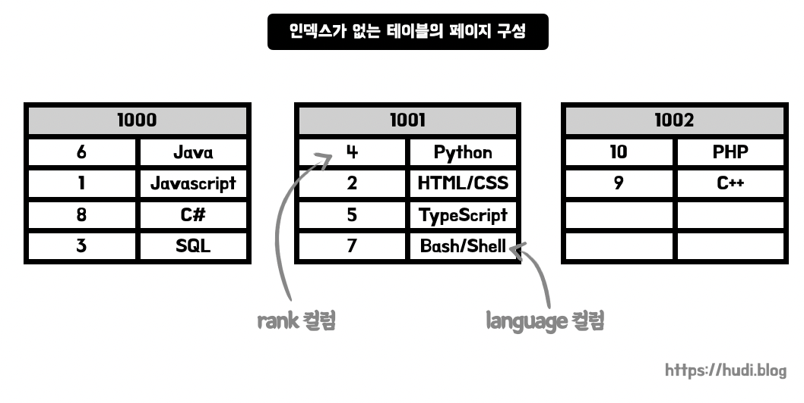
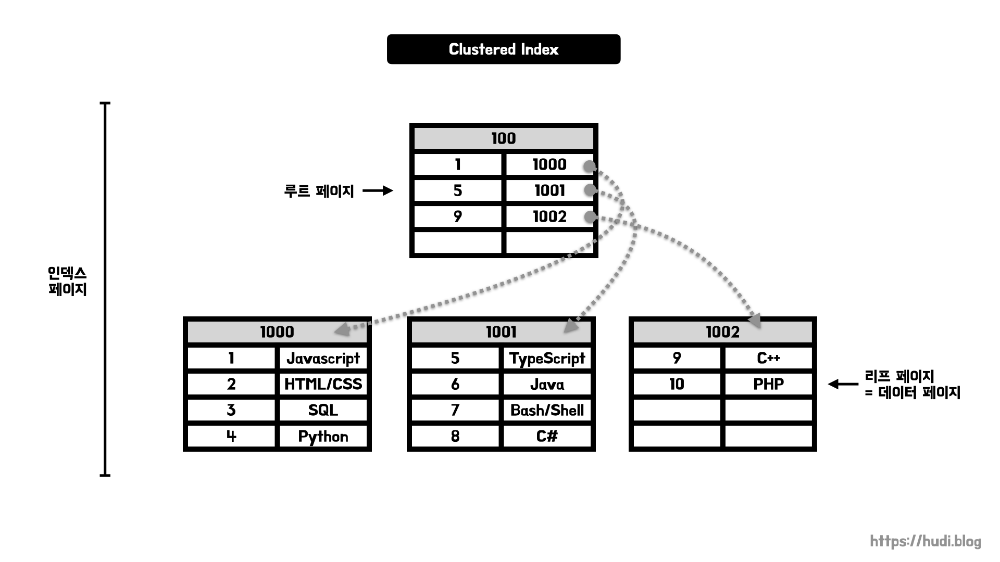
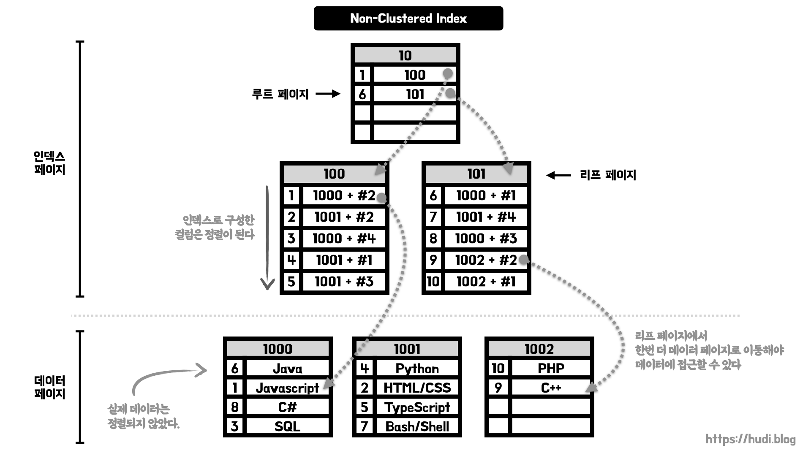
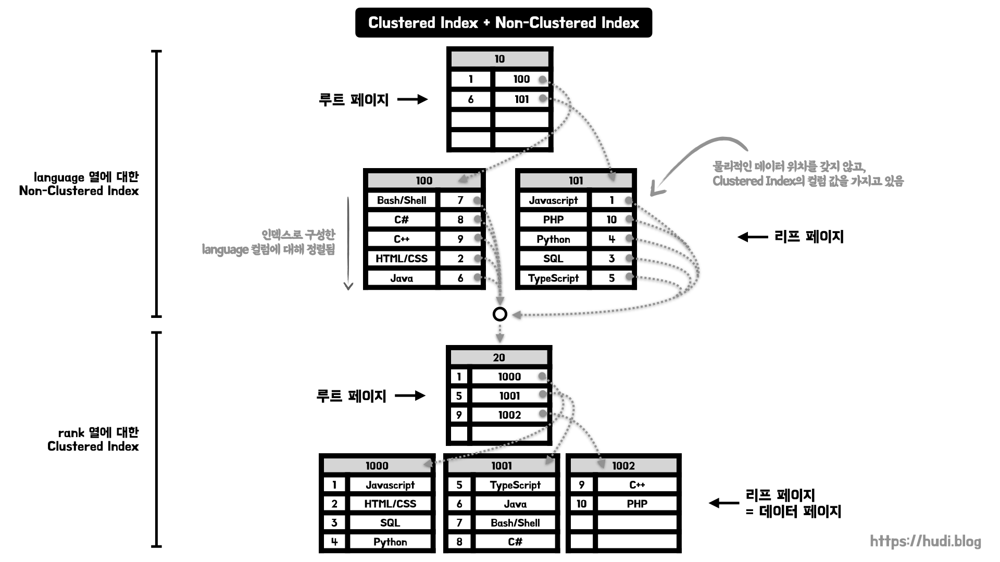

> 이번 포스팅은 MySQL(InnoDB) 기준으로 작성되었다.

## 인덱스가 없을 경우

위와 같이 1위부터 10위까지의 인기있는 프로그래밍 언어가 들어있는 테이블이 있다고 가정하자. 첫번째 열은 순위를 나타내는 `rank` 열, 두번째 열은 언어의 이름을 나타내는 `language` 열이다.

> 위 순위는 [2022 Stackoverflow 개발자 설문의 가장 인기있는 프로그래밍 언어 순위](https://survey.stackoverflow.co/2022/#most-popular-technologies-language)를 참고했다.

위 그림은 인덱스가 없는 테이블의 페이지 구성이다. 그냥 **데이터가 삽입된 순서대로 들어있는 모습**을 볼 수 있다. 편의상 페이지의 크기를 4개로 표현했지만 당연히, 실제 데이터베이스의 페이지 크기는 이렇게 작지 않다.

## 클러스터형 인덱스 (Clustered Index)

클러스터형 인덱스는 **테이블 전체가 정렬된 인덱스가 되는 방식**의 인덱스 종류이다. **실제 데이터와 무리(cluster)를 지어 인덱싱** 되므로 클러스터형 인덱스라고 부른다. 데이터와 함께 **전체 테이블이 물리적으로 정렬**된다. 클러스터형 인덱스는 영어 사전과 비슷하다. 영어 사전은 영어 단어가 사전순으로 정렬되어 있으면서, 영어 단어의 뜻도 함께 존재하기 때문이다.

클러스터형 인덱스는 **테이블당 하나**만 생성할 수 있다. 어떤 컬럼을 선택해 클러스터형 인덱스를 만들지에 따라 성능이 좌우될 수 있다. 특정 컬럼을 **PK로 지정하면 클러스터형 인덱스를 생성**한다. 혹은 **Unique + Not null로 지정해도 클러스터형 인덱스를 생성**한다. PK 컬럼과 Unique + Not null 컬럼이 동시에 존재하는 테이블은 **PK를 우선**으로 선택해 클러스터형 인덱스를 생성한다. 이 두가지가 모두 없는 경우 InnoDB는 내부적으로 `GEN_CLUST_INDEX` 라는 컬럼을 생성하여 클러스터형 인덱스를 생성한다. `GEN_CLUST_INDEX`는 행이 생성된 순서대로 값이 부여된다.

클러스터형 인덱스는 위 그림처럼 **B+Tree**의 형태로 구성되어 있다. 앞으로 여기서 B+Tree의 노드를 데이터베이스에서는 **페이지**라고 부른다. 각 페이지는 고유의 **페이지 번호**를 가지고 있다. 위 그림은 `rank` 컬럼을 PK로 설정해 클러스터형 인덱스를 생성한 모습이다.

루트 페이지를 보면 **Key로는 PK**를 가지고 있고, 포인터로는 다른 페이지의 **페이지 번호**를 가지고 있다. 또, 리프 페이지는 Key로 PK를 가지고 있고, **데이터를 직접 가지고 있는 것**을 확인할 수 있다.

## 비클러스터형 인덱스 (Non-Clustered Index)

비클러스터형 인덱스는 보조 인덱스(Secondary Index)라고도 불리며, 클러스터형 인덱스와 다르게 **물리적으로 테이블을 정렬하지 않는다**. 그 대신 **정렬된 별도의 인덱스 페이지를 생성하고 관리**한다. 즉, **실제 데이터를 함께 가지고 있지 않다**. 비클러스터형 인덱스는 책 뒷장의 '찾아보기' 페이지와 닮아있다.

비클러스터형 인덱스는 테이블 당 **여러개 생성이 가능**하다.

앞서 말한 것처럼 비클러스터형 인덱스는 **인덱스 페이지와 데이터 페이지가 구분**되어있다. 루트 페이지는 클러스터형 인덱스와 비슷하게 인덱스에 대한 컬럼과 페이지 번호를 가지고 있다.

리프 페이지는 조금 다르다. 인덱스 컬럼을 가지고 있는 것은 비슷하지만, 데이터를 직접 가지고 있지 않으며 `데이터 페이지 번호 + #오프셋` 을 가지고 있어 **데이터 페이지의 특정 행을 가리킨다**. 즉, 데이터에 접근하기 위해서는 **인덱스 페이지에서 데이터 페이지로 이동하는 하나의 과정이 추가**된다.

인덱스 페이지는 정렬되어 있지만, 실제 데이터 페이지는 정렬되지 않으므로 클러스터형 인덱스에 비해 삽입, 수정, 삭제 작업이 비교적 빠르다. 데이터 페이지에는 정렬 순서 상관없이 빈 곳에 데이터를 삽입하면 되기 때문이다.

## 클러스터형 인덱스와 비클러스터형 인덱스의 혼합

현실적으로는 하나에 테이블에 클러스터형 인덱스와 비클러스터형 인덱스가 혼합되어 있는 경우가 많다. PK는 기본적으로 존재하고, 추가로 조회가 자주 발생하는 컬럼에 대해 인덱스를 추가하기 때문이다.

이런 경우에는 **비클러스터형 인덱스를 먼저 거치고, 이어 클러스터형 인덱스를 거쳐 데이터를 찾는다**. 이때, 비클러스터형 인덱스는 `데이터 페이지 번호 + #오프셋` 대신 클러스터형 인덱스에 대한 컬럼 값을 갖는다.

위 그림은 `rank` 컬럼을 PK로 지정하고, 추가로 `language` 컬럼에 대해 비클러스터형 인덱스를 생성한 모습이다. 비클러스터형 인덱스의 인덱스 페이지는 `language` 컬럼을 기준으로 잘 정렬되어 있다. 그리고 `데이터 페이지 번호 + #오프셋` 대신 `rank` 컬럼 값을 가지고 있는 것을 확인할 수 있다.

이 `rank` 값을 가지고 클러스터형 인덱스에서 탐색을 하게 된다. 이후에는 우리가 알고있는 클러스터형 인덱스의 동작과정과 동일하게 데이터를 탐색한다.

그런데 왜 비클러스터형 인덱스에서 PK값을 가지고 있는 것일까? 클러스터형 인덱스는 데이터를 직접 가지고 있고, 테이블 전체가 정렬된 인덱스라고 이야기했다. 테이블에 **데이터가 추가, 수정, 삭제 되면 테이블 데이터의 페이지 번호와 페이지 내 순서가 모두 변경**된다. 이런 구조에서 비클러스터형 인덱스가 `데이터 페이지 번호 + #오프셋` 정보를 직접 들고 있다면, **비클러스터형 인덱스를 모두 수정해야하는 치명적인 문제점**이 발생한다. 따라서 이런 혼합 인덱스 구조에서는 비클러스터형 인덱스가 PK를 가지고 있는 것이다.

## 참고

- [https://www.youtube.com/watch?v=aTOFBD52060](https://www.youtube.com/watch?v=aTOFBD52060)
- [https://www.youtube.com/watch?v=qW9X4w_SnT4](https://www.youtube.com/watch?v=qW9X4w_SnT4)
- [https://www.youtube.com/watch?v=pOaLJVnGJgM](https://www.youtube.com/watch?v=pOaLJVnGJgM)
