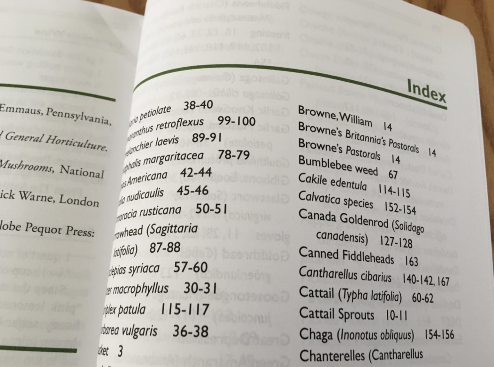
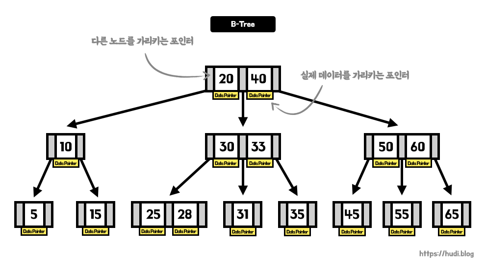
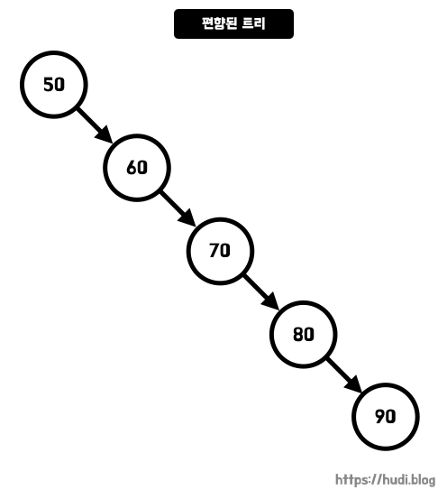
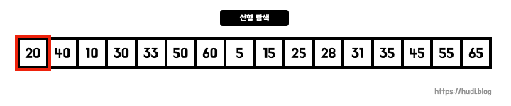
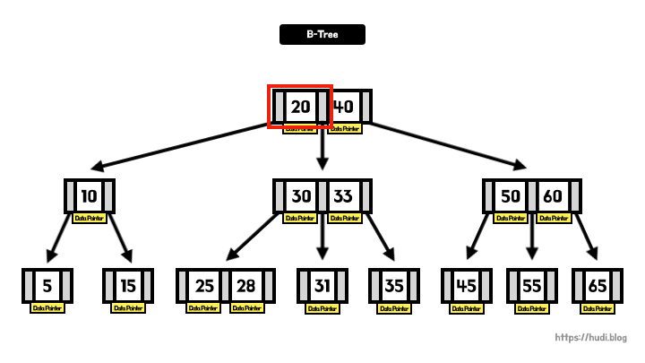
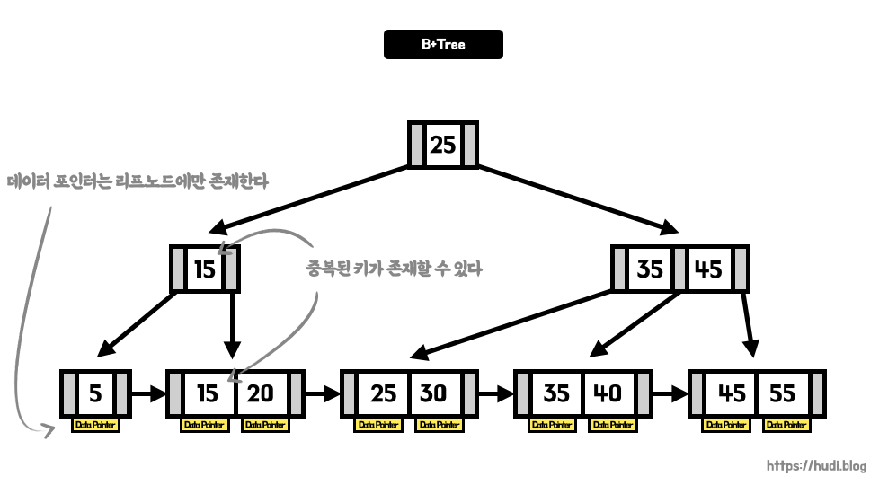

## 책의 찾아보기

아마, 이 글을 읽고 있는 여러분들은 데이터베이스 인덱스를 설명하며 항상 책 뒷장의 찾아보기(index) 페이지에 비유하는 설명을 많이 들어봤을 것이다. 책 뒷편의 찾아보기 페이지에는 책의 핵심 키워드가 사전 기준으로 정렬되어 있다. 책에 찾아보기 페이지가 없다면, 우리는 몇백장이 되는 책에서 원하는 내용을 찾느라 반나절을 보내게 될지도 모른다.

## 데이터베이스의 인덱스

책 뒷편의 찾아보기 페이지는 데이터베이스의 인덱스와 많이 닮아있다. 둘 다 **추가적인 저장공간(책 페이지)에 미리 정렬된 정보를 저장하여, 원하는 데이터(책 내용)를 찾기 위해** 사용된다.

즉 데이터베이스의 인덱스란, **추가적인 저장 공간을 사용해서 테이블 검색 속도를 향상**시키기 위한 자료구조이다. 데이터베이스 인덱스에는 **데이터의 키와 해당 데이터의 물리적 위치**가 나타나있다. 예를 들면, _'키가 10번인 데이터는 테이블 35번 행에 저장되어 있다'_ 와 같은 정보이다.

인덱스는 일반적으로 `SELECT` 쿼리의 `WHERE` 절에 사용될 **컬럼에 대한 조회 성능을 개선**할 때 사용된다.

## 왜 인덱스를 사용할까?

**인덱스는 실제 테이블의 데이터 크기에 비해 굉장히 작다**. 따라서 인덱스는 실제 데이터베이스 테이블에 비해 메모리에 적재하기 쉽다. 메모리(RAM)에 최대 1gb를 적재할 수 있고, 하드디스크에 100gb의 데이터베이스가 존재한다고 가정하자.

만약 우리가 찾고자 하는 데이터가 데이터베이스의 맨 끝에 있다면, 100gb의 데이터를 모두 탐색한 끝에야 원하는 데이터를 얻을 수 있다. 하지만, 우리에게 주어진 메모리는 1gb이므로 100gb의 데이터를 100개로 나눈뒤, 100번 꺼내와야한다. 그런데, **주 기억장치 대비 보조 기억장치의 IO성능은 굉장히 떨어진다**.

인덱스를 사용하면, 이런 불필요한 IO를 줄여 데이터 탐색 성능을 개선할 수 있다. **인덱스만을 메모리에 적재하고, 원하는 데이터의 물리적 주소를 찾아 접근**하면 되기 때문이다.

## 인덱스가 없다면?

인덱스를 사용하지 않으면, 데이터를 탐색할 때 **[풀 테이블 스캔(Full Table Scan)](https://en.wikipedia.org/wiki/Full_table_scan)**이 발생한다. 사용자가 원하는 데이터를 찾기 위해 테이블에 존재하는 모든 행을 읽어내는 방법이다. 풀 테이블 스캔은 전체 데이터를 탐색하므로, 디스크에서 데이터를 읽어 메모리로 적재하는 IO 비용이 많이 발생하는 가장 느린 테이블 스캔 방식이다.

풀 테이블 스캔은 테이블에 **인덱스가 존재하지 않거나**, 인덱스가 존재한다고 하더라도 데이터베이스의 **옵티마이저(Optimizer)가 인덱스 대신 풀 테이블 스캔으로 탐색하는 것이 더 적절하다고 판단**할 때 수행된다. 옵티마이저가 Full Table Scan을 고려할 경우에 대해서는 별도로 공부하고 포스팅으로 남겨보겠다.

## 인덱스 알고리즘

### 해시 테이블(Hash Table)

Key를 사용하여 원하는 자료에 빠르게 접근하는 자료구조로 가장 먼저 떠오르는 것은 해시 테이블이다. 해시 테이블은 **Key-Value 쌍으로 데이터를 저장하는 자료구조**이다. 데이터의 Key를 알고 있으면, 데이터에 $O(1)$의 시간 복잡도로 접근할 수 있다. 언뜻 보면 데이터베이스에 적합한 자료구조인 것 같다.

하지만, 실제로 많은 DBMS들은 해시 테이블을 사용하지 않는다. 왜 그럴까? 해시 테이블은 부등호 연산에 부적합하기 때문이다. 해시 테이블의 데이터는 **정렬되어 있지 않으므로**, 'Key가 500보다 작은 데이터'를 찾기 위해서는 하기 위해서는 **모든 데이터에 접근**해야한다. 데이터베이스에서는 **부등호 연산**이 자주 발생하므로, 해시 테이블은 적합하지 않다.

> 부등호 연산은 `<` `>` 를 제외하고도 `NOT` 연산, '~로 시작하는 데이터 찾기' 등이 모두 포함된다. `NOT` 연산은 사실 대상보다 크거나 작은 데이터를 찾는 연산이고, '~로 시작하는' 연산 또한 사전순으로 정렬된 데이터에서의 부등호 연산이기 때문이다.

> 해시 테이블에 대한 더 자세한 내용은 **[[DS] 해시테이블 (Hash Table)
> ](https://hudi.blog/ds-hash-table/)** 포스팅을 참고하자.

### B-Tree

B-Tree는 메모리에 담기 어려운 **큰 크기의 데이터**를 다루기 위해 사용된다. 즉, **파일 시스템 혹은 데이터베이스**에 적합하다.

B-Tree는 **이진 탐색 트리(binary search tree, BST)의 일반화된 형태**이다. 이진 탐색 트리가 자식 노드가 2개 이하인 트리라면, B-Tree는 자식 노드가 2개 이상인 트리이다. 즉, **노드의 개수를 늘리고 트리의 전체 높이를 줄여서 빠른 탐색 속도**를 얻을 수 있다. 최대 M개의 자식을 가질 수 있는 B-Tree를 M차 B-Tree라고 한다.

#### 같은 레벨을 유지하는 리프 노드

B-Tree의 중요한 특징으로는 **리프 노드(leaf node)가 모두 같은 레벨**을 갖는다는 점이다. 일반적인 이진 트리는 위 그림과 같이 한쪽 방향으로만 **편향될 가능성**이 존재한다. 이런 경우 트리 자료구조의 빠른 탐색 속도라는 이점을 누리지 못하고, **링크드리스트와 같이 동작할 수 있는 위험**을 갖는다. 하지만, B-Tree는 의도적으로 리프 노드의 레벨을 동일하게 유지함으로써 위와 같은 문제를 해결한다. 이런 특성을 갖는 트리를 **Self-Balanced Search Tree**라고 한다.

#### 키(key)와 포인터(pointer)

우리가 알고있던 일반적인 이진 트리와 다르게, 한 **노드에 여러 데이터**를 가질 수 있다. 데이터베이스에서는 B-Tree의 **노드를 페이지 또는 블럭**이라고 부르며, **노드 내의 데이터를 키(key)**라고 부른다. M차 B-Tree의 노드는 최대 M-1 개의 키를 가질 수 있다. 또한, **노드 내부의 키들은 항상 오름차순으로 정렬된 상태**를 유지한다.

각 노드의 키들은 **좌우로 다른 노드를 가리키는 포인터**를 가지고 있다. 좌측 포인터는 키보다 작은 데이터를 가진 노드를, 우측 포인터는 키보다 큰 데이터를 가진 노드를 가리킨다. 이는 이진 트리와 비슷하다.

#### 데이터 포인터(data pointer)

노드의 각 키는 실제 데이터의 **물리적 위치를 가리키고 있는 데이터 포인터(data pointer)**를 가지고 있다. **키를 기준으로 데이터를 탐색**한 뒤, 일치하는 **키를 발견한 경우 데이터 포인터가 가리키는 곳으로 이동해 실제 데이터**를 찾을 수 있다.

데이터베이스에서는 **특정 컬럼으로 인덱스를 생성**할 수 있는데, 이때 **컬럼의 값이 키**가 되고, **테이블의 행(데이터의 물리적 위치)는 데이터 포인터**가 된다.

#### 조회는 빠르지만, 삽입/수정/제거는 느리다

B-Tree는 항상 정렬된 상태를 유지한다. 즉, 조회 속도는 빠르지만 삽입과 수정, 제거 작업은 느리다.

#### 선형 탐색과 B-Tree 탐색 속도 비교

아래는 5, 10, 15, 20, 25, 28, 30, 31, 33, 35, 40, 45, 50, 55, 60, 65 중에서 일반적인 선형 탐색과 B-Tree가 28을 찾는 과정의 애니메이션이다.

일반적인 배열 혹은 리스트는 정렬된 상태를 유지하지 않으므로, 선형 탐색 과정이 $O(N)$의 시간복잡도를 갖는 것을 확인할 수 있다. 위 애니메이션에서는 **총 11번**의 탐색을 거쳐 28을 찾는다.

B-Tree는 정렬된 트리이므로 탐색이 $O(logN)$의 시간 복잡도를 갖는다. 28이라는 숫자를 찾는데 고작 **4번**의 탐색을 거친다.

### B+Tree

B+Tree는 B-Tree를 개선시킨 자료구조이다. 실제로 MySQL(InnoDB) 등 많은 DBMS에서는 **B-Tree대신 B+Tree를 사용**한다.

B+Tree는 B-Tree와 다르게 오직 **리프 노드의 키만 데이터 포인터를 가지고 있다**. B-Tree와 다르게, 리프 노드에만 데이터 포인터가 존재하므로 **노드에 더 많은 키를 보관**할 수 있게 된다. 이는 곧 **트리의 높이가 낮아**지는 것을 의미하고, **탐색 속도가 B-Tree에 비해 더 향상**됨을 의미한다. 다만, 이런 특징으로 트리에 **중복된 키**가 존재할 수 있다.

또한 B+Tree는 B-Tree과 다르게 **순차 검색에 유리**하다. 데이터베이스 특성상 부등호 연산이 많이 발생하게 된다. 이때, **B-Tree는 트리 순회를 해야하기 때문에 부등호 연산이 조금 오래걸린다**. 이런 단점을 극복하기 위해 B+Tree는 **리프 노드를 연결 리스트(linked list)로 연결**했다. 즉, **정렬된 상태의 리프 노드를 순차 검색**할 수 있게 된 것이다. 이로 인해 인덱싱에 더욱 적합한 자료구조가 될 수 있었다.

다만, B+Tree에서는 실제 데이터에 접근하기 위해서는 무조건 리프 노드까지 탐색해야한다. 따라서 운이 좋으면, 금방 데이터를 찾을수도 있는 B-Tree와 다르게, B+Tree는 고정적으로 $O(logN)$의 탐색 시간을 갖는다.

## 인덱스는 무조건 좋을까?

인덱스를 사용하면, 전반적인 조회 쿼리의 성능을 개선하여 시스템 전체의 부하를 줄일 수 있다. 하지만, 이런 좋은 인덱스도 제대로 사용하지 못하면 역효과를 볼 수 있다.

우선, 인덱스는 맨 처음 말했듯 저장 공간을 사용하여 조회 성능을 개선하기 위해 사용한다. 이 저장 공간은 데이터베이스 **전체 공간의 약 10%**라고 한다. 즉, 잘못 사용하면 **불필요한 저장 공간을 낭비**하게 된다.

또한 앞서 B-Tree를 이야기하며 말한것 처럼 **조회 성능은 증가할 수 있으나, 생성/수정/삭제 작업에 대한 성능은 오히려 낮아**진다. 인덱싱한 테이블이 조회보다 생성/수정/삭제 작업이 더 많이 발생하면 오히려 전체 성능이 저하될 수 있다.

## 인덱스 대상 컬럼 선택 기준, 카디널리티

인덱스 대상 컬럼은 **카디널리티(cardinality)가 높은 컬럼**을 우선적으로 선택해야 유리하다. 카디널리티란 데이터 집합에서 **유일한 데이터의 개수**를 의미한다.

예를 들어 대한민국 국민 테이블을 인덱싱할때 카디널리티가 낮은 성별 컬럼 대신 카디널리티가 높은 주민번호 컬럼을 인덱싱 하는 것이 바람직한다.

## 마치며

이번 포스팅에서는 데이터베이스 인덱스의 간단한 개념과 인덱싱에서 사용되는 알고리즘에 대해서 알아보았다. 하지만, 실제로 데이터베이스가 내부적으로 인덱스를 어떻게 관리하고, 데이터를 찾아가는지는 감이 잡히지 않는다. 실제 데이터베이스 내부 이야기는 많이 하지 않았기 때문이다.

다음 포스팅에서는 **클러스터형 인덱스(clustered index)와 비 클러스터형(non-clustered index)**를 설명하며, 실제로 인덱스가 어떻게 구성되어 있고, 데이터를 어떻게 찾아가는지 공부하고 정리해볼 예정이다.

## 참고

- [https://www.youtube.com/watch?v=aTOFBD52060](https://www.youtube.com/watch?v=aTOFBD52060)
- [https://mangkyu.tistory.com/96](https://mangkyu.tistory.com/96)
- [https://www.youtube.com/watch?v=G4QdllKNGzk](https://www.youtube.com/watch?v=G4QdllKNGzk)
- [https://www.geeksforgeeks.org/introduction-of-b-tree-2/](https://www.geeksforgeeks.org/introduction-of-b-tree-2/)
- [https://www.educative.io/answers/what-is-a-b-tree](https://www.educative.io/answers/what-is-a-b-tree)
- [https://velog.io/@seanlion/btree](https://velog.io/@seanlion/btree)
- [https://rebro.kr/169](https://rebro.kr/169)
- https://youtu.be/J7_J0xgt8WQ
- https://ssocoit.tistory.com/217#3._B+Tree
- https://zorba91.tistory.com/m/293
- https://dba.stackexchange.com/questions/123423/b-tree-and-btree-differences
- https://www.baeldung.com/cs/b-trees-vs-btrees
