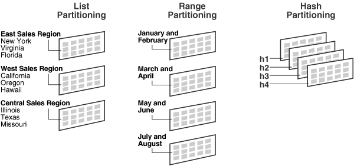
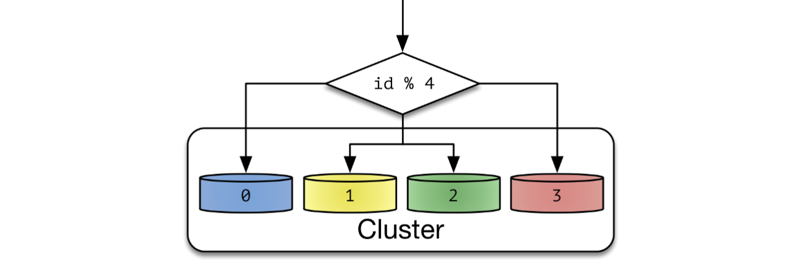
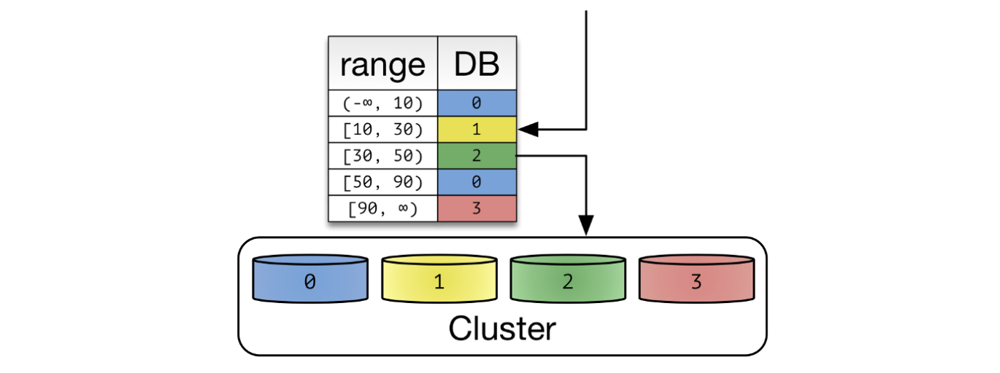

## 데이터베이스 분할에 대한 고민

전체 데이터베이스에 모든 데이터를 한 테이블 혹은 데이터베이스에서 관리하기가 어려워진다. **데이터베이스 볼륨이 커지면 커질수록 데이터베이스 읽기/쓰기 성능은 감소**할 것이고, 데이터베이스가 **병목 지점**이 될 것이다. 따라서 이를 적절히 분할할 필요가 있다. 데이터베이스를 분할하는 방법은 크게 **샤딩(sharding)**과 **파티셔닝(partitioning)**이 있다. 이 두 가지 기술은 모두 **거대한 데이터셋을 서브셋**으로 분리하여 관리하는 방법이다. 이번 포스팅에서는 이 둘의 개념과 차이점에 대해 알아본다.

## 파티셔닝이란?

> MySQL 기준으로 기술되었다.

파티셔닝은 매우 큰 테이블을 여러개의 테이블로 분할하는 작업이다. 큰 데이터를 여러 테이블로 나눠 저장하기 때문에 쿼리 성능이 개선될 수 있다. 이때, 데이터는 **물리적으로 여러 테이블로 분산**하여 저장되지만, 사용자는 마치 **하나의 테이블에 접근하는 것과 같이 사용**할 수 있다는 점이 특징이다. 파티셔닝은 MySQL 단에서 자체적으로 지원하는 기능이다.

MySQL 에서 파티셔닝을 지원하는 스토리지 엔진은 InnoDB와 NDB이며, MyISAM은 파티셔닝을 지원하지 않는다.

## MySQL 파티셔닝 종류

파티셔닝 종류는 Oracle과 MySQL 공식문서에서 소개한 4가지 방식을 간단하게 설명하겠다.

### List Partitioning

데이터 값이 특정 목록에 포함된 경우 데이터를 분리한다. 위 그림 처럼 특정 지역별로 데이터를 분할할 때 사용할 수 있겠다.

### Range Partitioning

데이터를 특정 범위 기준으로 분할할 때 사용한다. 위 처럼 1~2월, 3~4월, 5~6월 … 으로 데이터를 분리할 때 사용할 수 있다.

### Hash Partitioning

해시 함수를 사용하여 데이터를 분할할 때 사용한다. 특정 컬럼의 값을 해싱하여 저장할 파티션을 선택한다. MySQL 공식 문서에 따르면, 여러 컬럼으로 해싱하는 것은 크게 권장하지 않는다고 한다 ([**참고**](https://dev.mysql.com/doc/mysql-partitioning-excerpt/5.6/en/partitioning-hash.html)).

### Composite Partitioning

위 파티셔닝 종류 중 두개 이상을 사용하는 방식이다.

## 샤딩이란?

샤딩은 **동일한 스키마**를 가지고 있는 여러대의 데이터베이스 서버들에 데이터를 **작은 단위로 나누어 분산 저장**하는 기법이다. 이때, 작은 단위를 **샤드(shard)**라고 부른다.

어떻게 보면 샤딩은 수평 파티셔닝의 일종이다. 차이점은 파티셔닝은 모든 데이터를 동일한 컴퓨터에 저장하지만, 샤딩은 데이터를 서로 다른 컴퓨터에 분산한다는 점이다. 물리적으로 서로 다른 컴퓨터에 데이터를 저장하므로, 쿼리 성능 향상과 더불어 **부하가 분산**되는 효과까지 얻을 수 있다. 즉, 샤딩은 데이터베이스 차원의 수평 확장(scale-out)인 셈이다.

샤딩은 위와 같이 물리적으로 분산된 환경에서 사용되는 기법으로 데이터베이스 차원이 아닌 **애플리케이션 레벨에서 구현하는 것이 일반적**이다. 다만 샤딩을 **플랫폼 차원에서 제공하는 시도**가 많다고 한다. **[Naver d2 포스팅](https://d2.naver.com/helloworld/14822)**에 따르면, Hibernate Shards와 같이 애플리케이션 서버에서 동작하는 형태, CUBRID SHARD, Spock Proxy, Gizzard 와 같이 미들 티어(middle tier)에서 동작하는 형태, nStore나 MongoDB와 같이 데이터베이스 자체에서 샤딩을 제공하는 형태로 나뉜다고 한다.

~~(고등학교 때 MERN stack 공부하면서, mongodb 샤딩이 대체 뭐지?… 하고 그냥 넘어갔는데 드디어 공부했다!)~~

### 주의점

데이터를 물리적으로 독립된 데이터베이스에 각각 분할하여 저장하므로, 여러 샤드에 걸친 데이터를 조인하는 것이 어렵다. 또한, 한 데이터베이스에 집중적으로 데이터가 몰리면 Hotspot이 되어 성능이 느려진다. 따라서 데이터를 여러 샤드로 고르게 분배하는 것이 중요하다. 또 Celebrity Problem 등 다양한 문제가 존재한다. 자세한 내용은 이전에 작성한 **[[가상면접 사례로 배우는 대규모 시스템 설계 기초] Chap01. 사용자 수에 따른 규모 확장성](https://hudi.blog/system-design-interview-alex-xu-1/)** 포스팅을 참고하자.

## 샤딩 종류

샤딩의 종류는 다양하지만, 크게 Hash Sharding, Range Sharding 두 가지를 알아보겠다.

### Hash Sharding

Hash Sharding 중 나머지 연산을 사용한 **Modular Sharding** 을 알아본다. Modular Sharding은 PK값의 모듈러 연산 결과를 통해 샤드를 결정하는 방식이다. **총 데이터베이스 수가 정해져있을 때 유용**하다. 데이터베이스 개수가 줄어들거나 늘어나면 해시 함수도 변경해야하고, 따라서 **데이터의 재 정렬**이 필요하다.

### Range Sharding

PK 값을 범위로 지정하여 샤드를 지정하는 방식이다. 예를 들어 PK가 1~1,000 까지는 1번 샤드에, 1,001~2,000 까지는 2번 샤드에, 2,001~ 부터는 3번 샤드에 저장할 수 있다. Hash Sharding 대비 데이터베이스 **증설 작업에 큰 리소스가 소요되지 않는다**. 따라서 **급격히 증가할 수 있는 성격의 데이터**는 Range Sharding 을 사용함이 좋아보인다. 이런 특징으로 Range Sharding은 Dynamic Sharding 으로도 불린다.

다만, 이렇게 기껏 분산을 시켜놨는데 **특정한 데이터베이스에만 부하가 몰릴 수 있다**. 예를 들어 페이스북 게시물을 Range Sharding 했다고 가정해보자. 대부분의 트래픽은 최근에 작성한 게시물에서 발생할 것이다. 위 그림에서는 2, 3번 샤드에만 부하가 몰리는 것이다. 부하 분산을 위해 데이터가 몰리는 DB는 다시 재 샤딩(re-sharding)하고, 트래픽이 저조한 데이터베이스는 다시 통합하는 작업이 필요할 것이다.

## 참고

- [https://aws.amazon.com/ko/what-is/database-sharding/](https://aws.amazon.com/ko/what-is/database-sharding/)
- [https://www.singlestore.com/blog/database-sharding-vs-partitioning-whats-the-difference/](https://www.singlestore.com/blog/database-sharding-vs-partitioning-whats-the-difference/)
- [https://techblog.woowahan.com/2687/](https://techblog.woowahan.com/2687/)
- [https://docs.oracle.com/cd/B12037_01/server.101/b10743/partconc.htm](https://docs.oracle.com/cd/B12037_01/server.101/b10743/partconc.htm)
