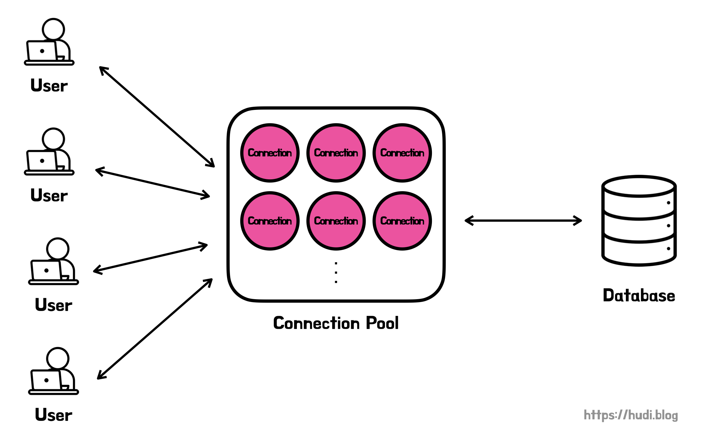
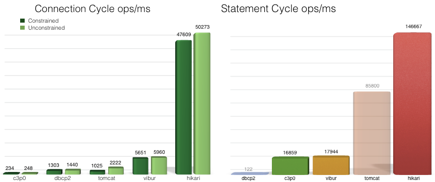

## 데이터베이스 커넥션

데이터베이스 커넥션 풀에 대해 알아보기 이전에 데이터베이스 커넥션이 무엇인지부터 알아봐야한다. 우리가 개발하는 웹 애플리케이션과 데이터베이스는 서로 다른 시스템이다. 따라서 데이터베이스 드라이버를 사용하여 데이터베이스에 연결해야한다.

데이터베이스 연결의 생애주기는 아래와 같다.

1. 데이터베이스 드라이버를 사용하여 데이터베이스 연결 열기
2. 데이터를 읽고 쓰기 위해 TCP 소켓 열기
3. TCP 소켓을 사용하여 데이터 통신
4. 데이터베이스 연결 닫기
5. TCP 소켓 닫기

위와 같이 데이터베이스 연결을 수립하고, 해제하는 과정은 비용이 많이 들어가는 작업이다.

## 데이터베이스 커넥션 풀 (DBCP)



사용자로부터 웹 애플리케이션에 **요청이 들어올때마다 데이터베이스 연결을 수립하고, 해제하는 것은 굉장히 비효율**적으로 보인다. 우리는 어떻게 이런 비효율을 해결할 수 있을까? **미리 여러개의 데이터베이스 커넥션을 생성해놓고, 필요할 때 마다 꺼내쓰면** 좋지 않을까? 방금 이야기한 방법을 **데이터베이스 커넥션 풀 (connection pool)**이라고 한다.

데이터베이스 커넥션 풀을 사용하면 데이터베이스 요청이 들어올 때 마다 데이터베이스 연결을 수립하고, 통신한 뒤, 닫는 과정을 거치지 않아도 된다. **데이터베이스 커넥션 풀에는 사전에 데이터베이스와 이미 연결이 수립된 다수의 커넥션들이 존재**한다. 커넥션 풀 안의 커넥션들은 데이터베이스 요청이 들어올 때 마다 새롭게 연결을 수립하고 닫는대신 **항상 연결을 열린 상태로 유지**한다.

WAS는 데이터베이스 커넥션이 필요할 때 직접 커넥션을 생성하지 않고, 커넥션 풀 컨테이너로부터 커넥션을 하나 건네받고, 사용을 마치면 반납한다. 이렇게 함으로써 우리는 데이터베이스 **연결을 열고, 닫는 비용을 절약**할 수 있다.

## 간단한 DBCP를 구현하여 성능 비교해보기

요청이 들어올 때 마다 커넥션을 생성하고, 해제하는 방식과 미리 커넥션을 여러개 생성해놓은 상태로 재사용하는 방식이 얼마나 차이가 날까? 직접 아주 간단한 DBCP를 구현하여 성능 차이를 비교해보았다. 물론, 실제 웹 애플리케이션처럼 멀티 쓰레드 환경에서 비교하지는 않았다. 단순히 데이터베이스 커넥션을 생성하고 해제하는게 얼마나 큰 오버헤드인지만 알아보기 위함이니 참고 바란다.

### 요청이 들어올 때 마다 커넥션 생성

```java
public class Application {

    private static final String URL = "jdbc:mysql://localhost:3306/dbcp-test";
    private static final String ID = "sa";
    private static final String PASSWORD = "sa";

    public static void main(String[] args) {
        Instant start = Instant.now();

        for (int i = 0; i < 100; i++) {
            Connection connection = generateConnection();
            doInsert(connection);
        }

        Instant end = Instant.now();
        System.out.println("수행시간: " + Duration.between(start, end).toMillis() + " 밀리초");

    }

    private static void doInsert(final Connection connection) {
        try (connection) {
            String sql = "INSERT INTO members(name, password) VALUES(?, ?)";
            PreparedStatement preparedStatement = connection.prepareStatement(sql);
            preparedStatement.setString(1, "test");
            preparedStatement.setString(2, "1234");
            preparedStatement.executeUpdate();
        } catch (Exception e) {
            e.printStackTrace();
        }
    }

    private static Connection generateConnection() {
        Connection connection = null;
        try {
            Class.forName("com.mysql.cj.jdbc.Driver");
            connection = DriverManager.getConnection(URL, ID, PASSWORD);
        } catch (Exception e) {
            e.printStackTrace();
        }

        return connection;
    }
}
```

위와 같이 JDBC를 직접 사용하여 테스트해 보았다. 100번의 `INSERT` 문을 실행한다. 한번의 `for` 루프마다 Connection을 생성하는 것을 볼 수 있다. `doInsert` 메소드에서 try-with-resources 문법을 사용하여 쿼리를 실행하고나서 커넥션을 해제하도록 하였다.

```
수행시간: 3610 밀리초
```

위 코드의 동작 시간은 약 3610ms 이다.

### 간이 DBCP 사용

이번엔 간이 DBCP를 만들어서 실행한 결과이다. 아래와 같이 `ConnectionPool` 클래스로 간단히 커넥션 풀을 만들었다.

```java
public class ConnectionPool {

    private static final String URL = "jdbc:mysql://localhost:3306/dbcp-test";
    private static final String ID = "sa";
    private static final String PASSWORD = "sa";

    private final List<Connection> pool;
    private int pointer = 0;

    public ConnectionPool() {
        this.pool = initializeConnectionPool();
    }

    private List<Connection> initializeConnectionPool() {
        return IntStream.range(0, 10)
                .mapToObj(ignored -> generateConnection())
                .collect(Collectors.toList());
    }

    private Connection generateConnection() {
        Connection connection = null;
        try {
            Class.forName("com.mysql.cj.jdbc.Driver");
            connection = DriverManager.getConnection(URL, ID, PASSWORD);
        } catch (Exception e) {
            e.printStackTrace();
        }

        return connection;
    }

    public Connection getConnection() {
        Connection connection = pool.get(pointer % 10);
        pointer++;
        return connection;
    }
}
```

총 10개의 커넥션을 생성해둔다.

```java
public class ApplicationCp {

    public static void main(String[] args) {
        ConnectionPool connectionPool = new ConnectionPool();

        Instant start = Instant.now();

        for (int i = 0; i < 100; i++) {
            Connection connection = connectionPool.getConnection();
            doInsert(connection);
        }

        Instant end = Instant.now();
        System.out.println("수행시간: " + Duration.between(start, end).toMillis() + " 밀리초");
    }

    private static void doInsert(final Connection connection) {
        try {
            String sql = "INSERT INTO members(name, password) VALUES(?, ?)";
            PreparedStatement preparedStatement = connection.prepareStatement(sql);
            preparedStatement.setString(1, "test");
            preparedStatement.setString(2, "1234");

            preparedStatement.executeUpdate();
        } catch (SQLException e) {
            e.printStackTrace();
        }
    }
}
```

그리고 위와 같이 커넥션 풀을 사용하여 똑같이 100번의 `INSERT` 를 실행하였다. 이 코드는 커넥션 풀에서 커넥션 재사용을 위해 쿼리를 실행하고 커넥션을 해제하지 않는다. 실행 시간 측정은 당연히 커넥션 풀을 초기화 하는 과정은 제외하였다.

```
수행시간: 669 밀리초
```

약 669ms 가 나왔다. 5.39배 성능이 향상되었다. 데이터베이스 커넥션을 생성하고, 해제하는 과정이 굉장히 큰 오버헤드임을 알게되었다.

## HikariCP

데이터베이스 커넥션 풀 프레임워크는 대표적으로 Apache Commons DBCP, Tomcat DBCP, HikariCP, Oracle UCP 등이 있다. 이번 포스팅에서는 **가장 많이 사용되는 HikariCP**에 대해 알아본다.

스프링부트로 개발을 해본 사람이라면, HikariCP가 무엇인지 이름은 들어봤을 것이다. 스프링부트로 만든 애플리케이션을 기동하면 아래와 같은 로그가 출력되기 때문이다.

```
com.zaxxer.hikari.HikariDataSource       : HikariPool-1 - Starting...
com.zaxxer.hikari.HikariDataSource       : HikariPool-1 - Start completed.
```

HikariCP는 **스프링부트에 기본으로 내장되어 있는 JDBC 데이터베이스 커넥션 풀링 프레임워크**이다. 스프링부트는 HikariCP를 사용할 수 있는 상황에서는 항상 HikariCP를 선택한다고 한다. HikariCP를 사용할 수 없는 경우 Tomcat DBCP → Apachde Commons DBCP → Oracle UCP 순으로 선택한다고 한다 ([참고](https://docs.spring.io/spring-boot/docs/current/reference/htmlsingle/#data.sql.datasource.connection-pool)).

스프링부트는 왜 HikariCP를 기본 내장하고, 최우선으로 선택하는걸까? HikariCP의 성능이 압도적으로 우수하기 때문이다. 아래 그래프는 HikariCP 팀에서 제공한 데이터베이스 커넥션 풀링 프레임워크들의 벤치마크 결과이다.



HikariCP는 바이트코드 수준까지 극단적으로 최적화 되어있다. 또한 미세한 최적화와 Collection 프레임워크를 영리하게 사용한 덕분에 위와 같은 벤치마크 결과가 나올 수 있었다.

## 적정 데이터베이스 커넥션 풀 사이즈

### HikariCP 공식

HikariCP 공식문서에서는 아래와 같이 커넥션 풀 사이즈를 제안한다 ([참고](https://github.com/brettwooldridge/HikariCP/wiki/About-Pool-Sizing#the-formula)).

$$
connection = ((core\_count * 2) + effective\_spindle\_count)
$$

$core\_count$ 는 CPU의 코어수를, $effective\_spindle\_count$는 DB서버가 동시 관리할 수 있는 IO 개수이다.

### HikariCP deadlock

> 아래 내용은 우아한형제들 기술 블로그의 **[HikariCP Dead lock](https://techblog.woowahan.com/2664/)에서 벗어나기 (이론편)** 를 참고했다.

DBCP를 사용할 때 **교착상태(deadlock)**를 주의해야한다. 교착상태란 **쓰레드가 서로의 DB Connection이 반납되기만을 무한정 대기하는 상황**이다. 아주 간단한 deadlock 시나리오를 살펴보자.

1. Thread-1이 작업을 수행하기 위해 2개의 DB Connection이 필요하다.
2. DBCP의 사이즈는 1이다. _(total = 1, active = 0, idle = 1, waiting = 0)_
3. Thread-1이 작업을 수행하기 위해 DBCP로부터 커넥션을 받아온다.
4. DBCP에 현재 존재하는 커넥션은 1개이므로, 1개만 Thread-1에게 건네준다.
5. Thread-1은 1개의 커넥션으로는 작업을 수행할 수 없으므로 다른 쓰레드로부터 1개의 커넥션이 반납될동안 기다린다.
6. 하지만 DBCP의 상태는 total = 1, active = 1, idle = 0, waiting = 0 이므로 반납될 커넥션이 존재하지 않는다. 즉, Thread-1은 자기자신이 커넥션을 반납하는 것을 기다리는 상황이다. 즉, 데드락을 의미한다.

이 문제를 해결하기 위해서 HikariCP팀은 아래와 같은 DBCP 최소 사이즈 공식을 제안한다 ([참고](https://github.com/brettwooldridge/HikariCP/wiki/About-Pool-Sizing)). 여기서 $T_{n}$은 WAS의 전체 쓰레드 개수, $C_{m}$은 쓰레드가 작업을 수행하기 위해 동시에 필요한 DB Connection의 개수를 의미한다.

$$
T_{n} * (C_{m} - 1) + 1
$$

위 공식을 적용해보자. 만약 쓰레드 최대 개수가 10개고, 동시에 필요한 커넥션수가 3개라고 해보자. 위 공식에 대입해서 계산해보면, 21이라는 결과가 나온다. 10개의 쓰레드에 모두 2개씩 커넥션을 할당하면, 1개의 커넥션이 풀에 남는다. 즉, 최소한 하나의 쓰레드는 무조건 커넥션을 3개 확보하고 작업을 처리하고, 커넥션을 반납할 수 있다. 따라서 데드락이 발생하지 않는다.

위 공식의 결과값은 어디까지나 데드락이 발생하지 않을 최소값이다. 따라서 공식 결과값에 $+α$ 가 필요하다.

그런데 그냥 DBCP 사이즈를 무식하게 크게 설정하면 데드락이고 뭐고 문제가 발생하지 않을 것 같다. 하지만 무제한으로 DB 커넥션 풀의 커넥션 개수를 늘릴 수는 없다. 커넥션도 결국 객체이기 때문에 메모리 공간을 차지하기 때문이다. 따라서 커넥션 개수와 메모리는 trade-off 관계이다. 따라서 위 공식에서 $α$ 값을 성능 테스트를 통해 최적의 값을 찾아내야한다.

## 참고

- [https://www.baeldung.com/java-connection-pooling](https://www.baeldung.com/java-connection-pooling)
- [https://steady-coding.tistory.com/564](https://steady-coding.tistory.com/564)
- [https://www.jdatalab.com/information_system/2017/02/16/database-driver.html](https://www.jdatalab.com/information_system/2017/02/16/database-driver.html)
- [https://github.com/brettwooldridge/HikariCP](https://github.com/brettwooldridge/HikariCP)
- [https://steady-coding.tistory.com/564](https://steady-coding.tistory.com/564)
