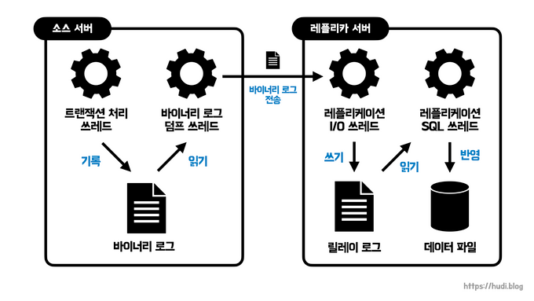
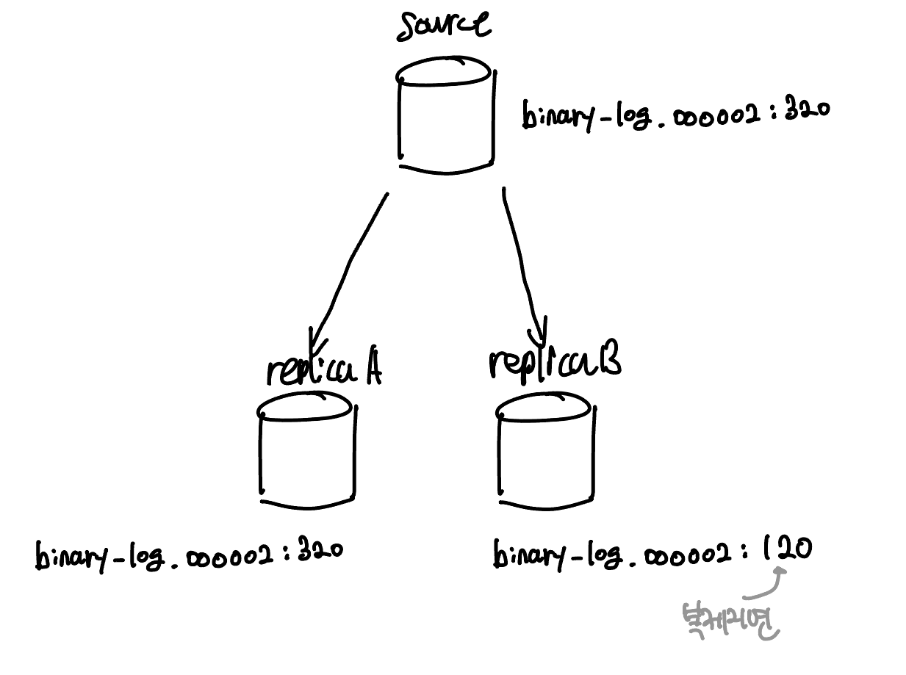
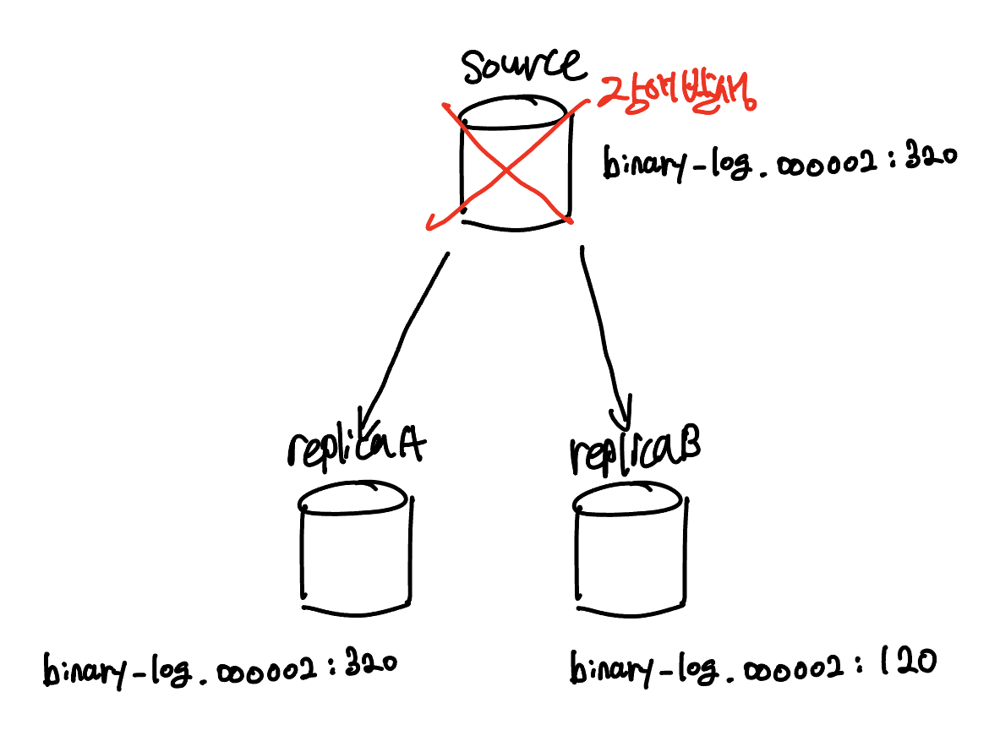
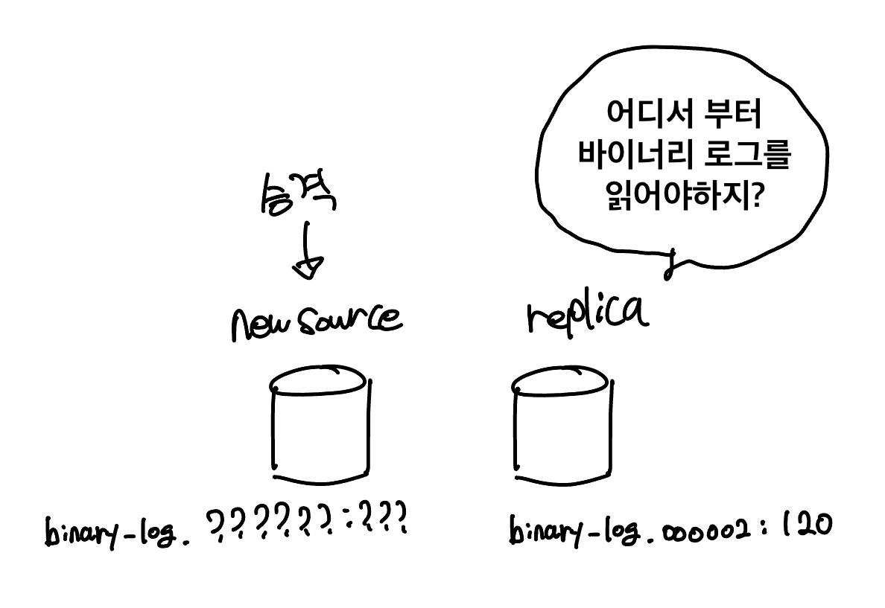
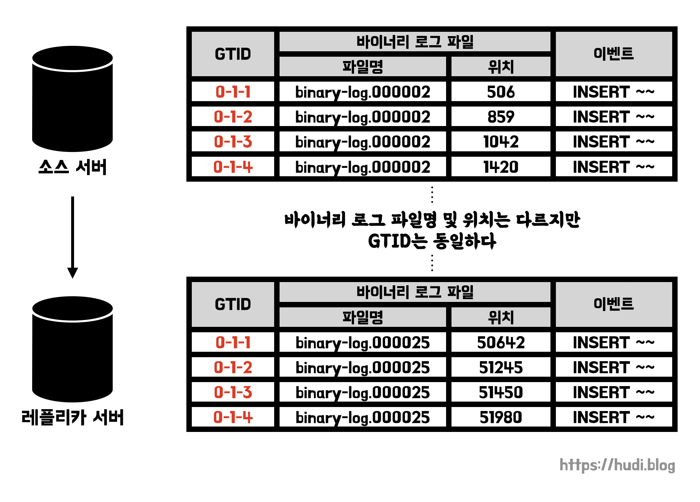

**[데이터베이스의 확장성과 가용성을 위한 MySQL Replication](https://hudi.blog/mysql-replication/)** 포스팅에서 데이터베이스 레플리케이션이 왜 필요한지, 그리고 MySQL에서의 대략적인 레플리케이션 동작 방식을 알아보았다. 이번 포스팅에서는 MySQL 8.0 기준으로 레플리케이션이 동작하는 아키텍처를 더 자세히 알아보려 한다.

## MySQL 레플리케이션 아키텍처

### 레플리케이션 동작 과정

MySQL 8.0 기준으로 소스 서버에서 레플리카 서버로 데이터가 어떻게 복제되는지 간략하게 알아보자.

**1. 레플리케이션 시작 :** 레플리카 서버에서 `START REPLICA` (혹은 `START SLAVE`) 명령이 실행되면, 레플리카 서버에서 레플리케이션 I/O쓰레드를 생성한다. 이 쓰레드는 `STOP REPLICA` (혹은 `STOP SLAVE`) 명령이 실행되면 종료된다.

**2. 바이너리 로그 전송 :** 소스 서버에서 발생하는 **이벤트(event)**는 **바이너리 로그(binary log)**라는 로그 파일에 기록된다. 레플리카 서버에 생성된 레플리케이션 **I/O 쓰레드는 소스 서버의 바이너리 로그 덤프 쓰레드에게 바이너리 로그 정보를 요청**한다. 요청을 받은 바이너리 로그 덤프 쓰레드는 바이너리 로그에서 이벤트를 읽어오는데 이때 바이너리 로그 파일을 일시적으로 잠근다. 그리고 이벤트를 모두 읽고 난 후 잠금을 해제한다.

**3. 릴레이 로그 생성 및 반영 :** 레플리케이션 **I/O 쓰레드는** 바이너리 로그 덤프 쓰레드로부터 받아온 바이너리 로그 정보를 기반으로 레플리카 서버에 **릴레이 로그를 생성**한다. 레플리케이션 **SQL 쓰레드**는 레플리케이션 I/O 쓰레드가 생성한 **릴레이 로그에 기록된 이벤트를 읽고 실행**한다. 

이 때, 레플리카 서버의 I/O 쓰레드와 SQL 쓰레드는 서로 독립적으로 동작한다. SQL 쓰레드가 느리게 데이터를 반영한다고, I/O 쓰레드가 소스 서버로부터 이벤트를 읽어오는데에는 영향을 주지 않는다.

또, 레플리카 서버가 소스 서버의 변경 내역을 반영하는게, 소스 서버와 독립적으로 동작한다. 따라서 레플리카 서버에 문제가 생기더라도 소스 서버는 그 영향을 받지 않는다.

단, 소스 서버에 문제가 생기면 그 즉시 레플리카 서버에 에러가 발생하고 복제가 중단된다. 하지만 이때에도 복제만 중단된 것이므로 레플리카 서버에서 쿼리는 정상적으로 실행할 수 있다. 다만 이때에는 레플리카 서버는 과거의 데이터를 가지고 있을 수 있으므로, 즉 정합성이 깨져있는 상태이므로 주의해야한다.

### 레플리카 서버가 관리하는 복제 관련 데이터

- **릴레이 로그** : 소스 서버 **바이너리 로그**로부터 읽어온 **이벤트(트랜잭션) 정보**가 저장된다.
- **커넥션 메타데이터** : 레플리카 서버의 I/O 쓰레드가 소스 서버에 연결할 때 사용하는 **DB 계정 정보**(Host, User_name, User_password, Port), 현재 읽고 있는 **소스 서버의 바이너리 파일명**과 **파일 내 위치값**(Master_log_pos) 등의 데이터가 저장된다. 이 정보는 `mysql` 데이터베이스의 `slave_master_info` 테이블에 저장된다.
- **어플라이어 메타데이터** : 레플리카 서버의 SQL 쓰레드는 어플라이어(applier)라는 컴포넌트를 가지고 있다. 어플라이어는 릴레이 로그의 이벤트를 레플리카에 실제 반영하는 역할을 한다. 어플라이어 메타 데이터는 어플라이어가 최근 적용한 이벤트가 저장되어 있는 릴레이 로그 파일명, 파일 내 위치 등의 정보가 담겨있다. `mysql` 데이터베이스의 `slave_relay_log_info` 에 저장된다.

커넥션 메타데이터와 어플라이어 메타데이터는 설정에 따라 테이블이 아닌 파일로 저장되도록 할 수 있다. 테이블에 저장하는것이 8.0.2 버전부터 기본 설정이다. 파일로 저장하는 방식은 여러 문제가 있어 향후 버전에서는 deprecated 될 예정이므로 자세한 설명은 생략한다.

## 복제 타입

MySQL의 레플리케이션은 바이너리 로그에 기록된 이벤트를 식별하는 방식에 따라 크게 **바이너리 로그 파일 위치 기반 복제(Binary Log File Position Based Replication)**와 **글로벌 트랜잭션 ID 기반 복제(Global Transaction Identifiers Based Replicaiton)**로 나뉜다.

### 바이너리 로그 파일 위치 기반 복제

바이너리 로그 파일 위치 기반 복제는 레플리케이션이 MySQL에 처음 도입되었을 때 부터 제공된 방식이다. 이 방식은 **바이너리 로그 파일명 + 파일 내에서의 위치**(offset 또는 position)를 통해 이벤트를 식별한다. 이 위치 값은 실제 파일의 바이트 수를 의미한다. 

레플리카는 자신이 어떤 바이너리 로그 파일의 어떤 위치까지 복제했는지 정보를 관리한다. 이 덕분에 레플리카는 레플리케이션을 **일시 중단하고 재개**할 수 있다. 복제를 중단한 **로그 파일의 특정 위치**로부터 복제를 다시 시작하면 되기 때문이다.

바이너리 로그 파일 위치 기반 복제에서 또 중요한 점은 `server_id` 값이다. 바이너리 로그에는 각 이벤트 별로 이벤트가 발생한 서버를 식별하기 위해 `server_id` 값을 기록한다. 이 `server_id` 값은 기본값이 1인데, **레플리케이션에 참여하는 모든 서버는 중복되지 않은 고유의 `server_id` 를 가져야한다**. 만약에 중복된 `server_id` 를 가지게 되면 어떤 일이 발생할까?

예를 들어 소스와 레플리카가 둘다 `server_id` 가 1이라고 가정하자. 레플리카의 I/O 쓰레드는 소스의 바이너리 로그 덤프 쓰레드로부터 바이너리 로그를 읽어온다. 그런데, 이벤트를 읽어보니 `server_id` 가 1이다. **이런 경우 레플리카는 자기 자신으로부터 발생한 이벤트로 간주하고 해당 이벤트를 적용하지 않는다.**

**바이너리 로그에는 소스 서버의 모든 이벤트가 저장되어 있지 않다**. 바이너리 로그가 비활성화 된 기간이 있을수도 있고, 용량 확보를 위해서 일정 기간이 지난 바이너리 로그를 제거했을수도 있다. 따라서 레플리카 서버를 구성하기 전 **mysqldump 와 같은 툴을 이용해 소스 서버의 데이터를 우선 레플리카 서버에 적재**를 한 뒤 레플리케이션을 구성해야한다.

### 글로벌 트랜잭션 ID 기반 복제

바이너리 로그 파일 위치 기반 복제는 이벤트를 바이너리 로그 파일 명과 파일 내의 위치로 식별한다. 만약 레플리카도 바이너리 로그가 활성화 되어있다면 어떨까? 같은 이벤트인데도 불구하고 다른 바이너리 로그 파일명과 위치를 가질 것이다. 즉, 절대적으로 특정이벤트를 식별할 수 있는 식별자가 없다. 이와 같은 식별은 최초로 이벤트가 발생한 소스 서버에서만 유효하다.

레플리케이션에 참여하고 있는 모든 서버들이 같은 이벤트에 대해서 서로 다른 식별자를 가지고 있으면 어떤 문제가 생길까? 복제 토폴로지 변경이 어려워진다. 토폴로지 변경은 주로 장애 발생 시 failover를 위해 수행되는데, 서로 호환되지 않는 이벤트에 대한 식별자로 인해 토폴로지 변경이 어렵다. MHA, MMM, Orchestrator와 같은 MySQL HA 솔루션들은 내부적으로 복잡한 바이너리 로그를 계산하거나, 때로는 포기한다.

위 그림은 바이너리 로그 파일 위치 기반 복제 방식의 레플리케이션 구성이다. 소스 1대와 레플리카 2대로 구성되어 있다. 소스 서버의 최신 바이너리 로그 위치는 `binary-log.000002:320` 이고, 레플리카A는 최신 이벤트까지 동기화하였다. 그런데 레플리카 B는 네트워크 문제로 복제가 약간 지연되어 `bianry-log.000002:120` 까지만 동기화 되었다. 이때 소스에 장애가 발생한다.

이때 완전 동기화 된 레플리카 A를 소스서버로 승격(promotion)한다. 

그런데 바이너리 로그 파일 위치 기반 복제에서는 같은 이벤트라고 하더라도 서로 식별 값이 다르다고 했다. 레플리카(전 레플리카B)는 `binary-log.000002:120` 까지 동기화 되어 있다는 정보를 가지고 있지만, 이는 새로운 소스 서버에는 유효하지 않다. 따라서 이 레플리카는 동기화할 수 없다.

물론 새로운 소스 서버의 릴레이 로그가 살아있다면, 이 릴레이 로그에 남아있는 (전) 소스 서버의 바이너리 로그 정보를 가져와서 복구할 수 있다. 하지만 릴레이 로그는 불필요한 시점에 자동 삭제되므로 이 방법은 제한적이다. 수동으로 직접 확인하는 방법도 있지만 당연하게도 매우 어렵다.

이러나 저러나 바이너리 로그 파일 위치 기반 복제는 이런 장애 상황에서 토폴로지를 변경하기 어렵다. 즉, failover가 까다롭다. **어떤 서버에 있던 상관없이 동일한 이벤트를 동일한 식별자로 식별할 수 없을까?**

레플리케이션에 참여하고 있는 모든 서버들이 이벤트에 대해 동일한 식별자를 가지도록 하는 방식이 **글로벌 트랜잭션 ID 기반 복제**이다. 그리고 이때 이벤트에 부여된 식별자를 **GTID**(Global Transaction IDentifier)라고 한다. GTID는 MySQL 5.6에서 처음 도입되었다.

GTID를 사용하면 위와 같은 장애 상황에서 GTID를 통해 이벤트를 식별할 수 있으므로, 새로운 소스 서버로부터 레플리카가 곧바로 동기화를 시작할 수 있게 된다.

GTID는 꼭 복구 상황에서만 유용하지 않다. 서비스를 운영하면서 데이터베이스를 축소, 확장, 통합 시켜야하는데 이때 바이너리 로그 파일 위치 기반 복제보다 GTID가 훨씬 더 간단하다.

바이너리 로그 파일 위치와 파일 내 위치는 물리적인 식별 방식이라고 할 수 있다. 반면, GTID로 이벤트를 식별하는 방식은 논리적인 의미로서 물리적인 파일 이름, 위치와 무관하게 생성된다. GTID는 레플리케이션 토폴로지 내에서 유일하다. 또한 GTID는 커밋되어 바이너리 로그에 기록된 트랜잭션에 한해서만 생성된다. GTID는 소스의 아이디와 트랜잭션 아이디 값의 조합으로 생성된다. 이 둘은 콜론(`:`) 으로 구분된다. 

## 참고

- Real MySQL 8.0 - 백은빈, 이성욱
- [https://www.youtube.com/watch?v=95bnLnIxyWI](https://www.youtube.com/watch?v=95bnLnIxyWI)