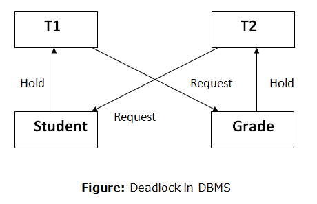

> 락의 종류와 전략은 DBMS 벤더사마다 조금씩 다르다. 본 포스팅은 MySQL 8.0 InnoDB 기준으로 설명한다.

DBMS에서 특정 데이터에 대한 동시 접근이 발생한 경우 일관성과 무결성 지키기 위해 해당 데이터에 잠금을 걸 수 있다. 이때, 이 잠금을 구현하는 방식에 따라 크게 공유락과 배타락으로 나뉜다.

## 공유 락과 배타 락

### 공유 락 (Shared Lock)

공유 락(Shared Lock)은 읽기 락(Read Lock)이라고도 불린다. 공유 락이 걸린 데이터에 대해서는 읽기 연산(SELECT)만 실행 가능하며, 쓰기 연산은 실행이 불가능하다. 공유 락이 걸린 데이터에 대해서 다른 트랜잭션도 똑같이 **공유 락을 획득할 수 있으나**, **배타 락은 획득할 수 없다**. 공유 락이 걸려도 읽기 작업은 가능하다는 뜻이다.

공유 락을 사용하면, 조회한 데이터가 트랜잭션 내내 변경되지 않음을 보장한다.

### 배타 락 (Exclusive Lock)

배타 락은 쓰기 락(Write Lock)이라고도 불린다. 데이터에 대해 배타 락을 획득한 트랜잭션은, 읽기 연산과 쓰기 연산을 모두 실행할 수 있다. 다른 트랜잭션은 배타 락이 걸린 데이터에 대해 **읽기 작업도, 쓰기 작업도 수행할 수 없다**. 즉, 배타 락이 걸려있다면 다른 트랜잭션은 **공유 락, 배타 락 둘 다 획득 할 수 없다**. 배타 락을 획득한 트랜잭션은 해당 데이터에 대한 **독점권**을 갖는 것이다.

### 트랜잭션이 락을 획득하지 못하면?

|         | 공유 락 | 배타 락 |
| ------- | ------- | ------- |
| 공유 락 | 허용    | 대기    |
| 배타 락 | 대기    | 대기    |

정리해보자면 위 표와 같이 배타 락이 개입하는 경우에는 양립이 불가능해진다. 트랜잭션이 락을 획득하지 못한 경우에는 락을 획득하기 위해 대기하게 된다. 후술 하겠지만, 이런 특성으로 인해 데드락이 발생할 수 있다.

## MySQL 8.0 에서의 공유 락, 배타 락

공유 락, 배타 락의 잠금 옵션은 Auto Commit 이 비활성화 되거나, BEGIN 혹은 START TRANSACTION 명령을 통해 트랜잭션이 시작된 상태에서만 잠금이 유지된다.

### 공유 락 (SELECT FOR SHARE)

아래와 같이 `SELECT FOR SHARE` 를 사용하여 특정 데이터로부터 공유 락을 획득할 수 있다.

```sql
SELECT * FROM table_name WHERE id = 1 FOR SHARE;
```

### 배타 락

아래와 같이 `SELECT FOR UPDATE` 를 사용하여 특정 데이터로부터 배 락 을 획득할 수 있다.

```sql
SELECT * FROM table_name WHERE id = 1 FOR UPDATE;
```

## 몇 가지 주의점

### 잠금 없는 읽기

InnoDB 스토리지 엔진을 사용하는 테이블에서는 한 가지 주의할 점이 있다. `FOR UPDATE` 혹은 `FOR SHARE` 절을 가지지 않는 `SELECT` 쿼리는 잠금 없는 읽기가 지원된다. 따라서 특정 데이터가 `FOR UPDATE` 로 락이 걸린 상태라도 `FOR UPDATE` , `FOR SHARE` 가 없는 단순 `SELECT` 쿼리는 아무런 대기 없이 해당 데이터를 조회할 수 있다.

### 데드락



데드락은 서로가 점유하고 있는 자원에 대해 무한정 대기하고 있는 상황을 의미한다. 특정 데이터를 점유한다는 락의 특성 상 데드락이 발생할 수 있다. 예를 들어보자.

트랜잭션이 완료되기 위해서는 특정 데이터를 조회한 뒤, 다른 데이터를 변경해야 한다고 가정하자. 트랜잭션1은 id = 1 인 데이터를 조회하고, id = 2 인 데이터를 변경해야한다. 트랜잭션2는 id = 2 인 데이터를 조회하고, id = 1 인 데이터를 변경해야한다. 이 두개의 트랜잭션이 동시에 실행된다고 가정하자.

트랜잭션1은 id = 1 인 데이터로부터 공유 락을 획득한다. 동시에 트랜잭션2는 id = 2 인 데이터로부터 공유 락을 획득한다. 그 후 트랜잭션1은 id = 2 인 데이터로부터 배타 락을 획득하려한다. 하지만, id = 2 인 데이터는 트랜잭션2가 공유 락을 걸어 배타 락을 획득할 수 없다. 트랜잭션1은 대기한다. 동시에 트랜잭션2는 id = 1 인 데이터로부터 배타 락을 획득하려한다. 마찬자기로 트랜잭션1의 공유 락이 걸려있어 획득할 수 없다. 트랜잭션1과 트랜잭션2는 서로의 데이터의 락이 해제될 때 까지 무한정 대기한다.

락과 같이 특정 리소스를 점유하는 매커니즘을 사용할 때에는 위와 같은 데드락을 주의해야한다.

## 참고

- Real MySQL 8.0 - 백은빈, 이성욱
- [https://www.youtube.com/watch?v=ZXV6ZqMyJLg](https://www.youtube.com/watch?v=ZXV6ZqMyJLg)
- [https://sabarada.tistory.com/121](https://sabarada.tistory.com/121)
- [http://wiki.hash.kr/index.php/락](http://wiki.hash.kr/index.php/%EB%9D%BD)
