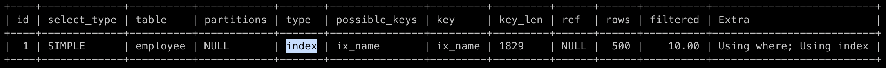
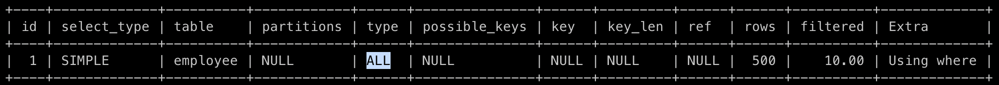
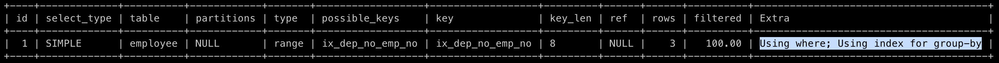
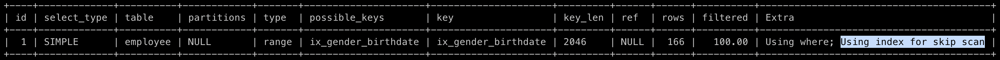
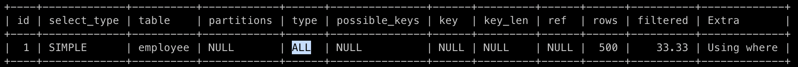

## 인덱스 레인지 스캔

인덱스 레인지 스캔은 검색해야할 범위가 정해졌을 때 사용되는 방식이다. 인덱스 레인지 스캔은 B-Tree의 루트 페이지부터 리프 페이지까지 내려가 범위 탐색의 시작점을 찾는다. 그 이후 **정렬된 인덱스 데이터를 범위 탐색의 끝점까지 순서대로 쭉 읽는다**. 이때, 쭉 읽는 것을 스캔이라고 표현한다.

리프 노드에서 순서대로 쭉 읽어올 수 있는 이유는 **인덱스는 항상 정렬된 상태**를 유지하기 때문이고, InnoDB의 인덱스는 **B+Tree로 구성되어 리프 노드 페이지가 링크드 리스트**로 연결되어있기 때문에 가능하다. 

리프 노드에서 검색 조건에 일치하는 데이터를 찾으면 실제 데이터 파일에서 레코드를 읽어오는 과정이 필요하다. 이때, **레코드를 읽어오는 과정에서 디스크 랜덤 I/O**가 발생한다. 따라서 인덱스를 통해 데이터 레코드를 읽는 작업은 비용이 많이 드는 작업이다.

**[쿼리 튜닝 관점에서의 저장 매체와 랜덤 I/O, 순차 I/O](https://hudi.blog/storage-and-random-sequantial-io/)** 포스팅에서 이야기했듯이, 쿼리 속도를 높이기 위해서는 랜덤 I/O 횟수를 줄여야한다. 인덱스 레인지 스캔은 랜덤 I/O를 사용하는 반면, **테이블 풀 스캔은 순차 I/O**를 사용한다. 따라서 읽어야할 데이터 레코드가 **20~25%를 넘으면, 테이블의 데이터를 직접 읽는 것이 더 효율적인 처리** 방식이 된다. 

### 인덱스 레인지 스캔 과정 정리

1. **인덱스 탐색 (index seek)** : 조건에 만족하는 값이 저장된 위치를 찾는다.
2. **인덱스 스캔 (index scan)** : (1)에서 찾은 위치부터 필요한 만큼 인덱스를 쭉 읽는다.
3. **레코드 읽어오기** : (2)에서 읽어온 **인덱스 키**와 **레코드 주소**를 이용해 레코드가 저장된 페이지를 가져오고, 최종 레코드를 읽어온다.

### 커버링 인덱스

쿼리를 실행시킬 수 있는 데이터를 인덱스가 모두 가지고 있는 인덱스를 커버링 인덱스(covering index)라고 한다. 쉽게 말하자면 `SELECT` , `WHERE` , `ORDER BY` , `GROUP BYT` 등에서 사용되고 있는 컬럼이 모두 인덱스에 존재하는 경우를 의미한다.

이런 경우 인덱스 레인지 스캔 과정에서 레코드를 읽어오는 작업이 필요 없을 수 있다. 쿼리를 실행하기 위해 필요한 정보가 모두 인덱스에 존재하기 때문이다. 이런 경우 랜덤 I/O가 발생하지 않고, 성능이 그만큼 빨라진다.

### 실행계획으로 살펴보기

실행계획(query execution plan)은 MySQL 엔진의 옵티마이저(optimizer)가 쿼리를 최적화하여 수립한 작업 절차를 의미한다. `EXPLAIN` 를 사용하여 특정 쿼리의 실행 계획을 확인할 수 있다. 이 실행계획을 살펴보고 실제로 쿼리를 실행할 때 인덱스 레인지가 발생하는지 확인해볼 것이다.

```sql
ALTER TABLE employee
ADD INDEX ix_name (name);
```

일단 위와 같이 `name` 필드에 인덱스를 생성했다.

```sql
EXPLAIN
SELECT phone, country
FROM employee
WHERE name BETWEEN 'Joshua Herrera' AND 'Ruth Fox';
```

그리고 위와 같이 `name` 필드에 대한 인덱스 레인지 스캔이 발생하도록 SELECT 쿼리를 작성했다. 이에 대한 실행계획을 `EXPLAIN` 을 통해 살펴보자.


위 표를 보면 `type` 이 `range` 인 것을 볼 수 있다. 실제로 인덱스 레인지 스캔이 발생한 것을 확인할 수 있다.

## 인덱스 풀 스캔

인덱스 레인지 스캔처럼 범위 탐색을 하지만, 인덱스 풀 스캔은 전체 인덱스를 모두 탐색하는 방법이다. 쿼리의 조건절이 인덱스의 첫 컬럼이 아닌 경우에 인덱스 풀 스캔 방식이 적용된다. 예를 들어 인덱스를 `(name, country, phone)` 으로 설정해뒀는데, 조건절에서는 `country` 혹은 `phone` 이 사용되는 경우이다.

쿼리가 인덱스에 명시된 컬럼만으로 조건을 처리할 수 있는, 즉 커버링 인덱스인 경우에만 이 방식이 사용된다. 인덱스에 있는 컬럼만으로 쿼리를 처리할 수 없는 경우, 인덱스 풀 스캔이 사용되면 레코드마다 랜덤 I/O가 발생한다. 이는 굉장히 비효율적이므로 절대 이 방식으로 사용되지 않는다.

인덱스의 크기는 테이블 크기보다 작으므로 테이블 풀 스캔보다는 효율적이다. 인덱스 풀 스캔이 테이블 풀 스캔보다는 적은 디스크 I/O가 사용되기 때문이다.

### 실행계획으로 살펴보기

```sql
ALTER TABLE employee
ADD INDEX ix_name_country_phone (name, country, phone);
```

위와 같이  `(name, country, phone)` 3개의 컬럼에 인덱스를 걸어준다.

```sql
EXPLAIN
SELECT phone
FROM employee
WHERE country = 'South Korea';
```

그리고 인덱스의 첫번째 컬럼이 아닌 컬럼을 조건절에 넣어준다.



실행계획의 `type` 이 `index` 인 것을 알 수 있다. `index` 라는 이름이 조금 오해를 할 법 한데, `index` 는 인덱스 풀 스캔을 의미한다. 즉 인덱스의 모든 범위를 탐색한 것이다.

```sql
EXPLAIN
SELECT gender
FROM employee
WHERE country = 'South Korea';
```

쿼리에서 인덱스를 구성하고 있지 않은 컬럼까지 요구하면 어떻게 될까? 위와 같이 인덱스에 포함되지 않은 `gender` 컬럼을 쿼리에 포함하여 실행계획을 살펴보자.



실행계획의 `type` 이 `ALL` 인것을 확인할 수 있다. `ALL` 은 테이블 풀 스캔을 의미한다. 이와 같이 커버링 인덱스가 아닌 상황에서는 옵티마이저가 인덱스 풀 스캔보다 테이블 풀 스캔을 하는 것이 더 효율적이라고 판단한 것이다. 

## 루스 인덱스 스캔

인덱스 레인지 스캔과 비슷하게 동작하지만, 중간중간 필요없는 인덱스 키 값을 건너뛰는(skip)하고 다음으로 넘어가는 형태로 처리한다. `GROUP BY` 또는 `MIN` , `MAX` 같은 집계 함수에 최적화 된 방식이다.

```sql
SELECT dep_no, MIN(emp_no)
FROM employee
WHERE dep_no BETWEEN 2 AND 4
GROUP BY dep_no;
```

`employee` 테이블은 `(dep_no, emp_no)` 두 컬럼으로 인덱스가 생성되어 있다. 위 쿼리에서 `GROUP BY` 를 통해 `dep_no` 컬럼 기준으로 그루핑을 하고, `MIN` 집계 함수를 사용하여 그룹별로 제일 작은 `emp_no` 를 가져온다. 인덱스 레인지 스캔 중 그룹에서 가장 작은 `emp_no` 를 찾으면, 해당 그룹에서는 더이상 인덱스 스캔을 할 필요가 없어진다. 이때 필요 없는 인덱스를 건너뛰게되고, 이 방식을 루스 인덱스 스캔이라고 한다.

### 실행계획으로 살펴보기

```sql
ALTER TABLE employee
ADD INDEX ix_dep_no_emp_no (dep_no, emp_no);
```

위 처럼 인덱스를 걸어준다.

```sql
EXPLAIN
SELECT dep_no, MIN(emp_no)
FROM employee
WHERE dep_no BETWEEN 2 AND 4
GROUP BY dep_no;
```

앞선 예제 쿼리의 실행계획을 살펴보자.



`type` 은 `range` 로 나와있는데, `Extra` 에 `Using index for group-by` 가 표시된 것을 확인할 수 있다. 이것으로 루스 인덱스 스캔이 적용되었음을 확인할 수 있다.

## 인덱스 스킵 스캔

인덱스를 생성할 때 컬럼의 순서는 중요하다. 인덱스 컬럼 순서를 기준으로 인덱스가 정렬되기 때문이다. 아래와 같은 인덱스를 생성해보자.

```sql
ALTER TABLE employee
ADD INDEX ix_gender_birthdate (gender, birth_date);
```

이 상태에서 아래 쿼리를 실행하면 인덱스를 탈 수 있을까?

```sql
SELECT gender FROM employee
WHERE birth_date > '1998-01-01';
```

인덱스 풀 스캔에서 배운 내용으로 보아 인덱스의 첫번째 컬럼이 조건절에 존재하지 않으므로 인덱스를 타지 않을 것 같다. 이 경우 `birth_date` 로 시작하는 새로운 인덱스를 만들어야한다.

하지만 MySQL 8.0 부터는 인덱스 스킵 스캔이라는 최적화 기능이 도입되었다. 한번 위 쿼리에 대한 실행 계획을 살펴보자.



`Extra` 에 `Using index for skip scan` 이 포함된 것을 볼 수 있다. 무슨 의미일까? MySQL 8.0은 위 쿼리를 아래와 같이 두개의 쿼리로 최적화하여 실행해준다.

```sql
SELECT gender, FROM employee WHERE gender='M' AND birth_date > '1998-01-01';
SELECT gender, FROM employee WHERE gender='F' AND birth_date > '1998-01-01';
```

우리가 추가하지 않은 `gender` 컬럼이 조건절에 추가된 것을 확인할 수 있다. 인덱스에 대한 첫번째 컬럼과 그 컬럼이 가질 수 있는 모든 값('M' 과 'F')에 대해 MySQL 8.0의 옵티마이저가 임의로 조건절에 추가한 것이다. 이렇게 되면 조건절이 인덱스의 첫번째 컬럼을 포함하게 되어 쿼리가 인덱스를 탈 수 있다.

하지만, 현재의 인덱스 스킵 스캔은 아래의 두가지 제약 조건이 존재한다.

1. **WHERE 조건절에 조건이 없는 인덱스의 선행 컬럼의 유니크한 값의 개수가 적어야 함.**
2. **쿼리가 인덱스에 존재하는 컬럼만으로 처리 가능해야 함(커버링 인덱스).**

1번째 제약 조건 먼저 보자. 유니크한 값이 너무 많으면 MySQL 옵티마이저는 인덱스에서 스캔해야 할 시작 지점을 검색하는 작업이 많이 필요해진다. 예를 들어 인덱스가 `(gender, birth_date)` 가 아니라 `(emp_no, birth_date)` 라고 가정해보자. `emp_no` 는 다른 행과 중복되지 않은 숫자 값 이다. 즉, 유니크한 값의 개수가 매우 많다. 

```sql
SELECT emp_no FROM employee
WHERE birth_date > '1998-01-01';
```

이때, 위의 쿼리를 실행하면, 옵티마이저는 어떻게 최적화 해야할까?

```sql
SELECT gender, FROM employee WHERE emp_no=1 AND birth_date > '1998-01-01';
SELECT gender, FROM employee WHERE emp_no=2 AND birth_date > '1998-01-01';
SELECT gender, FROM employee WHERE emp_no=3 AND birth_date > '1998-01-01';
SELECT gender, FROM employee WHERE emp_no=4 AND birth_date > '1998-01-01';
SELECT gender, FROM employee WHERE emp_no=5 AND birth_date > '1998-01-01';
# ...
```

위와 같이 오히려 성능이 떨어지는 상황이 발생할수도 있다. 따라서 인덱스 스킵 스캔은 인덱스의 선행 칼럼의 유니크한 값의 개수가 적은 상황에서만 적용 가능한 최적화다.

2번째 제약 조건을 살펴보자.

```sql
SELECT phone FROM employee
WHERE birth_date > '1998-01-01';
```

위와 같이 커버링 인덱스가 아닌 쿼리를 실행하면 어떻게 될까?



위와 같이 바로 테이블 풀 스캔을 하는 것을 알 수 있다. 즉, 커버링 인덱스일 때만 인덱스 스킵 스캔이 가능하다.

## 더 공부해볼 키워드

- 실행계획
- 옵티마이저
- 커버링 인덱스

## 참고

- Real MySQL 8.0 (8.3.4) - 백은빈, 이성욱
- [https://jojoldu.tistory.com/476](https://jojoldu.tistory.com/476)
- [https://dev.mysql.com/doc/refman/8.0/en/execution-plan-information.html](https://dev.mysql.com/doc/refman/8.0/en/execution-plan-information.html)