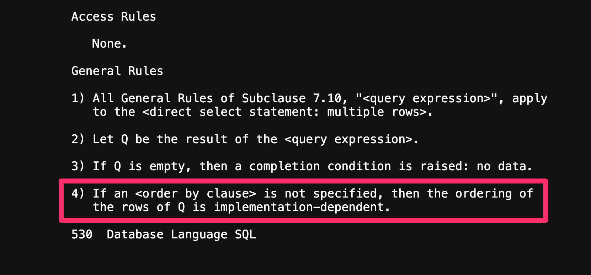

## MySQL이 알아서 PK로 정렬해줄 것이라는 오해

흔히 `SELECT` 쿼리를 실행하면 Primary Key 기준으로 오름차순 정렬이 되는 것을 보고, MySQL의 기본 정렬은 PK 기준이라고 생각할 수도 있다.

```sql
CREATE TABLE user
(
    id           BIGINT AUTO_INCREMENT PRIMARY KEY,
    address      VARCHAR(255) NULL,
    age          INT NOT NULL,
    created_at   DATETIME(6) NULL,
    email        VARCHAR(255) NULL,
    first_name   VARCHAR(255) NULL,
    last_name    VARCHAR(255) NULL,
    phone_number VARCHAR(255) NULL
);
```

이를 확인해보기 위해서 위와 같이 `user` 테이블을 만들고, 실제와 비슷한 환경을 만들기 위해 10만개의 더미 데이터를 추가해두었다. 먼저, `user` 테이블에 대해서 아무런 조건 없는 단순한 `SELECT` 쿼리를 실행해보자.

```sql
mysql> SELECT * FROM user;
+--------+---------------+-----+----------------------------+-----------------------------------+------------+-----------+--------------+
| id     | address       | age | created_at                 | email                             | first_name | last_name | phone_number |
+--------+---------------+-----+----------------------------+-----------------------------------+------------+-----------+--------------+
|      1 | 802 Main St   |  77 | 2022-10-09 12:32:10.119311 | grace.jones1@test.com             | Grace      | Jones     | 555-8533     |
|      2 | 209 Maple St  |  39 | 2022-01-24 12:32:10.119335 | bob.miller2@dummy.com             | Bob        | Miller    | 555-4287     |
|      3 | 592 Birch St  |  53 | 2024-06-17 12:32:10.119348 | john.miller3@test.com             | John       | Miller    | 555-4130     |
|      4 | 914 Spruce St |  46 | 2021-09-06 12:32:10.119356 | grace.jones4@dummy.com            | Grace      | Jones     | 555-7132     |
|      5 | 507 Oak St    |  60 | 2023-02-11 12:32:10.119363 | alice.jones5@example.com          | Alice      | Jones     | 555-8964     |
|      6 | 710 Birch St  |  74 | 2022-03-28 12:32:10.119369 | alice.williams6@dummy.com         | Alice      | Williams  | 555-7837     |
|      7 | 198 Oak St    |  44 | 2022-08-07 12:32:10.119376 | john.miller7@example.com          | John       | Miller    | 555-6914     |
|      8 | 802 Oak St    |  44 | 2021-04-29 12:32:10.119382 | john.doe8@example.com             | John       | Doe       | 555-6634     |
|      9 | 420 Birch St  |  71 | 2024-02-11 12:32:10.119388 | bob.brown9@example.com            | Bob        | Brown     | 555-7305     |
|     10 | 732 Willow St |  54 | 2023-10-27 12:32:10.119395 | john.smith10@test.com             | John       | Smith     | 555-4544     |
```

결과는 예상처럼 PK인 `id` 컬럼 기준으로 오름차순 정렬되어 보인다. 그렇다면 이번에는 좀 더 복잡한 조건을 만들어보고, 조회 쿼리에도 여러 조건을 추가해보자.

```sql
mysql> create index user_age_email_index on user (age desc, email desc);
```

우선 위와 같이 인덱스를 추가해보자. 그리고 아래와 같이 쿼리한다.

```sql
mysql> SELECT * FROM user WHERE age > 25 AND email LIKE '%@test.com' LIMIT 10;
+-------+---------------+-----+----------------------------+-----------------------------+------------+-----------+--------------+
| id    | address       | age | created_at                 | email                       | first_name | last_name | phone_number |
+-------+---------------+-----+----------------------------+-----------------------------+------------+-----------+--------------+
| 56753 | 104 Ash St    |  80 | 2024-02-29 12:32:10.413366 | john.williams56753@test.com | John       | Williams  | 555-3182     |
| 16364 | 951 Maple St  |  80 | 2021-01-21 12:32:10.205319 | john.williams16364@test.com | John       | Williams  | 555-2859     |
|  9196 | 175 Birch St  |  80 | 2021-09-12 12:32:10.168647 | john.smith9196@test.com     | John       | Smith     | 555-2383     |
|  6681 | 801 Pine St   |  80 | 2020-02-01 12:32:10.155685 | john.smith6681@test.com     | John       | Smith     | 555-8990     |
| 11058 | 217 Birch St  |  80 | 2023-11-21 12:32:10.178208 | john.smith11058@test.com    | John       | Smith     | 555-9641     |
| 97566 | 916 Birch St  |  80 | 2023-04-08 12:32:10.626287 | john.miller97566@test.com   | John       | Miller    | 555-2294     |
| 53274 | 375 Birch St  |  80 | 2022-04-09 12:32:10.395543 | john.miller53274@test.com   | John       | Miller    | 555-6957     |
| 47688 | 256 Birch St  |  80 | 2020-03-19 12:32:10.366987 | john.miller47688@test.com   | John       | Miller    | 555-7895     |
| 15841 | 379 Spruce St |  80 | 2022-05-06 12:32:10.202662 | john.miller15841@test.com   | John       | Miller    | 555-3964     |
|  9954 | 155 Birch St  |  80 | 2023-06-02 12:32:10.172515 | john.martinez9954@test.com  | John       | Martinez  | 555-6591     |
+-------+---------------+-----+----------------------------+-----------------------------+------------+-----------+--------------+
10 rows in set (0.02 sec)
```

예상과 다르게 `id` 컬럼의 정렬이 뒤죽박죽 불규칙적이다. 왜 이런일이 발생할까?

## 사실, MySQL은 정렬을 보장하지 않는다

방금 전 알아본것 처럼 MySQL은 정렬 순서를 보장해주지 않는다.

MySQL은 자신이 판단했을 때 가장 효율적으로 데이터를 탐색할 수 있는 순서대로 우리에게 데이터를 보여준다 (정확히는 그냥 DBMS가 데이터를 읽는 순서대로 우리에게 보여준다). 즉 쿼리, 인덱스, 실행 계획, 쿼리 옵티마이저의 동작, 데이터 스토리지 엔진, 물리적인 데이터의 위치 등 여러 조건들에 따라서 정렬 순서는 달라지고, 이는 예측 불가능하다.

그렇다면 첫번째 `SELECT * FROM user` 쿼리는 왜 PK 기준으로 정렬되는 것 처럼 보였던 것일까? 이것은 그저 Clustered Index[^1]에서 데이터가 PK 기준으로 물리적인 정렬이 되어 있어 가장 빠르게 탐색할 수 있는 방법이었기 때문이다.

### 정렬을 보장해야한다면, Order By를 반드시 명세하자

물론 데이터 조회 순서에 영향을 주는 모든 요소를 파악하고 동작을 예측해서, 데이터 정렬 순서를 예상해보는게 가능이야 하겠다만… 그런 수고를 들이느니 간단하게 `SELECT` 쿼리 마지막에 `Order By` 를 추가하는게 훨씬 더 경제적이다.

```sql
mysql> SELECT * FROM user WHERE age > 25 AND email LIKE '%@test.com' ORDER BY id  LIMIT 10;
+----+---------------+-----+----------------------------+--------------------------+------------+-----------+--------------+
| id | address       | age | created_at                 | email                    | first_name | last_name | phone_number |
+----+---------------+-----+----------------------------+--------------------------+------------+-----------+--------------+
|  1 | 802 Main St   |  77 | 2022-10-09 12:32:10.119311 | grace.jones1@test.com    | Grace      | Jones     | 555-8533     |
|  3 | 592 Birch St  |  53 | 2024-06-17 12:32:10.119348 | john.miller3@test.com    | John       | Miller    | 555-4130     |
| 10 | 732 Willow St |  54 | 2023-10-27 12:32:10.119395 | john.smith10@test.com    | John       | Smith     | 555-4544     |
| 14 | 824 Maple St  |  37 | 2021-02-11 12:32:10.119419 | david.smith14@test.com   | David      | Smith     | 555-3876     |
| 16 | 616 Birch St  |  31 | 2021-02-10 12:32:10.119432 | alice.johnson16@test.com | Alice      | Johnson   | 555-2375     |
| 17 | 404 Birch St  |  56 | 2021-11-25 12:32:10.119438 | charlie.doe17@test.com   | Charlie    | Doe       | 555-9786     |
| 19 | 201 Birch St  |  75 | 2023-08-13 12:32:10.119450 | hank.jones19@test.com    | Hank       | Jones     | 555-9836     |
| 24 | 808 Maple St  |  45 | 2024-05-23 12:32:10.119480 | david.jones24@test.com   | David      | Jones     | 555-7736     |
| 28 | 274 Main St   |  35 | 2022-05-16 12:32:10.119504 | bob.davis28@test.com     | Bob        | Davis     | 555-4227     |
| 31 | 640 Cedar St  |  40 | 2019-11-08 12:32:10.119522 | jane.doe31@test.com      | Jane       | Doe       | 555-8499     |
+----+---------------+-----+----------------------------+--------------------------+------------+-----------+--------------+
10 rows in set (0.02 sec)
```

`Order By` 를 추가하고 나서야, (당연하게도) `id` 기준으로 정렬되어 결과를 보여주는 것을 볼 수 있다.

### SQL-92 명세

사실 SQL의 이런 동작 방식은 SQL-92 이라는 SQL 표준 명세[^2]를 보아도 알 수 있다.



> 4. If an \<order by clause\> is not specified, then the ordering of the rows of Q is implementation-dependent.

SQL-92 문서를 읽어보면 중후반부에 **_‘만일 order by 절이 명세되지 않았다면, Q(쿼리)의 정렬은 구현에 의존한다.’_** 라는 내용이 명확히 존재하는 것을 알 수 있다.

따라서 예시를 MySQL로 들었지만, 이런 특징은 비단 MySQL 뿐 아니라 Oracle, SQL Server 와 같은 다른 벤더의 DBMS 도 마찬가지이다[^3].

### DBMS는 굳이 PK 기준 정렬을 해줄 의무가 없다

그럼 MySQL을 포함한 여러 DBMS 들은 배려심이 없어서 이렇게 개발자를 당황하게 만드는 걸까?

이건 내 개인적인 생각이지만, 잘 생각해보면 MySQL은 굳이 `Order By` 가 없는 질의에 대해서 PK 기준으로 정렬을 해줄 의무가 없다. 대부분의 경우 PK를 auto_increment 로 사용하지만, UUID 처럼 sequential 하지 않은 값을 사용하는 경우도 충분히 존재한다. 이런 경우 애써 MySQL이 정렬을 해준다고 한들, 그 순서는 별 의미가 없을 것이다.

## 흔한 실수: 커서 기반 페이지네이션

관련하여 나의 실수를 하나 공유해본다. 매일 새벽에 해당 일자에 발생한 어떠한 데이터를 집계하는 배치 잡을 작성하던 때였다. 아무래도 배치이기 때문에 많은 양의 데이터를 다루게 되는데, 이때 다량의 데이터를 제한 없이 모두 읽어오게 되면, OOM이 발생하게 되어 배치 잡 프로세스가 죽을수도 있다.

따라서 이런 경우 페이지네이션을 사용해야 안전하다. 페이지네이션은 크게 오프셋 기반과 커서 기반 방식으로 나뉘게 되는데, 커서 기반의 페이지네이션 방식이 오프셋 기반 방식에 비해 여러 이점이 있어 (이건 별개 포스팅으로 다뤄보겠다), 커서 기반 페이지네이션을 선택했다.

커서 기반 페이지네이션은 커서 기준으로 삼을 sequential 한 컬럼이 하나 필요한데, 위 예제와 비슷하게 당시 테이블도 PK인 `id` 컬럼이 sequential 했으므로 이 컬럼을 기준으로 잡고 로직을 작성했다. 위 예제를 예로 들자면, 아래와 같이 JPA Repository 메소드를 작성한것이다.

```kotlin
interface UserRepository : JpaRepository<User, Long> {
    fun findByIdGreaterThanAndAgeGreaterThanAndEmailEndsWith(
        id: Long,
        age: Int,
        email: String,
        pageable: Pageable,
    ): List<User>
}
```

그리고 여러분의 예상처럼, 배치는 어떤 데이터는 중복으로 집계되고, 어떤 데이터는 누락되면서 난리가 났고, 나는 새벽 한밤중에 부랴부랴 대응하느라 정신이 없었다. <strike>하필 다음날 오전에 출국하는 비행기가 있었는데, 잠을 늦게 자서 비행기를 놓칠뻔했다.</strike>

그러니까, 커서기반 페이지네이션 할 때 꼭 `Order By` 를 넣어서 정렬을 보장하자. MySQL은 여기까지 배려해주지 않는다.

## 참고

- https://dba.stackexchange.com/questions/6051/what-is-the-default-order-of-records-for-a-select-statement-in-mysql
- https://stackoverflow.com/questions/8746519/sql-what-is-the-default-order-by-of-queries
- https://stackoverflow.com/questions/49815703/what-is-the-default-order-by-for-a-mysql-innodb-query-that-omits-the-order-by
- https://www.contrib.andrew.cmu.edu/~shadow/sql/sql1992.txt

[^1]: https://hudi.blog/db-clustered-and-non-clustered-index/
[^2]: https://www.contrib.andrew.cmu.edu/~shadow/sql/sql1992.txt
[^3]: https://learn.microsoft.com/en-us/archive/blogs/conor_cunningham_msft/no-seatbelt-expecting-order-without-order-by
