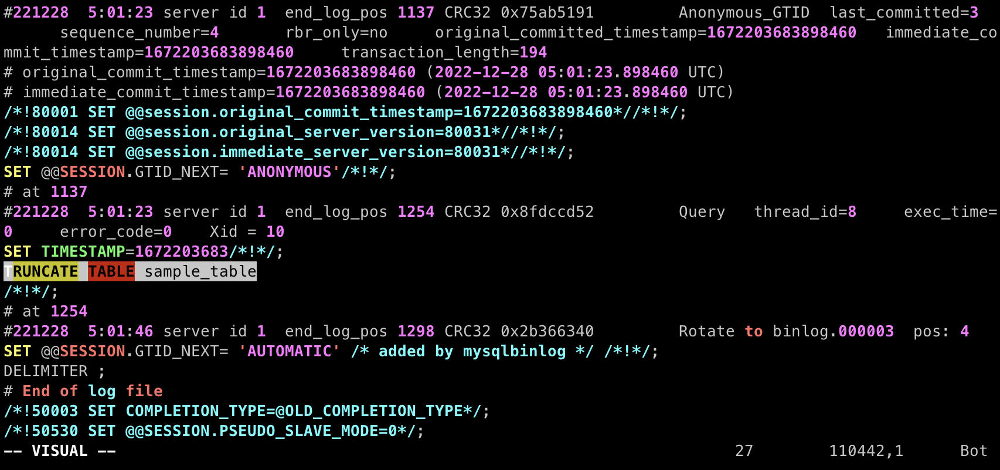

## MySQL 바이너리 로그

MySQL에는 바이너리 로그라는 것이 존재한다. 바이너리 로그에는 MySQL에서 데이터베이스에서 테이블 생성, 변경 작업, 데이터 추가, 삭제, 변경 등의 **‘이벤트’**가 저장되어 있다. 단, SELECT 와 같이 데이터베이스를 변경하지 않는 명령에 대한 이벤트는 저장하지 않는다.

이 바이너리 로그는 크게 두 가지로 활용된다. 첫번째는 **데이터베이스 복구**이다. 말했듯, 바이너리 로그에는 데이터베이스를 변경하는 모든 이벤트가 저장되어있어 데이터베이스를 특정 시점으로 복구하는데 사용할 수 있다.

두번째로는 **데이터베이스 레플리케이션**이다. 이전 **[MySQL 8.0의 레플리케이션 아키텍처와 복제 타입](https://hudi.blog/mysql-8.0-replication-architecture-and-replication-type/)** 포스팅에서도 다룬바 있는데, 레플리카가 소스의 바이너리 로그를 읽어가 레플리카에 릴레이 로그로 저장한다음 복제가 진행된다.

이번 포스팅에서는 첫번째 활용 방법에 대해 다룬다.

## PIT(Point-In-Time) 복구

MySQL 바이너리 로그를 활용하여 특정 시점으로 데이터를 복구할 수 있다. 이를 PIT 복구라고 한다. 이 방법에 대해 알아보자.

### 복구 상황 상정

```sql
CREATE DATABASE sample_database;
USE sample_database;

CREATE TABLE sample_table(   
  id BIGINT PRIMARY KEY AUTO_INCREMENT,
  text VARCHAR(255) not null
);

INSERT INTO sample_table(text)
VALUES
('lost data 1'),
('lost data 2'),
('lost data 3'),
('lost data 4');
```

위와 같이 데이터베이스와 테이블을 생성하고, 데이터를 넣어주었다. 서비스 중 개발자 실수로 TRUNCATE 를 실행해 데이터를 몽땅 날렸다고 가정하자.

```sql
TRUNCATE TABLE sample_table; # 🙀
```

### 바이너리 로그 확인

이제 복구를 시작하자. 우선, 아래 쿼리로 바이너리 로그 목록을 조회해보자.

```sql
SHOW BINARY LOGS;
```

아래 사진과 같이 바이너리 로그 파일 이름이 출력될 것이다.

```
+---------------+-----------+-----------+
| Log_name      | File_size | Encrypted |
+---------------+-----------+-----------+
| binlog.000001 |   3001484 | No        |
| binlog.000002 |      1254 | No        |
+---------------+-----------+-----------+
```

이제 아래 쿼리를 사용하여, 현재 작성중인 바이너리 로그 파일을 닫고 새로운 바이너리 로그 파일을 열자. 즉, 위 사진 기준으로 `binlog.000002` 파일을 닫고, `binlog.000003` 파일을 만드는 것이다. 복구 시점을 확실히 확인하기 위한 작업이다.

```sql
FLUSH LOGS;
```

다시 `SHOW BINARY LOGS;` 를 실행해보면, 바이너리 로그 파일 목록에 `binlog.000003` 이 추가된 것을 확인할 수 있을 것이다.

### 바이너리 로그를 텍스트로 변환

바이너리 로그는 이름 그대로 이벤트 정보를 이진 데이터로 저장한다. 따라서 그냥 파일을 열게되면 우리가 읽을 수 없다. 이를 텍스트로 변환할 필요가 있다. 이때 사용되는 유틸리티가 **mysqlbinlog** 이다. mysqlbinlog 는 MySQL 에서 기본 제공되므로 곧바로 사용할 수 있다.

바이너리 로그의 일반적인 저장 경로는 `/var/lib/mysql` 이다. 아래 명령을 통해 단일 바이너리 로그 파일을 텍스트 파일로 변환할 수 있다. 리다이렉션을 사용하여 표준 출력을 파일로 리다이렉트할 수 있다.

```bash
mysqlbinlog /var/lib/mysql/binlog.000001 > binlog.000001.sql
```

또는 아래와 같이 와일드카드를 사용하여 모든 바이너리 로그를 단일 텍스트 파일로 변환할 수 있다.

```bash
mysqlbinlog /var/lib/mysql/binlog.0* > binlog.sql
```

하지만 우리는 `binlog.000003` 은 필요하지 않으니 아래의 방법을 사용하자. 아래의 방법처럼 여러 바이너리 로그를 전달하여 하나의 바이너리 로그로 만드는 방법도 있다.

```bash
mysqlbinlog /var/lib/mysql/binlog.000001 /var/lib/mysql/binlog.000002 > recover.sql
```

### 복구 시작

자, 이제 이 파일을 vim 으로 열어 문제의 **TRUNCATE 쿼리를 없앤** 다음, 바이너리 로그에 저장된 쿼리를 **처음부터 다시 실행**할 것이다. 방금 mysqlbinlog 를 사용하여 생성한 `recover.sql` 을 vim으로 열어보자.

```bash
vim recover.sql
```



> vim의 일반 모드에서 Shift + G를 누르면, 파일의 최하단으로 커서를 옮길 수 있다.
> 

문제의 TRUNCATE 쿼리가 보인다. 이를 `#` 또는 `/* */` 를 사용하여 주석 처리 하자. 그리고 파일을 저장한다. 이제 이 SQL 파일을 다시 MySQL에서 실행하는 일만 남았다.

```bash
mysql -u 유저이름 -p -f < recover.sql
```

위와 같이 다시 파일을 mysql 명령의 표준 입력으로 리다이렉트하여 SQL문을 실행할 것이다. 바이너리 로그에는 `CREATE DATABASE`, `CREATE TABLE` 과 같은 명령도 함께 존재한다. 그렇기 때문에 일반적인 방법으로 실행하면 이미 데이터베이스 또는 테이블이 존재한다는 에러가 발생하고, 이어서 쿼리를 수행하지 않는다. 따라서 `-f` 옵션을 붙여준다.

### 복구 완료

```sql
SELECT * FROM sample_table;
```

```
+----+-------------+
| id | text        |
+----+-------------+
|  1 | lost data 1 |
|  2 | lost data 2 |
|  3 | lost data 3 |
|  4 | lost data 4 |
+----+-------------+
```

잃어버린 데이터가 복구 되었다 🎉

## 마치며

이 방법은 바이너리 로그가 삭제되지 않은 시점에서만 사용이 가능하다. 바이너리 로그는 서버 용량을 차지하므로, 일반적으로 일정 주기가 지나면 삭제하도록 설정해둘 것이다. 따라서 mysqldump 등의 유틸리티를 사용하여 적절한 주기로 **데이터베이스를 백업하는게 무엇보다 중요**할 것이다. 바이너리 로그를 사용한 복구는 **데이터베이스 백업 시점과 사고가 발생한 시점 사이에 유실된 데이터를 복구**하는데 사용하는 것이 좋아보인다.

그런데 이 모든걸 어떻게 알고 있냐고? 나도 알고 싶지 않았다.

## 참고

- https://dev.mysql.com/doc/refman/8.0/en/binary-log.html