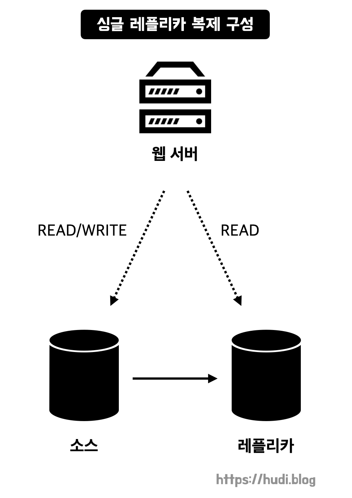
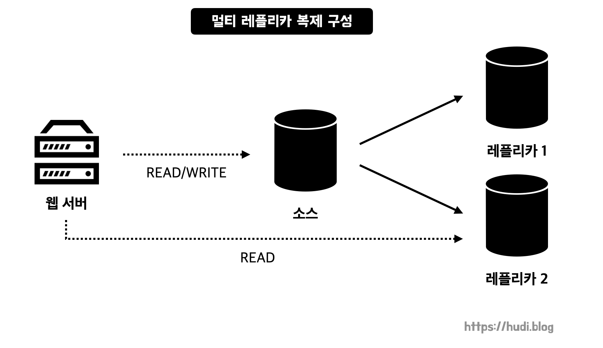
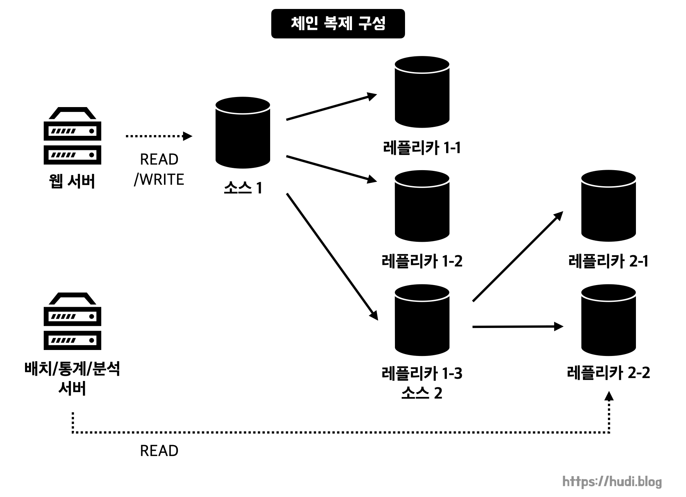
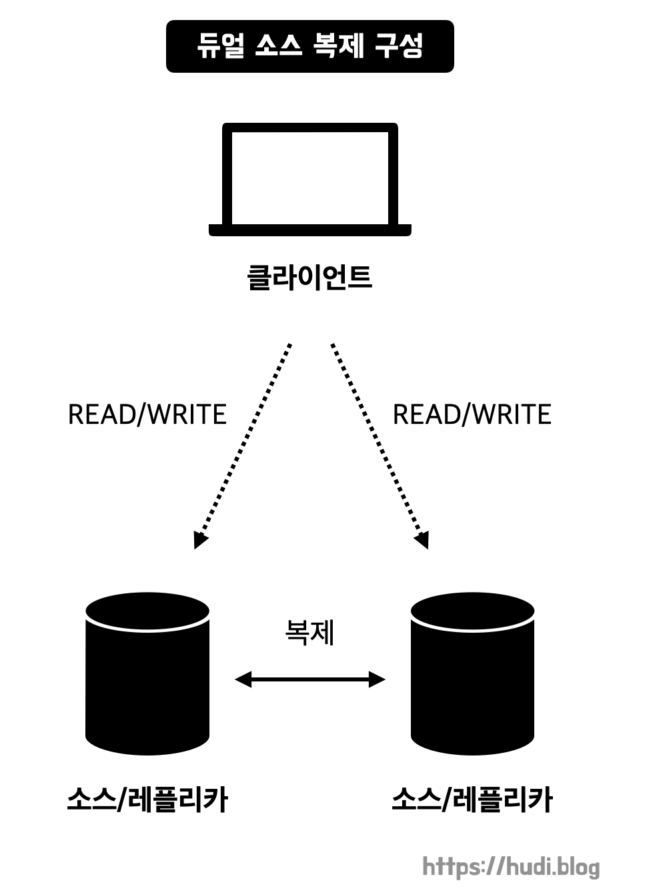
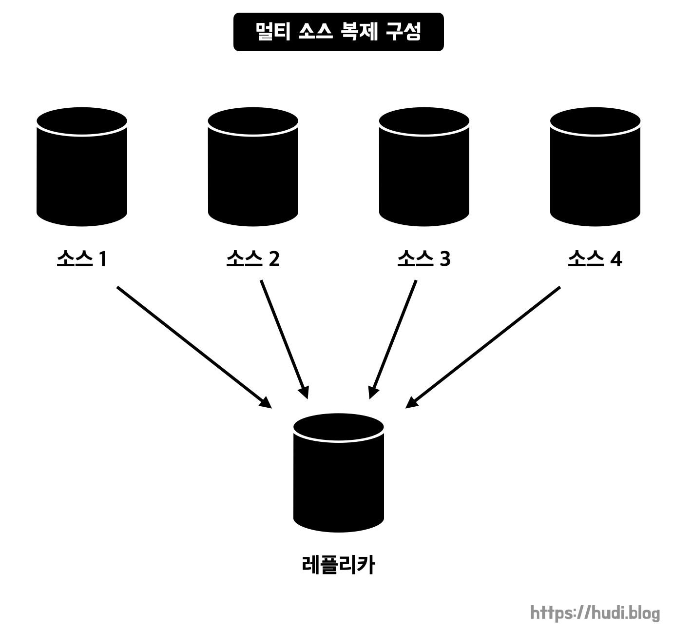

이번 포스팅에서는 MySQL의 레플리케이션 기능을 활용하여 어떤 토폴로지를 구성할 수 있을지 알아본다. 용도에 따라 다양한 토폴로지가 존재한다.

## 싱글 레플리카 복제 구성

가장 기본적인 형태이며 가장 많이 쓰이는 형태이다. 싱글 레플리카 복제 구성에서 웹 서버가 레플리카 서버에 읽기 요청을 전달하면, 레플리카 서버에 문제가 발생했을 때 서비스 장애 상황이 발생할 수 있다. 따라서 **일반적으로 소스 서버가 읽기/쓰기 연산을 모두 처리**하며, **레플리카는 예비용 서버**로 활용한다. 예비용 서버란, 소스 서버가 장애가 발생했을 때 **소스 서버를 대체**하거나 및 **데이터 백업**을 할 수 있는 서버를 말한다.

단, 레플리카 서버를 서비스와 무관한 **배치 작업이나 어드민 툴에서 사용되는 쿼리**를 수행하는 용도로 두는 것은 괜찮다. 이 상황에서 레플리카가 장애가 발생하더라도 실 서비스에는 큰 영향을 주지 않기 때문이다.

## 멀티 레플리카 복제 구성

2대 이상의 레플리카를 두는 형태이다. 대부분의 서비스에서 발생하는 요청은 쓰기 요청보다 읽기 요청이 많다. 즉, 읽기 작업을 분산하여 성능을 향상시킬 수 있다. 혹은 배치 작업, 통계, 분석 작업 등 각 용도별로 별도의 레플리카를 구성하여 사용할수도 있다.

웹 서버가 레플리카 서버로 읽기 요청을 보내는 순간, 레플리카 서버는 소스 서버만큼 중요해진다. 이야기했듯, 레플리카 서버가 장애가 발생하면 서비스에도 장애가 발생하기 때문이다. 또는 배치, 통계, 분석 등의 작업을 수행하는 서버도 특정 시각 내에 쿼리 처리가 반드시 수행돼야 하는 요건이 있을수도 있다.

이런 상황에서 레플리카 하나가 장애가 발생하면, 다른 레플리카 서버가 장애가 발생한 서버를 대신해야 한다. 이 경우 장애 서버를 대체한 서버에 쿼리가 몰리고 부하가 높아질 수 있다. 이런 상황을 대비하기 위해 백업 등 제한적인 용도로 활용되는 예비 레플리카 하나는 확보해두는게 좋다. 이 서버는 소스 서버의 대체 서버 겸 다른 레플리카 서버의 대체 서버로 활용된다.

## 체인 복제 구성

레플리카 서버가 많아져 소스 서버가 바이너리 로그를 읽고 전송하는 작업에 부하가 걸릴 때 이를 해소하기 위한 복제 구성이다. 소스에 연결된 레플리카가 소스의 바이너리 로그를 다시 다른 레플리카에 배포하는 형태로 소스 서버의 부하를 완화한다. 이때, 소스 서버1과 그 레플리카를 묶어 1차 복제 그룹이라고 한다. 그리고 소스서버2와 그 레플리카를 묶어 2차 복제 그룹이라고 한다.

1차 복제 그룹의 레플리카는 소스 서버1로부터 직접 복제받기 때문에 빠르게 데이터가 반영된다. 따라서 OLTP(Online Transaction Processing, 네트워크 상에서 여러 사용자가 DB를 갱신하거나 조회하는 작업)용도로 사용한다. 2차 복제 그룹은 통계, 배치, 백업 등의 용도로 사용할 수 있다.

혹은 MySQL 서버를 업그레이드 하거나, 장비를 교체할 때 사용할수도 있다. MySQL 새로운 버전 혹은 새로운 장비가 설치된 2차 복제그룹을 구성한 뒤, 점진적으로 데이터베이스 요청을 1차 복제그룹에서 2차 복제그룹으로 이동시키면 중단없이 작업을 수행할 수 있다.

## 듀얼 소스 복제 구성

두 개의 데이터베이스 서버가 서로의 소스 서버이자 레플리카 서버인 구성이다. Active-Passive 구성과 Active-Active 구성으로 나뉜다.

Active-Passive는 하나의 서버로만 읽기/쓰기 요청이 전달되고, 나머지 하나의 서버는 켜져있는 상태로 대기하는 형태이다. 두 서버가 모두 소스 서버이므로 언제든 쓰기 작업이 가능한 형태이다. 따라서 장애 발생 시 별다른 설정 없이 바로 Passive 서버로 전환하여 Failover할 수 있다.

Active-Active는 지리적으로 매우 떨어진 위치에서 유입되는 쓰기 요청도 원활히 수행하기 위해 사용한다. 다만, 서로의 트랜잭션이 동기화 되기 전까지는 정합성이 깨질 수 있으므로 주의해야한다.

### Active-Active 구성에서의 주의점

Active-Active 구성에서는 주의해야할 점이 두 가지 정도 존재한다.

첫번째로, **동시에 같은 데이터에 대해 쓰기 작업을 수행할 때**이다. 하나의 데이터베이스를 사용하면 동일한 데이터에 대한 동시에 발생한 두 요청은 잠금 경합으로 인하여 순차적으로 처리된다. 하지만 Active-Active 구성에서 동일한 데이터에 대한 변경 트랜잭션이 각 서버로 동시에 유입되면 예상치 못한 결과가 나올 수 있다. **마지막 트랜잭션이 최종적으로 반영되기 때문**이다.

두번째로, **Auto-Increment 키를 사용할 때**이다. 새로운 데이터가 동시점에 각 서버에 유입되었을 때 같은 Auto-Increment 키가 생성될 수 있다. 이로 인한 **중복 키 에러**가 발생할 수 있다. 따라서 Active-Active 구성에서는 **Auto-Increment 사용을 지양**하고 **애플리케이션 단에서 유일하고 글로벌한 값을 생성**하는 것이 좋다.

### 쓰기 성능 개선을 위한 듀얼 소스 복제?

듀얼 소스 복제 구성은 사실 쓰기 성능을 개선하는 용도로는 그다지 효과적이지는 않다. 서로의 쓰기 요청을 자신의 데이터베이스에 반영하는 작업이 발생하기 때문이다. 오히려 두 서버간 **트랜잭션 충돌로 인한 롤백이나 복제 멈춤** 현상으로 인한 역효과가 많다. 따라서 쓰기 성능을 개선하고 싶다면 **샤딩(sharding)을 권장**한다.

## 멀티 소스 복제 구성

하나의 레플리카 서버가 다수의 소스 서버를 갖는 구성이다. 서로 다른 데이터를 한 곳에 모아 백업하거나, 분석용으로 사용할 때 사용된다. 혹은 샤딩 구성을 해뒀는데, 다시 하나의 서버로 통합하고 싶을때도 사용할 수 있다.

멀티 소스 복제 구성에서는 레플리카 서버는 연결된 여러 소스서버에 대해 **병렬적**으로 복제 작업을 수행한다. 이때 각 소스별 독립된 복제 처리를 **채널(channel)**이라고 한다. 채널은 **개별적인 I/O 쓰레드, SQL 쓰레드, 릴레이 로그**를 가진다.

이 구성은 MySQL 5.7.6 버전부터 가능하다.

## 참고

- Real MySQL 8.0 - 백은빈, 이성욱