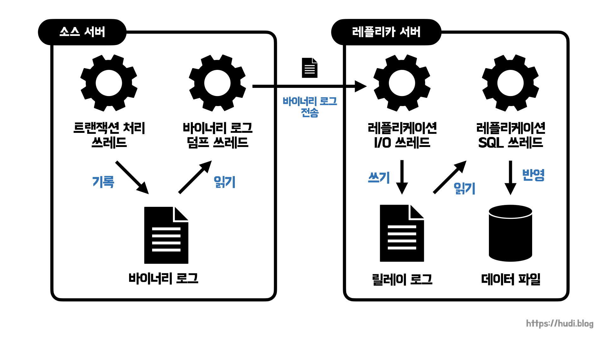

## 학습 배경

달록에서 톰캣 튜닝을 위해 성능 테스트 환경을 구축했다. 조금 더 학습해보니 톰캣을 튜닝하고, 로드 밸런싱을 적용해도 결국 **데이터베이스에서 병목이 발생하면 시스템 전체 성능 저하**가 발생할 수 있다는 것을 알게되었다. 물론, 현재 데이터베이스 인덱싱이나 N+1 문제 해결 등 쿼리 튜닝을 시도하고 있지만, 더 최적화할 수 있는 방법을 찾아보았더니 **데이터베이스를 다중화하여 읽기 성능을 개선**할 수 있다는 사실을 알게되었다. 바로 데이터베이스 레플리케이션이었다.

처음에는 단순히 레플리케이션이 데이터베이스의 읽기 성능만을 개선하는 기술이라고 알고 있었는데, 데이터베이스를 복제함으로써 얻는 이점이 꽤 다양하다는 것을 알게 되었다. 이번 포스팅에서는 MySQL을 기준으로 데이터베이스 레플리케이션의 개념적인 내용을 간단히 다뤄보려한다.

## 복제 (Replication)

복제는 한 서버의 데이터가 다른 서버로 동기화 되는 것을 의미한다. 이때 원본 데이터를 소유하고 있는 서버를 **소스(source) 서버**, 복제된 데이터가 저장될 서버를 **레플리카(replica) 서버**라고 한다. 예전에는 각각을 master, slave로 불렀지만, 최근에는 윤리적인 이유로 이런 명칭은 사용되지 않고 있다. TMI로 Github도 비슷한 이유로 master 브랜치 명을 main으로 변경한 적이 있다.

대부분의 DBMS에서 레플리케이션을 지원하지만, 이번 글에서는 가장 대중적인, 그리고 달록에서 사용중인 MySQL을 기준으로 레플리케이션에 대해 알아본다.

## 왜 레플리케이션이 필요할까?

### 🚀 수평 확장 (scale-out)

수평 확장은 수직 확장(scale-up)과 비교되는 개념으로, 서버의 성능 향상을 위해 서버 성능을 증가시키는 것이 아니라 **서버의 개수를 증가**시키는 방식을 의미한다. 일반적인 데이터베이스 레플리케이션을 통해 애플리케이션 서버뿐 아니라 데이터베이스의 서버도 수평적으로 확장할 수 있다.

이렇게 수평적으로 확장된 상태에서, 하나의 서버는 **CUD(Create, Update, Delete) 쿼리를 수행**하고, **다른 서버는 Read 쿼리**만을 실행하면서 쿼리 성능 향상을 기대해볼 수 있다.

일반적으로 한대의 쓰기를 담당하는 소스 서버와 여러대의 읽기를 담당하는 레플리카 서버로 구성하여 부하를 분산하는 것이 일반적이라고 한다. 즉, **쓰기는 한대에 집중하고 읽기는 분산**한다. 따라서 읽기에 대한 부하를 분산하여 성능 향상을 꾀하는 방법이다.

### 📑 백업

레플리케이션은 데이터를 동기화 하는 작업이므로 당연히 백업에도 활용할 수 있다. 백업 프로그램을 통해 정기적으로 데이터베이스를 백업하는 방식을 사용하면 서비스에 영향을 줄 수 있다. **데이터베이스가 애플리케이션의 요청을 처리하면서, 백업 과정을 동시에 수행**하기 때문이다.

하지만 레플리케이션 단독으로는 완벽한 백업을 수행할 수는 없다. 소스 서버에 개발자가 실수로 모든 데이터를 제거한 상황을 가정해보자. **레플리케이션은 매우 빠른 속도**로 이루어지므로, 해당 내용이 레플리카 서버로 전파되어 레플리카 서버의 모든 데이터도 똑같이 제거될 것이다. 따라서 백업을 위해서는 레플리카 서버는 실시간으로 동기화 되는 역할을 주고, 레플리카 서버에 **스케줄러를 실행하여 간격을 두고 주기적으로 백업**하는 구조를 구축하는 것이 필요하다.

레플리케이션으로 백업된 데이터베이스 서버는 원본 서버가 문제가 생겼을 때 대체로 사용될수도 있다.

### 🔍 데이터 분석

데이터 분석을 위한 쿼리는 **많은 양의 조회 연산과 집계 연산**을 사용하기 때문에 데이터베이스 서버에 부하를 준다. 이를 실제 서비스 되는 데이터베이스에서 수행하면, **실 서비스 성능에 영향**을 끼칠 것이다. 레플리케이션으로 데이터베이스를 이중화한 뒤, 복제 서버에서 분석 쿼리를 실행하면 실 서비스에 영향을 끼치지 않을 수 있다.

### 🌎 데이터의 지리적 분산

지금과 같이 많은 서비스들이 전세계적으로 서비스 되고 있는 상황에서는 지리적인 이유로 발생하는 이슈도 많을 것 이다. 만약 구글 검색 결과가 미국 데이터베이스 서버에만 존재한다면, 미국과 지리적으로 멀리 떨어진 나라는 **미국 대비 느린 서비스**를 이용할 수 밖에 없다. 따라서 각 국가별로 복제 서버를 둔 뒤, 레플리케이션을 통해 동기화 시켜 지리적 이슈를 해결할 수 있다. 마치 CDN과 비슷하다.

## MySQL의 레플리케이션 구조

MySQL에서 발생되는 **모든 변경사항(이를 이벤트라고 한다)**은 **바이너리 로그(binary log)**라는 파일에 순차적으로 기록된다. 바이너리 로그에는 변경 내역과 테이블 구조 변경, 계정, 권한 변경 등의 정보가 저장된다. 레플리케이션은 레플리카 서버가 소스 서버의 바이너리 로그를 읽어와 레플리카 서버에 순차적으로 적용하는 과정으로 이루어진다. 조금 더 자세히 알아보자.

트랜잭션 처리 쓰레드를 제외하고, MySQL의 레플리케이션은 3개의 쓰레드로 동작한다. 그 중 레플리케이션 쓰레드는 소스 서버에서, 나머지 레플리케이션 I/O 쓰레드와 레플리케이션 SQL 쓰레드는 레플리카 서버에서 실행된다.

### 바이너리 로그 덤프 쓰레드 (Binary Log Dump Thread)

바이너리 로그 덤프 쓰레드는 **레플리케이션 작업이 레플리카 서버로부터 요청 되었을 때 소스 서버로부터 생성**된다. 바이너리 로그 덤프 쓰레드는 바이너리 로그의 이벤트를 읽고, 레플리카 서버로 전송하는 역할을 수행한다. 이벤트를 읽을 때 바이너리 로그 파일에 대해 잠금을 수행하고, 읽기 작업이 끝나면 잠금을 즉시 해제한다.

### 레플리케이션 I/O 쓰레드 (Replication I/O Thread)

레플리카 서버에서 레플리케이션 작업이 시작되면, 레플리케이션 I/O 쓰레드를 생성하며, **소스 서버로부터 바이너리 로그를 가져온다**. 가져온 **이벤트들은 레플리카 서버의 릴레이 로그(relay log)에 저장**한다. Relay는 중계라는 의미이다. 즉, 소스 서버와 레플리카 서버를 중계하는 로그라는 의미이다. 레플리케이션 I/O 쓰레드는 오직 바이너리 로그를 읽고(input), 릴레이 로그를 쓰는 작업(output)만 수행한다.

### 레플리케이션 SQL 쓰레드 (Replication SQL Thread)

레플리케이션 I/O 쓰레드가 릴레이 로그를 작성하면, **레플리케이션 SQL 쓰레드는 릴레이 로그에 기록된 이벤트를 읽고 실행하는 역할**을 수행한다.

## 레플리케이션 주의점

레플리케이션을 사용하면, 소스 서버와 레플리카 서버가 동기화되는 순간에 상호 보유중인 데이터가 불일치 한다. 이때 쿼리가 실행되면 데이터 정합성이 깨지는 문제가 발생할 수 있다.

또한 레플리케이션을 사용하면 애플리케이션 레벨에서 소스 서버와 레플리카 서버에 대한 요청을 분기해야한다.

## 마무리

이번 포스팅에서는 데이터베이스 레플리케이션의 개념적인 부분을 간단하게 공부해보았다. 하지만, 아직 실제 프로젝트에서는 적용해보지 못했다. 다음 포스팅으로는 MySQL과 스프링부트를 사용하여 데이터베이스 레플리케이션을 적용하는 방법에 대해 다뤄보겠다.

## 참고

- Real MySQL 8.0, 백은빈, 이성욱
- [https://www.youtube.com/watch?v=GmGxY93pizc](https://www.youtube.com/watch?v=GmGxY93pizc)
