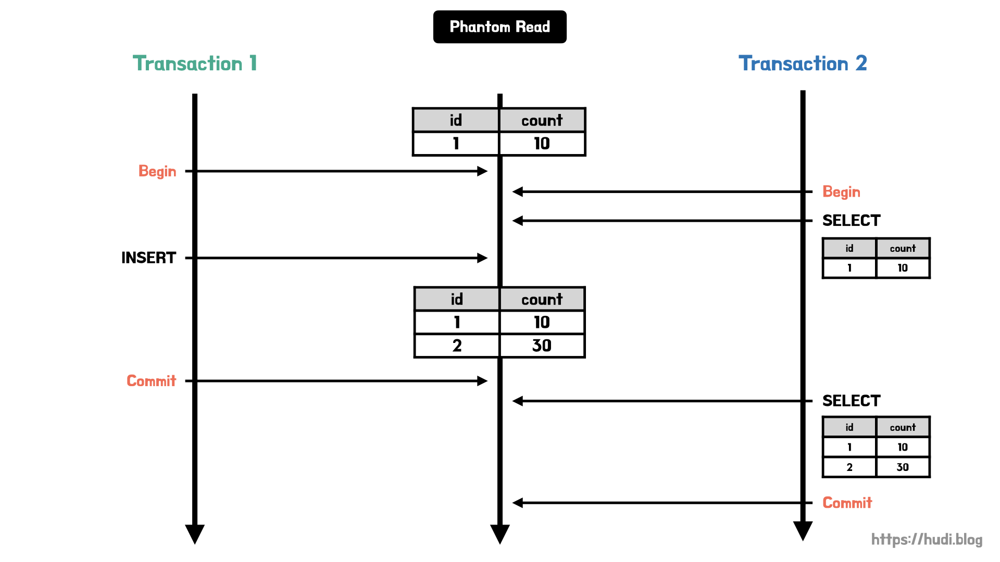
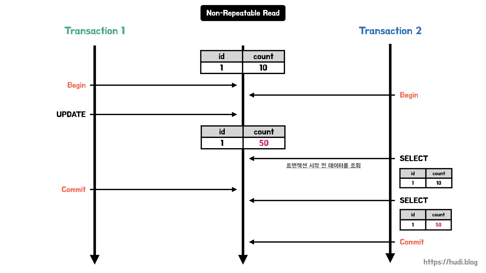
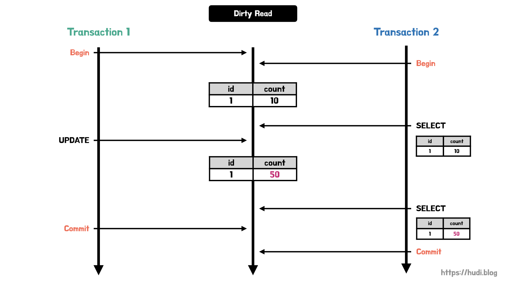
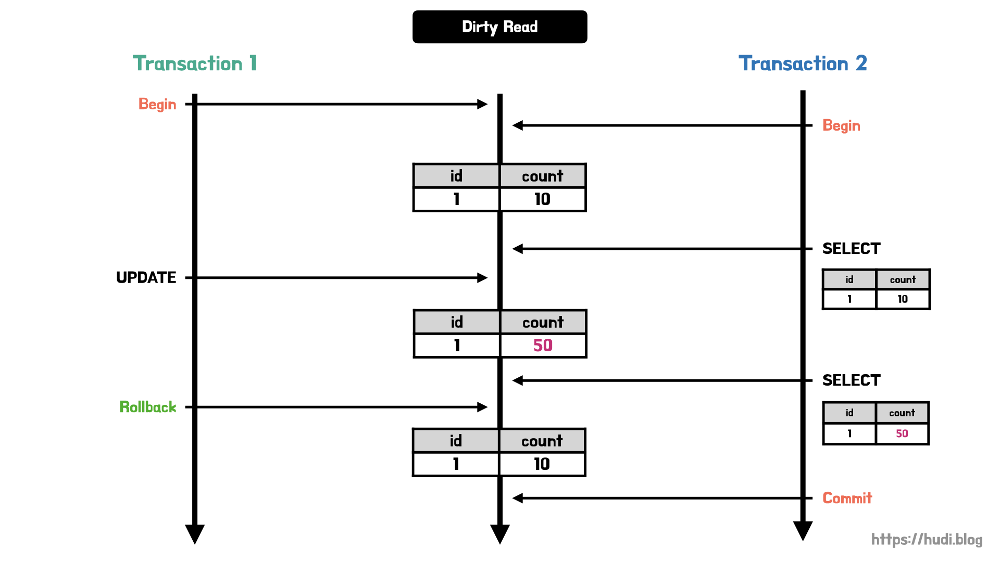

> 이 포스팅은 **[우아한테크코스 4기 2022 CS Plant 스터디](https://github.com/woowacourse-study/2022-cs-plant)**에서 기술 면접을 대비하기 위해 작성되었습니다.

## 트랜잭션 격리 수준

복수개의 트랜잭션이 한번에 처리될 때, **특정 트랜잭션이 변경하거나 조회하고 있는 데이터에 대해서 다른 트랜잭션에 대해 조회 허용 여부를 결정**하는 것이다. 트랜잭션 격리 수준은 아래와 같이 4개로 구분된다.

- **SERIALIZABLE (직렬화 가능)**
- **REPEATABLE READ (반복 가능한 읽기)**
- **READ COMMITTED (커밋된 읽기)**
- **READ UNCOMITTED (커밋되지 않은 읽기)**

밑으로 갈수록 격리 수준이 낮아지며, 동시 처리 성능이 높아진다. 반면 위로 갈수록 격리 수준이 높아지며, 동시 처리 성능은 낮아지지만 데이터 부정합 문제가 발생할 확률이 줄어든다. 즉, **데이터 정합성과 성능은 반비례**한다.

## 트랜잭션 격리 수준에 따라 발생할 수 있는 문제점

트랜잭션 격리 수준에 대해 알아보기 전에 트랜잭션 격리 수준에 따라 발생할 수 있는 문제점을 간단히 짚고 넘어간다. 자세한 다이어그램은 각 트랜잭션 격리 수준에 첨부해두었다.

### 더티 리드 (Dirty Read)

더티 리드는 특정 트랜잭션에 이해 **데이터가 변경되었지만, 아직 커밋되지 않은 상황에서 다른 트랜잭션이 해당 변경 사항을 조회할 수 있는 문제**를 말한다.

이 문제는 트랜잭션 A가 데이터를 변경하고 커밋하지 않은 시점에 트랜잭션 B가 변경된 데이터를 읽어온 상황에서, 트랜잭션 A가 변경 내용을 커밋하지 않고 **롤백**한 상황에서 치명적이다. 트랜잭션 B는 무효가 된 값을 읽고 처리하므로 문제가 발생한다.

### 반복 불가능한 조회 (Non-Repeatable Read)

**같은 트랜잭션 내에서 같은 데이터를 여러번 조회했을 때 읽어온 데이터가 다른** 경우를 의미한다.

### 팬텀 리드 (Phantom Read)

Non-Repeatable Read의 한 종류로 **조회해온 결과의 행이 새로 생기거나 없어지는 현상**이다.

## SERIALIZABLE

특정 트랜잭션이 사용중인 테이블의 모든 행을 다른 트랜잭션이 접근할 수 없도록 잠근다. 가장 높은 데이터 정합성을 갖으나, 성능은 가장 떨어진다. 이 격리 수준에서는 단순한 SELECT 쿼리가 실행되더라도, 데이터베이스 락이 걸려 다른 트랜잭션에서 데이터에 접근할 수 없게된다.

## REPEATABLE READ

특정 행을 조회시 항상 같은 데이터를 응답하는 것을 보장하는 격리 수준이다. 하지만, SERIALIZABLE과 다르게 행이 추가되는 것을 막지는 않는다. 이로 인해 팬텀 리드 현상이 발생할 수 있다.

MySQL의 InnoDB엔진의 기본 격리 수준이 REPEATABLE READ이다.

### 발생할 수 있는 문제

- Phantom Read

## READ COMMITTED

**커밋이 완료된 트랜잭션의 변경사항만 다른 트랜잭션에서 조회할 수 있도록 허용**하는 격리 수준이다. 즉, 특정 트랜잭션이 이루어지는 동안 다른 트랜잭션은 해당 데이터에 접근할 수 없다. 가장 많이 사용되는 격리 수준이며, 오라클 등 에서 기본값으로 설정되어있다.

> (2022. 09. 16) 정정한다. MySQL의 InnoDB엔진의 기본 격리 수준은 REPEATABLE READ이다.

특정 트랜잭션에서 데이터가 변경되었으나, 아직 커밋되지 않은 상태라면 **다른 트랜잭션에서는 해당 데이터에 접근했을 때 트랜잭션 시작 전 데이터**를 읽어온다. 커밋이 된 이후에서야 변경된 데이터 값을 읽어올 수 있다.

이런 특성으로 팬텀 리드와 반복 불가능한 조회 문제가 발생한다.

### 발생할 수 있는 문제

- Phantom Read
- Non-Repeatable Read

## READ UNCOMMITTED

커밋이 되지 않은 트랜잭션의 데이터 변경 내용을 다른 트랜잭션이 조회하는 것을 허용하는 격리 수준이다. 데이터 부정합 문제가 발생할 확률이 높지만, 성능은 가장 빠르다. 데이터를 어림잡아 집계하는 등의 연산에서 사용하면 좋다.

아래와 같이 롤백 상황에서 큰 문제가 발생한다.

### 발생할 수 있는 문제

- Dirty Read
- Non-Repeatable Read
- Phantom Read
