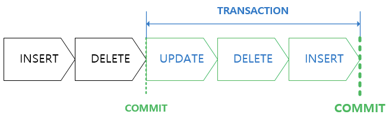
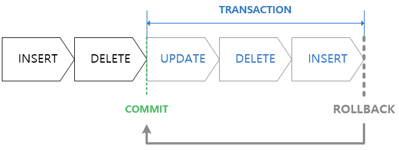

## 학습동기

최근 스프링에서 `@Transactional` 이라는 애너테이션을 적용해서 트랜잭션을 사용할 수 있다는 사실을 알게되었다. 스프링에서 트랜잭션을 제대로 사용해보기 전에 트랜잭션의 개념을 간단히 짚고 넘어가고자 학습하게 되었다.

## 트랜잭션이란?

트랜잭션은 데이터베이스에서 하나의 논리적 기능을 수행하기 위해 여러개의 쿼리를 하나로 묶은 작업의 단위이다. 트랜잭션은 **원자성(Atomicity), 일관성(Consistency), 격리성(Isolastion), 지속성(Durability)** 4가지 특징을 갖는다. 이 앞글자를 따서 ACID 특징 이라고 부른다.

## ACID 특징

### 원자성(Atomicity)

트랜잭션을 구성하는 작업 전체가 성공하거나, 아니면 전체가 실패하는 것 둘 중 하나만을 보장하는 특징이다. 트랜잭션을 구성하는 여러 쿼리 중 일부분만 성공하거나, 일부분만 실패하면 문제가 발생할 것 이다.

예시로 은행 시스템의 송금 과정을 구현하는 상황을 가정해보자. 송금 과정은 아래의 Operation 들의 순서로 이루어질 것이다.

1. 계좌 잔액 테이블에서 송금자 A의 잔액을 차감한다.
2. 계좌 잔액 테이블에서 돈을 받는 B의 잔액을 추가한다.
3. 거래 내역 테이블에서 A가 B로 송금한 내역을 추가한다.

그런데 이 과정에서 3번 Operation 이 실패한다면, A와 B의 계좌 잔액은 변경되겠지만 그 거래내역은 데이터베이스 어디에서도 찾아볼 수 없을 것 이다.

### 일관성(Consistency)

트랜잭션 실행 이전의 데이터베이스가 Correct State 였다면, 트랜잭션 실행 이후의 데이터베이스도 Correct State 임을 보장해야하는 특징이다. 이때, Correct State 란 도메인의 유효범위, 무결성 제약조건을 만족하는 상태를 의미한다. 예를 들어, 계좌 잔액의 도메인 유효범위는 0이상일 것 이다. 마이너스 통장이 아닌 이상 잔액이 0인 잔고에서 출금을 할 수 없을 것 이다.

### 격리성(Isolation)

실행중인 트랜잭션의 중간 결과를 다른 트랜잭션이 접근할 수 없는 특징이다. 트랜잭션과 관련된 격리성 이슈와 이를 해결하기 위한 격리 수준에 대해서는 좀 더 깊게 공부하고 별개의 포스팅으로 남길 계획이다.

### 지속성(Durability)

성공적으로 완료(Commit)된 트랜잭션은 영원히 반영되어야 하는 특징을 의미한다.

## Commit 과 Rollback 연산

### Commit

트랜잭션을 구성하는 여러 쿼리가 성공적으로 처리되었다고 확정하는 명령어이다. '커밋이 수행되었다' 는 '하나의 트랜잭션이 성공적으로 수행되었다' 와 동치이다.

### Rollback

에러나 이슈가 발생했을 때 데이터베이스를 트랜잭션 커밋 이전으로 돌리는 작업.

