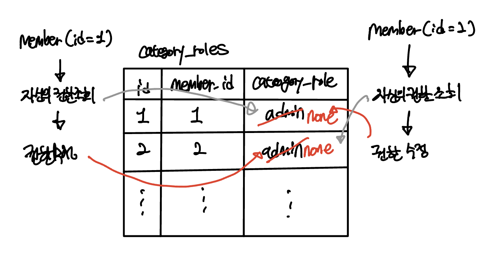

> 이 글은 우아한테크코스 4기 [달록팀의 기술 블로그](https://dallog.github.io/troubleshooting-of-category-role-concurrency-issue/)에 게시된 글 입니다.

오랜만의 포스팅 입니다. 이번 글에서는 달록에서 발생한 동시성 이슈를 JPA의 낙관적 락을 사용하여 해결한 경험에 대해 공유드리겠습니다.

## 문제 상황

달록은 카테고리 역할이라는 도메인이 존재합니다. 카테고리 역할은 현재는 크게 `NONE` 과 `ADMIN` 으로 나뉘어져있습니다. `NONE` 은 카테고리에 대한 아무런 권한을 가지고 있지 않고, `ADMIN` 은 카테고리 이름 수정, 카테고리 제거, 일정 추가/제거/수정 등의 모든 권한을 가지고 있습니다. 또한 `ADMIN` 은 카테고리 구독자들의 카테고리 역할을 변경할 수 있습니다. 예를 들어, `NONE` 인 구독자를 `ADMIN` 으로 승격할 수 있고 반대로 `ADMIN` 인 구독자를 `NONE` 으로 권한을 박탈할수도 있습니다.

그런데 달록은 이 구독자 카테고리 역할 변경 기능에서 동시성 이슈가 발생하였습니다. User1과 User2가 둘다 `ADMIN` 이라고 가정해봅시다. 이때, User1과 User2가 동시에 서로의 카테고리 역할을 `NONE` 으로 변경하면, 서로의 역할이 동시에 `NONE` 으로 변경됩니다.

검증을 먼저 진행하고, 이후에 행위를 수행하는 경쟁 조건의 대표적인 형태인 **Check-Then-Act 패턴**인데요. 앞서 설명한 상황은 자기 자신의 `CategoryRole` 을 확인(Check) 하고, 상대방의 `CategoryRole`을 수정(Act) 하는 상황입니다. Check와 Act 사이에 다른 트랜잭션이 자신의 `CategoryRole`을 `NONE`으로 수정해버렸으니, 즉 Act 시점에는 이미 Check 시 검증한 사실이 유효하지 않기 때문에 발생하는 동시성 이슈이죠.

달록에서의 카테고리는 최소 1명 이상의 `ADMIN` 이 존재해야하는 도메인 제약 조건이 존재합니다. `ADMIN` 이 1명도 없다면, 그 카테고리를 아무도 관리할 수 없기 때문이죠. 하지만, 위와 같은 동시성 이슈가 발생하면 앞서 이야기한 도메인 제약 조건이 깨지고, 일관성이 무너질 수 있습니다. 이를 재현해봅시다.

## 문제 재현

> 아래 코드는 문제 재현을 위해 인수 테스트 클래스에 작성한 테스트 코드입니다. 단순히 반환값을 보기 위해 작성한 코드이므로 별도의 assertion은 없습니다.

```java
@Test
void concurrency_test() throws Exception {
    // given절 생략

    // when
    Thread thread1 = new Thread(
            () -> 회원의_카테고리_역할을_변경한다(관리자2_토큰, 카테고리.getId(), 관리자1_id, new CategoryRoleUpdateRequest(NONE)));
    Thread thread2 = new Thread(
            () -> 회원의_카테고리_역할을_변경한다(관리자1_토큰, 카테고리.getId(), 관리자2_id, new CategoryRoleUpdateRequest(NONE)));

    thread1.start();
    thread2.start();

    Thread.sleep(1000);

    // then
    System.out.println(자신이_ADMIN인_카테고리_목록을_조회한다(관리자1_토큰).body());
    System.out.println(자신이_ADMIN인_카테고리_목록을_조회한다(관리자2_토큰).body());
}
```

Given절에서는 관리자1과 관리자2 이라는 두 회원에게 `공통 일정` 이라는 카테고리에 `ADMIN` 역할을 부여하였습니다. 이 코드는 생략합니다.

When절을 살펴보면 `회원의_카테고리_역할을_변경한다()` 메소드를 통해 관리자1과 관리자2은 서로의 카테고리 역할을 `NONE` 으로 변경합니다. 동시성을 위해 쓰레드를 생성하여 진행했습니다. 실제 웹 서버는 멀티 쓰레드로 동작하기 때문이죠. 모든 API의 실행이 끝날때까지 1초가량 기다린 후 Then절을 실행합니다.

Then절을 살펴보면 `자신이_ADMIN인_카테고리_목록을_조회한다()` 메소드를 통해 관리자1과 관리자2의 역할이 `ADMIN` 인 카테고리 목록을 조회합니다. 우리가 원래 기대하는 결과는 관리자1 또는 관리자2 어느 한쪽은 `공통 일정` 카테고리에 대해 `ADMIN` 역할을 가지고 있어야 합니다. 하지만 동시성 이슈의 발생으로 아래와 같은 예상치 못한 결과가 나왔습니다.

### 관리자1 결과

```json
{
  "categories": [
    {
      "id": 1,
      "name": "내 일정",
      "categoryType": "PERSONAL",
      "creator": {
        "id": 1,
        "email": "devhudi@gmail.com",
        "displayName": "후디",
        "profileImageUrl": "/hudi.png",
        "socialType": "GOOGLE"
      },
      "createdAt": "2022-11-06T00:06:44.98412"
    }
  ]
}
```

### 관리자2 결과

```json
{
  "categories": [
    {
      "id": 3,
      "name": "내 일정",
      "categoryType": "PERSONAL",
      "creator": {
        "id": 2,
        "email": "dev.hyeonic@gmail.com",
        "displayName": "매트",
        "profileImageUrl": "/mat.png",
        "socialType": "GOOGLE"
      },
      "createdAt": "2022-11-06T00:06:45.582431"
    }
  ]
}
```

관리자1, 관리자2 둘 모두 `공통 일정` 에 대한 `ADMIN` 카테고리 역할을 잃었습니다. `공통 일정` 카테고리는 더이상 관리자가 존재하지 않는 일관성이 깨진 카테고리가 되어버렸습니다. 이 문제를 어떻게 해결할 수 있을까요?

## 트랜잭션 격리 수준으로 해결이 되지 않는 이유

동시성 이슈와 트랜잭션 격리 수준에 대한 이해도가 낮을 때에는 격리 수준을 설정하는 것으로는 왜 이 문제가 해결되지 않는지 알지 못했습니다. 최근 낙관락/비관락에 대해 공부하면서 원인을 알게 되었어요.

달록은 `CategoryRole` 엔티티를 통해 카테고리 역할을 관리합니다. 그리고 이 엔티티는 `category_roles` 라는 테이블과 매핑되어 있습니다. 이 테이블엔 더 많은 컬럼이 있지만, 대표적으로 `id` , `member_id` , `category_role` 3개의 컬럼이 있습니다.



위와 같이 동시에 2명의 회원이 서로의 카테고리 역할을 수정할때, 이 두 트랜잭션은 서로 다른 행을 수정합니다. 애초에 양 트랜잭션이 서로 간섭하지 않는 상황이므로 트랜잭션 격리 수준으로 이 문제는 해결할 수 없죠. 다른 방법이 필요합니다.

## JPA의 낙관적 락을 사용한 동시성 이슈 해결

낙관적 락은 애플리케이션 레벨에서 동시성 이슈를 해결할 수 있는 방법입니다. JPA는 낙관적 락과 비관적 락 둘다 지원합니다. 낙관적 락은 대부분의 트랜잭션이 충돌이 나지 않는 낙관적인 상황을 가정하는 방법입니다. 반대로 비관적 락은 대부분의 트랜잭션이 충돌이 발생할 것이라고 비관적으로 가정하고 우선적으로 락을 걸고 보는 방법입니다. 낙관적 락과 비관적 락에 대한 깊은 내용은 조금 더 공부한 다음 별개 포스팅으로 작성해보겠습니다.

서로 동시에 `ADMIN` 권한을 내려버리는 일은 사실 자주 발생하지 않는 상황이죠. 따라서 이 경우에는 낙관적 락을 사용하는 것이 바람직합니다. 무턱대고 비관적 락을 걸어버리면, 동시성이 떨어져 성능적으로 손해를 볼 수 있기 때문입니다. 그렇다면, 달록은 낙관적 락을 어떻게 사용하여 이 문제를 해결하였을까요?

### 엔티티에 버전 추가

```java
@Table(name = "category_roles")
@Entity
public class CategoryRole extends BaseEntity {

    // ...

    @Version
    private Long version;

    // ...
```

JPA는 낙관적 락을 버전 관리를 통해 지원합니다. 이 버전은 엔티티의 값을 변경하면 증가하게 됩니다. 트랜잭션을 커밋하는 시점에 조회한 엔티티의 버전과 실제 데이터베이스의 엔티티 버전을 비교하여 충돌 여부를 감지합니다.

### 레포지토리에 락 옵션 지정

```java
public interface CategoryRoleRepository extends JpaRepository<CategoryRole, Long> {

    @Lock(LockModeType.OPTIMISTIC)
    @Query("SELECT cr "
            + "FROM CategoryRole cr "
            + "WHERE cr.member.id = :memberId AND cr.category.id = :categoryId")
    Optional<CategoryRole> findByMemberIdAndCategoryId(final Long memberId, final Long categoryId);

    // ...
```

달록은 Spring Data JPA를 사용합니다. 따라서 위와 같이 Repository 메소드 위에 `@Lock` 어노테이션을 추가하여 락 옵션을 지정합니다.

`NONE` 옵션은 조회한 엔티티를 수정할 때 다른 트랜잭션에 의해 이 엔티티가 변경되지 않음을 보장합니다. 즉, 엔티티를 수정해야 버전을 체크하죠. 반면, 위 코드에서 사용한 `OPTIMISTIC` 옵션은 조회한 엔티티가 트랜잭션 동안 다른 트랜잭션에 의해 변경되지 않음을 보장합니다. 즉, 엔티티를 수정하지 않더라도 버전을 체크해요.

카테고리 역할 수정 트랜잭션은 자기 자신의 `CategoryRole` 을 조회하여 역할이 `ADMIN` 임을 확인한 이후(권한 확인), 다른 사람의 `CategoryRole` 을 수정합니다. 즉, 조회만 해오는 자기 자신의 `CategoryRole` 이 트랜잭션 내내 변화하지 않음을 보장해야 합니다. 따라서 `OPTIMISTIC` 락 옵션을 사용합니다.

### 서비스 예외처리

낙관적 락에서 문제가 생겼을 경우 JPA는 `ObjectOptimisticLockingFailureException` 라는 예외를 던집니다. 서비스 계층에서 조금 더 추상화된 예외로 번역해서 던지도록 코드를 수정합니다.

```java
@Transactional
public void updateRole(final Long loginMemberId, final Long memberId, final Long categoryId,
                       final CategoryRoleUpdateRequest request) {
    try {
        CategoryRoleType roleType = request.getCategoryRoleType();

        validateAuthority(loginMemberId, categoryId);
        validateSoleAdmin(memberId, categoryId);
        categoryRoleRepository.validateManagingCategoryLimit(memberId, roleType);

        CategoryRole categoryRole = categoryRoleRepository.getByMemberIdAndCategoryId(memberId, categoryId);

        validateCategoryType(categoryRole);

        categoryRole.changeRole(roleType);
    } catch (ObjectOptimisticLockingFailureException e) {
        throw new CategoryRoleConcurrencyException();
    }
}
```

`CategoryRoleConcurrencyException` 라는 커스텀 예외를 생성하여, 동시성 이슈가 발생했을 때 이 예외를 던지도록 작성하였습니다.

## 문제 해결

다시 한번 위의 테스트 코드를 실행해봅시다. 아래와 같이 관리자1 또는 관리자2 둘 중 한명은 `공통 일정` 카테고리가 관리중인 카테고리 목록에서 제거되지 않음을 확인할 수 있습니다.

### 관리자1 결과

```json
{
  "categories": [
    {
      "id": 1,
      "name": "내 일정",
      "categoryType": "PERSONAL",
      "creator": {
        "id": 1,
        "email": "devhudi@gmail.com",
        "displayName": "후디",
        "profileImageUrl": "/hudi.png",
        "socialType": "GOOGLE"
      },
      "createdAt": "2022-11-06T00:58:39.262795"
    },
    {
      "id": 2,
      "name": "공통 일정",
      "categoryType": "NORMAL",
      "creator": {
        "id": 1,
        "email": "devhudi@gmail.com",
        "displayName": "후디",
        "profileImageUrl": "/hudi.png",
        "socialType": "GOOGLE"
      },
      "createdAt": "2022-11-06T00:58:39.483338"
    }
  ]
}
```

### 관리자2 결과

```json
{
  "categories": [
    {
      "id": 3,
      "name": "내 일정",
      "categoryType": "PERSONAL",
      "creator": {
        "id": 2,
        "email": "dev.hyeonic@gmail.com",
        "displayName": "매트",
        "profileImageUrl": "/mat.png",
        "socialType": "GOOGLE"
      },
      "createdAt": "2022-11-06T00:58:39.908153"
    }
  ]
}
```

위 결과는 두 트랜잭션 중 어떤 트랜잭션이 먼저 커밋되느냐에 따라 달라지겠지만, 동시성 이슈가 해결되고 도메인의 일관성이 보호되는 모습을 확인할 수 있었습니다 🙂

## 남는 의문점

이 문제를 해결하면서 계속 든 의문점은 _'왜 트랜잭션 격리 수준을 SERIALIZABLE로 해서는 이 문제를 해결할 수 없을까?'_ 입니다. 제가 알기로는 SERIALIZABLE은 읽기 작업에 대해서도 공유 락을 획득하여, 읽어온 데이터에 대한 변경을 막는 것으로 알고 있었거든요.

> _하지만 트랜잭션이 격리 수준이 SERIALIZABLE로 설정되면 읽기 작업도 공유 잠금(읽기 잠금)을 획득해야만 하며, 동시에 다른 트랜잭션은 그러한 레코드를 변경하지 못하게 된다. 즉, 한 트랜잭션에서 읽고 쓰는 레코드를 다른 트랜잭션에서는 절대 접근할 수 없는 것이다._ ― Real MySQL 8.0

위에서 본 것 처럼 카테고리 역할 변경 로직은 **(1) 자신의 CategoryRole을 가져와 권한 확인 (2) 상대방의 CategoryRole 변경** 이 두 단계로 진행됩니다. 격리레벨이 SERIALIZABLE 이라면 자신의 CategoryRole을 조회하므로 이 행에 대하여 공유락이 걸려야하고, 따라서 다른 트랜잭션에서는 이 행을 수정할 수 없어야합니다.

하지만 테스트 결과 트랜잭션 격리 수준을 SERIALIZABLE로 변경하기만 하는걸로는 동시성 이슈가 해결되지 않았습니다. 낙관락 혹은 비관락을 통해서만 이 문제가 해결되었는데요, 솔직히 아직 정확한 원인은 모르겠습니다. 이에 대해서는 조금 더 깊은 공부가 필요할 것 같습니다.

## 참고

- 자바 ORM 표준 JPA 프로그래밍, 김영한
