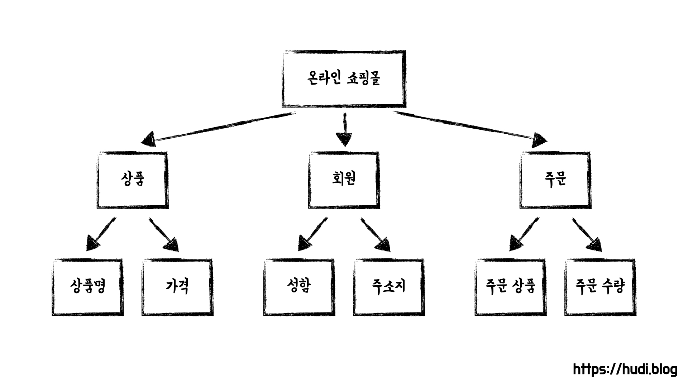

도메인에 대해 검색을 해보면, '해결하고자 하는 영역' 정도의 설명이 나온다. 그런데 프로그래밍을 할 때에는 무언가 주체적으로 비즈니스 로직을 수행하는 객체를 도메인이라고 부르기도 한다. 도메인이라는 용어 자체가 굉장히 추상적이고 넓은 범위로 사용되고 있어 레벨1 첫 미션부터 지금까지 굉장히 혼란을 느꼈다. 내가 가진 이 혼란을 정리하고자 관련된 여러 용어를 내 나름대로 최대한 명확히 해보고자 이 글을 쓴다.

## 도메인 (Domain)

도메인은 소프트웨어 엔지니어링에서 사용되는 용어로써, 프로그래밍으로 해결하고자 하는 주제에 대한 영역과 핵심 비즈니스 요구사항을 의미하는 단어다. 도메인은 다시 하위 도메인으로 나뉘어질 수도 있다.

예를 들어 우리가 '온라인 쇼핑몰' 을 개발한다면 이를 도메인이라고 부를 수 있다. 그리고 '온라인 쇼핑몰' 도메인은 또 다시 '상품', '회원', '주문' 이라는 하위 도메인으로 나누어질 수 있다.

더 나누어 본다면 '상품'은 '상품명', '가격' 이라는 하위 도메인으로, '회원'은 '성함', '주소지' 라는 하위 도메인으로, '주문'은 '주문 상품', '결제 정보' 등의 하위 도메인으로 나누어질 수 있을 것 이다.

## 도메인 모델 (Domain Model)

이제 도메인이 무엇인지는 조금 알 것 같다. 그렇다면 도메인 모델은 무엇일까?

도메인 모델은 도메인에 대한 지식을 선택적으로 단순화하고 의식적으로 구조화한 형태이다*(조영호, 오브젝트(위키북스, 2019), 606p.)*. 도메인 모델은 반드시 실재적인 무언가로 표현되지 않아도 존재한다.

따라서 '도메인 모델' 이라는 용어 자체는 엄밀하게는 소프트웨어와는 별개의 개념이다. 프로그래머는 필요하다면 머리속에 있던 도메인 모델을 종이 위에 다이어그램으로 표현(개념 모델)할 수 있을 것이다.

(22.05.16 추가) 이렇듯 도메인 모델은 사람들 머리속에 공유된 멘탈 모델(Mental Model)이라고 할 수 있다.

## 도메인 객체 모델 (Domain Object Model) 과 도메인 객체

도메인 모델에 대한 표현을 코드로 나타낸다면 이를 '도메인 객체 모델' 이라고 한다. 이를테면 위 도메인 모델의 상품 도메인을 `Item` 클래스로, 회원 도메인을 `User` 클래스로 표현할 수 있을 것 이다. 그리고 이것이 인스턴스화 된 것을 우리는 '도메인 객체' 라고 부를 수 있을 것 이다.

따라서 흔히 우리가 클래스나 객체를 가리키며 '도메인' 혹은 '도메인 모델' 이라고 부르는 것들은 엄밀하게는 잘못된 표현인것이다.

> An object model of the domain that incorporates both behavior and data.
>
> _[마틴 파울러](https://martinfowler.com/eaaCatalog/domainModel.html)_

마틴 파울러에 따르면 도메인 객체는 데이터와 행위를 함께 가지고 있는 것 이라고 한다. 좀 더 설명을 덧붙이자면, 특정한 책임을 갖고 어플리케이션에서 비즈니스 로직을 수행하는 객체를 도메인 객체라고 할 수 있다.

## 참고

- https://medium.com/myrealtrip-product/what-is-domain-driven-design-f6fd54051590
- https://martinfowler.com/eaaCatalog/domainModel.html
- https://www.codewithjason.com/difference-domains-domain-models-object-models-domain-objects/
- 조영호, 오브젝트(위키북스, 2019), 606p.
