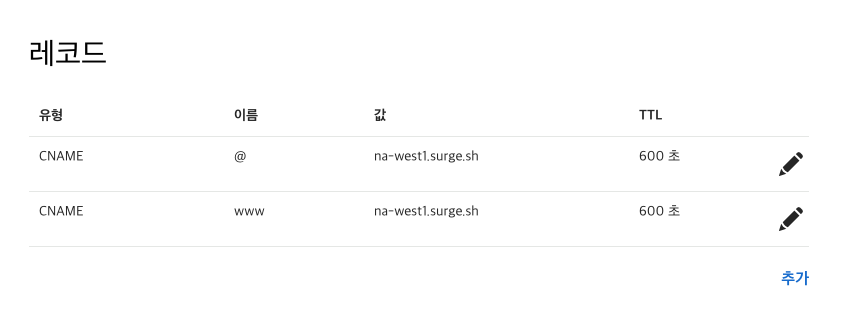
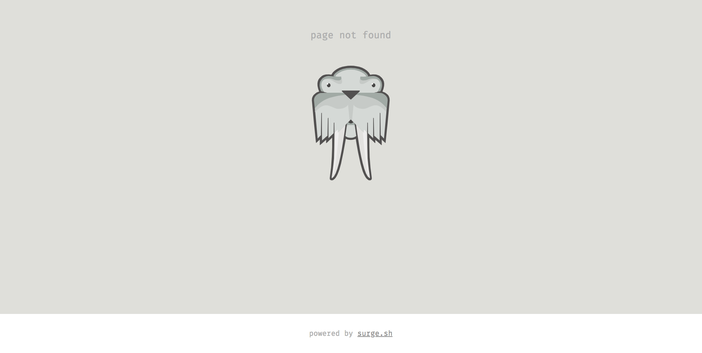

[Surge.sh](https://surge.sh)는 **정적 웹 어플리케이션을 귀찮은 가입 과정 혹은 복잡한 설정 과정 없이** 배포할 수 있는 **프론트엔드를 위한 호스팅 서비스**이다. 아주 큰 특징은 지금 코드를 작성하고 있는 IDE 혹은 터미널에서 벗어나지 않고, 커맨드라인에서 **명령어 몇줄로 아주 간단하게 배포**할 수 있다는 것이 특징이다. 그리고, 가격도 개인적인 프로젝트 수준에서는 **무료 플랜을 사용해도 정말 무방**하다. 별도의 서버가 필요없거나 API 서버가 따로 있는 경우의 정적 웹사이트, 웹 어플리케이션, SPA 등의 배포에 아주 최적화 되어있다. 이런 장점에도 의외로 국내자료가 매우 없기 때문에 직접 소개를 해보려 한다.

## 설치하기

Surge.sh는 AWS 혹은 기타 VPS 호스팅 서비스와 다르게 따로 웹사이트에서 프로젝트를 관리할 대쉬보드 같은 것이 존재하지 않는다. 대신 관리 도구를 npm 을 통해 설치하고, 커맨드 라인안에서 우리의 프로젝트를 배포하고, 삭제하는 등의 관리를 할 수 있다. 일단 다음 명령어를 입력하여 Surge 를 글로벌로 설치해보자.

```
$ npm install --global surge
```

이제 어떤 폴더에서든 surge 명령어를 실행하여 프로젝트를 배포 할 수 있게 되었다.

## 배포하기

이제 바로 정적 웹사이트를 배포해 볼 것이다. 배포하고 싶은 프로젝트 혹은 간단한 index.html 등의 파일을 준비하자. 그리고 해당 프로젝트 디렉토리에 이동하여, 다음과 같은 명령을 입력한다.

```
$ surge
```

우리는 아직 surge 에 가입하지 않은 상태이니, 가입 절차를 진행하게 될 것이다. 이 과정은 최초 한번만 해주면 되며, 다음 부터는 생략된다.

```
Welcome to Surge! (surge.sh)
Login (or create surge account) by entering email & password.

    email: youremail@gmail.com
    password:
```

여러분들이 사용할 이메일과 패스워드를 입력하면, 다음과 같이 배포할 프로젝트의 경로, 배포할 도메인 등을 물어볼 것이다. 우리는 배포할 프로젝트 디렉토리로 이동했으므로, 수정하지 않고 미리 입력된 내용대로 설정해주자.

```
Running as youremail@gmail.com (Student)

    project: /some/path/somedir/
    domain: obedient-face.surge.sh
    upload: [====================] 100% eta: 0.0s (1 files, 139 bytes)
    CDN: [====================] 100%
    IP: 45.55.110.124

Success! - Published to obedient-face.surge.sh
```

surge.sh 는 기본적으로 임의의-단어.surge.sh 형태의 도메인을 생성해준다. 당연히 도메인은 우리가 원하는대로 변경할 수 있다. .surge.sh 로 끝나는 도메인은 무료로 제공하기 때문에 중복되지만 않으면, first-project-by-hudi.surge.sh 따위의 도메인으로도 프로젝트를 배포할 수 있다.

필자는 obedient-face.surge.sh 라는 도메인에 프로젝트가 배포되었다. 해당 도메인에 접속하면, 우리가 배포한 프로젝트가 작동하는 것을 확인할 수 있다. 이렇게 간단하게 웹사이트가 배포된다니, 놀랍지 않은가?


또한 아래와 같이 명령을 입력하면, 배포 과정을 좀더 축약할 수 있다.

```
$ surge ./ custom-domain.surge.sh
```

## 커스텀 도메인에 배포하기

분명 무료로 제공되는 도메인도 좋지만, 실제 프로덕트에는 우리 소유의 도메인으로 접속할 수 있게 해야한다. 그 과정도 생각보다 간단하다. 일단 다음과 같이 배포할때 도메인 설정을 본인 소유의 도메인으로 배포한다.

```
$ surge ./ yourdomain.com
```

그리고 DNS 서버에서 CNAME 을 수정해줘야 한다. CNAME의 호스트네임 @과 www 를 na-west1.surge.sh 로 설정해준다. DNS 제공자가 CNAME 을 설정할 수 없게 해놓았다면, A레코드를 45.55.110.124 으로 향하게 설정해주면 된다. 이때 호스트네임은 역시 @과 www 로 설정해주면 된다.



또한 호스트네임을 \* 로 설정하면, 추후 해당 도메인의 하위 도메인 (cdn.yourdomain.com 등) 으로도 배포할 수 있게 된다.

## 클라이언트 사이드 라우팅 대응



React router 혹은 Vue router 를 통해 클라이언트 사이드에서 라우팅을 하는 프로젝트를 배포하게 되는 경우가 있을 것이다. 이때, 최상위 경로 외의 하위 경로에 접속했을때 Surge 는 기본적으로 200 에러가 발생한다.

이런 경우에는 간단하게, index.html 파일을 복사하여, 200.html 로 이름을 변경하면 된다.

```
$ cp index.html 200.html
```

## 프로젝트 관리

프로젝트를 여러개 배포했다면, 그 리스트를 확인도 해야하고, 필요없는 프로젝트는 삭제해야할 것이다.

### 프로젝트 리스트 조회

```
$ surge list
```

### 프로젝트 삭제

```
$ surge teardown <프로젝트 도메인>
```

## 마치며

더 자세한 사용법은 [Surge.sh 공식 문서](https://surge.sh/help/getting-started-with-surge)를 참고하면 된다. 항상 사이드 프로젝트를 하면서, 정적 웹사이트만을 배포할때 발생하는 서버 비용과 그 과정이 부담스럽거나 귀찮았는데 Surge.sh 를 알게 되고서는 비용 부담도 사라졌고, 배포 과정도 단축되어 놀라웠다. 본 문서를 읽어주신 프론트엔드 개발자분들이 Surge.sh 를 적극적으로 활용하여 배포 과정에서 겪는 문제점이 없어지길 바란다.
