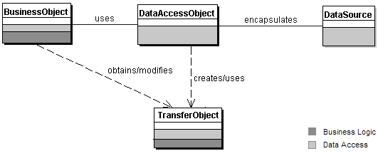

## DAO (Data Access Object)



DAO는 데이터베이스나 외부 파일 시스템과 같은 영속성 메커니즘에 접근하여 데이터의 CRUD(Create, Read, Update, Delete) 처리를 담당하는 객체 혹은 그러한 패턴을 의미한다.

세상에는 MySQL, PostgreSQL, MongoDB 등 다양한 영구 저장소가 존재한다. 또한 이를 사용하기 위해 각 벤더별로 제공하는 API도 다양하다. 이 API를 직접 사용하게 되면 특정 영구 저장소 API에 우리 코드가 종속되는 결과가 발생하게 된다.

예를 들어, Business Layer에서 직접 특정 벤더의 API를 사용한 경우, Business Layer와 Database Layer(Infrastructure Layer)가 강하게 결합되고, Database Layer의 변화가 Business Layer까지 영향을 끼칠 수 있다. 또한 만약 MySQL에서 PostgreSQL로 마이그레이션을 해야할 일이 생긴다면, MySQL의 API를 사용한 코드를 모두 PostgreSQL의 API를 사용한 코드로 변경해야하는 등의 문제도 발생할 수 있을 것 이다.

DAO는 이런 문제를 해결하기 위해 등장한 패턴이다. DAO는 고수준인 Business Logic과 저수준인 Persistence Logic을 분리하기 위해, Persistence Logic을 캡슐화 하고 도메인 레이어에 객체지향적인 인터페이스를 제공하는 객체이다. DAO를 사용하여 영속성 메커니즘에 대한 CRUD 로직을 캡슐화하게 되면, Business Layer는 데이터에 접근하는 방식을 알고있지 않게된다. 따라서 SRP, 관심사의 분리를 만족하는 코드를 작성할 수 있게 된다. 결과적으로 Business Layer 는 비즈니스 로직에만, DAO는 CRUD 로직에만 집중할 수 있게 된다.

또한 DAO는 비즈니스 로직과 영구 저장소 벤더의 API 사이에서 어댑터 역할을 한다.

## 예시 코드

예시 코드를 위해 우아한테크코스 레벨2 스프링 체스게임 미션의 코드 일부분을 가져왔다.

**JdbcRoomDao.java**

```java
@Repository
public class JdbcRoomDao implements RoomDao {
    // ...

    @Override
    public void createRoom(Room room) {
        String query = String.format("INSERT INTO %s VALUES (?, ?, ?, 'WHITE')", TABLE_NAME);
        jdbcTemplate.update(query, room.getId().getValue(), room.getRoomTitle().getValue(),
                room.getPassword().getValue());
    }
```

**ChessService.java**

```java
@Service
public class ChessService {
    // ...

    public RoomDto createRoom(CreateRoomDto createRoomDto) {
        Room room = Room.create(createRoomDto.getTitle(), createRoomDto.getPassword());
        roomDao.createRoom(room);

        initializeBoard(room);

        return RoomDto.from(room);
    }
```

위 코드에서 Persistence Layer에 해당하는 `JdbcRoomDao` 클래스에는 직접 SQL문으로 데이터베이스에 접근하는 로직이 존재한다. 그리고 Business Layer의 `ChessService` 클래스에는 그저 비즈니스 로직을 수행하기 위해 `JdbcRoomDao` 의 메소드를 호출하는 코드가 존재한다. `ChessService` 는 자신이 요구하는 데이터의 출처와 데이터 접근방법에 대해 전혀 관심이 없다.

위 코드는 MySQL 기준으로 작성 되었다. 만약 요구사항이 변경되어 RDBMS가 아니라 NoSQL인 MongoDB를 사용하도록 변경되었다고 가정해보자. DAO없이 `ChessService` 가 데이터 접근 로직을 갖고 있다면, `ChessService` 의 많은 비즈니스 로직도 변경되었겠지만 DAO가 있는 구조에서는 DAO에서 데이터를 처리하는 로직만 변경하면된다.

## 참고

- https://ko.wikipedia.org/wiki/%EB%8D%B0%EC%9D%B4%ED%84%B0_%EC%A0%91%EA%B7%BC_%EA%B0%9D%EC%B2%B4
- https://www.baeldung.com/java-dao-pattern
