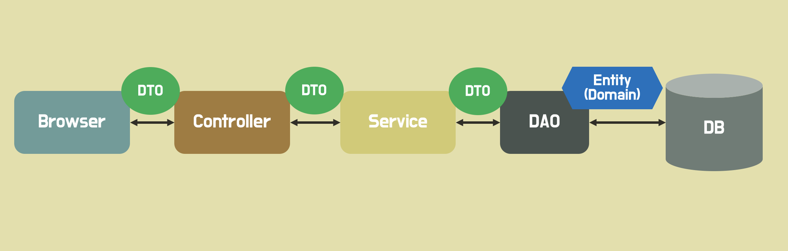
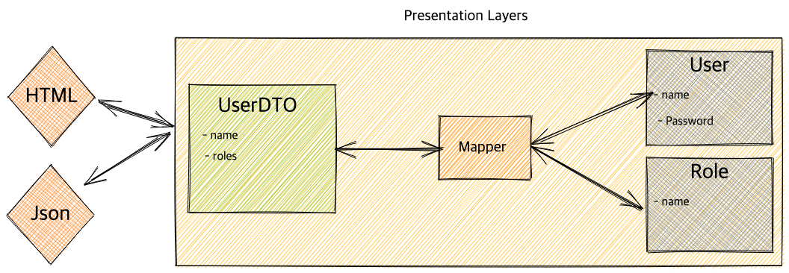

> DTO는 우테코 과정 중 정말 많이 들어봤고, 나름 사용도 많이 했지만 이상하게 바람직하게 사용하고 있다는 확신이 들지 않는 개념이다. DTO에 대한 내용은 항상 새롭게 알아가는데, 이러다간 DTO에 대한 글을 작성하지 못할 것 같아 일단 지금까지 알게된 개념위주로만 먼저 정리해보려 한다.

## DTO란?



DTO란 **Data Transfer Object**의 약자로, **계층 간 데이터 전송을 위해 도메인 모델 대신 사용되는 객체**이다. 이때, 계층이란 Presentation(View, Controller), Business(Service), Persistence(DAO, Repository) 등을 의미한다.

> The difference between data transfer objects and business objects or data access objects is that a DTO does not have any behavior except for storage, retrieval, serialization and deserialization of its own data (mutators, accessors, parsers and serializers). In other words, DTOs are simple objects that should not contain any business logic but may contain serialization and deserialization mechanisms for transferring data over the wire.
>
> [_영문 위키피디아 - Data transfer object_](https://en.wikipedia.org/wiki/Data_transfer_object)

DTO는 순수하게 데이터를 저장하고, 데이터에 대한 getter, setter 만을 가져야한다고 한다. 위키피디아에 따르면 **DTO는 어떠한 비즈니스 로직을 가져서는 안되며**, 저장, 검색, 직렬화, 역직렬화 로직만을 가져야 한다고 한다.

> 직렬화는 DTO를 Byte, Json, Xml 등의 형태로 변환하는 것을 의미한다. 역직렬화는 그 반대를 의미한다.

## 도메인 대신 DTO를 사용하면 좋은 이유

DTO 대신 도메인 모델을 계층간 전달에 사용하면, UI 계층에서 도메인 모델의 메소드를 호출하거나 상태를 변경시킬 수 있다. 또한 UI화면마다 사용하는 도메인 모델의 정보는 상이하다. 하지만 도메인 모델은 UI에 필요하지 않은 정보까지 가지고 있다. 이런 모든 도메인 모델 속성이 외부에 노출되면 보안 문제가 발생할 수 있다. **즉, 도메인 모델을 캡슐화 하여 보호할 수 있다.**

또한 도메인 모델을 계층간 전송에 사용하면, 모델과 뷰가 강하게 결합될 수 있다. 뷰의 요구사항 변화로 도메인의 코드를 변경해야할 일이 생기는 것은 좋지 않다. **DTO를 사용하면 이 결합을 느슨하게 만들 수 있다.**

## DTO는 어떤 계층까지 사용되어야 할까?

일단, DTO가 영속 계층(Persistence Layer)까지 도달하는 것은 공통적으로 지양하는 모양이다. 그렇다면, Controller 와 Service 레이어 둘 중 DTO는 어디서 변환되어야 할까?

> A Service Layer defines an application's boundary [Cockburn PloP] and its set of available operations from the perspective of interfacing client layers. It encapsulates the application's business logic, controlling transactions and coor-dinating responses in the implementation of its operations.
>
> [_마틴 파울러 - Service Layer_](https://martinfowler.com/eaaCatalog/serviceLayer.html)

마틴파울러는 Service Layer 란 어플리케이션의 비즈니스 로직 즉, 도메인을 보호하는 레이어라고 말한다. 즉, 이 정의를 명확히 지키기 위해서는 Presentation Layer 에 도메인을 노출해서는 안된다. 따라서 이러한 관점으로는 도메인은 서비스 레이어에서 DTO로 변환되어 컨트롤러로 전달되어야 한다.

우테코 체스미션에서 나는 DAO의 반환타입을 아래와 같이 DTO로 설정했다.

```java
public BoardDto getBoard(String gameId) {
    // ...
}
```

위와 같은 관점에 따르면 이는 DTO를 바람직하게 사용하는 것이 아닌 것 같다. 사실 아직까지 DTO의 사용범위에 대한 이유가 명확히 공감되지는 않는다. 레벨2에서 스프링 프레임워크를 사용해보면서 경험과 배움을 더 쌓아야 할 것 같다.

## DTO Mapper

나는 아래의 체스 미션 코드와 같이 DTO에 엔티티 변환 로직을 두곤했다. DTO에 별도의 로직을 두는 것이 조금 불편했으나 '이 정도는 괜찮겠지' 라는 생각을 가지고 있었다.

```java
public class PieceDto {
    private final PieceType pieceType;
    private final PieceColor pieceColor;

    private PieceDto(PieceType pieceType, PieceColor pieceColor) {
        this.pieceType = pieceType;
        this.pieceColor = pieceColor;
    }

    // ... 생략

    public Piece toPiece() {
        return new Piece(pieceType, pieceColor);
    }
}
```

그러던 와중 밸덩에서 아래의 그림을 보았다.



DTO와 도메인 모델의 변환은 별도의 Mapper 객체를 사용한다고 한다. 앞으로는 별도의 Mapper 를 두는 것을 고려해야겠다.

## 참고

- [https://tecoble.techcourse.co.kr/post/2021-04-25-dto-layer-scope/](https://tecoble.techcourse.co.kr/post/2021-04-25-dto-layer-scope/)
- [https://tecoble.techcourse.co.kr/post/2020-08-31-dto-vs-entity/](https://tecoble.techcourse.co.kr/post/2020-08-31-dto-vs-entity/)
- [https://www.baeldung.com/java-dto-pattern](https://www.baeldung.com/java-dto-pattern)
- [https://martinfowler.com/eaaCatalog/dataTransferObject.html](https://martinfowler.com/eaaCatalog/dataTransferObject.html)
