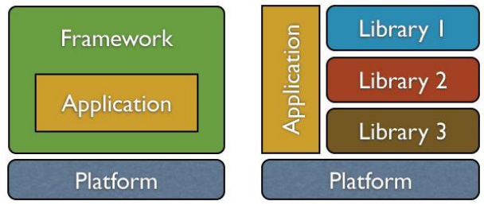

## 학습 동기

우아한테크코스 레벨2에서 스프링을 본격적으로 사용하면서, 스프링에서 제공하는 의존성 주입과 스프링 빈(Bean)을 접하게 되었다. 이 개념들에 익숙해지기 전 밀접하게 관련이 있어보이는 제어의 역전 (Inversion Of Control) 개념을 짚고 넘어가고자 한다.

## 제어의 역전 (Inversion Of Control, IoC)

> Don't call us, we will call you.
>
> _- 헐리우드 원칙(Hollywood Principle)_

우리가 프레임워크 없이 개발할 때에는 객체의 생성, 설정, 초기화, 메소드 호출, 소멸(이하 객체의 생명주기)을 프로그래머가 직접 관리한다. 또한 전통적인 프로그래밍에서는 외부 라이브러리를 사용할 때, 개발자가 직접 외부 라이브러리를 호출하는 형태로 이용한다.

하지만, 프레임워크를 사용하면 객체의 생명 주기를 모두 프레임워크에 위임할 수 있다. 즉, 외부 라이브러리가 프로그래머가 작성한 코드를 호출하고, 흐름을 제어한다.



이와 같이 개발자가 작성한 객체나 메서드의 제어를 개발자가 아니라 외부에 위임하는 설계 원칙을 제어의 역전이라고 한다. 즉, 프레임워크는 제어의 역전 개념이 적용된 대표적인 기술이라고 할 수 있다.

제어의 역전에서는 오브젝트 스스로가 사용할 오브젝트를 결정하지도, 생성하지 않는다. 원칙의 이름 그대로 제어에 대한 권한이 개발자에서 외부 환경으로 역전되는 것 이다.

좀 더 간단히 이야기해보자. 전통적인 방식으로 라이브러리를 사용하는 것은 우리의 프로젝트의 일부분으로서 라이브러리를 가져와 우리가 직접 제어하는 것이다. 반면 IoC는 우리의 코드가 프레임워크의 일부분이 되어 프레임워크에 의해 제어되는 것 이라고 생각하면 될 것 같다.

어플리케이션의 제어 책임이 프로그래머에서 프레임워크로 위임되므로, 개발자는 핵심 비즈니스 로직에 더 집중할 수 있다는 장점이 있다.

## IoC와 DI

IoC는 DI(Dependency Injection)과 밀접한 관련이 있다. DI는 IoC 원칙을 실현하기 위한 여러 디자인패턴 중 하나이다. IoC와 DI 모두 객체간의 결합을 느슨하게 만들어 유연하고 확장성이 뛰어난 코드를 작성하기 위한 패턴이다.

## 스프링에서 만난 IoC

**Controller 코드**

```java
@RestController
public class WebSpringController {

    // ...

    private final ChessService chessService;

    @Autowired
    public WebSpringController(ChessService chessService) {
        this.chessService = chessService;
    }

    // ...
}
```

**Service 코드**

```java
@Service
public class ChessService {
    private final GameDao gameDao;
    private final BoardDao boardDao;

    @Autowired
    public ChessService(GameDao gameDao, BoardDao boardDao) {
        this.gameDao = gameDao;
        this.boardDao = boardDao;
    }

    // ...
}
```

우테코 레벨2 첫번째 미션에서, 스프링을 사용하며 위와 같이 Controller와 Service의 코드를 작성하였다. 내가 직접 작성한 코드에서는 그 어디에도 `ChessService` 클래스의 인스턴스를 생성하지 않았다. 하지만 `@Autowired` 라는 어노테이션을 사용하여, 별도의 코드를 작성하지 않고도 Controller에 `ChessService` 의 인스턴스가 생성되어 주입되었다.

즉, 객체의 생명주기가 프로그래머에서 스프링 프레임워크로 위임된 것 이다. 위와 같이 간단하게 스프링을 사용해보며 IoC 설계 원칙에 대해 맛볼 수 있었다.

## 참고

- 이일민, 토비의 스프링 3.1, 에이콘(2012)
