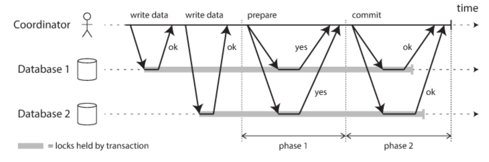
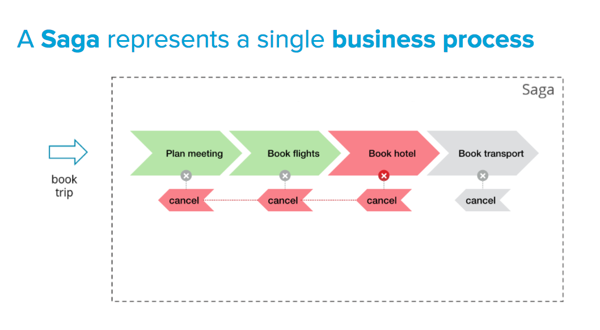
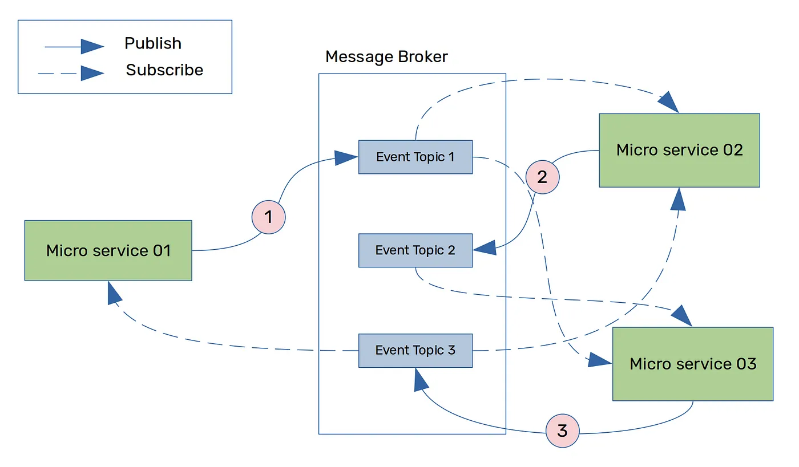
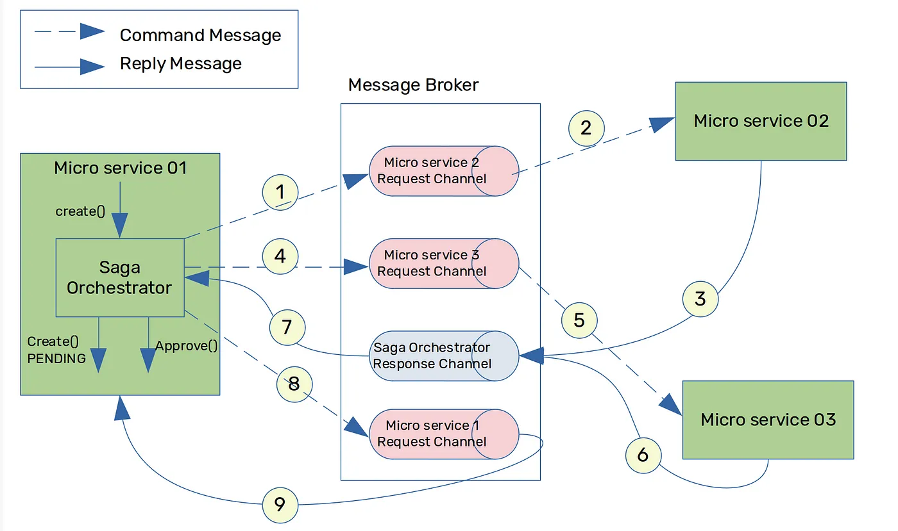

## MSA에서의 데이터 일관성

기존 모놀리식 환경에서는 DBMS가 트랜잭션의 원자성과 일관성을 보장해주었다. 트랜잭션의 작업 중 일부가 실패하면, 전체 작업을 롤백하는 **All or Nothing 구현**이 어렵지 않았다.

하지만 MSA에서는 하나의 기능이 여러 마이크로 서비스를 걸쳐 수행된다. 즉, **전체 트랜잭션이 마이크로 서비스의 물리적인 로컬 트랜잭션 여러개가 묶여서** 만들어진다. 더이상 DBMS가 지원하는 트랜잭션을 통해 일관성을 유지할 수 없게 된 것이다. **일부 마이크로 서비스가 실패하게 되면, 데이터 일관성은 깨지게** 된다.

## 2PC 패턴?

이전에는 이런 분산 트랜잭션 문제를 해결하기 위해 **2PC(Two-Phase Commit) 패턴**을 사용하였다 (이전에 **[글로벌 트랜잭션 (feat. JTA, 2PC)](https://hudi.blog/global-transaction/)** 포스팅에서 다룬적 있다). 2PC는 코디네이터(coordinator)와 여러 데이터베이스간의 **합의**를 통해 트랜잭션 커밋/롤백이 결정된다. 글로벌 트랜잭션에 참여하는 모든 데이터베이스가 커밋이 가능한 상태 혹은 불가능한 상태임을 코디네이터에게 알리고 (phase 1), **코디네이터가 커밋 또는 롤백을 수행하는 방식**이다 (phase 2).

다만 2PC는 아래의 이유로 **MSA에서는 많이 사용되지 않는다**.

- Lock을 사용하므로 **성능 측면에서 불리**하다.
- NoSQL 등 **DBMS가 지원하지 않으면 사용할 수 없다**.
- **이종의 DBMS에서는 사용하기 어렵다**.
- MSA에서 일반적으로 마이크로 서비스는 **각자의 데이터베이스를 소유**하고 (database per service), 다른 마이크로 서비스에게는 Public API를 통해 데이터를 제공한다. 여러 데이터베이스에 걸친 글로벌 트랜잭션을 하나의 코디네이터가 관리하는 구조에서 적합하지 않다.
- **코디네이터에 의존적**이다. 코디네이터 장애 상황에서 각 데이터베이스는 커밋/롤백 여부를 스스로 결정할 수 없다.

## SAGA 패턴

SAGA 패턴은 MSA와 같은 분산 아키텍처에서 데이터 일관성을 보장하기 위해 등장한 설계 패턴이다.

SAGA 패턴에서는 **연속된 개별 서비스의 로컬 트랜잭션이 이어져, 전체 비즈니스 트랜잭션을 구성**한다. 첫번째 트랜잭션이 완료되면 두번째 트랜잭션이 트리거 되고, 두번째 트랜잭션이 완료되면 세번째 트랜잭션이 트리거된다 (이 과정이 마치 하나의 무용담(saga)같아 SAGA라는 이름이 붙여졌다).

SAGA 패턴에서는 개별 서비스가 실패했을 때 **보상 트랜잭션(compensating transaction)**을 발생시켜 이를 상쇄한다. 즉, SAGA 패턴에서는 **데이터 일관성을 관리하는 주체가 DBMS가 아닌 애플리케이션임**을 알 수 있다. 이것이 SAGA 패턴의 핵심이다. 보상 트랜잭션이 적용되기 전까지 일시적으로 데이터 정합이 깨져있을 수 있으나, 보상 트랜잭션이 완료되면 **‘결과적 정합’**을 보장한다.

SAGA 패턴은 크게 코레오그래피 기반 사가와 오케스트레이션 기반 사가로 구분된다.

### 코레오그래피 기반 사가 (Choreography-based Saga)

각 서비스는 트랜잭션이 완료되면, 완료 이벤트를 발행한다. 만일 그 다음에 수행되어야할 로컬 트랜잭션이 있다면, 해당 이벤트를 구독한 마이크로 서비스가 이어서 실행한다. 중간에 로컬 트랜잭션이 실패하면, 이에 대한 보상 트랜잭션 이벤트를 발생하여 롤백을 시도한다.

**장점**

- 구성이 편리하다.
- 하나의 서비스에 문제가 발생해도, 시스템 나머지 부분이 영향을 덜 받는다.

**단점**

- SAGA 참가자가 많은 경우 트랜잭션 흐름이 복잡하다.
- 마이크로 서비스간 순환 종속성이 발생할 수 있다.
- 각 마이크로 서비스가 서로를 알고 있는 구조로, 결합도가 높다.

### 오케스트레이션 기반 사가 (Orchestration-based Saga)

중앙 집중된 Saga Orchestrator가 SAGA 참여자들에게 어떤 로컬 트랜잭션을 실행해야하는지 알려주는 방식이다. 오케스트레이터가 모든 트랜잭션을 처리하고, 필요하다면 보상 트랜잭션을 발생시켜 롤백을 시도한다.

**장점**

- 트랜잭션을 모두 오케스트레이터가 관리하여, 트랜잭션 흐름이 명확하다.
- 각 마이크로 서비스는 서로를 알지 못하여, 결합도가 낮다.

**단점**

- 오케스트레이터에 중앙 집중되어 SPOF가 될 수 있다.
- 같은 이유로 확장성과 유연성이 낮다.

## SAGA는 트랜잭션이 격리되지 않는다

데이터베이스 트랜잭션은 ACID(Atomicty, Consistency, Isolation, Durability)을 보장한다. 그런데, SAGA 패턴에서의 트랜잭션은 이 중 **I(Isolation)을 보장하지 않는다**. 따라서 이런 문제점을 보완하기 위한 설계가 필요하다.

## 참고

- https://microservices.io/patterns/data/saga.html
- https://learn.microsoft.com/ko-kr/azure/architecture/reference-architectures/saga/saga
