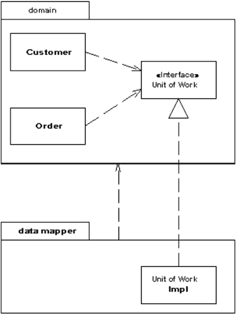

## 분리 인터페이스(Separated Interface) 패턴



분리 인터페이스 패턴은 인터페이스와 그 구현을 별개의 패키지에 위치시키는 패턴이다. 클라이언트가 인터페이스에 의존하도록 하면, 클라이언트는 실제 구현에 대해 완벽하게 알지 못하게된다. 인터페이스에 대한 구현체가 다른 패키지에 존재하기 때문이다. 인터페이스의 구현체는 컴파일 타임 혹은 런타임에 제공될 수 있다. 분리 인터페이스 패턴을 사용하여, 서로 다른 시스템간의 결합도를 느슨히 유지할 수 있게된다.

DDD의 레포지토리를 예로 들어보자. 레포지토리는 마치 일급 컬렉션과 같은 추상화된 도메인 객체의 저장소 역할을 한다. 즉, 레포지토리는 도메인 계층에 속한다. 레포지토리를 사용하는 클라이언트 입장에서는 도메인이 인-메모리에 저장되던, 파일 시스템에 저장되던, 데이터베이스에 저장되던 전혀 신경쓰지 않아도 된다. 도메인이 잘 저장되기만 하면 되니까.

하지만, 일반적으로 도메인 객체의 데이터는 데이터베이스에 저장된다. 데이터베이스에 접근하는 계층은 인프라스트럭쳐 계층이다. 이때, 분리 인터페이스 패턴이 사용된다. 레포지토리의 인터페이스는 도메인 패키지에 정의하고, 이에 대한 구현은 인프라스트럭쳐 패키지에 구현한다.

Spring Data JPA가 떠오른다. Spring Data JPA를 사용하면서 우리는 직접 구현체를 작성하지 않고 인터페이스만을 작성하여 쉽게 객체를 영속화하는 레포지토리를 만들 수 있었다. 실제로 Spring Data JPA의 공식 문서를 읽어보면 Spring Data JPA는 Eric Evans의 Domain Driven Design의 개념을 차용했다고 한다.

> Spring Data JPA takes the concept of a specification from Eric Evans' book, “Domain Driven Design”, following the same semantics and providing an API to define such specifications with the JPA criteria API. - [Spring Data JPA - Reference Documentation](https://docs.spring.io/spring-data/jpa/docs/current/reference/html/#specifications)

## 문제 상황

달록팀은 OAuth를 사용하여 사용자 로그인 기능을 구현한다. 이런 구조에서는 할 수 없이 회원 로그인에 대한 비즈니스 로직이 외부 OAuth 서비스에 의존하며, 서로 다른 시스템이 강하게 결합된다.

만약에 OAuth와 관련된 외부 서비스의 API 스펙이 변경되면 어떻게 될까? 회원 로그인과 관련된 도메인 로직이 변화에 대한 영향을 받게 된다.

달록팀은 이 문제를 앞서 설명한 분리 인터페이스 패턴으로 해결하였다. 외부의 OAuth API를 직접 호출하는 구현체를 `auth` 패키지의 도메인 로직에서 직접 호출하는 것이 아니라 `OAuthClient` 라는 인터페이스를 `auth` 패키지에 정의하였고, 그에 대한 구현체를 `infrastructure` 패키지에 위치하도록 만들었다.

### OAuthClient

```java
package com.allog.dallog.domain.auth.application; // domain 패키지

// ...

public interface OAuthClient {

    OAuthMember getOAuthMember(final String code, final String redirectUri);

    OAuthAccessTokenResponse getAccessToken(final String refreshToken);
}
```

### GoogleOAuthClient

```java
package com.allog.dallog.infrastructure.oauth.client; // infrastructure 패키지

// ...

public class GoogleOAuthClient implements OAuthClient {

    // ...

    @Override
    public OAuthMember getOAuthMember(final String code, final String redirectUri) {
        // ...
    }

    // ...
}
```

### 느슨해진 결합

위와 같이 인터페이스와 구현을 각각 다른 패키지에 위치 시켜, 클라이언트인 `AuthService` 는 `infrastructure` 패키지가 아닌, `domain` 패키지에 의존할 수 있게 되었다.

처음에는 이런 구조가 일반적이지 않고, 비 직관적이라고 생각해서 조금 어색하다고 생각했다. 하지만, 실제로 DDD의 레포지토리 등에서 사용되고 있는 패턴이었다.

분리 인터페이스를 사용하여 외부 서비스(OAuth API 등) 사양 변경에 대한 영향이 도메인 계층에 전파되는 것을 막을 수 있었다.

## 마치며

생각보다 Separated Interface 패턴에 대한 정보를 쉽게 찾아볼 수 없었다. 이에 대해 조금 더 깊게 공부하보려면 마틴 파울러의 P of EAA 책이나, DDD를 깊게 공부해봐야할 것 같다.

## 참고

- https://www.martinfowler.com/eaaCatalog/separatedInterface.html
- https://www.youtube.com/watch?v=d3k-hOA7k2Y
- https://dallog.github.io/separated-interface/
